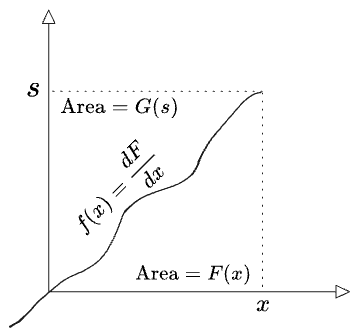
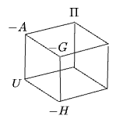
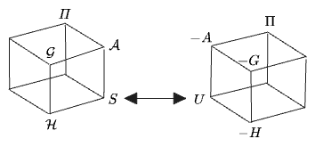

import { Image } from 'astro:assets';
import legendreOld from '../../images/thermo/legendre-old.png';

Statistical mechanics is introduced as the unified theory explaining thermodynamics—but nobody taking it even understands thermo. Derivations in stat-mech tend to arrive at some formula for a Helmholtz Free Energy, or Gibbs, or one or another definition of the specific heat—but so what? These things are all too arbitrary and disconnected to compress easily into memory, and the derivations make use of innumerable seemingly-arbitrary partial derivatives; getting from one expression to any other amounts to navigating a labyrinth. 

This was my experience, anyway, and none of my peers seemed to understand it any more than I did. Here are, years later, some resources to help make sense of things.

#### Table of Contents

## I. The Potentials

First, for reference, I'll write out the mess of objects under discussion: a zoo of different "potential functions", and their differentials. Each is given with its typical "Legendre Transform" relationship to the energy; more on this later. The examples are not meant to be meaningful as formulas, but they will at least serve to demonstrate the *kinds* of functional forms one tends to see for the properties we're talking about here.

Starting with energy:

| Name        | Arguments | Expression             | Differential          | Ideal Gas Example                                                                    |
| --------------- | ------------- | -------------------------- | ------------------------- | ------------------------------------------------------------------------------------ |
| Internal Energy | $$U(S, V, N)$$ | $$S^{-1}_{(U)}$$ (see below) | $$dU = TdS - PdV + \mu dN$$ | $$U = \frac{3N}{4\pi} {(\frac{h^3 N}{V})}^{2/3} \exp{[\frac{2S}{3Nk} - \frac{5}{3}]}$$ |

 

$S$ is the entropy. $$N$$ is the particle number and $$\mu$$ is the chemical potential (think "energy to add a particle, increasing $$N$$).

Note that $$U$$ and all of its arguments are *extensive* quantities, proportional to the size of the systems. Consequently its derivatives $$T, -P, \mu$$ are all *intensive*, like "densities". This property perhaps makes $$U$$ a natural starting point from which to derive other potentials, but it's impractical to actual *calculate* $$U$$ directly by such a formula because $$S$$ is usually not something you can measure.

Next we have three potentials which relate to the energy by "swapping" the entropy/temperature and pressure/volume variables:

| Name              | Arguments | Expression                                                                | Differential           | Ideal Gas Example                                                                                     |
| --------------------- | ------------- | ----------------------------------------------------------------------------- | -------------------------- | ----------------------------------------------------------------------------------------------------- |
| Helmholtz Free Energy | $$A(T, V, N)$$  | $$A = U - TS$$                                                              | $$dA = -SdT - PdV - \mu dN$$ | $$A = NkT( \ln{\left[\frac{N}{V} \Lambda^3\right]} - 1)$$  with $$\Lambda(T) = \frac{h}{\sqrt{2 \pi m k T}}$$ |
| Enthalpy              | $$H(S, P, N)$$  | $$H =  U +  PV$$                                                            | $$dH = TdS + VdP - \mu dN$$  | $$H = \frac{3N}{4\pi} {\left(\frac{h^3 P}{kT}\right)}^{2/3} \exp{\left[\frac{2S}{3Nk} - \frac{5}{3}\right]}+ NkT$$            |
| Gibbs Free Energy     | $$G(T, P, N)$$  | $$G = U - TS + PV$$ $$G = A + PV$$ $$G = H - TS$$ $$G =\mu N$$  | $$G = -SdT + VdP - \mu dN$$  | $$G = NkT \ln{\left[\frac{P\Lambda^{3}}{kT}\right]}$$                                                              |

 

Think of Helmholtz as the "something like the energy", but specifically in a closed container where you can control the temperature and $$N, V$$ are fixed. This is a more useful notion than the energy itself, as the energy is a function of $$S$$—though it must be the case that you could parameterize energy by temperature; I don't understand why this isn't done. Gibbs additionally gives control over the external pressure—appropriate for a vial of liquid open to the air. The relation $$G =\mu N$$, though particularly simple, only holds when $$U$$ is a function of no other variables than the ones given above.

Enthalpy I confess to not understanding the point of at all.

We can additionally swap the $$N/\mu$$ relation:

| Name           | Arguments    | Expression                                                          | Differential            | Ideal Gas Example                            |
| ------------------ | ---------------- | ----------------------------------------------------------------------- | --------------------------- | -------------------------------------------- |
| Landau Free Energy | $$\Pi(T, V, \mu)$$ | $$\Pi = TS - U + \mu N$$ $$\Pi = -A + \mu N$$ $$\Pi \stackrel{*}{=}PV$$ | $$d\Pi = SdT + PdV + N d\mu$$ | $$\Pi = \frac{V}{\Lambda^3}kT e^{\frac{\mu}{kT}}$$  |

 

Landau Free Energy represents an "open" system which can exchange particles with its environment at a fixed chemical potential $$\mu$$.

So far we have been working with the three variables of a chemical fluid—$$S, V, N$$—but the same method can be applied to any "state variable" at all to generate an additional "free energy", and can furthermore be mixed with any of the above to create even more "free energies". For example, magnetization:

| Name                         | Arguments | Expression                    | Differential   | Example |
| -------------------------------- | ------------- | --------------------------------- | ------------------ | ------- |
| (Magnetic) Internal Energy       | $$U(S, M)$$   |                                   | $$dU = TdS + BdM$$   |         |
| (Magnetic) Helmholtz Free Energy | $$A(T, M)$$   | $$A = U - TS$$                      | $$dA = SdT + BdM$$   |         |
| Magnetic Free Energy             | $$F(T, B)$$   | $$F = U - TS - BM$$ $$F = A - BM$$ | $$dF = -SdT - M dB$$ |         |

 

 

Here we started with a different expression for the energy $$U(S, M)$$ as a function only of $$S$$ and a magnetization $$M$$, which might describe a magnetizeable object of fixed volume and particle number (like a metal rod), whose entropy and energy vary only due to an external magnetic field $$B$$. When we then calculate a Helmholtz energy $$A$$, which requires only a $$T/S$$ variable pair, the new variable $$M$$ just comes along for the ride.

Finally, entropy itself:

| Name | Arguments | Expression              | Differential                                        | Ideal Gas Example                                                                                                                                                                     |
| -------- | ------------- | --------------------------- | ------------------------------------------------------- | ------------------------------------------------------------------------------------------------------------------------------------------------------------------------------------- |
| Entropy  | $$S(U, N, V)$$  | $$S = U^{-1}_{(S)}(U, N, V)$$ | $$dS = \frac{1}{T}dU + \frac{P}{T}dV  - \frac{\mu}{T}dN$$ | $$S = Nk(\ln{[\frac{V}{Nh^3} {(\frac{4\pi m E}{3N})}^{\frac{3}{2}}]} + \frac{5}{2})$$  or, though this uses a $$T$$:  $$S = Nk [\ln{\frac{V}{N{\Lambda(T)}^3}} + \frac{5}{2}]$$ |

 

Entropy is related to the above potentials not via a Legendre transform but as the inverse of $$U(S, V, N)$$ w.r.t. its first argument, that is:[^1]

$$
S = S(U, N, V) = U^{-1, 1}(S, N, V)
$$

[^1]: There doesn't appear to be a great notation for "inverse of a function w.r.t. a single argument"—a glaring omission from mathematics, I think. See [this Math Overflow post](https://mathoverflow.net/questions/145676/inverses-of-two-argument-functions-with-respect-to-one-argument); the elementary example is the relationship between $$x^y = z$$, $$\log_x z = y$$, and $$\sqrt[y]{z} = x$$. The ForeXiv reference above uses Sussman's notation which here would be $$S(U, N, V) = \mathcal{V}_1 U(S, N, V)$$.

Note that $$S$$ therefore does *not* have units of energy. Instead, its units are $$\frac{[\mathrm{energy}]}{[\mathrm{temperature}]}$$ since $$dU \sim TdS$$. And note that, while "solving" a large expression $$U(S)$$ for $$S$$ may be complicated, solving $$dU = TdS - PdV + \mu dN$$ for a local $$dS$$ is always quite simple.

## II. Legendre Transforms

All of those definitions are a mess. Now to make sense of them.

What we are usually *taught* is that those expressions like $$A = U - TS$$ amount to a Legendre transform from $$U(S) \to A(T)$$. The general form of the Legendre transform is given as $$F(x) \to G(s) = xs - F(x)$$; that the signs in thermo don't quite match up with that expression, we can chalk up to historical accident—apparently chemists preferred for $$U$$ to appear with a positive sign in every expression, and flipped the signs of everything else accordingly. 

We will need the right sense of what a Legendre transform really is. Unfortunately, the way these are usually taught conveys no "sense" at all. Sometimes these derivations are accompanied by strange diagrams of tangent lines to a function $$F$$, with the value $$G(y)$$ indicated as an intercept somewhere, like the following:

<Image src={legendreOld} width="400" alt="Legendre transform diagram" />
 

But this gives no insight at all. Why those lines? Why would anyone DO that?

I tried an article called "[Making Sense Of the Legendre Transform](https://arxiv.org/abs/0806.1147)", but it came up short of making sense of things. It was a post on [ForeXiv](https://blog.jessriedel.com/2017/06/28/legendre-transform/) which finally offered, to me, a cogent explanation of the Legendre Transform for the first time.

The "transform" in qeuestion turns an $$F(x)$$ into a $$G(s)$$ as: 

$$
G(s) \to \max_x (xs - F(x))
$$

which for suitable $$F$$ can be written without the $$\max$$ (or $$\min$$)

The right view is this. To take the Legendre transform of a convex function $$F(x)$$, you:
1. Take a derivative $$F(x) \to f(x) = \frac{dF}{dx}$$
2. Invert the derivative $$f(x) = s \to x(s) = f^{-1}(s)$$,
3. Integrate to give a new function $$G(s)$$:

$$
G(s) = \int^{s} {f}^{-1}(s') ds'
$$

That is: all you do is invert the first derivative! One actually performs these operations so rarely that it's easy to never learn how to *do* one! But apparently this is just a function inverse—of $$f(x)$$—but, whatever reason, we wanted to work in the space/units of $$F(x)$$, its integral, instead. In this form, a Legendre transform is self-evidently an involution.

That we're "inverting the derivative" doesn't *completely* determine the form of the Legendre transform. Ultimately the question of whether it's right is whether it's useful for explainig the physical world. But we can try to justify the particular choice to integrate to get $$G(s)$$ in two ways. 

First, $$G(s)$$ has the advantage of living in the same space/units as $$F(x)$$ itself (usually energy). $$g(s) = {f}^{-1}(s)$$ would *not* have the same units as $$f$$.

Second, there's a nice graphical relationship between $$F(x)$$ and $$G(s)$$ as defined above:

Evidently $$F + G = xs$$. Both areas can be parameterized just as easily by $$s$$, so we can can also write:

$$
G(s) = s x(s) - F(x(s))
$$

The inverse transform produces the original function by reparameterizing both regions by $$x$$ again:

$$
F(x) = xs(x) - G(s)
$$

This will often be written symmetrically, with the understanding that one parameterizes all terms by either $$x$$ or $$s$$ to solve for one function or the other: 

$$
F(x) + G(s) = sx
$$

Apparently, there are three equivalent ways to calculate $$G(s)$$ once you have $$x(s) = {f}^{-1}(s')$$:

1. Integrate along $$s$$: $$G(s) = \int^{s}_{s(x_0)} x(s) ds'$$
2. Integrate along $$x$$: $$G(s) = \int_{x_0}^{x} (s - f(x))dx$$ 
3. Or, plug in: $$G(s) = x(s)s - F(x(s))$$

 
A few notes:
* For convex functions, the transform "conserves" all of the information in the function, as can be seen in the diagram above. Thus if a function has multiple arguments like $$F(x, y)$$, then taking its Legendre transform can be thought of as a reparameterization of *one* of its arguments in of terms the derivative w.r.t. that argument. It's as if we had a blackbox with an inlet that says "takes $$x$$s at a rate of $$F'$$", and we swapped it to now take $$F'$$s at a rate of $$x$$." It "wants" to be written like $$F(x, y) \to F(\tilde{x}, y)$$, but this steps on with our normal notation, as the new function almost certainly doesn't have the same functional form as the original $$F$$.
* We're not thinking about the lower bounds of integration, but all three terms in the Legendre formula $$F + G = xs$$ are really integrals:

  $$
    \int^x f(x')dx' + \int^s g(s') ds' = \int^{xs} d(x's')
  $$

  It all works out as long as all three integrals are taken over the same region in $$(x, s)$$ space, as can be seen graphically.
* We can also see this as "integration by parts" $$\int u dv = \int d(uv) - \int v du$$, except from a perspective where the integrated function $$F = \int u dv$$ is the principle object of interest, rather than the integrand $$u$$.
  In fact it may make the most sense to think of Legendre as a transform of differentials $$dF \to dG$$: 
$$
dF(x) = s(x)dx \to dG(s) = dF - d(sx) = -x(s) ds
$$

  After all, Legendre transforms tend to arise when working with energies, whose absolute values are not meaningful. The differentials are perhaps the "true" relationships, while the integrated values are only meaningful relative to some reference frame; an energy floor, at least.
* Sometimes one sees an expression with a $$\sup$$ or $$\inf$$ in it, which is needed when Legendre-transforming a non-convex function, projecting into the smaller space of convex functions. I'll skip this for this post, as essentially all the functional forms of interest in thermoynamics are convex.

I find it helpful to characterize the "gesture" one takes in a Legendre transform. The basic gesture is "**unwrap—invert—rewrap**": we differentiate to expose the derivative, flip the graph, then integrate again. 

Because it's just an inversion, it's an involution on the space of only convex functions. 

Because we discard information in the unwrap step (differentiation throws away constants), we would normally have a free parameter on the rewrap step (the lower bound of integration) but we have to choose this to readd the constant term discarded at the beginnning, such that the whole operation is an involution. This makes $$F, G$$ corresponds to the two parts of the same square in $$x, s$$ space.

Compare this to the "gesture" of a matrix inverse, which could be implemented as: rotate to a diagonal basis—invert—unrotate. This is *also* an involution on the space of invertible matrices, and here again one must unrotate into the original basis to reattain the information that was discarded, such that the combined operation is basis-independent.

Contrast with a Fourier transform, which is *not* an involution; instead the forward and inverse Fourier transforms have the senses of "rotate" and "unrotate"; they invert each other but they are not the same operation.
  
The two simplest examples of Legendre transforms, and also ones most commonly encountered, are those functions whose first derivatives are their own inverse functions:

$$
\begin{aligned}
F(x) & = \frac{ax^2}{2} & G(s, y) & = \frac{s^2}{2a} \\
F(x, y) &= \frac{ax^2}{2} + b(y) + c & G(s, y) &= \frac{s^2}{2a} - b(y) - c
\end{aligned}
$$

Note the constant terms flips signs, and that a term not involving $$x$$ is a constant from the perspective of the transform.

$$
\begin{aligned}
F(x) &= \ln x  &G(s) &= 1 + \ln s
\end{aligned}
$$

$$\ln{x}$$ maps to $$\ln{x}$$, up to some constants, because its derivative $$\frac{1}{x}$$ is its own inverse. This arises in the transformation between $$A \leftrightarrow G$$ for the ideal gas.

## III. Conventional Thermodynamics

Now we'll tidy all of those thermodynamic functions. Some of this section is based on the "Making Sense of..." paper, but that paper doesn't quite go far enough.

Note again that a Legendre transform operates on a single argument of a function at a time. Let's look at what happens when you transform one argument followed by another. Let $$F(a, b)$$ be a function, with $$\alpha, \beta$$ its derivatives w.r.t. $$a, b$$, such that:

$$
dF = \alpha \: da + \beta \: db
$$

Then we can either transform $$a \to \alpha$$, $$b \to \beta$$, or both. The following diagram shows what we get via each path (writing $$F$$ as the function name in every case, imprecisely):

$$
\begin{matrix} 
F(a, b) & \to & F(\alpha, b) & = & a\alpha - F \\ 
\downarrow & & \downarrow & \\ 
F(a, \beta) & \to & F(\alpha, \beta) &   \\
= & & & = & \\ 
b \beta - F & & & & a \alpha + b \beta - F
\end{matrix}
$$

Clearly you get 2x2 different functions. And we see that you could transform many variables at once by 

$$
F(\vec{x}) \to \vec{x}\cdot\vec{s} - F
$$

At this point an annoying bit of pedantry comes up which will help to clarify the situation in thermodynamics. The above diagram shows what you get if you view the final doubly-transformed function $$F(\alpha, \beta)$$ as "the original $$F$$ twice-transformed." But if you stop after one transformation, say $$F(\alpha, b)$$, give that a new name $$G(\alpha, b) = F(\alpha, b)$$, and then forget where it came from and transform the second variable $$G(b) \to H(\beta)$$, you get a different set of signs for the "double-transformed" result:

$$
\begin{aligned}
H(\alpha, \beta) & = b\beta - G(\alpha, b)\\
& =b\beta - (a\alpha - F)\\
& \ne F(\alpha, \beta)
\end{aligned}
$$

Which is right? Well, both are: you can transform the function $$G$$ just as easily as $$-G$$ and you'll get two different results. The cleanest fix here is to name $$G = -F$$ instead, but the real point is that the signs of each $$a\alpha$$, $$b\beta$$ term need not be the same. (This makes me wonder about the classical-mechanic transform $$\vec{v} \to \vec{p}$$...)

This approach will supply a map for our thermodynamic potentials. The different combinations of Legendre transforms with respect to the three arguments of $$U(S, N, V)$$ will form a cube, not every corner of which has a conventional name.

$$A$$, $$H$$, and $$G$$ transform the $$S/T$$ and $$P/V$$ variables, so they form a square; one face of the larger cube:

$$
\begin{matrix} 
U(S, V, N) & \to & -A(T, V, N) & = & TS - U \\ 
\downarrow & & \downarrow & \\ 
-H(S, P, N) & \to & -G(T, P, N) &   \\
= & & & = & \\ 
(-P)V - U & & & & TS + (-P)V - U = (-P)V - A = TS- H
\end{matrix}
$$

The signs look rather arbitrary! The only explanation I can see for the minus signs on $$A, H, G$$ is that all are defined so that $$U$$ itself enters their expressions with a *positive* sign. And $$P$$ randomly has a negative sign everywhere because $$V$$ has the opposite sense of the other arguments of $$U$$: higher $$S$$ or $$N$$ represents a greater internal energy, but greater $$V$$ means *less* energy—less compression.

If we instead were to take $$-A$$ as the starting point, all the signs would come as nicely as in our original $$a \to \alpha, b \to \beta$$ example:

$$
\begin{matrix} 
-A(T, V, N) & \to & U(S, V, N) & = & TS - (-A) \\ 
\downarrow & & \downarrow & \\ 
G(T, P, N) & \to & H(S, P, N) &   \\
= & & & = & \\ 
PV - (-A) & & & & TS + PV - (-A)
\end{matrix}
$$

That doesn't tell us much, but it's nice to know *some* sense exists to the pattern.

Next we have the face spanned by $$S/T$$ and $$N/\mu$$:

$$
\begin{matrix} 
U(S, V, N) & \to & -A(T, V, N) & = & TS - U \\ 
\downarrow & & \downarrow & \\ 
 & \to & \Pi(T, V, \mu) &   \\
 & & & = & \\ 
 & & & & TS + \mu N - U = \mu N - A
\end{matrix}
$$

The lower left function doesn't appear in my stat-mech book, but could easily be defined. $$\Pi$$, unlike the other potentials, comes out with the "proper" sign as a double-transformation of $$U$$. 

In all they make a cube:

The signs indicate what you would get if you derived every potential via "$$G = xs - F$$" transforms starting from $$U$$.

Finally we can write down a separate face you would use if you had magnetic energies:

$$
\begin{matrix} 
U(S, M) & \to & -A(T, M) & = & TS - U \\ 
\downarrow & & \downarrow & \\ 
 & \to & -F(T, H) &   \\
 & & & = & \\ 
 & & & & TS + MH - U
\end{matrix}
$$

## IV. Dimensionless Potentials

What about entropy $$S$$?

As detailed above, entropy is *not* a Legendre-transform of any of these potentials; instead it is obtained by inverting $$U$$ w.r.t. one of its arguments.

We can therefore create a second cube of "transformed entropies" starting from $$S$$.

The "Making Sense Of..." paper suggests it would be more intuitive to use Legendre transforms which start from the entropy. They suggest a *dimensionless* entropy $$\mathcal{S} = S/k = \ln \Omega$$. In this approach the duality between $$S$$ and $$T$$ would instead be a duality between inverse-temperature $$\beta = \frac{1}{kT}$$ and energy $$U$$, because $$\beta = \frac{\partial {\mathcal S}}{\partial U}$$. (Note they use $$E$$.)

We're then free to introduce dimensionless analogs of all of the potentials ($$\eta$$ is a dimensionless pressure $$\beta P$$):

$$
\begin{aligned}
\mathcal{A}(\beta, N, V) &= \beta A = \beta U - \mathcal {S}\\
\mathcal{G}(\beta, N, \eta) &=\beta G = \beta U + \eta V - \mathcal{S}\\
\end{aligned}
$$

These two "transformed entropies" are easy to relate to back to the normal "transformed energies" because $$T$$ is accessible from $$S$$ as easily as from $$U$$ ($$T = \frac{dU}{dS} = {(\frac{dS}{dU})}^{-1}$$). $$H$$ is weirder, because ordinarily it is a function of $$S$$ and so cannot be reached by Legendre transforms alone; a function inverse is needed. Instead we can imagine a dimensionless enthalpy $$\mathcal{H}(U, N, \eta)$$, or a dimensionless Landau Free Energy in terms of $$\frac{\partial \mathcal{S}}{\partial N}$$. I won't spell everything out, but I tried the calculations for the ideal gas example and, indeed, all the potentials turn out simpler than their energy-based analogs; all are simple $$\ln(\ldots)$$ without any exponentials mixed in. 

Mostly this approach is only useful to clarify the relationship of $$S$$ to everything else—and, somehow, the knowledge that there *is* a clean way to do this is some relief for my frustration at the version of thing I actually had to learn.

And that's it. I wish I'd had all of this back when I first made contact with stat-mech., so I hope it helps someone else.

 

#### References:
- [Making Sense Of the Legendre Transform](https://arxiv.org/abs/0806.1147)
- [ForeXiv on the Legendre Transform](https://blog.jessriedel.com/2017/06/28/legendre-transform/)
- Pathria & Beale

