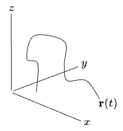
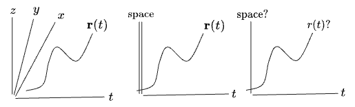
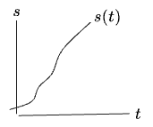
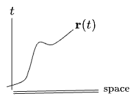
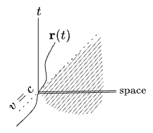
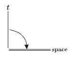
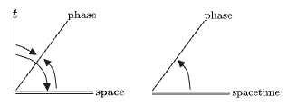
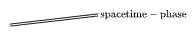

#### Table of Contents

## Trajectories

We'll start with the trajectory of a particle moving in 3D:

We can't see the time axis, so let's fold the spatial axes into a single dimension:

Schematically this makes sense, but how could we actually reduce the trajectory $$r(t)$$ to something meaningful this diagram? The "natural" way from above, $$\mathbf{r} \to \Vert \mathbf{r}\Vert$$, wouldn't know about any spatial rotations; movement on the surface of a sphere would stand still, so it would be forgetting the speed. Projections down to one dimension have the same problem: they lose translations and velocities in the other dimensions. (If the trajectory doesn't vary along the lost dimension, then go right ahead. The expression for the reduced trajectory will only contain the fixed value—radius $$R$$, say.)

The only way to project down to 1D while retaining the exact speed of the particle is to simply integrate the speed:

$$
s[\mathbf{r}(t)] = \int \Vert \frac{d\mathbf{r}}{dt}(t) \Vert dt
$$

This gives us the arc length $$s$$ as a function of $$t$$.

This $$s[\mathbf{r}(t)]$$ trajectory can never decrease, so if it starts at zero it can never even be negative—like $$\Vert \mathbf{r}\Vert$$ it's more like half of a dimension.

## Spacetime

Flip the axes and it looks like a Minkowski diagram:

Or in the familiar form in physics:

For a physical particle the shaded area of the above diagram is inaccessible: a particle at the origin would have to move faster than light to reach those positions at those times. Equivalently: a movement in space $$d\mathbf{r}$$ requires at least $$dt = \frac{d\mathbf{r}}{c}$$ change in time. Of course, we can *conceive* of those coordinates—nothing stopping us from saying "there's an object at $$x=10, t=0$$". But for the moment let's focus on the particle.

The dimensions of a particle trajectory exhibit this dependence of space on time, which turns up so often that we might try to find a notation for it:

. I'm not sure *exactly* what I want this to mean yet, or if multiple symbols are needed. It could be:
- "changing the spatial coordinate always requires a change in the time coordinate". Here the reverse wouldn't hold: a change in time *could* be accompanied by a change in space, but it doesn't have to. 
- or, "space depends on time", that is, "time is the independent variable, space is dependent".
- or, "time causes space", in the sense of causal inference.

## Quantum Mechanics

Let's also plot the phase of a quantum wave. A wave function advances its phase along any single trajectory by the action $$S[\mathbf{r}(t)]$$ of the path: the mass-energy of the particle $$\times$$ the proper time it experiences in its rest frame, in units of Planck's constant $$h$$. 

$$
\begin{aligned}
\psi \to e^{-i \phi}\psi &= e^{-i\int d \phi} \psi_0 = e^{iS[\mathbf{r}(t)]/\hbar}\psi_0 \\
d\phi &= \frac{mc^2}{\hbar}d\tau = 2\pi \frac{mc^2}{h}d\tau
\end{aligned}
$$

(There's a $$2\pi$$ because it's a phase, it's like a unit conversion.)

In some other reference frame parameterized by $$t$$ the action is found from a Lagrangian:

$$
-i \phi = i\frac{i}{\hbar}S[\mathbf{r}(t)] = \frac{i}{\hbar}\int Ldt = \frac{i}{\hbar}\int (-mc^2\frac{d\tau}{dt})dt = -\frac{i}{\hbar} \int (\mathbf{p}\cdot d\mathbf{x} - Edt)
$$

Hence changes in space and time both cause changes in phase, by amounts proportional to the momentum and energy respectively (the two components of $$m d\tau$$ as seen in the $$\mathbf{x}, t$$ frame). Great. So: 

In the left diagram the arrow from $$t$$ passing through "phase" is meant to apply to to "phase" as well; this will come in handy later. So read this as: "phase depends on space and time"; a change in phase requires either an increase in either time or space (which still depends on time).

The right diagram collapses space and time into a single dimension. Then: a change in phase requires a change in spacetime. But you can contrive a change in spacetime which results in no change in phase. All you need is $$\mathbf{p} \cdot d\mathbf{x} - H dt = 0$$. That's going to be hard though, because that quantity (in special relativity) is 

$$
(\mathbf{p} \cdot \mathbf{v} - H)dt =  Ldt = -m\sqrt{c^2-v^2}
$$

so it's only $$0$$ at the speed of light. For our lone massive particle, this is also inaccessible, so these phase and spacetime dimensions aren't actually independent. Something must have been "unfolded" incorrectly somewhere, which leaves us with two dimensions that represent the same thing. Might as well collapse them further:

All of that was the phase along a single trajectory, but if you propagate multiple trajectories, they can interfere and cancel out again. This is where you go off and take a full path integral, counting all the ways they can recombine to cancel out, which leads to the rest of physics.

$$Ldt$$ above is just $$-mc^2\frac{d\tau}{dt}$$, which is doing the same thing as the arc length $$\frac{ds}{dt}$$ in our earlier example; $$-m\sqrt{c^2 - v^2}$$ is just an arc length. Just like with arc length, we've projected a whole trajectory down to a single $$t$$-dependent function. And the speed of this curve is constant (it equals $$mc^2$$); only its angle in $$d\mathbf{x}, dt$$ can change. So this reduction has thrown out some information that, in fact, wasn't changing anyway, which makes it a natural choice. We're left with an $$mc^2$$ representing the fixed speed. There's a Noether theorem in here: any invariant of the system can be folded out cleanly; the resulting $$L$$ depends only on the constant value ($$m$$); similarly any parameter which can be folded out must be conserved.

Hence $$Ldt$$ is what we get when we "fold" a trajectory down to a single one-dimensional expression. We get two handles with which to compare to other systems (mass and time) along with a bunch of unit conversions (mass to energy to action to phase). 

If we decide to expand our system in terms of any other parameters, $$Ldt$$'s functional dependence on those parameters will encode a lot of information about the system; hence we can expand $$Ldt$$ in terms of $$d\mathbf{x}$$. But $$L$$ itself must be indifferent to the specific coordinate system we use. 

This is just like how our determinant $$\det \mathbf{A}$$ contains much of the information about $$\mathbf{A}$$ itself. But its expansion in terms of eigenvalues only knows about the set of eigenvalues, not their order, nor the vectors they correspond to. Getting information *out* of the folded objects $$\det \mathbf{A}$$ or $$L$$ requires adding parameters and indicating how they relate to each other: $$\det \mathbf{A}(\lambda_n)$$ tells us more than the value of $$\det\mathbf{A}$$ alone; same for $$L(\mathbf{x}, \mathbf{v})$$. 

 

 