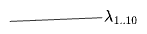

*Part of a series on Dimension Diagrams*:
1. *(This post)*.
2. *<a href="/posts/2024-09-02-dimensions-physics/">Physics</a>*
3. *<a href="/posts/2025-08-30-data-dimensions/">Data Engineering</a>*

#### Table of Contents

## I. Vectors

Behold a three-dimensional vector space:

And a vector:

Here I've labeled the components of the vector called $$\mathbf{a}$$ in the $$x,y,z$$ coordinate system. Simple enough.

But if there were *more* than three dimensions, we couldn't simply draw a vector in perspective. Instead, let's collapse the extras onto a single axis:

The double line represents "one or more dimensions"—the rest of the $$N$$ dimensions, for any $$N$$. And $$a_{3\ldots N}$$ stands for the projection of the vector $$\mathbf{a}$$ onto that entire subspace.

Maybe you even decide to forget how many dimensions are in $$\mathbf{a}_{3{.}{.}N}$$, "reducing" the information in those axes into a single scalar $${a}_{3{.}{.}N}$$. This will then give a 3 dimensional space as in the first diagram. 

But there are various ways to perform this reduction—how do you pick? An obvious choice is to map that component $$\mathbf{a}_{3{.}{.}N}$$ to its length $$\mathbf{a}_{3{.}{.}N} \to \vert \mathbf{a}_{3{.}{.}N}\vert$$. Since $$ {\vert\mathbf{a}_{3{.}{.}N} \vert}^2 = a_3^2 + \ldots + a_N^2$$, this preserves the length of the full vector:

$$\vert \mathbf{a} \vert= \sqrt{a_1^2 + a_2^2 + a_{3{.}{.}N}^2}$$

But that isn't the only option; you could, for example, project to a single one of the $$(N-2)$$ dimensions, such as $$\mathbf{a}_{3{.}{.}N} \to a_3$$.

Or you could go the opposite direction: maybe you thought you were working in 3 dimensions, and then: more pop out! You "unreduce" one dimension into a whole $$(N-2)$$-dimensional subspace. This clearly adds information, so you have some choice in how you do it. This choice will in turn determine how operations on the original vector extend to the unreduced vector—what, for example, will happen to a rotation which previously took the "1" dimension into the "3" dimension? How should this map to the larger $$3{.}{.}N$$ dimensions? It could rotate into "3" only (the inverse of "projection"), or it could map to all of the new dimensions "equally", i.e. into the vector $$(0, 0, \frac{\sqrt{a_3}}{\sqrt{N-2}}, \frac{\sqrt{a_3}}{\sqrt{N-2}}, ...)$$, which has the same length as the original $$a_3$$ but spread evenly over all $$3{.}{.}N$$ dimensions (making this the inverse of the reduction to a length). Or something else!

Now, if you have one vector $$\mathbf{a}$$, you can decompose some other vector $$\mathbf{b}$$ into components parallel and perpendicular to $$\mathbf{a}$$. 

Here I've adopted a few conventions:
* $$\perp a$$ and $$\parallel a$$ are *subspaces*, and will not be typeset in boldface. These are labeled in the diagram as lines without arrows, while vectors have arrows at the end. Their "negative" halves are not depicted (what would negative $$\perp a$$ mean?)—but it might be useful to depict these in other instances.
* A double line is again used for a subspace of greater than one dimension. Here, in $$N$$ dimensions,  $$\perp a$$ will be $$N-1$$-dimensional.
* On the left are shown the vector projection $$\mathbf{b}_{\parallel a}$$ and rejection $$\mathbf{b}_{\perp a}$$. 
* On the right, the scalar projection $${b}_{\parallel a}$$ and rejection $${b}_{\perp a}$$ are shown. The "sides" of $$\mathbf{b}$$ are labeled something like their *lengths*, but $${b}_{\perp a}$$ should be thought of as containing $$N-1$$ components. 
* These projections and rejections are written to suggest that they are operations between $$\bf{b}$$ and the subspaces $$\perp a$$ and $$\parallel a$$, rather than between $$\bf{b}$$ and the vector $$\bf{a}$$ itself. This is helpful because it avoids having to make reference to any particular basis on the subspace $$\perp a$$.

The same decomposition as an equation is:

$$
\begin{aligned}
\mathbf{b} &= \mathbf{b}_{\parallel a} + \mathbf{b}_{\perp a} \\
&= \frac{\mathbf{b}\cdot\mathbf{a}}{ {\vert \mathbf{a} \vert}^2} \mathbf{a} + \frac{\mathbf{b}\cdot\mathbf{a}_\perp}{ {\vert \mathbf{a}_\perp \vert}^2} \mathbf{a}_\perp
\end{aligned}
$$

More conventions: $$\mathbf{a}$$ is a vector, but $$\mathbf{a}_{\perp}$$ can not be. Only in two dimensions is there a *vector* spanning the space orthogonal to $$\mathbf{a}$$, and even then there's no particular reason to choose any particular vector on the subspace $$\perp a$$. In more than two dimensions, we will take $$\mathbf{a}_\perp$$, $$\mathbf{b}\cdot\mathbf{a}_\perp$$, and $$\frac{\mathbf{b}\cdot\mathbf{a}_\perp}{ {\vert \mathbf{a}_\perp \vert}^2} \mathbf{a}_\perp$$ to mean "whatever they need to" for the above to make sense—matrix, or a particular choice of basis, or an oriented area? We'll figure it out later. 

In any case, once we've defined $$\mathbf{a}_\perp$$, we should just as easily be able to start over by projecting $$\mathbf{b}$$ onto *that*. Then we'd call the $$\mathbf{b}_{\parallel(a_\perp)}$$ term the "projection" (onto an $$(N-1)$$-dimensional space) and $$\mathbf{b}_{\perp (a_\perp)}$$ the rejection. We should get the same result:

$$
\mathbf{b} = \mathbf{b}_{\parallel (a_\perp)} + \mathbf{b}_{\perp (a_\perp)} = \mathbf{b}_{\perp a} + \mathbf{b}_{\parallel a}
$$

So whatever $$\mathbf{a}_\perp$$ means, it ought to be able to play the role of "projection" and "rejection" equally well.

The right diagram above depicted a vector in terms of its two components $$(b_{\parallel a}, b_{\perp a})$$. The latter component could be taken to stand for $$N-1$$ components at once, or could represent a "reduction" to a single scalar as discussed earlier. With this convention we could "draw" an $$N$$-dimensional vector in a plane, and at least preserve the apparent "orthogonality" of the components parallel to and perpendicular to $$\bf{a}$$. 

Let's now throw out the rule that "right angles represent orthogonal dimensions". Instead, for the rest of this post, we'll use a half-axis starting from the origin to stand for an entire dimension, orthogonal to all the rest, no matter what angle they're drawn at. Double-lines will represent multiple dimensions collapsed into a single half-axis. We can then fit more than two or three dimensions in a single diagram. Here's a 10-dimensional space and a vector $$\mathbf{a}$$ (which is zero on dimensions 5 through 9). I'm encoding the absolute values of the projections onto each axis as a dotted line.

The obvious definition of an expression like $$a_{3,4}$$ is as the norm of that component, $$a_{3,4} = \vert \mathbf{a}_{3,4} \vert$$, but I am hoping to keep open the option of using different "reductions" rather than only using

Is the polygon anything? Probably not. It's quite underdetermined: it's only defined only up to the signs of the components and up to the choice "projection" on any multi-dimensions (the $$3,4$$ dimension here.) This kind of diagram might be more sensible for depicting probabilities, which can't be negative anyway. 

## II. Matrices

We can do something similar with a matrix. Suppose you have some rank-10 real matrix $$A$$, which can be diagonalized as follows: 

$$
A = \begin{pmatrix}
\lambda_1 \\
& \lambda_2 \\
& & \lambda_{3,4} R_{2 \times 2} & \\
& & & \lambda_{6{.}{.}9} \mathbf{I}_{4 \times 4} \\
& & & & 0 \\
\end{pmatrix}
$$

That is, this matrix:
- scales its first two eigendimensions by $$\lambda_1, \lambda_2$$ respectively.
- rotates dimensions 3 and 4 into each other, while scaling by $$\lambda_{3, 4}$$.
- scales dimensions 5 through 9 by a common factor $$\lambda_{6{.}{.}9}$$.
- annihilates dimension 10.

This can be visualized as follows:

This could be read as a vector along the lines of the previous section, but I don't think that interpretation would be very meaningful. Instead this should now be thought of as a simply standing for the diagonal representation of the matrix itself.

The first two eigenvalues are the biggest, so we could approximate this matrix by only its first two "principal components", i.e. by zeroing all but the first two eigenvectors, defining a new matrix $$A'$$:

Explicitly:

$$
A' = \begin{pmatrix}
\lambda_1 \\
& \lambda_2 \\
& & 0_{3{.}{.}10}
\end{pmatrix}
$$

This is something like a "principal component analysis". The action of $$A'$$ on a given input vector $$\mathbf{x}$$ will deviate from that of the original $$A$$ in some way that depends on $$\mathbf{x}$$'s components along the zeroed dimensions:

$$
(A - A')
\begin{pmatrix}
x^1 \\
x^2 \\
\mathbf{x}^{3{.}{.}10}
\end{pmatrix}

= 

\begin{pmatrix}
0\\
0\\
{\lambda}_{3{.}{.}10} \cdot {x}^{3{.}{.}10}
\end{pmatrix}
$$

where the last expression is to be understood as a standard inner product.

We can equivalently think of this PCA-like-reduction as a reduction of the _vector space_ to three-dimensions, where the first two dimensions are chosen as principal eigendimensions. Under this reduction $$A$$ transforms into a reduced $$\tilde{A}$$:

$$
\tilde{A} = \begin{pmatrix}
\lambda_1 \\
& \lambda_2 \\
& & \lambda_{3{.}{.}10}
\end{pmatrix}
$$

or, graphically:

where $$\lambda_{3{.}{.}10}$$ is *something* representing the error of the transformation. Its action on vectors is

The action of $$\tilde{A}$$ in the reduced space would then be

$$
\tilde{A'}
\begin{pmatrix}
x^1 \\
x^2 \\
x^{3{.}{.}10}
\end{pmatrix}

= 

\begin{pmatrix}
\lambda_1 x^1 \\
\lambda_2 x^2 \\
\lambda_{3{.}{.}10} x^{3{.}{.}10}
\end{pmatrix}
$$

where $$x^{3{.}{.}10}$$ is some other thing, and the multiplication operation in the last expression is not specific. If it were full-rank matrix multiplication, we'd recover the original $$A$$, but the point is to leave its implementation unspecified.

Meanwhile the reduced-truncated $$\tilde{A'}$$ has no component on the remaining dimensions:

$$
\tilde{A'} = \begin{pmatrix}
\lambda_1 \\
& \lambda_2 \\
& & 0_{3{.}{.}10}
\end{pmatrix}
$$

One constraint we can place on the meaning of $$\lambda_{(3{.}{.}10)}$$ is that it should reduce to a scalar in the case of only one additional dimension. one obvious scalar value would be the square root of [Frobenius norm](https://en.wikipedia.org/wiki/Matrix_norm#Frobenius_norm) of $$A' - A$$, which for Normal matrices is the norm of the eigenvalues considered as a vector:

$$
{(\lambda_{3{.}{.}10})}^2 = {\Vert A' - A\Vert}_{F} = {(\lambda_{3,4})}^2 +4{(\lambda_{6{.}{.}9})}^2 + 0^2
$$

Then if we take $$x^{3{.}{.}10}$$ to also be a norm

$$
{(x^{3{.}{.}10})}^2 = {(x^3)}^2 + \ldots + {(x^{10})}^2
$$

we get an interpretation of $${(\lambda_{3{.}{.}10})}^2$$ as an upper bound on the error of 

$$
{\Vert (A' - A) \mathbf{x} \Vert} \le {\Vert (A' - A) \mathbf{x} \Vert}_F \Vert x \Vert
$$

(All this would be more general if working with singular values, but I can't be bothered.)

Another "reduction" operation would be to define $$\lambda_{3{.}{.}10}$$ as the determinant of the minor of $$A$$ on dimensions $$3{.}{.}10$$. In the present example this would be zero, since we said $$\lambda_{10} = 0$$, but there might be some other class of matrices for which this makes more sense. And the determinant (of a minor) has as its most natural interpretation the scaling of (here, $$N-2$$-dimensional) unit volumes—so perhaps the action on a mere vector $$\mathbf{x}$$ is not what we should be thinking of here.

If we can reduce away some of the dimensions of a matrix, we can reduce away *all* of them, getting a single scalar: 

Some good candidates for the "one-dimensional reduction" of a matrix are:
- the determinant, or geometric mean, of eigenvalues
- the trace
- the Frobenius norm
- the sum of absolute values of eigenvalues/SVs.
- the largest eigenvalue, or perhaps its absolute value. Same for SVs.

This is really the starting point for this whole line of thinking: it seems that there are multiple sensible ways to "reduce" a linear operator to a single number. Each ought to be able to be thought of as operations on the vector space instead on the operator, and it should be possible to "partially apply" any of them to give successive "approximations" to the original operator. 

My point here is not really to discover a new matrix operation, but to arrive at a "unified framework" in which to understand a number of disparate linear algebra concepts—in particular, from which to *motivate* them. The idea of such operations as applying to the _space_ rather than to the _operator_ is highly suggestive to me—it is something like 

Now, when we mapped $$\mathbf{a}_{3\ldots N}$$ down to one dimension $$a_3$$, there was an obvious way to do that so that $$\mathbf{a}_{3..N}^2 = a_3^2 + \ldots + a_N^2$$. But there's no reverse operation that brings all that information back: you could unfold the scalar $$a_3$$ into any particular vector in your new dimensions $$3{.}{.}N$$, but there is way to distinguish any of the new dimensions from each other unless you also specify that structure.

Or, consider rotating around dimension 2 (rotating dimension 1 into 3), before and after the unfolding. Before, $$\mathbf{e}_1$$ mapped to $$\mathbf{e}_3$$. After, does it map to any particular vector? To all vectors in $$3{.}{.}N$$? To an equivalence class of vectors? All of these will work, but I think the most sensible and least opinionated target is to map to the volume element on the unfolded space:

$$a_3 \to a_3 \mathbf{e_3} \wedge \mathbf{e_4} \wedge \ldots \wedge \mathbf{e_N}$$

This looks like like the reverse of what we just did with the matrix $$\mathbf{A}$$, so we can run that backwards to see where to go from here. We arrived at $$\det{A}$$ by forgetting the dimensions of the matrix; therefore, anywhere it it appears, we can restore the matrix's full dimensions pulling eigenvalues out of the $$\det$$:

$$\det{\mathbf{A}}$$ could of course be the determinant of many matrices—knowing it belonged to $$\mathbf{A}$$ amounts to a choice of how to unpack it—the same choice we would have to make with our $$\mathbf{a}_3$$. Some applications might be indifferent to the choice; others might depend on the specific choice, or that the same choice is made each time an unfolding occurs.

And of course, we can equally well imagine folding 10 dimensions into 2 or 3 rather than 1, and the same "choices" will arise.

All of this isn't so strange: we do this to get $$\mathbb{C}$$ from $$\mathbb{R}$$ all the time. "Actually this $$r$$ is 2D":

And there are different ways you can do it. The obvious one is to identify $$r$$ with $$r + 0i$$, but it as easily be mapped to any other vector. Or you could do something weirder: maybe you take $$r$$ to the volume element $$r(1 \wedge i)$$, or to the set of all the complex numbers of radius $$r$$, i.e $$\mathbf{r} \to \{ z \mid \Vert z \Vert = r \}$$, with the sign of $$r$$ perhaps encoding something else. This is all to say: unfolding dimensions is inherently underspecified, as it maps to a larger space.

 

 