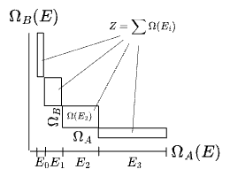
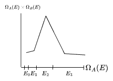
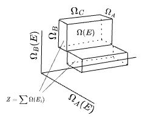
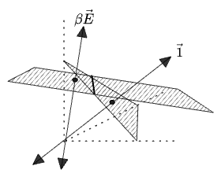

#### Table of Contents

# Part 1: The Partition Function

## Multiplicity

Statistical mechanics begins with the postulate that the macroscopic behavior of an isolated system depends only on its entropy, defined as the logarithm of the "multiplicity" of states: 

$$
S(N, V, E) = k\ln \Omega(N, V, E, \ldots)
$$

Measurable thermodynamic quantities like pressures and heat capacities derivatives are then found by taking derivatives of $$S$$ in various combinations.

Thus the system is completely characterized by the functional form of $$\Omega$$. For example, if our system consists of $$N$$ non-interacting quantum-mechanical free particles in a box of volume $$V$$, then $$\Omega$$ can be found by fixing $$N$$ and $$V$$, then counting the quantized states with energies in $$[E, E+\Delta E]$$.

This $$\Omega$$ is variously called the "multiplicity", "count", or just "number" of states. In some contexts it is the "density of states" or "degeneracy" of states, where it is usually written $$g(E)$$ or $$g_i$$.

For two independent systems considered together, the joint count of states will be $$\Omega_{A \times B} = \Omega_\text{A} \times \Omega_\text{B}$$, and entropies will add $$S_{A \times B} = S_A + S_B$$. But in this context it's not really accurate to call $$\Omega_\text{A}$$ on its own the "count of states". It's just one factor in a product, like the side of a rectangle or a cardinality of a single set in a product $$\vert A \times B \vert = \vert \text{A} \vert \cdot \vert \text{B} \vert$$. Even when a system is said to be "isolated" or "independent", this just means that the joint state of the whole world can be factored as $$\text{(System)} \times \text{(Rest of the World)}$$. Ech state of an "isolated" system is still a whole slice of size $$\vert \text{(Rest of the World)} \vert$$. 

So I'll go on calling $$\Omega$$ the "multiplicity" or "count of states", but with the understanding that this is the size of one factored dimension in a product. 

We can visualize the multiplicity of three independent systems together $$A \times B \times C$$ as a rectangular prism:

Maybe you constructed this system by taking products of the smaller systems. Once you have $$\Omega$$ you might forget that it factors and look only at the joint dependence on parameters like $$E$$. Or, you might begin with a single expression $$\Omega$$ and then find that it factors into $$A \times B \times C$$.

For completeness, we should also mention that disjunct—mutually exclusive—states will _add_ their multiplicities: $$\Omega_{A+B} = \Omega_A + \Omega_B$$. This is just how we count the alternative states of single system: $$\Omega = 1 + 1 + \ldots$$. The rule is: multiplication represents "and" and addition represents "or".

We restate all of this in the language of probabilities. If we postulate that a system of specified $$N, V, E$$ has an equal probability of being found in each of its $$\Omega(A)$$ states, then the distribution of its states will be $$p(x_A) \sim \mathrm{Uniform}(\Omega_A(E)$$).

This "uniform distribution of states" is called the "microcanonical ensemble", but I'll avoid the term in this essay. In fact I intend to avoid discussing probabilities at all, preferring to allow $$\Omega$$ stand on its own as a description of a system, to the extent possible. 

For any joint distribution, picking a single value for $$x_A$$ determines the state up to a conditional distribution $$p(x_B \mid x_A)$$. If $$x_A, x_B$$ are _independent_, then this conditional does not depend on the choice of $$x_A$$; it is simply the marginal distribution $$p(x_B \mid x_A) = p(x_B)$$, for all $$x_A$$. So independent systems have distributions which can be factored as a product of marginal distributions: 

$$
p(x_A, x_B) = p(x_A)p(x_B) \sim \mathrm{Uniform}(\Omega_A \cdot \Omega_B)
$$

 

## The heat reservoir via generating functions

Let's now look at the standard "heat reservoir" derivation of the partition function. We imagine a system $$A$$ which can excahnge energy freely with a much larger reservoir $$B$$. We label the states of each by their energies $$E_A, E_B$$, and each has a multiplicity function which depends only on its energy: $$\Omega_A(E_A), \Omega_B(E_B)$$. I will be departing a bit from the standard textbook argument by making liberal use of the language of "generating functions" ("g.f."s from now on.) So we will represent the states of $$A$$ and $$B$$ separately as two generating functions:

$$
\begin{align}
g_A(y) = \sum_E \Omega_A(E) y^E && g_B(z) = \sum_E \Omega_B(E) z^E
\end{align}
$$

where $$y$$ and $$z$$ are placeholder variables which track the "energy cost" of each state, which is a standard g.f. method. These should be thought of as "transformations" of the underlying series $$\Omega_A, \Omega_B$$.

We'll want to have a few facts about g.f.s on hand:
* The g.f.s above are written as sums over energies $$E_A, E_B$$, but they would come to the same thing if we summed over individual states $$x_A$$: $$\sum_x y^E(x) = \sum_E \Omega(E) y^E$$,  since $$\Omega_A(E) = \vert \{ x_A \mid E(x_A) = E\} \vert$$
* The sum $$\sum_E$$ can be taken over the actual spectrum of system $$A$$, since the coefficient of any term not in the spectrum would just be zero.
* We can use a g.f. to count the total states over all $$E$$ by evaluating at $$y=1$$: $$g_A(1) = \sum \Omega_A(E) = \Omega_A$$. This just reduces the g.f. to a sum of $$\Omega$$ across all states.
* We can convert a g.f. to a "probability generating function" ("p.g.f") by normalizing it: $$p_A(y) = \frac{g_A(y)}{g_A(1)}$$. 
* We can also plug in other values for $$y$$ to assign a "cost" to each unit of $$E$$. This is best illustrated with the binomial series $${(x+y)}^N = \sum {N \choose k} x^k y^{N-k}$$ as seen in the following examples
  * Plugging in $$x=y=1$$ counts the total number of states, which is $${(1+1)}^N = 2^N$$ 
  * Plugging in $$x = y = \frac{1}{2}$$ give a $$\mathrm{Binomial}(\frac{1}{2})$$ distribution, representing the probability of getting $$k$$ heads in $$N$$ coin flips: $$p(k) = {N \choose k} \frac{1}{2}^N$$. 
  * Plugging in any other $$x = p$$, $$y = 1-p$$ will give a different $$\mathrm{Binomial}(p)$$ distribution. This works because $$({p + (1-p)})^N = 1^N = 1$$. Any assignment of values that make the g.f. equal to 1 can be interpreted as a p.g.f.
  * Plugging in $$x = y$$ marks the two variables as indistinguishable, reducing the series to $$x^N$$.
  * Other expressions like $$y=2x^2$$ can usually be given some interpretion in terms of of weights, costs, indistinguishability, etc.

Now, if our system and reservoir do *not* interact, we can track their energies separately in a two-variable joint g.f., which is just the product

$$g_{\text{independent } A \times B}(y, z) = g_A(y)\times g_B(z) = \left(\sum_{E_A} \Omega_A(E_A) y^{E_A} \right)\left(\sum_{E_B} \Omega_B(E_B) z^{E_B} \right)$$

Clearly the series would factor; each term for a given power of $$y$$ contains a full copy of the series in $$z$$ and vice versa. Likewise any fully-factorizable g.f. polynomial must represent a product of independent states—this is just the same statement about marginal probabilities from before.

If our system and reservoir *can* interact, by exchanging energy, then we need to represent this by using the same cost-tracking variable in each series. Now the terms mix, and we can rewrite the product as a sum over total energies:

$$
\begin{align}
g_{A \times B}(y) = g_A(y)\times g_B(y) 
  &= \left(\sum_{E_A} \Omega_A(E_A) y^{E_A} \right)\left(\sum_{E_B} \Omega_B(E_B) y^{E_B} \right)\\
  &= \sum_{E_A} \sum_{E_B} \Omega_A(E_A) \Omega_B(E_B) y^{E_A + E_B}\\
  &= \sum_{E_\text{total}} \sum_{E_A} \Omega_A(E_A) \Omega_B(E_\text{total} - E_A) y^{E_\text{total}}\\
  &= \sum_{E_\text{total}}(\Omega_A * \Omega_B)(E_\text{total}) y^{E_\text{total}}\\
  &= \sum_{E_\text{total}}\Omega_{A \times B}(E_\text{total}) y^{E_\text{total}}
\end{align}
$$

... and we observe that the product of two g.f.s is the g.f. of the _convolution_ of their series: 

$$
\Omega_{A \times B}(E_\text{total}) = \Omega_A * \Omega_B
$$

Note that each $$E_\text{total}$$ term is picking up contributions from a diagonal line in the space of energies $$E_A \times E_B$$:

So this convolution is just a way of "reindexing" the joint series by the combined energies $$E_\text{total}$$. The underlying expression hasn't changed yet.

 

## Linearizing the reservoir

Now that we have our joint g.f., we'll add the assumption that the reservoir $$B$$ is so much larger than system $$A$$ that, while its multiplicity $$\Omega_B$$ _will_ vary as energy is exchanged (otherwise they'd be independent), its state will not change appreciably. Thus the *rate* of the variation will be approximately constant, and we can replace the function $$\Omega_B$$ with a linear approximation. But we'll actually linearize $$S_B$$ rather than $$\Omega_B$$, which I'll only try to justify with a hand-wave-y argument for now: entropies compose additively, $$S_{A\times B} = S_A + S_B$$, so they represent "extensive" physical quantities and are the "sorts of thing we take derivatives of", while multiplicites compose multiplicatively. More on this later.

The typical version of this argument linearizes around $$E_\text{total}$$, interpreting the reservoir as containing "nearly all of the energy". This interpretation isn't necessary, though—all we need is that the reservoir's slope $$S_B'$$ is approximately constant. So I'll linearize around an arbitrary energy $$E^*$$ instead: 

$$
\begin{align}
\Omega_B(E_B) &= \Omega_B(E^* + (E_B - E^*)) \\
  &\approx \Omega_B(E^*)e^{S_B'(E^*)\times (E_B - E^*)/k}\\
  &= e^{S_B(E^*)/k}e^{\beta(E^*)(E_B - E^*)}
\end{align}
$$

where $$\beta = \frac{1}{k}\frac{\partial S_B}{\partial E} = \frac{1}{kT}$$.

We can now rewrite the term $$\Omega_B(E_\text{total} - E_A)$$ in the joint g.f. $$g_{A \times B}(y)$$ with the linearization:

$$
\begin{align}
\Omega_B(E_\text{total} - E_A) &= \Omega_B(E^* + (E_\text{total} - E_A - E^*) ) \\
&\approx e^{S_B(E^*)/k}e^{\beta(E^*)(E_\text{total} - E_A - E^*)}\\
&= e^{S_B(E^*)/k + \beta (E_\text{total} - E^*)}e^{-\beta E_A}\\
&\approx e^{S_B(E_\text{total})/k}e^{-\beta E_A}
\end{align}
$$

We see that, no matter which $$E_B = E^*$$ we linearize at, the effect is to isolate the dependence of $$\Omega_B$$ on $$E_A$$ as $$\Omega_B \propto e^{-\beta E_A}$$.

Now we insert the linearization back into the g.f.: 

$$
\begin{align}
g_{A \times B}(y) &\approx \sum_{E_\text{total}} \sum_{E_A} \left[\Omega_A(E_A) e^{S_B(E_\text{total})/k}e^{ - \beta E_A}\right ] y^{E_\text{total}}
\\
&= \sum_{E_\text{total}} \left[\sum_{E_A} \Omega_A(E_A) e^{- \beta E_A}\right ] e^{S_B(E_\text{total})/k}  y^{E_\text{total}}\\
&= \sum_{E_\text{total}} Z(\beta) e^{S_B(E_\text{total})/k}  y^{E_\text{total}}
\end{align}
$$

... and there appears the partition function $$Z(\beta)$$.

$$
Z(\beta) = \sum_{E_A} \Omega_A(E_A) e^{- \beta E_A}
$$

The effect of our linearization has been to characterize the influence of the external reservoir $$B$$ on $$A$$ (and really, the influence of the entire external world) in terms of a single parameter $$\beta$$. Read this as: the reservoir converts energy into entropy at a fixed exchange rate $$\beta$$. Then $$A$$, which in isolation had a certain dependence of entropy-on-energy $$S_A(E) = k \ln \Omega_A(E)$$, will instead experience an *effective* dependence $$S_A(E) = k\ln \Omega_A(E) - \beta E$$, since any energy traded away comes at a constant entropy cost. 

(This is a lot like linearizing the gravitational potential at the surface of the earth as $$U_g = mgy$$. We're not really doing anything more complicated than elementary physics here!) 

 

## $$Z$$ as the multiplicity of the combined system

Let's now try to interpret the partition function $$Z$$ in our joint g.f. We had:

$$ 
\begin{align}
g_{A \times B}(y) &\approx \sum_{E_\text{total}} \left[\sum_{E_A} \Omega_A(E_A) e^{- \beta E_A}\right ] e^{S_B(E_\text{total})/k}  y^{E_\text{total}} \\
&= \sum_{E_\text{total}} Z(\beta) \times e^{S_B(E_\text{total})/k}  y^{E_\text{total}}
\end{align}
$$

We can read the terms

$$
\Omega_A(E_A) \times e^{-\beta E_A} \times S_B(E_\text{total}/k)
$$ 

as the product of multiplicities of _three_ systems. The first is just $$A$$, but the second and third are a fictitious division of $$B$$ into a part which captures its full $$E_A$$-dependence, and a part which doesn't depend on $$E_A$$ at all: $$A \times B = A \times B_{A} \times B_{\not{A}}$$. This fictitious $$B_{\not{A}}$$ could depend on all kinds of other variables, and in fact is summing up the contribution of the rest of the whole world, but our approximation has guaranteed it won't depend on $$E_A$$.

We can visualize the joint distribution of the $$E_A$$-dependent systems, $$A \times B_{A}$$: 

The rectangles widths grow according to $$\Omega_A$$ while their heights shrink according to to $$e^{-\beta E_A}$$. The partition function $$Z$$ is the combined area of the all of the rectangles.[^1]

[^1]: Here I'm plotting $\Omega$ on the axes, not $E$; the $E_i$ values are labeling the bins. If the $E$ distribution were bounded, this would be like plotting against the quantile of $E$ rather than $E$ itself, or against the "position on $E$'s c.d.f.". Basically this is an unnormalized [copula](https://en.wikipedia.org/wiki/Copula_(statistics)) plot, a concept I only learned about when I was trying to figure out what this thing I was drawing was.

Their joint multiplicity $$\Omega(E) = \Omega_A(E) e^{-\beta E}$$ represents the _areas_, which grow and then shrink again:

The "third" system $$B_{\not{A}}$$ can be visualized as an independent dimension, called $C$ below:

We can also read a physical interpretation of $$Z(\beta)$$ off the joint generating function 

$$g_{A \times B} = \sum_{E_\text{total}} Z(\beta) e^{S_B(E_\text{total}/k)}  y^{E_\text{total}}$$

For each $$E_\text{total}$$, this has the form of a product of two systems $$Z \times \Omega_{B_{\not {A}}}$$. We conclude:

**$$Z$$ represents the total contribution of $$\Omega_A$$ _and_ the energy exchange with $$B$$ to the multiplicity of the combined system $$\Omega_{A \times B}$$.** 

In other words:

**$$Z$$ is the multiplicity of all systems which depend on $$E_A$$.** 

In still other words: 

**$$Z$$ is the effective multiplicity of system $$A$$, accounting for its interaction with the environment.**

 

## $$Z$$ as a Laplace transform

If we write the definition of $$Z$$ as an integral and drop all the $$A$$ subscripts, the partition function reveals itself to be the Laplace transform of $$\Omega(E)$$:

$$
Z(\beta) = \int \Omega(E) e^{-\beta E} dE
$$

That g.f.s are very nearly Laplace transforms isn't too surprising, since multiplication of g.f.s corresponded to the convolution of underlying functions, which is one of the defining properties of the Laplace transform. 

From this perspective the $$e^{-\beta E}$$ arose from system $$A$$'s own Laplace transform. Apparently our linear approximation took $$B$$'s function form out of the picture entirely: 

$$
\begin{align}
\mathcal{L}[\Omega_{A \times B}](\beta) = \mathcal{L}[\Omega_A * \Omega_B](\beta)
  &= \mathcal{L}[\Omega_{A}](\beta) \times \mathcal{L}[\Omega_{B}](\beta) \\
  &\approx \mathcal{L}[\Omega_{A}](\beta) \times e^{S_B(E_\text{total}/k)}\\
  &= \mathcal{L}[\Omega_{A} ](\beta) \times \text{const.}
\end{align}
$$

Thus the linear approximation for the reservoir makes the joint state $$\mathcal{L}[\Omega_{A \times B}]$$ depend only on system $$A$$. Maybe if you have a great intuition for Laplace transforms you could work out the form $$\Omega_A$$ without the external reservoir argument at all; apparently we have parameterized system $\Omega$ by its derivative $\beta = k\frac{\partial \ln \Omega_A}{\partial E_A}$, though it's hard for me to imagine where that form would come from without the reservoir argument... maybe the reservoir argument will give some insight into the Laplace transform.
 

## $$Z$$ as an information cost

One more interpretation: we arrived at $$Z$$ by plugging $$e^{-\beta}$$ in for the cost-tracking variable $$y$$ in a g.f. Other ways of evaluating g.f.s at specific values, like $$x=1$$ or $$x=y$$, were interpretable. So what does it mean to plug in $$e^{-\beta}$$?

We can first observe that any g.f. like $$g(x) = \sum_n a_n x^n$$ can be reindexed by evaluation at $$x = y^m$$: $$g(y) = \sum a_n y^{nm}$$. The transformed g.f. represents a reindexed series $$b_k = a_{k/m}$$, where the set of weights is unchanged but their assignment to indices, which represent counts of a resource, has been altered. In evaluating at $$y = {\frac{1}{e}}^\beta$$, we are first assigning each unit of the original cost $$y$$ to $$\beta$$ units of a new cost. This can also be seen as altering the energy scale $$E \to E' = \beta E$$. (We could express the partition function as $$Z(\beta) = \sum_{E'} \Omega(E' / \beta)e^{-E'}$$.) 

Then we have also set the scaled cost to $$\frac{1}{e}$$. This suggests an interpretation as "information", based on the fact that the Shannon Entropy (about which more later) is usually interpreted as an expectation of information: $$H[p(x)] = \langle \ln{\frac{1}{p(x)}}\rangle = \langle I(x)\rangle$$. This suggests that any probability can be seen as the exponent of an "information cost": 

$$
p(x) = e^{-I(x)} = {\frac{1}{e}}^{I(x)}
$$

We shouldn't read *too* much into this: this does not necessarily imply that $$\frac{1}{e}$$ is a particularly privileged unit of information, beyond the fact that it interacts nicely with derivatives. After all, the logarithm base in the entropy can easily be changed to 2 or anything else. 

But it feels safe to read the assignment $$y=e^{-\beta}$$ as assigning an information-cost to each unit of energy.[^2]

[^2]: I am led to contemplate whether the energy going into any particular mode in our system $A$, e.g. a wave mode with energy $E^*$, can itself be seen as an information cost, but one which doesn't depend on the ambient temperature, being quantized and unable to exchange freely in units smaller than $E^*$ itself. I often think of the canonical momentum as the "information cost of changing Lorentz reference frames"; a bound state of a wave must change its frame at every coordinate within the boundary at once in order to be consistent with the B.C.s; this quantizes it. But, if this view is right, at root all of the energy is just "configuration entropy"... 

 
 

# Part 2: The Free Energy 

## Postulates for the Physical State

We have so far describing our the system in terms of *probabilities* except for a few interpretative remarks. The only physical content is the form of the function $$\Omega(E)$$ (dropping the label $$A$$ now), and the experimental fact that derivatives of $$S = k\ln \Omega$$ behave like measurable thermodynamic variables. 

We have also not discussed *equilibrium*. The partition function $$Z(\beta)$$ is so far only the multiplicity $$\Omega$$ of a larger system than $$A$$ alone. Nothing about the "heat reservoir" argument required equilibrium, only the exchange of energy, because we have not made any claim as to which state $$A$$ is to be found in. We are still completely free to apply different postulates as to which state the system (along with the interacting part of the reservoir) is actually to be expected experimentally.

Three choices of postulate are common:
1. (Mode Postulate) The system is simply found in the state of maximal of $$\Omega_A(E)e^{-\beta E}$$, i.e. the mode, which we'll call $$E^*$$. 
2. (Mean Postulate) Or, the system is found to be in the mean-energy state of this series, which we'll call $$\langle E \rangle = U$$.
3. (Distribution Postulate) Or, the system is found in all possible states with uniform probability *over the system and reservoir* combined. This is:

$$
\begin{align}
   p(x_A, x_{B_A}) = \mathrm{Uniform}[Z(\beta)] && \text{or} && p(E_A, E_B) = \frac{\Omega_A(E_A)\Omega_B(E_B)}{Z(\beta)}
\end{align}
$$
   
In terms of the system $$A$$ alone, applying the linearization as before, we get a physical state which is a drawn from a "canonical ensemble", whose states are distributed according to the "Boltzmann distribution" with $$Z$$ as the normalization constant: 
   
$$
\begin{align}
p_\text{Boltzmann}(x) = \frac{e^{-\beta E(x)}}{Z(\beta)}  && \text{or} && p_\text{Boltzmann}(E) = \frac{\Omega(E) e^{-\beta E}}{Z(\beta)}
\end{align}
$$

Each postulate above answers the same question: how do we make physical predictions of thermodynamic properties from only a description of the multiplicities of states of a system $$\Omega(E)$$?

None of these postulates are _inherently_ correct, except inasmuch as they reproduce experimental results. 

We can make some progress on picking among the postulates by observing how they relate to each other. The distribution in postulate 3 will have as its mode and mean the exact values $$E^*$$ and $$U$$ chosen by the first two postulates (since it's proportional to the same underlying series for $$\Omega_A$$). And it will turn out that, for most physical systems, the mode and mean will be effectively equal to each other, and in fact the series $$\Omega(E)e^{-\beta E}$$ will alwmost alawys be very nearly a delta function around its modal value $$E^*$$.

We can illustrate this with a simple system of $$N$$ binary bits, each with energy $$0$$ or $$\epsilon$$. The "exact" Boltzmann distribution as a function of the number of $$\epsilon$$-bits $$m$$ is:

$$
p_\text{Boltzmann}(m) = \frac{ {N \choose m} e^{-\beta(m\epsilon)}}{\sum_m{N \choose m}e^{-\beta(m\epsilon)}}
$$

For some temperature $$kT$$, the state with $$\frac{m}{N} = \frac{kT}{\epsilon}$$ of the bits will be the largest term this series. How dominant is it? If $$kT = \frac{N\epsilon}{2}$$, and $$N=1000$$, the peak at $$m=500$$ has 2.5% of the total probability, and the range $$m \in [490, 500]$$, only 2% of the range of $$m$$, supports about 50% of the total probability. That's pretty sharp, but this is nothing compared to typical thermal systems, which usually have $$N \sim O(10^{23})$$. One can show with a Stirling approximation that the width of this peak grows as $$O(\sqrt{N})$$; thermal systems are very sharply peaked indeed.

The sharpness of these peaks justifies the "thermodynamic limit": for large $$N$$ we assume that the mode ($$E^*$$, postulate 1) and mean ($$U$$, postulate 2) are equal, $$E^* = U$$, and often approximate the entire distribution (postulate 3) as *only* its peak value, or as a sharp Gaussian around the peak value, the variances of which turn out correspond to second-order thermodynamic properties like "specific heat" and "compressibility".

(This last observation is essentially the Central Limit Theorem: the sum of many identical distributions tends to converge to a Gaussian. We could call this Gaussian approximation "postulate 4", but we won't need it.)

But I'm not going to take this limit yet. I will instead examine the three postulates separately, and apply the thermodynamic limits separately to each one, so we can clearly see where different definitions of the same concepts arise, and which simplifying limits lead to their familiar forms.

## 1. Free Energy in the Modal State

Where is the extremal energy $$E^*$$ of the $$\Omega_A(E)e^{-\beta E}$$ series? We maximize that term, which is equivalent to minimizing the exponent:  

$$
\begin{align}
E^* = \mathrm{argmax}_E ~[\Omega(E) e^{-\beta E} ]
= \mathrm{argmax}_E ~[e^{\beta(TS(E)- E)}] &= \mathrm{argmax}_E ~[e^{-\beta f(E;T)}]  \\
&= \mathrm{argmin_E} ~f(E;T) \\
&= \mathrm{argmin_E} ~[E - TS(E)]
\end{align}
$$

where $$f(E; T) = E - TS(E)$$ is the "free energy" in a state with energy $$E$$. 

Then the extremal value of $$\min_T f(E; T)$$ gives the *thermodynamic* Free Energy:

$$
F(T) = \min_E E - TS(E)
$$

I call this "thermodynamic" because a single formula like this can serve as an entry point into classical thermodynamics, which makes predictions about the properties of materials by taking different derivatives of the Free Energy (which generally would be a function of $$V$$ and $$N$$ as well, so $$F(T, N, V)$$), in the same way that derivatives of $$S(N, V, E)$$ corresponded to physical properties of an isolated system.

Note how the extremization has consumed the $$E$$ parameter, with its "dual", the temperature, falling out as an argument which parameterizes how sharply the extremization w.r.t. $$E$$ should affect the original function $$\Omega(E)$$. 

This relationship expresses $$F(T)$$ as a Legendre transform of the entropy $$S(E) = k \ln \Omega(E)$$, which can be best understood as inverting the first derivative, or saying: the extremum of $$S$$ occurs at the energy $$E^*$$ where $$S'(E^*) = \frac{1}{T}$$, or, the modal energy $$E^* = {(S')}^{-1}(T)$$. In other words, $$E^*$$ occurs where the rate of increase of $$\Omega(E)$$ cancels the rate of decrease of $$e^{-\beta E}$$. We can locate this on the visualization from before: the extremal $$E^*$$ occurs when the rectangle areas are stationary, that is, at the energy for which the widths are growing at the same rate that the heights are shrinking:  

Strictly speaking, the above equation is not how the Legendre transform is usually written. The standard form would be $$\frac{F(T)}{T} = \min_{E} \frac{1}{T}E - S(E)$$, Legendre-transforming $$S(E)$$ w.r.t. a slope which we name $$\frac{1}{T}$$. This definition can be written more naturally in terms of $$\beta = \frac{1}{kT}$$ with a "dimensionless free energy" $$\mathcal{F} = \beta F$$ and "dimensionless entropy" $$\mathcal{S} = S/k$$, then we have: 

$$
\mathcal{F} = \min_E \beta E - \mathcal{S}(E)
$$

You can also see this as a Legendre transform of $$E(S) \to F(T)$$ through the parameter $$T = \frac{d E}{d S}$$, if you had started with the $$S(E)$$ inverted as $$E(S)$$. These different formulations are all equivalent, only amounting to different rearrangements of the underlying differential $$dF = dE - TdS + SdT$$. 

Note that we have still asserted nothing about equilibrium or probabilities! Our expression simply represents the value of the series $$\Omega_A(E)e^{-\beta E}$$ as its maximum:

$$
\Omega_A(E^*)e^{-\beta E^*} = e^{-\beta F(T)}
$$

This $$F(T)$$ I will call the "modal Free Energy", so we can distinguish it from the definitions of Free Energy arising under the other postulates. 

Let's now try to interpret it.

First, note that $$F$$ is the extremal value of the $$f(E; T)$$, the "free energy of a state", which can be traced back to $$e^{-\beta f(E;T)} = e^{-\beta E + S_A(E)/k} = \Omega_{A \times B_{E}}(E)$$. This $$f(E;T)$$ is simply the the number of states in the combined system $$A \times B_{A}$$ when system $$A$$ is at a given energy $$E$$. So the "free energy" of system $$A$$ is nothing but the "entropy" of the larger system when in its modal state: 

$$
F(T) = S_{A \times B_A}(E^*(T))
$$

If we think of "turning on" a reservoir suddenly, the free energy of a *state* $$f(E;T)$$ tells us "how does the entropy of a state of energy $$E$$ change when we turn on the reservoir, as a function of the temperature?" Answer: $$S(E) \to \frac{-f(E; T)}{T}$$. 

The thermodynamic free energy $$F(T)$$ instead tells us: "how does entropy _at the extremal energy_ change, as a function of the temperature?"

$$F(T)$$ can also tell us: "how does the extremal value *of the energy* change?" The extremal value of a Legendre transform is encoded in a derivative: 

$$
\begin{align}
E^* &\equiv \frac{\partial (F/T)}{\partial (1/T)} \\
&= \frac{\partial }{\partial (1/T)}\left(\min_E \frac{E}{T} - S(E)\right) \\
&= E^* + \frac{1}{T}\frac{\partial E^*}{\partial (1/T)} - \frac{\partial S}{\partial E^*}\frac{\partial E^*}{\partial (1/T)}\\
&= E^* + \left(\frac{1}{T}{E^*}' - \frac{1}{T}{E^*}'\right) \\
&= E^*
\end{align}
$$

In effect we've transformed from an isolated-system version of postulate 1 to an interacting version, i.e. from:
1. (isolated) the system $$A$$ is found in the state of maximum entropy $$S$$ for a given energy $$E$$

to:

1. (interacting) the system $$A$$ is found in the state of minimum free energy $$F$$ for a given temperature $$T$$, which is the state of maximum entropy $$S$$ for the larger system $$A \times B_A$$. 

Note that we've now strung together two approximations: first we linearized the reservoir, then, in adopting postulate 1, we have assumed that a system described by a series $$\Omega(E)e^{-\beta E} = e^{-\beta f(E; T)}$$ can be found in its state of modal $$E^*$$. If we additionally assume the whole series is *exactly* a delta function at its mode—as is justified in the thermodynamic limit of very-large-$$N$$—then the value at the peak would be $$e^{-\beta F(T)}$$, and the approximate series is just:

$$
\begin{align}
\Omega(E)e^{-\beta E} &\approx e^{-\beta F(T)}\delta_{E=E^*}\\
\implies \sum_E \Omega(E)e^{-\beta E} &\approx e^{-\beta F(T)}
\end{align}
$$

But the l.h.s of the second line is just the partition function $$Z(\beta)$$, so in the thermodynamic limit we get:

$$
F = - kT \ln Z
$$

We can read this one of two ways:
* either we are "approximating $$F(T)$$ up" to encompass all of the other states $$\Omega_{A \times B_A}$$
* or, we are "approximation the partition function $$Z$$ down" to forget about all states besides the extrema.

In the very-large-$$N$$ limit these are equivalent, but I prefer the first interpretation so we don't have to forget that the rest of the energy states exist. 

Finally, the above expression for the large-$$N$$ modal $$F$$ looks a lot like $$S = k \ln \Omega$$. This says once again that the free energy in the form $$-\frac{F}{T}$$ is nothing but the entropy of the larger system $$A \times B_A$$, whose multiplicity is just $$Z$$:

$$
-\frac{F}{T} = k \ln \Omega_{A \times B_A} = k\ln Z(\beta) = S_{A \times B_A}
$$

 

## 2. Free Energy in the Mean State

Now onto postulate 2: approximating the system by its _mean_ energy. We don't need a probabilitistic interpretation to do this; a series has a mean too:

$$
U = \langle E \rangle = \frac{\sum_E E ~ \Omega(E) e^{-\beta E} }{ \sum_E ~ \Omega(E) e^{-\beta E}} = \frac{\frac{-\partial Z}{\partial \beta} }{ Z(\beta)} = \frac{\partial (-\ln Z)}{\partial \beta}
$$

(That $$\langle E \rangle$$ is equal to a derivative of $$Z$$ is a consequence of $$Z$$ being a moment generating function. More on this later.)

This $$U$$ is the mean of the series after the reservoir is "turned on". But what does it mean to turn on the reservoir? There are a few interpretations:
1. We start with $$\beta = 0$$ and increase $$\beta$$ to its final value, representing:
	a. that initially $$T=\infty$$, energy is free and all states are equally accessible; each energy $$E$$ corresponds to a number of states $$\Omega(E)$$—so the "isolated system" we considered originally is an "infinite temperature" system. Then we view the reservoir as turning the temperature down from $$\infty$$, or putting a finite "cost" on units of energy.
	b. or that initially $$k=\infty$$, which would seem to represent a sort of "classical limit" akin to $$\hbar=0$$.
2. Or, our system $$A$$ is initially isolated at energy $$E_A = U$$. Then we introduce a reservoir at exactly the temperature $$\beta = S_A'(U)$$, and the exchange of energy allows other states than $$E_A = U$$ to become accessible.

The two cases starting with $$\beta=0$$ don't suggest any particular characterization of the mean state before the reservoir: all states are accessible, all energies $$E$$ appear with multiplicity $$\Omega(E)$$. Typical systems have unbounded energy levels $$E$$ and unbounded $$\Omega(E)$$, therefore the "mode" or "mean" energies would just be infinite as well.

The latter case is more interesting: before the reservoir, the system was a specific state with entropy $$S(U) = k\ln \Omega(U)$$. Afterwards, states with energies around $$U$$ become accessible; the effective entropy of the whole system $$A \times B_A$$ is now $$k \ln Z(\beta)$$, as we've seen. What is the difference $$k \ln Z - S(U)$$? How much entropy was gained?

$$
\begin{align}
k\ln Z - S(U) &=  k \ln \sum_E \Omega(E) e^{-\beta E} - k \ln \Omega(U) \\
&= k \ln \sum_E \frac{\Omega(E)}{\Omega(U)}e^{-\beta E}\\
&= k \ln {\left[e^{-\beta U} + \sum_{E \ne U} \frac{\Omega(E)}{\Omega(U)}e^{-\beta E}\right]} \\
&= -\frac{U}{T} + k \ln {\left[1 + \sum_{E \ne U} \frac{\Omega(E)e^{-\beta E}}{\Omega(U)e^{-\beta U}}\right]}\\
\implies  U - TS &= -kT\ln \frac{Z}{[1 + \sum \ldots]}
\end{align}
$$

(Note we're assuming $$E$$ is continuous so the mean $$U$$ actually appears in the series.)

The last line brings us one approximation away from the thermodynamic equation $$F = U-TS$$, which is the same Legendre transform we saw before but now in terms of $$U$$. (Note that $$F = U-TS$$ is a shorthand for $$F(T) = \min_U U-TS(U)$$ or $$F(T) = \left.U-TS(U)\right\vert_{U = {(S')}^{-1}(\frac{1}{T})}$$.) 

We can now define a "mean" Free Energy $$F(T)$$, as opposed to our earlier  "modal" Free Energy. We have a choice of what definition to take as fundamental:
* either we choose $$F = -kT \ln Z$$, the exact entropy of the expanded system $$A \times B_A$$, but $$F = U-TS$$ only holds approximately,
* or, we choose $$F = U-TS = -kT\ln \frac{Z}{[1 + \sum \ldots]}$$, and $$F = -kT \ln Z$$ only holds approximately.

In either case we get $$F = -kT \ln Z$$ in a large-$$N$$ approximation. We also have, again, two choices of how to interpret the approximation:
* either all states have the mean energy,
* or, the contributions of all states other than the mean energy vanish: $$\Omega(E)e^{-\beta E} \ll \Omega(U)e^{-\beta E}$$ for $$E \ne U$$

I find it helpful to see that $$F$$ is most naturally seen as a characterization of "introducing a reservoir to a system already with energy $$U$$." And we have still managed to avoid the probabilistic postulate 3! Our only simplifications have been approximations.

 

## 3. Free Energy of a Distribution of States

Finally we consider the third postulate: that the physical state of the system can take on any of the accessible values $$E$$ with a Boltzmann distribution $$p(E) = \frac{\Omega(E) e^{-\beta E}}{Z(\beta)}$$. 

We can take for granted that the conclusions of the previous two sections apply to this distribution:
* the mode of this distribution is $$E^*$$ and we can define $$F_\text{modal} = f(E^*; T)$$
* the mean of this distribution is $$U$$ and we can define $$F_\text{mean} = U - TS(U)$$
* if we take approximate the entire distribution as a delta function, then the above two equations hold exactly, and so does $$F = -kT \ln Z$$, and the whole system can in some respects be treated as possessing only a single state of multiplcity $$Z(\beta)$$, entropy $$-\beta F$$, and energy $$E = E^* = U$$. 

To consider our distribution *as a distribution*, we'll bring in  the Shannon entropy:

$$
H[p] = -\sum_E p \ln p
$$

The Shannon Entropy of the Boltzmann distribution is:

$$
\begin{align}
H[p(x)] &= -\sum _x\frac{e^{-\beta E(x)}}{Z(\beta)} \ln \frac{e^{-\beta E(x)}}{Z(\beta)}\\
     &= \left(\sum_x p(x) \ln Z(\beta)\right) + \left(\sum p(x) \beta E(x)\right)\\
&= \ln Z + \beta \langle E \rangle
\end{align}
$$

Clearly this is just another expression for $$\frac{1}{k}S = -\beta F + \beta U$$. We've already identified $$-\beta F$$ as $$\ln Z$$. Now we can identify the Shannon Entropy $$H[p_\text{Boltzmann}]$$ with $$S$$. But this is curious, because this same quantity was previously found to be thermodynamic entropy of the single state of energy $$U$$ *before* the introduction of the reservoir!

We also note the fact that the Shannon entropy of any uniform distribution over $$\Omega$$ elements is $$\ln \Omega$$. Then:

* $$H[p(x)] = S(U) = \ln \Omega(U)$$ admits interpretation as the Shannon entropy of:
  * Either the Boltzmann distribution
  * Or of a uniform distribution over the $$\Omega(U)$$ states at the mean energy.
* While $$-\beta F = \ln Z$$ is the Shannon entropy of a uniform distribution over the $$Z$$ accessible states in the joint system $$A \times B_A$$. 

Turning on the reservoir appears to have "smeared" the fixed state $$U$$, whose Shannon and thermodynamic entropies were both $$k \ln \Omega(U)$$, into a distribution of states centered around $$U$$ with the same *Shannon* entropy, but whose effective thermodynamic entropy is greater by $$\beta U$$.

If we express the Shannon entropy of a uniform distribution of $$n$$ elements as $$h(n) = -\sum_n \frac{1}{n} \ln \frac{1}{n} = \ln n$$, with $$h(nm) = h(n) + h(m)$$, we can rewrite the Shannon entropy to make these interpretations clear:

$$
\begin{align}
H[p(x)] &= h(Z) - \sum_x p(x) \beta E(x)\\
  &= h(Z) + \sum_x h(e^{-\beta E(x)}) \\
\sum_x p(x) h(e^{-\beta E(x)}) + H[p(x)] &= h(Z)
\end{align}
$$

which we can read as describing the entropies of two equivalent subdivisions of the system:
1. choosing a state $$x$$ of system $$A$$ with probability $$p(x)$$, then for each $$x$$ choosing one of the $$e^{-\beta E(x)}$$ states of the reservoir $$B_A$$.
2. choosing one of $$Z$$ total states of $$A \times B_A$$.

If we had computed the Shannon entropy of the distribution of energies $$p(E)$$ instead of $$p(x)$$, we would have gotten:

$$
\begin{align}
H[p(E)] &= \ln Z + \beta \langle E \rangle - \sum_E p(E) \ln \Omega(E)\\
 &= H[p(x)] - \frac{1}{Z} \sum_E \Omega(E) \ln \Omega(E)
\end{align}
$$

In the second line we've written this in terms of the "full" entropy $$H[p(x)]$$; we see a correction term $$-\frac{1}{Z} \sum_E \Omega(E) \ln \Omega(E)$$ which appararently accounts for the way the underlying states are grouped into energies; i.e. for switching from finest-grained description in terms of $$p(x)$$ to the coarser $$p(E)$$.

If we break this up differently, writing $$\ln Z = h(Z)$$:

$$
\begin{align}
h(Z) &= H[p(E)] + \sum_E p(E) \times h(\Omega(E)e^{-\beta E})\\
 &= H[p(E)] + \sum_E p(E) \times \left[h(\Omega(E)) + h(e^{-\beta E})\right]  
\end{align}
$$

This now expresses two ways of viewing the states of the combined system $$A \times B_A$$. On the left we have $$h(Z)$$ representing a uniform distribution over all $$Z$$ states; on the r.h.s. we see the entropy of, first, a Boltzmann distribution of energies of $$A$$ alone, and then for each $$E_A$$, choosing uniformly from one of $$\Omega(E)$$ states of system $$A$$ and one of the $$e^{-\beta E}$$ states of system $$B$$. 

So we see that the Free-Energy equation $$F = U - TS$$ can be written in these two separate ways as the sort of "the entropy of two equivalent divisions of a system must be equal" argument that we use to [characterize](https://en.wikipedia.org/wiki/Entropy_(information_theory)#Characterization) the Shannon entropy in the first place.

We can also express this in terms of the "relative entropy", "information gain", or "K-L divergence" between two distributions:

$$
D(p ~\Vert~ q) = -\sum p\ln \frac{p}{q}
$$

Then:
* The term $$\beta \langle E \rangle = -\sum_x \frac{e^{-\beta E(x)}}{Z} \ln e^{-\beta E(x)}$$ can be read as $$-D( \frac{e^{-\beta E(x)}}{Z} ~ \Vert ~ \frac{1}{Z})$$, the information gained by moving from a uniform distribution over all $$Z$$ states to a Boltzmann distribution.
* The difference of the two granularities of entropy above, $$H[p(x)] - H[p(E)] = \frac{1}{Z} \sum_E \Omega(E) \ln \Omega(E)$$ is a relative entropy $$D( \frac{\Omega(E)}{Z} ~ \Vert ~ \frac{1}{Z})$$, which we can read as the information gained by grouping the energies—marking states indistinguishable—according to $$\Omega(E)$$.
* We can view $$\ln Z$$ as the divergence $$D\left(\delta_x ~ \Vert ~ \frac{1}{Z}\right)$$, where $$\delta_x$$ is a distribution localized at any single point $$x$$. Thus the Shannon entropy $$h(Z) = \ln Z$$ of a uniform distribution represents the information to be gained by going from that entire uninformative uniform distribution to any single state.

Hence we can express the Shannon entropies entirely as differences of divergences, capturing the fact that entropy is only ever defined relative to some finer-grained description of a system.

$$
\begin{align}
H[p(x)] + D\left(\frac{e^{-\beta E}}{Z} ~ \Vert ~ \frac{1}{Z}\right) &= D\left(\delta_x ~ \Vert ~ \frac{1}{Z}\right)\\
H[p(E)] + D\left(\frac{\Omega(E)e^{-\beta E}}{Z} ~ \Vert ~ \frac{1}{Z}\right) &= D\left(\delta_x ~ \Vert ~ \frac{1}{Z}\right)
\end{align}
$$

The first line represents the identification of $$p(x)\times Z$$ of the underlying states as single states; the second the identification of $$\Omega(E)$$ of the $$x$$ states as single states.[^3]

[^3]: This makes me think it should be possible to add a third expression representing the complete coarse graining of the system down to a single state of energy $$U$$, perhaps with an error term capturing the fact that, unlike the first two lines, this alters the system. But I can't quite see how to do it.

In summary: when we finally apply the probabilistic interpretation of our distribution of states, we find that the Shannon entropy of this distribution is $$S(U)$$, which was thermodynamic entropy of the mean state *before* the reservoir was turned on. Two things about this surprised me: 
* I expected the Shannon entropy of the distribution to equal $$F$$, I think, but in hindsight this would be impossible because $$F$$ (or rather $$-\beta F$$) is the entropy of a *uniform* distribution over all of the joint states of $$A \times B_A$$, distributed as $$\frac{1}{Z}$$ rather than of system $A$ alone distributed as $$\frac{e^{-\beta E(x)}}{Z}$$. 
* When we translate $$F = U -TS$$ into information-theoretic terms, it turns out to be nothing but the definition of relative entropy.

 

## 4. Translating the Energy Scale

We have seen three derivations of the same expressions for Free Energy, arising from three postulates as to the physical state of our system. 

One final derivation is as follows. If we have some very simple system with a single state with multiplicity $$\Omega(E)$$ and entropy $$S(E)$$, we can ask: how do these change as we alter the definition of energy $$E \to E - E_0$$? We make our same linear approximation:

$$
\begin{align} 
\Omega(E) \to \Omega(E-E_0) &= \Omega(E) e^{-\beta E_0} \\
S(E) \to S(E - E_0) &= k\ln \Omega(E) - k \beta E_0 \\
  &= S(E) - k \beta E_0
\end{align}
$$

But this is the same as the Free Energy relationship, written as $$-F/T = S - U/T$$, if we identify:
* $$S(E)$$ as the entropy before the shift
* $$\Omega(E-E_0)$$ as the multiplicity after the shift, which will apparently equal $$Z$$
* $$-F/T$$ as the entropy after the shift, i.e. $$S(E - E_0)$$, which equals $$\ln \Omega(E-E_0)$$.
* $$E_0 = U$$ as the new zero-energy.

It seems this relation is the only sensible way for entropy to transform under a change of energy scale. We can write these as a transformation law between $$Z$$ and $$ \Omega $$ :

$$
\begin{align}
\ln Z(\beta) &= \ln e^{- \beta U} \Omega(U) && \text{or} && \ln \Omega(U) = \ln e^{+ \beta U} Z(\beta)
\end{align}
$$

In this form we can clearly see that, when the effect of a reservoir or a change of energy is to transform each energy's multiplicity $$\Omega(E) \to \Omega(E)e^{-\beta E}$$, the same transformation is carried out on the "macroscopic" description: $$\Omega(U) \to \Omega(U)e^{-\beta U} = Z(\beta)$$. The effect of the reservoir on the average-energy state is exactly the average of all the effect on all the microscopic energy states: $$U = \langle E \rangle$$. And the r.h.s. $$\ln \Omega(U) = \ln e^{+\beta U} Z(\beta)$$ expresses the opposite effect, i.e. turning *off* the reservoir. 

I interpret this as follows. If you initially describe a system at a fine-grained scale where all states $$(x, E(x))$$ are discernible, then:
* the effect of turning on a heat reservoir at temperature $$\beta$$, which adds Boltzmann factors $$e^{-\beta E(x)}$$ to each state, then summarizing the system by a single total $$\Omega, S, U$$...
* ...must be, to lowest order, the same as the effect of summarizing the system by a single $$\Omega, S$$, and mean energy $$U$$, then turning on the reservoir and adding a Boltzmann factor to the single state $$e^{-\beta U}$$

There is a "commutator" of this sequence of operations—all the terms we drop in a thermodynamic limit—but again, to lowest order, the requirement that the result transform self-consistently with an energy scale implies there is no other way for these two operations to behave!

 

## Conclusions

We see, in conclusion, that the same equation $$F = U - TS$$ can represent:
* How the modal entropy is affected by a reservoir
* How the effective entropy of the state of mean energy $$U$$ is affected by a reservoir
* How the Shannon entropy of the state at energy $$U$$ is altered by a reservoir
* Or, how the entropy of any single state is altered by a change of energy scale

In each of the first three cases we are approximating our large-$$N$$ system as a single function of entropy, and evidently out there is only one form this function can take, which is determined solely from how it must transform with a change of energy scale. All of this rhymes closely with classical mechanics—the other setting in physics where one encounters Legendre trasforms—where the effects of interactions can always be equivalently viewed as transformations of the coordinate system. And this argument explains why the different postulates all lead to the same asymptotic $$F$$: there really isn't any other way for a one-dimensional system to behave. 

It is also remarkable to me that no probabilities are needed to produce the results of thermodynamics. $$\Omega(E)$$ completely characterizes the system. We can make statements about its mode and mean and even properties like variances without having to make any assertion as to which state we expect to  find then we *measure* it. We only need a postulate as to which state a system is to be found in, whether probabilistic or not, at the moment of measurement, and this choice can be made solely on the basis of experiments. I assume these the grounds for the use of "probabilities".

  

# Part 3: General Techniques

When studying stat-mech for the first time, many of its tools—partition functions, generating functions, free energies—are encountered on an ad hoc basis in some vaguely historical order, and wind up feeling like a bag of magic tricks with no overall logic to them. Each separate encounter has a separate name; it is as if we gave separate names all of countless different Fourier Transforms encountered in a physics education. There are in fact only a handful of techniques being used over and over, and one of my goals in spelling out these derivations has been to disentangle them. We've seen in particualr that $$Z$$ is nothing but a generating function, Legendre transform, Laplace transform, and a Shannon entropy, all at once—and all of these techniques _have_ to produce the same object because, it turns out, there's only one sensible way to summarize a giant thermodynamic-scale system by a single formula.

The following few sections will spell out some of the less-familiar general techniques of which the standard stat-mech arguments are specific examples.

 

## Maximum-Entropy Estimation of Distributions

If you take for granted the probabilistic postulate, you can derive the partition function and free energy formulas via another route. We consider the following constrained optimization problems:
* Maximize the Shannon Entropy $$H[p(x)] = -\sum p(x) \ln p(x)$$ w.r.t. a known mean energy $$\langle E(x) \rangle = U$$ and the constraint that the probabilities are normalized $$\sum p(x) = 1$$. 
* Or, maximize the multinomial coefficient $$W[\{n_i\}] = {N \choose \{ n_i \}}$$ over a set of occupation numbers $$\{ n_i \}$$, subject to constraints $$\sum n_i = N$$ and $$\sum n_i E_i = U$$. 

The second problem arises when considering stat-mech as arising from an imaginary ensemble of states sharing energy (a trick to make the probabilities palatable to frequentists, I suspect). In the large-$$N$$ limit, it amounts to the same problem as the Shannon entropy optimization, because the Shannon entropy itself is simply the asymptotic form of a multinomial—

$$
\begin{align}
\ln W_{N}[\vec{n}] &\approx [N\ln N - \sum_i n_i \ln n_i]= -N\sum \frac{n_i}{N} \ln \frac{n_i}{N} \\
&= NH[n_i / N] \\
&= NH[p(E_i)]
\end{align}
$$

—an observation which helps to interpret the Shannon entropy, but won't shine any light on the present situation. 

I'll sketch the first constraint-optimization derivation to illustrate the method; the full details can be found in any stat-mech textbook. We add Lagrange multipliers for the constraints to get a Lagrangian function for the problem:

$$
L = H[p(x)]- \mu\left(\sum p(x) - 1\right) - \beta\left(\sum E(x) p(x) - U\right)
$$

Here $$H[p(x)]$$ is the Shannon entropy $$- \sum p(x) \ln p(x)$$.

The condition $$\delta L = 0$$ ought to hold for any variation $$\delta p(x)$$, $$\delta \mu$$, or $$\delta \beta$$ at the extremal $$p^*(x)$$. A little calculus leads to:

$$
\begin{align}
p^*(x) & = e^{-1 - \mu - \beta E(x)}
\end{align}
$$

The normalization ($$\mu$$) constraint reads: 

$$
1 = e^{-\mu -1} \sum e^{- \beta E(x)}
$$

which sets $$\mu^* + 1 = \ln \sum_x e^{- \beta E(x)} = \ln Z(\beta)$$.

Then the average energy constraint ($$\beta$$) gives $$U = \sum p^*(x) E(x)$$, which we identify as $$- \frac{\partial \ln Z(\beta)}{\partial \beta}$$. This is an implicit formula for $$\beta^*$$ in terms of the provided $$U$$:

$$
\beta^* = {\left( \frac{\partial \ln Z}{\partial \beta}\right)}^{-1}(U)
$$

Finally, evaluating $$H^* = H[p^*(x)] = L(p^*(x), \mu^*, \beta^*)$$, we get:

$$
\begin{align}
H^* &= -\sum \frac{e^{-\beta E(x)}}{Z(\beta)}\ln \frac{e^{-\beta E(x)}}{Z(\beta)}\\
&= \sum p(x) [\ln Z(\beta) + \beta E(x)]\\
&= \ln Z(\beta) + \beta \langle E \rangle\\
&= S(U)
\end{align} 
$$

Interestingly, we find that the thermodynamic entropy $$S(U)$$ is specifically the *extremal* value of the Shannon entropy over all distributions adhering to the constraints. And $$S = \max_\beta (\ln Z(\beta) + \beta U)$$ has spelled out the same Legendre transform again.

I never learned it in my physics education, but this derivation is a completely general technique—called [maximum-entropy](https://en.wikipedia.org/wiki/Principle_of_maximum_entropy)—which can be used to estimate a probability distribution from knowledge of some set of $$K$$ expectation values $$\langle f_k(x) \rangle = F_k$$. 

The same derivation with $$K$$ constraints has as a solution:

$$
\begin{align}
Z(\lambda_1, \lambda_2, \ldots) &= \sum_x e^{-\lambda_1 f_1(x) - \lambda_2 f_2(x) - \ldots}\\

p^*(x) &= \frac{e^{-\lambda_1 f_1(x) - \lambda_2 f_2(x) - \ldots}}{Z}\\
S(F_1, F_2, \ldots) = H[p^*] &= \ln Z + \lambda_1 F_1 + \lambda_2 F_2 + \ldots
\end{align}
$$

The last line expresses the extremal entropy as a Legendre transform of $$\ln Z$$ w.r.t. all of the $$\lambda_k$$s at once. We can also write this in a symmetric form as:

$$
S(\{F_k\}) - \ln Z(\{\lambda_k\})  = \sum \lambda_k F_k
$$

This is exactly how one arrives at a "grand canonical partition function": a second constraint on the total particle number $$N$$ is added, which amounts to a second Legendre-transform of $$U(N, S) \to F(N, T) \to \Pi(T, \mu) = TS + \mu N - U$$. It is unfortunate we're stuck such a terrible name as "grand canonical" for such an elementary operation.

Just about all of the properties of the stat-mech $$Z$$ turn out to be completely general. The various derivative relationships of $$Z$$ are found to be properties of Legendre transforms:

$$
\begin{align}
F_k &= \frac{\partial (-\ln Z)}{\partial \lambda_k}
&&\lambda_k = \frac{\partial S}{\partial F_k}\\

\frac{\partial F_k}{\partial \lambda_j} &= \frac{\partial^2 (-\ln Z)}{\partial \lambda_k \partial \lambda_j}
&& \frac{\partial \lambda_k}{\partial F_j} = \frac{\partial^2 S}{\partial F_k \partial F_j}
\end{align}
$$

Note the two first-derivative relationships in the first line are how we actually perform the Legendre tranforms $$S \leftrightarrow -\ln Z$$. We isolate, say, $$S$$, then invert the $$K$$ implicit equations $$F_k = \frac{\partial (-\ln Z)}{\partial \lambda_k}$$ to write the $$\lambda_k$$ as functions of the $$\{F_k\}$$. The full form is:

$$
S(\{F_k\}) = \ln Z(\lambda_k(\{F_k\})) + \sum_k F_k \times \lambda_k(\{F_k\})
$$

These formulas produce most of the zoo of thermodynamic equations like $$-\left(\frac{\partial A}{\partial T}\right)_{V, N}=S$$ and $$\left(\frac{\partial S}{\partial V}\right)_{T, N} = \left(\frac{\partial P}{\partial T}\right)_{V, N}$$, as well various other definitions specific heats and compressibilities. This is all so clear in Jaynes that I now think it a crime to teach stat-mech without mentioning these in generality.

We can go on to express identities pertaining to the distribution $$p(x)$$ by re-interpreting our $$F_k$$ as $$\langle f_k(x) \rangle$$. Then we have, say:

$$
\begin{align}
\langle f_k \rangle&= \frac{-1}{Z}\frac{\partial Z}{\partial \lambda_k} = - \frac{\partial (\ln Z)}{\partial \lambda_k}\\

\langle f_j f_k \rangle - \langle f_j \rangle \langle f_k \rangle
 & = - \frac{\partial }{\partial \lambda_j} \langle f_k \rangle 
 = + \frac{\partial^2 \ln Z}{\partial \lambda_j \partial \lambda_k} \\
 
\langle f_1^{m_1} f_2^{m_2}\ldots\rangle &= \frac{1}{Z} 
  \left[ 
    {\left(\frac{\partial }{\partial \lambda_1}\right)}^{m_1} 
    {\left(\frac{\partial }{\partial \lambda_2}\right)}^{m_2} 
  \ldots \right]Z
\end{align}
$$

These properties derive from the fact that $$Z$$ is a kind of moment generating function; more on this in a bit.

In any case, these identities give measures of dispersion and fluctuations in stat-mech, among them the fact that $$\text{var}[E] = -\frac{\partial U}{\partial \beta} = kT^2 C_V$$, which, because $$C_V \sim O(N)$$, means that the standard deviation of energy measurements will grow only as $$O(\sqrt{N})$$; another characterization of the sharpness of the peak around $$U$$ in the Boltzmann distribution.

For more, see Jaynes. The takeaway from this section is simply that **partition functions arise *generally* when estimating a distribution from knowledge of its expectations like $$\langle f(x)\rangle$$**. This is comforting to me: it turns out all of this is a completely natural thing to do, rather than some weird trick we've wedged in at the bottom of our tower of abstractions.

 

## $$Z$$ is a Legendre Transform of Shannon Entropy

In the maximum-entropy derivation we just saw, we ended up finding a Legendre duality between $$- \ln Z$$ and the extremal value of $$H[p]$$, which was $$H^*[p] = S(U)$$. We can make this explicit by writing the solution in terms of the full Lagrangian function (I'll write all the extremizations as $$\max$$ rather than thinking about which, if any, ought to be $$\min$$...):

$$
\begin{align}
L &= H[p]- \mu\left(\sum p(x) - 1\right) - \beta\left(\sum E(x) p(x)  - U\right)\\
S(U) = H^* &=\max_\beta \max_{p(x)} \max_\mu  ~L(p(x), \mu, \beta)\\
&= \max_\beta (-\ln Z(\beta) + \beta U) 
\end{align}
$$

The outermost maximization represents the Legendre transform between $$\ln Z$$ and $$S$$. This makes me curious: what about the other $$\max$$s? Can we interpret those as Legendre transforms too? It looks like $$\ln Z$$ is two Legendre transforms removed from the Shannon entropy itself. We have the following expression for $$\ln Z$$:

$$
\begin{align}
-\ln Z(\beta) &= \max_{p(x)} \max_\mu   L\\
 &= \max_{p(x)} \max_\mu   \left[H[p]- \mu\left(\sum p(x) - 1\right) - \beta\sum E(x) p(x)\right]
\end{align}
$$

This will be easier to interpret if we take a detour to look at the relationship between Lagrange multipliers and Legendre Transforms.

If you have some constrained optimization problem "maximize $$f(x)$$ subject to $$g(x) = c$$", the Lagrangian function will look like $$L = f(x) - \lambda(g(x)-c)$$, and the solution will be:

$$
\begin{align}
f(x^*) &= \max_\lambda \max_x L \\
&= \max_\lambda [ \max_x f(x) - \lambda g(x)] + \lambda c
\end{align}
$$

If $$g(x)$$ were just the function $$x$$, then $$f(x^*) = f(c)$$, and the Lagrange multiplier method just amounts to a roundabout way of evaluating $$f$$ at $$c$$. But the equation for $$f(x^*)$$ also suggests an even *more* roundabout way of evaluating a function: you can (for suitably well-behaved functions $$f$$) set $$x = c$$ by taking two Legendre transforms:

$$
\begin{align}
f(x^*) &= \max_\lambda [ \max_x f(x) - \lambda x] + \lambda c\\
&= \max_\lambda [ \tilde{f}(\lambda)] + \lambda c\\
&= \tilde{\tilde{f}}(c) = f(c)
\end{align}
$$

A more general constraint function like $$g(x)$$ constrains the optimization to the subspace $$g^{-1}(c)$$. Generically it can be rewritten in terms of $$y=g^{-1}$$, though $$g^{-1}(c)$$ will be a set or subspace unless $$g$$ is one-to-one. In the one-to-one case it reduces to the simple case of "evaluate a function", except that the function is now $$f \circ g^{-1}$$. If not one-to-one:

$$
\begin{align}
f(x^*) &=  \max_\lambda \left[ \max_{y \vert  y \in g^{-1}(c)} f(y) - \lambda y\right]  + \lambda c
\end{align}
$$

This still looks a like "evaluating a function with two Legendre transforms", with the thorny details of the constraint surface now stashed away in the definition of $$y$$.

This line of thinking also suggests it is sensible to take a Legendre transform w.r.t. any (suitable) *function* on the space $$x$$, not just to one of the available parameters. (Of course, any such transform will be equivalent to a a transform with respect to the parameters after some reparameterization—this is obvious in hindsight, but is rather hidden by the general obscurity which surrounds all things Legendre.)

Now returning to our Lagrange-multiplier expression for $$\ln Z$$:

$$
\ln Z(\beta) = - \left(\max_{p(x)}\left[\max_\mu H[p]- \mu\left(\sum p(x) - 1\right)  \right] - \beta\sum E(x) p(x)\right)
$$

We can read this as:
* Legendre transform $$H$$ w.r.t. its zeroeth moment $$m_0 = \sum p(x) \to \mu$$
* Legendre transform $$\mu$$ back to $$m_0$$ also evaluate this at $$m_0=1$$ (this transform doesn't have a $$\max$$ in the above expression because it has been evaluated.)
* Then, Legendre the average energy $$\langle E(x)\rangle \to \beta$$
* Then the final transformation $$S(U) = \max_\beta \ln Z(\beta) + \beta U$$ sets the value of the average energy $$\langle E \rangle = U$$

If we view $$p(x) \to p_i$$ and $$E(x) \to E_i$$ as vectors, the second to last transform reads: "reparameterize $$\mathbf{p}$$ in terms of its component along $$\beta\mathbf{E}$$", and the final Legendre transform sets this component to $$U$$. The normalization constraint can also be written in vector notation as $$\mathbf{p}\cdot \mathbf{1} = 1$$; this reparameterizes $$H$$ by its derivative along the line $$\mathbf{1} = (1, 1, \ldots)$$, then of course we transform back to set the component along this line to 1, which constraining $$p_i$$ to the unit simplex. The combination of the two constraints constrains the system to the subspace of intersection of these two planes, which we can visualize in 3D:

Clearly you could rotate to a basis that isolates the $$\beta \mathbf{E}$$ and $$\mathbf{1}$$ components, which would be analogous to the reparameterization $$y = g^{-1}(x)$$.

One question arises: can these planes fail to intersect for some value of $$U$$? Yes: obviously we have no physical solution if $$U \notin [E_\min, E_\max]$$. But it certainly seems possible to imagine other sets of energies for which $$\mathbf{p}$$ satisfying $$\beta \mathbf{E} \cdot \mathbf{p} = U$$ has no solutions... I wonder if these have a physical interpretation.

It's curious that the $$\mu$$ transform removes only a single degree of freedom (leaving $$n-1$$ if we have $$M$$ discrete $$x$$), while the $$\beta$$ transform removes *the other $$n-1$$*: we extremize *all* of the $$p(x)$$ at once, with a single constraint value $$U$$ shared between them. This will clearly limit the space of variations that are possible! I suppose the argument is that we have no reason to prefer one or another, or to prefer any particular ordering. 

Another curiosity: this same line of thinking implies that we can break out the $$\mu$$-maximization to define a "Shannon entropy constrained to the simplex", like:

$$
H_\Delta = \max_\mu \left[H[p]- \mu\left(\sum p(x) - 1\right) \right]
$$

This thing is perhaps even more natural than $$H$$, since it bakes in the fact that the arguments are probabilities. Clearly it is related to $$\ln Z$$ by a single Legendre transform:

$$
\ln Z + H_\Delta = \beta \langle E(x)\rangle
$$

... except that this is really $$M-1$$ separate Legendres w.r.t. all the remaining degrees of freedom of the $$p(x)$$, setting $$\frac{\delta H_\Delta}{\delta (p/E)} = \beta$$ across the board. Hm.

That's probably enough about this, although my mind wanders off in a few more directions. I find the equivalence of Lagrange Multipliers and Legendre transforms to be really interesting. It came up in my classes now and then, but I've never seen it spelled out as a general relationship between the two techniques, and nobody ever mentioned you could Legendre-transform w.r.t. any constraint function—probably because it's either equivalent to a reparameterization in the one-to-one case, or very complicated in any other case.

 

## $$Z$$ is a few kinds of generating functions at once

We have mentioned that $$Z$$ is a generating function, but it's a little unclear what sort of generating function it is. Its derivatives are moments: $$\langle {(E)}^n\rangle = \frac{1}{Z} \left[ {\left(\frac{\partial }{\partial \beta}\right)}^{n}   \ldots \right]Z(\beta)$$. But the standard moment-generating-function defined in probability theory, which looks like$$M_X(t) = \langle e^{tX} \rangle$$, is normally utilized by evaluating its derivatives at zero: $$\langle x^n \rangle = \left.\frac{d M_X}{d t}\right\vert _{t=0}$$. The moments of $$Z$$ don't take $$\beta = 0$$, though.

If you stare at this for a minute you'll realize that $$Z$$ is indeed an m.g.f., but it's the standard m.g.f. of the *uniform* distribution over all $$\sum \Omega(E)$$ energy states. But when we use it to calculate moments of the Boltzmann distribution, we evaluate it not at $$\beta=0$$, but at some other finite $$\beta$$. If we call this point $$\beta^*$$ we can document the three series expansons of $$M, Z$$ and $$\ln Z$$ below:

$$
\begin{align}
M(-\beta) &= \langle e^{-\beta E} \rangle_\text{uniform} = \frac{1}{\Omega} \sum_E \Omega(E) e^{-\beta E}
\\
&= M(0 - \beta)  && \text{(Taylor series around 0)}
\\
&= 
1
- {\langle E\rangle}_\text{uniform}\beta
+ {\langle E^2\rangle}_\text{uniform}\frac{\beta^2}{2}
+ \ldots && \text{(m.g.f. for uniform distr.)}
\end{align}
$$

So $$M(-\beta)$$ is the m.g.f. of a uniform distribution. This is not especially useful: it corresponds to $$\beta = 0$$, i.e. infinite temperature. Now $$Z$$:

$$
\begin{align}
Z(\beta) &= \Omega \times M(-\beta^* + (\beta^* - \beta)) && (\text{Taylor series around } -\beta^*)\\
&= \Omega \times \bigg[ M(-\beta^*) \\
& \quad\quad\quad\quad {+} M'(-\beta^*)\frac{(\beta^* - \beta)}{1!} \\
& \quad\quad\quad\quad {+} M''(-\beta^*)\frac{ {(\beta^* -\beta)}^2}{2!} + \ldots \bigg]
\\
&= \left(\sum \Omega(E)e^{-\beta^* E}\right) \\
&\quad\quad {+} \left(\sum (-E)\Omega(E)e^{-\beta^* E} \right)\frac{(\beta-\beta^*)}{1!} \\
&\quad\quad {+} \left(\sum (+E^2)\Omega(E)e^{-\beta^* E} \right)\frac{ {(\beta-\beta^*)}^2}{2!} \cdots
\\
&= Z(\beta^*) \\
& \quad\quad {-} Z(\beta^*){\langle E\rangle}_\text{Boltzmann}\frac{(\beta-\beta^*)}{1!} \\
& \quad\quad {+} Z(\beta^*){\langle E^2 \rangle}_\text{Boltzmann}\frac{ {(\beta-\beta^*)}^2}{2!}
\end{align}
$$

We have to divide out $$Z(\beta^*)$$ to produce a proper m.g.f.:

$$
\begin{align}
\frac{Z(\beta)}{Z(\beta^*)}
&= 1 \\
& \quad\quad {-} {\langle E\rangle}_\text{Boltzmann}\frac{(\beta-\beta^*)}{1!}\\
 &\quad\quad {+} {\langle E^2 \rangle}_\text{Boltzmann}\frac{ {(\beta-\beta^*)}^2}{2!}
\cdots && \text{(m.g.f. for Boltzmann distr.)}
\end{align}
$$

Since I've spelled out the $$\beta - \beta^*$$ dependence, you would use this to calculate e.g. $$\langle E \rangle$$ by taking $$\left. \frac{1}{Z}\frac{d Z(\beta)}{d\beta}\right\vert_{\beta = \beta^*}$$. So, like a standard m.g.f., we "set something" to remove the terms we don't care about. But we normally don't distinguish between $$\beta, \beta^*$$, which makes usage simpler.

Finally we have the series $$\ln Z$$:

$$
\begin{align}
\ln Z(\beta)
&= \ln Z(\beta^*) \\
& \quad\quad {-} {\langle E\rangle}_\text{Boltzmann}\frac{(\beta-\beta^*)}{1!} \\
& \quad\quad {+} {\mathrm{var}[E]}_\text{Boltzmann}\frac{ {(\beta-\beta^*)}^2}{2!}
\cdots && \text{(c.g.f. for Boltzmann distr.)}
\\
\end{align}
$$

$$\ln Z$$ appears to generate central moments, but this turns out not to hold after the third moment. This turns out to be a general property of the logarithm $$\ln M_X$$ of any mgf, called the "[cumulant generating function](https://en.wikipedia.org/wiki/Cumulant)".

Note that these are all just normal Taylor series! They will generalize in the usual way to multiple dimensions, so if $$Z$$ involves $$K$$ constraint functions like $$f_k$$, it will have $$K$$ separate $$\frac{\partial }{\partial \lambda_k}$$ first derivative terms, a $$K \times K$$ Hessian for a second derivative, etc., and all of these will have interpretations as expectations and covariances. 

 

## Factoring a Delta Function with Lagrange Multipliers

When we originally linearized $$\Omega_B(E_B) \approx e^{S_B(E_\text{total})/k - \beta E_B}$$, we handwaved an argument as to why we linearized the entropy $$S$$ rather than the multiplicity $$\Omega_B$$. 

Perhaps we can do better? Here's another argument. You *could* write the term for a given $$E_\text{total} = E$$ with a $$\delta$$-function as 

$$
\begin{align}
\Omega_{A \times B}(E_\text{total}) &= \sum_{E_A, E_B} \Omega_A(E_A) \Omega_B(E_B) \delta(E_\text{total} - E_A -E_B)
\end{align}
$$

Now, we often reach for Lagrange multipliers to implement the concept of "constraints". Le'ts try to translate the $$\delta$$-contraint into that language, even though this isn't actually an optimization problem. We'll get:

$$
\Omega_{A \times B}(E_\text{total}) = \sum_{E_A, E_B} \max_{\lambda}  [\Omega_A(E_A) \Omega_B(E_B) + \lambda(E_\text{total} - E_A - E_B)]
$$

where the $$\max_{\lambda}$$ should be interpreted as transforming the terms of the series into the $$\delta$$-function in the previous formula. Therefore we should think of it as selecting *all* terms which are locally extremal, rather than a single true maxima.

On this equation, the condition that $$\nabla_\lambda$$ give $$0$$ should lead to $$\Omega_A ' \Omega_B = \Omega_B' \Omega_A = \lambda$$, and since $$\Omega' = \frac{\Omega}{k} S'$$ this becomes the condition $$S_A' = S_B' = \frac{ k \lambda}{\Omega_A \Omega_B}$$. But then we're stuck; there's no clear way forward to simplify the series. The problem is that the Lagrange multiplier term is being added rather than multiplied, so it can't "kill" the terms that don't meet the constraint.

If instead we translate the $$\delta$$-function into an exponentiated "Lagrange multiplier", we get:

$$
\Omega_{A \times B}(E_\text{total}) = \sum_{E_A, E_B} \max_{\beta} [e^{S_A(E_A)/k} e^{S_B(E_B)/k}e^{\beta(E_\text{total} - E_A - E_B)}]
$$

then the constraint says $$S_A' = S_B' = k\beta$$. Because these expressions don't depend on the other system, we can factor the series into a product of individual extremizations, effectively decoupling the constrained $$E_A, E_B$$ variables:

$$
\Omega_{A \times B}(E_\text{total}) = \max_{\beta} \left[e^{\beta E_\text{total}}
  \left(\max_{E_A}\sum_{E_A}  e^{S_A(E_A)/k - \beta E_A} \right)
  \left(\max_{E_B}\sum_{E_B} e^{S_B(E_B)/k - \beta E_B}\right)\right]
$$

I find this clarifying: it tells us to think of $$e^{-\beta E}$$ as a "multiplicative Lagrange multiplier", or as "part of a $$\delta$$-function". Adding $$e^{-\beta E_A}$$ to each term of the series amounts to abstracting out how that series will participate in an enclosing $$\delta(E_\text{total} - E_A - \cdots)$$.

We can distill a general technique: if you want to analyze the behavior of $$f_A(x_A)f_B(x_B)$$ subject to $$x_A + x_B = x$$, write: 

$$
\begin{align}
f_A(x_A)f_B(x_B)|_{x_A + x_B = x} &\to \max_{x_A, x_B, \mu} e^{\ln f_A(x_A)} e^{\ln f_B(x_B)} e^{-\mu(x_A + x_B)}\\
&= \max_{\mu} \left(\max_{x_A} e^{\ln f_A(x_A) - \mu x_A}\right) \left(\max_{x_B} e^{\ln f_B(x_B) - \mu x_B}\right) 
\end{align}
$$

which encodes the constraint as the condition $$\nabla_{x_A} \ln f_A = \nabla_{x_B} \ln f_B = \mu$$.  This is hardly a rigorous treatment, but it gives some suggestive basis for the otherwise inscrutable technique of tacking on $$-\mu x$$ terms without any justification, which I've seen employed by employed on a few occasions by grandmasters of physics like Landau. What is happening, apparently, is a rewriting of a $$\delta$$-function to encoding it as its Laplace transform, somewhat like the more-familiar replacement by the Fourier transform $$\delta(x) \to \frac{1}{2 \pi}\int e^{-ikx } dk$$.

---

# References

1. Jaynes "Probability Theory: the Logic of Science"
2. "Making Sense of the Legendre Transform", [arXiv](https://arxiv.org/abs/0806.1147)
3. "What is Entropy?", John C Baez, [ebook](https://math.ucr.edu/home/baez/what_is_entropy.pdf)

