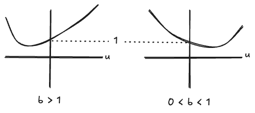
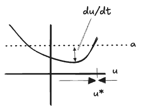
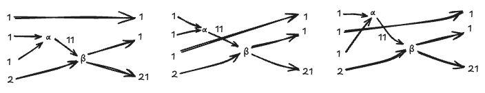

#### Table of Contents

## Introduction

This is part 1/? of a series of posts on the theory of "reaction networks", a.k.a. "Petri Nets", a.k.a. "mass-action kinematics". For the most part this material will be assembled from various links on John Baez' [page](https://math.ucr.edu/home/baez/networks/). Almost nothing here is my own work, but I will be restating it in my own words and partially in my own notation. 

My own interests are in:
* Elementary examples of parts of quantum-mechanics and statistical-mechanics, e.g. Fock Space, and in decomposing these theories into simpler ones.
* The relationships between descriptions of the same system at levels of abstraction, with a renormalization flavor.
* The zoo of equilibrium behaviors of dynamical systems, and how they relate to the underlying parameters
* Generating function methods, wherever they appear.
* The opportunity to develop methods of diagramming high-dimensional spaces.

## Reaction Networks

A "reaction network" is a graph whose edges represents "reactions" (or "processes" or "transitions") between different "complexes" (or "combinations" or "tuples") of "species", each with an associated "rate constant". For example:

$$
\begin{aligned}
X_1 + 2X_2 &\stackrel{\alpha}{\to} X_1 + X_3\\
3X_1 &\underset{\gamma}{\overset{\beta}{\rightleftharpoons}} X_2\\
X_3 &\stackrel{\delta}{\to} \emptyset
\end{aligned}
$$

The standard examples of systems which might be described by reactions networks are:
* Chemicals, where the "species" stand for molecules, and reactions stand for reactions. 
* Population dynamics, where the "species" represent _species_, or cells, enzymes, viruses, etc, and reactions stand for interactions between species, like predation or asexual reproduction.

A reaction network represents the set of processes that can change the state of a many-particle system. Only these reactions can occur, and no others; therefore any state which is not accessible via some sequence of reactions is unreachable. The set of possible states is further constrained by the rate constants: some states may turn out to be attractors, others dynamically unreachable. The second reaction above represents a reversible reaction, so in principle this system could move back and forth along the line of $$X_2 - 3X_1$$, but whether it actually does so will depend on the relative rates of the two reactions and the interactions with the other reactions. If a network has a graph cycle —"cyclic" or "weakly reversible" network—it could potentially return to its original state from another direction, but again it is not guaranteed to do so.

### Levels of Abstraction

I want to emphasize at the outset that a reaction network merely describes a set of processes, which can be "translated" into equations in different ways—in particular, at different "resolutions", "levels of analysis", or "levels of abstraction". 
0. *Equilibrium*. The highest level of abstraction. Here we characterize a system by its equilibrium or long-time behaviors, which might be an attractor state, but also might include more complicated behaviors like cycles. Whether these states can be deduced from the network is a matter of mathematics. 
   
   Examples: Thermodynamics as equilibrium stat-mech. Expectations of stationary wave functions in quantum mechanics.
   
1. *Expectations*. This is the entrypoint for most analysis of a reaction network: we translate the network into differential equation in the average populations or concentrations. This is called "Rate Equation", which is an ODE for species averages $$\frac{d X_i}{d t}$$. It can be analyzed for long-time behavior and for stability and bifurcations, etc, which can tell us things at level 0. 
   
   Examples: in quantum mechanics: the classical limit as an expectation, or in another sense, stationary wave functions. Various models one encounters in diff-eq class, like the predator-prey model and various models of viral spread.
   
2. *Stochastic Dynamics*. At this much-lower level of abstraction, we can describe the system as a probability distribution over states with exact numbers of each species. Then we can translate our reaction network into a differential equation for the evolution of this probability distribution, giving a "stochastic dynamical system". This level gives a better picture of the underlying behavior, but is much higher-dimensional and correspondingly is much harder to solve. Nonetheless, under some conditions we can characterize equilibrium solutions at this level of analysis, and can lift these solutions to the Rate-Equation level.
   
   Examples: the Shrodinger equation, especially when viewed as a path integral of a propagator.
   
3. *Histories, Timelines, or Sequences of Reactions*. At a lower-level still would be a characterization of the state as a particular _sequence_ of reactions, with which we can associate some probability-weight or "amplitude". The weighted sum of all possible timelines we expect to leads to the higher-level characterizations of the system. But this level of analysis is particularly suited to questions like: what is the probability for a transition between specific starting and ending states?
   
   Examples: a diagram in a path integral, in QFT. I also think of "programs", in the sense of a sequence of expressions in an abstract language. Or, the probability of a specific sequence of mutations occuring in genetics, and the ways that selection effects would bias the post-hoc distribution of mutations. Or, the probability that some system breaks down over time.
   
4. *Micro-scale Dynamics*. At the lowest level of analysis we have the interactions of individual particles. At this level the reaction network doesn't tell us anything; in fact this is the level where you might calculate the rate constants used at higher levels of analysis by computing scattering cross sections from the underlying dynamics. Or perhaps we can use statistical-mechanics methods to find a density-of-states or partition function.
   
   Examples: Hamiltonian mechanics of interacting particles in a gas. Individual vertexes in QFT. 

Most of the theory here will concentrate on the three highest levels of analysis. In particular, we'll want to say things about the behavior at higher levels of abstraction, through arguments at lower levels.

I spell all of this out because, first, I think it will be a good way to organize these ideas, but in particular because, for me, the most interesting thing about reaction networks is as a model system for understanding the relationships between the different levels of abstraction.

## Level 1: The Rate Equation

### Anatomy of a Rate Equation

A reaction network is most simply seen as encoding a differential equation called the "Rate Equation" of the network. 

Here is the example from above again:

$$
\begin{aligned}
X_1 + 2X_2 &\stackrel{\alpha}{\to} X_1 + X_3\\
3X_1 &\underset{\gamma}{\overset{\beta}{\rightleftharpoons}} X_2\\
X_3 &\stackrel{\delta}{\to} \emptyset
\end{aligned}
$$

We translate into the following set of coupled diff-eqs:

$$
\begin{aligned}
\frac{d X_1}{d t} &= - 3\beta {(X_1)}^3 + 3\gamma X_2\\
\frac{d X_2}{d t} &= - 2\alpha X_1 {(X_2)}^2 + \beta {(X_1)}^3 - \gamma X_2\\
\frac{d X_3}{d t} &= + \alpha X_1 {(X_2)}^2 - \delta X_3
\end{aligned}
$$

$$\alpha, \beta, \gamma, \delta$$ stand for the "rate constants" of the four reactions, and will also be used as the names for the specific reactions. Note that in this example $$\beta$$ and $$\gamma$$ represent two different reactions relating between the same sets of species, but in reverse directions.

When we want to iterate over reactions, we'll index by $$r$$. $$R$$ will the total number of reactions, and we can also use $$R$$ for the set of reactions without ambiguity. So in this example we have $$r \in R = \{\alpha, \beta, \gamma, \delta\}$$. The rate constant of reaction $$r$$ is a positive real number, and will also be called $$r$$—we will see how far we can get identifying reactions with their rate constants.

$$X_i$$ are the "concentrations" or "populations" of each of the $$S$$ species, which are non-negative real numbers—we think of the rate equation variables as representing the time-dependence of averages or expectations rather than integer numbers of molecules or organisms. You could also write concentrations as $$[x_i]$$ or $$[X_i]$$ like in chemistry class. We use capitals $$X_I$$ for concentrations because we will later use $$x_i, n_i, N_i$$, and $$N$$ when working with exact integer numbers of particles.

The rate of a reaction depends on the product of the concentrations of its *inputs* only, e.g. our first reaction $$\alpha$$ occurs with rate $$\alpha X_1 {(X_2)}^2$$. This is the "law of mass action".

The coefficients like $$+2, -3$$ represent the _change_ in the concentration of a species when a reaction occurs. So our first reaction $$\alpha$$ removes two units of $$X_2$$ and adds one unit of $$X_3$$, but doesn't change the number of species. $$X_1$$ since $$X_1$$ appears on both sides of the reaction. 

The groups of species appearing on either side of the reactions are the "complexes" of the network. $$K$$ will denote the set of complexes and also the total number of them. In this network there are five: 

$$
K = \{X_1 + 2X_2, X_1 + X_3, 3X_1, X_2, X_3\}
$$

We will index complexes by a lower-case $$k$$. Each reaction $$r$$ has a source complex $$k_r$$ and a target complex $$k_r'$$—think of these as the two ends of an edge of a graph. We can index into these complexes to find the component of species $$X_i$$ like $$k_{r,i}$$. Here:
* $$k_\alpha = X_1 + 2X_2$$, so $$k_{\alpha, 1} = 1$$, $$k_{\alpha, 2} = 2$$, and the full tuple is $$k_\alpha = (1, 2, 0)$$. 
* $$k_\alpha' = X_1 + X_3$$, so $$k_{\alpha, 1}' = 1, k_{\alpha, 3}' = 1$$ and the full tuple is $$k_\alpha' = (1, 0, 1)$$. 

The difference $$k_r' - k_r$$, in terms of _species_, we will call $$\Delta_r$$—this is the change in the exact species population when reaction $$r$$ occurs once. Here $$\Delta_\alpha = (0, -2, 1)$$.

We could try to write the Rate Equation as a matrix equation:

$$
\frac{d }{d t}\begin{pmatrix}X_1 \\ X_2 \\ X_3 \end{pmatrix}
= 
\begin{pmatrix}
  0& 0 & -3\beta & +3\gamma & 0\\
  -2\alpha & 0 & +\beta & -\gamma & 0\\
  0 & +\alpha & 0 & 0 & -\delta
  \end{pmatrix}
  \begin{pmatrix}
  X_1 {(X_2)}^2 \\ X_1 X_3 \\ {(X_1)}^3 \\  X_2 \\ X_3
\end{pmatrix}
$$

...but this won't be very useful because the matrix isn't square—instead it has dimension $$S \times K$$, because the rates depend on the _complexes_, and there can be a lot of these in general. You could also write it as a diff-eq relating complexes to complexes, but you would have to denote the species-in-the-complexes in some other way. So, neither of these approaches will be useful.

 

### The Rate Equation in Tuple Notation

We can condense the Rate Equation somewhat by summing over reactions, where $$k'_r, k_r$$ are the "target" and "source" of reaction $$k$$, and $$i, j$$ additionally index the species.

$$
\frac{d X_i}{d t} = \sum_r \underbrace{(k'_{r, i} - k_{r, i})}_{\text{change in species i 
due to reaction r}} 
  \times \underbrace{r \prod_i X_j^{k_{r, j}}}_\text{rate of reaction r}
$$
 
This is not too bad, but all those species indices are not so easy to read. Some of the literature chooses to clean this up by omitting the species index entirely, asking us to remember which terms refer to species (which obey special rules_) and which do not. I want to take a different approach and represent all indexing-over-species as an overbar $$\bar{k}_r, \bar{k}_r'$$, which will always represent a tuple over _species_. So $$\bar{k}_\alpha = (1, 2, 0)$$ in the example above. You can still index into a barred quantity like $$k_{\alpha, 2} = 2$$.

A tuple over species $$\bar{k}$$ will act like a vector as $$\vec{x}$$, but we won't assume it has any "vectorial" properties besides those we explicitly define mention here.

Tuples can be added or subtracted, and it will occasionally be useful to take a dot-product:

$$
\begin{aligned}
\bar{k}' - \bar{k} &= (k'_1 - k_1, k'_2-k_2, \cdots)\\
\bar{c} \cdot \bar{x} &= c_1 x_1 + c_2 x_2
\end{aligned}
$$

We'll also define operations on tuples which do not have vector analogs. Most operations which would not be defined on vectors we implement by applying component-wise, then multiplying all of the components of the result:

$$
\begin{aligned}
\bar{k}! &= k_1! k_2!\cdots\\
\bar{x}^\bar{k} &= x_1^{k_1} x_2^{k_2}\cdots\\
\frac{N!}{\bar{n}!}  &= \frac{N!}{n_1! n_2! \cdots}\\
\end{aligned}
$$

Note that the last line is a succinct way to write a multinomial coefficient $${N \choose \{n_1, n_2, \cdots\}}$$, if $$\sum n_i = N$$. We could also write this as $${N \choose \bar{n}}$$.

Finally we will need a couple more non-standard operations. First we have the "falling power", which works for integers or tuples:

$$
\begin{aligned}
N^{k \downarrow} &= N(N-1)(N-2)\cdots(N-k+1) \\
  &= \frac{N!}{(N-k)!}\\
\bar{N} ^ {\bar{k}\downarrow} &= N_1^{k_1 \downarrow}N_2^{k_2 \downarrow} \cdots \\
  &= \frac{\bar{N}!}{(\bar{N} - \bar{k})!} \\
  &\stackrel{?}{=} {\bar{N} \choose \bar{k}}\cdot(\bar{k}!)
\end{aligned}
$$

The last line indicates that the falling power could be related to a multinomial coefficient with _both_ arguments tupled, but this seems a little too wacky, so we won't use it. 

Note that $$N^{k\downarrow}$$ is a product of $$k$$ terms where all but one being are slightly less than $$N$$. So it's reasonable to read it as representing a number "somewhat smaller than $$N^k$$".

Next we have the scalar product of more-than-2 tuples, which we write as a chain of dot-products:

$$
\bar{a} \cdot \bar{b} \cdot \bar{c} = a_1 b_1 c_1 +  a_2 b_2 c_2 + \cdots
$$

And lastly we implement inequality between tuples, which can be seen as a shorthand for "logical AND" or as a product of indicator functions. We won't attempt to find a notation for "OR".

$$
\begin{aligned}
\bar{n} \ge \bar{k}& = (n_1 \ge k_1) \times  (n_2 \ge k_2) \times \cdots \\
  &= 1_{n_1 \ge k_1} \times  1_{n_2 \ge k_2} \times \cdots
\end{aligned}
$$

With all of this notation, and $$\bar{\Delta}_r = \bar{k}_r' - \bar{k}_r$$, we can write the Rate Equation very concisely. The Rate Equation on column vectors looks like this:

$$
\begin{aligned}
\frac{d }{d t} \begin{pmatrix}X_1 \\ X_2\end{pmatrix}
  = \sum_r \begin{pmatrix}\Delta_{r, 1} \\ \Delta_{r, 2}\end{pmatrix}  r  \left(\prod_j {(X_j)}^{k_{r, j}}\right)
&& \text{(Rate Equation, vector notation)}
\end{aligned}
$$ 

We want to write this as a "tuple equation", just as we do for vectors, representing a system with one equation for each index $$i$$. Then the r.h.s. expression $$\left(\prod_j {(X_j)}^{k_{r, j}}\right)$$ will have to be evaluated in _each_ $$i$$ equation. For a two-species system the above stands for a system of two equations, each containing a term $$\bar{X}^{\bar{k}_r}$$ which has its own internal tuple structure:

We immediately encounter a weakness of the notation, unfortunately—we would like to write this term as $$\bar{X}^{\bar{k}_r}$$, but we will need to indicate somehow that these tuples are not to participate in the $$i$$ system of equations. 
I will account for this with absolute-value symbols like $$\vert \bar{X}^{\bar{k}_r} \vert$$. This isn't ideal because, unlike a vector norm, we're not really taking an absolute value, and it's easy to imagine doing this with negative numbers, although we won't encounter any. Another approach could be for operations 
like $$\bar{k}!$$ to be defined to apply component-wise but without multiplying-away the tuple structure, like $$\bar{k}! = (k_1!, k_2!, \cdots)$$, and only multiplying when wrapped in absolute-value signs: $$\vert \bar{k}\vert = k_1! k_2! \cdots$$. 
I don't care for this—it will be too verbose when we use a lot of tuples. I'll instead use $$\vert \cdot \vert$$ only when an expression inside a tuple equation might be ambiguous. In general this might collide with any _actual_ absolute values, but we won't encounter any of these; nearly all of our tuples will be positive anyway.

An alternative to all of this would be to use an Einstein-like notation, with the rule that tuple components _multiply_ for any tuple index appearing on only one side of the $$=$$, while those that appear on both sides of $$=$$ lead to a tuple of equations. We'd have:

$$
\begin{aligned}
\frac{d X_i}{d t} =  \sum_r r \Delta_{r, i} {X_j}^{k_{r, j}}
&& \text{(Rate Equation, Einstein-ish notation)}
\end{aligned}
$$

I'm going to stick with tuples, though—we'll get a lot of use out of them.

Our concise Rate Equation is therefore:

$$
\begin{aligned}
\frac{d \bar{X}}{d t} &=  \sum_r r \bar{\Delta}_r  \left \vert \bar{X}^{\bar{k}_r}\right \vert
&& \text{(Rate Equation, tuple notation)}
\end{aligned}
$$

 

### A Rate Equation Example

For any *particular* network you could attack the corresponding Rate Equation with the methods of standard differential equations. In general we can't hope to find exact solutions; the goal of such analysis is usually to make "level 0" statements characterizing equilibria and long-time behavior. But it will be helpful to see the general shape such an analysis takes with a worked example.

As a demonstration of what it takes to analyze a particular Rate Equation, I'll look at the following simple model of an epidemic, where $$X$$ represents the "healthy population", $$Y$$ is "sick", and $$Z$$ is "dead".

$$
X + Y {\overset{\alpha}{\longrightarrow}} 2Y {\overset{\beta}{\longrightarrow}} Z
$$

This leads to the following system of equations:

$$
\frac{d}{dt} \begin{pmatrix}
X \\ Y \\ Z
\end{pmatrix}
=
\begin{pmatrix}
-\alpha XY\\
\alpha XY - \beta Y\\
\beta Y
\end{pmatrix}
$$

The $$\bar{\Delta}$$ tuples are $$\bar{\Delta}_\alpha = (-1, +1, 0)$$ and $$\bar{\Delta}_\beta = (0, -1, +1)$$, and the input complexes are $$\bar{k}_\alpha = (1, 1, 0)$$ and $$\bar{k}_\beta = (0, 1, 0)$$. So the same equation in "tuple notation" would be:

$$
\frac{d}{dt}\bar{X} = \alpha \bar{\Delta}_\alpha {\vert \bar{X} \vert}^{\bar{k}_\alpha} + \beta \bar{\Delta}_\alpha {\vert \bar{X} \vert}^{\bar{k}_\beta}
$$

For such simple system the tuple notation is no help at all, and the clearest form would would probably be to just expand the "input" tuples:
$$
\frac{d}{dt}\bar{X} = (-1, 1, 0) \alpha  XY + (0, -1, 1)\beta Y
$$

Clearly the total population $$N = X + Y + Z$$ has zero time derivative, being the sum of the three diff-eqs above. This also implies that that matrix representation on *complexes* is a stochastic matrix, with columns summing to 1:

$$
\frac{d}{dt} \begin{pmatrix}
X \\ Y \\ Z
\end{pmatrix}
=
\begin{pmatrix}
-\alpha & 0\\
+\alpha & -\beta\\
0 & +\beta
\end{pmatrix}
\begin{pmatrix}
XY \\ Y
\end{pmatrix}
$$

Now we'll solve this. This system is simple enough that it admits an exact solution by way of the following trick. We observe that the $$\dot{X}$$ and $$\dot{Z}$$ equations are not independent because

$$
\frac{\dot{X}}{X} = \frac{d}{dt}\log X =  -\alpha y = \frac{-\alpha}{\beta} \dot{Z}
$$

Then the solutions for $$\log{X(t)}$$ and $$Z(t)$$ differ only by a constant:

$$
X(t) = X_0 e^{-\frac{\alpha}{\beta}Z(t)}
$$

And we can make use of the fact that $$Y = N - X -Z$$ to solve for $$Z$$ exactly:

$$
\dot{Z} = \beta Y = \beta(N - Z - X) = \beta(N - Z - X_0 e^{-\frac{\alpha}{\beta}Z(t)})
$$

We now define parameters to make this dimensionless. If we define $$u = \alpha Z / \beta$$, we can rearrange:

$$
\begin{aligned}
\frac{\beta}{\alpha} \frac{d u }{dt} &= \beta(N - \frac{\beta}{\alpha}u  - X_0 e^{-u}) \\
\frac{d u}{d(X_0 \alpha t)}  &= \frac{N}{X_0} - \frac{\beta}{\alpha X_0}u - e^{-u}
\end{aligned}
$$

And now we define constants $$\tau = X_0 \alpha$$, $$a = \frac{N}{X_0}$$, and $$b = \frac{\beta}{\alpha X_0}$$ to write this in a dimensionless form:

$$
\frac{du}{d\tau} = a - bu - e^{-u}
$$

We arrive at a fairly simple first-order differential equation, which is most easily analyzed by observing that $$bu + e^{-u}$$ always has an intercept of $$1$$, and is shaped like a distorted kind of upward parabola. The minimum of this part of the equation occurs where $$\frac{d}{du} (bu + e^{-u}) = 0$$, or $$b = e^{-u}$$; hence $$u_{\text{min}} = - \ln b$$. For $$0 < b < 1$$ this minimum is to the left of $$u = 0$$; for $$b > 1$$ it is to the right:

Then the full system $$a - (bu + e^{-u})$$ will have a zero (a fixed point) wherever the horizontal line $$a$$ crosses this curve. Note that $$a$$ is always $$\ge 1$$, being the inverse of the initial "healthy" fraction. 

Apparently:
* When $$a = 1$$, meaning $$N = X_0$$, $$u=0$$ is a fixed point: a healthy population can't suddenly get sick.
* When $$b<1$$ or $$a > 1$$, the model develops an "attractor" fixed point $$u^*$$—an eventual "death toll"—and while the value of the attractor increases slowly as a function of the initial condition $$X_0$$ (through $$a$$, which isn't really independent of $$U(0)$$), it increases very quickly as a function of the "rate of transmission" $$\alpha$$ relative to the rate at which sick patients die off $$\beta$$; represented by $$\frac{1}{b}$$.

From here you could go on to calculate the location of the fixed point as a function of the parameters and the initial conditions, or the timescale of convergence to the fixed point, or you could modify this comically-simple model to include behaviors like "getting better" and "quarantining". But it is adequate to demonstrate the typical behavior of reaction networks: fixed points appear and move around the parameter space as a function of the rate constants.

## Level 2: The Master Equation

### Stochastic Evolution

In one sense the Rate Equation is a direct translation of the information in a reaction network. But in most cases this should be thought of as an approximation of the underlying physical system, in a few ways:
1. The rate constants $$r$$ are either estimated from measurements, or, if they're determined from the underlying physics, are probably approximations which only capture the highest-order interactions
2. The law that reactions occur with rate $$\propto r \bar{X}^{\bar{k}_r}$$ is itself only approximately true
3. The initial conditions are only approximate measurements and therefore represent a peaked distribution of species numbers $$X_1 \to \langle x_1 \rangle$$, which is in actuality discrete rather than continuous, and may be quantum-mechanical

We could imagine trying to "undo" the abstraction along any of these axes. Here we'll take the first two as givens—as assumptions of the "reaction network" class of models, essentially—and only broaden our view along the third axis.

Instead of concentrations, we'll now consider the time-evolution of *a probability distribution over the exact particle numbers*. 

A "state" will now be a distribution $$P(\bar{n})$$ over the $$S$$ discrete species numbers, represented by an $$S$$-tuple $$\bar{n} = (n_1, n_2, \ldots, n_S)$$. We'll use $$N=n_1 + n_2 + \cdots + n_M$$ for the total number of particles. The equation governing the evolution of such a distribution is called a "Master Equation" of the system.

This is a "stochastic" dynamical system, but will turn out to closely resemble a quantum-mechanical wave function, with the Master Equation corresponding to the Shrodinger Equation for many particles in a basis whose diagonal elements are the "occupation numbers" of each energy state, exactly like our $$\bar{n}$$. 

In quantum mechanics one might arrive at the same thing by first considering some $$N$$ underlying single-particle wave functions; then restricting to only anti-symmetric or symmetric combinations (a Fock Space), and then switching to the occupation basis. We won't run into those symmetrization questions because we are not trying to say anything about spatial wave functions. (I imagine quantum mechanics would come out cleaner by starting with the occupation numbers. Spatial wave functions are the complicated part. These occupation-number equations will not be difficult to write down, as we'll see.)

Following that analogy, we can represent a full state by an expression which looks like a wave function: 

$$
\begin{aligned}
\psi &= \sum_\bar{n} \psi_\bar{n} \vert \bar{n} \rangle\\
 &= \sum_{n_1, n_2, \cdots} \psi_{n_1, n_2, \cdots} \vert n_1 n_2 n_3 \cdots \rangle
\end{aligned}
$$

Here, $$\psi_\bar{n} = P(\bar{n})$$. Note that in the stochastic case, the coefficients $$\psi_\bar{n}$$ are positive real numbers rather than complex amplitudes, and we normalize this distribution with $$\vert \psi \vert = \sum_\bar{n} \psi_\bar{n} = 1$$ rather than $$\sum \psi_\bar{n}^\dagger \psi_\bar{n} = 1$$.

One could write the quantum-mechanical probability as $$\psi_\bar{n}^\dagger \psi_\bar{n} = (\Re \psi_\bar{n})^2 + (\Im \psi_\bar{n})^2$$, which is just a distribution over tuples of $$2S$$ species. (Telling! We'll want to follow the two parallel tracks to the exact point at which this fails.)

Our "Master Equation" will represent the time evolution of this distribution by a Hamiltonian-like operator:

$$
\dot{\psi}(t) = H \psi
$$

The solution can be found for a given initial condition as a time-evolution operator which is just the matrix exponential of the generator $$H$$:

$$
\psi(t) = e^{tH}\psi(0)
$$

Now we'll build it. First we need to represent our reactions in the occupation-number basis. We'll use off the same example from the beginning of this essay:

$$
\begin{aligned}
X_1 + 2X_2 &\stackrel{\alpha}{\to} X_1 + X_3\\
3X_1 &\underset{\gamma}{\overset{\beta}{\rightleftharpoons}} X_2\\
X_3 &\stackrel{\delta}{\to} \emptyset
\end{aligned}
$$

Each reaction $$k$$ converts the term $$\bar{n} \to {\bar{n} + \bar{\Delta}_r}$$, where, recall, $$\bar{\Delta}_r = \bar{k}_r' - \bar{k}_r$$: it adds to the targets and removes from the sources. Spelled out, this is:

$$
\vert \bar{n} \rangle = \vert n_1, n_2, n_3 \rangle\to \begin{cases} 
   \vert n_1, n_2 - 2, n_3 + 1 \rangle & (\alpha)\\
   \vert n_1 - 3, n_2 + 1, n_3 \rangle & (\beta)\\
   \vert n_1 + 3, n_2 - 1, n_3\rangle & (\gamma)\\
   \vert n_1, n_2, n_3 - 1  \rangle & (\delta)
\end{cases}
$$

How do we represent the rate of a reaction? Reaction $$k$$ will convert state $$\bar{n}$$ to state $$\bar{n} + \bar{k}_r' -\bar{k}_r$$ at a factor proportional to:
1. The prior probability, of $$\bar{n}$$ which is $$\psi_\bar{n}$$
2. The rate constant $$r$$
3. The number of ways to choose all of the reaction's inputs $$\bar{k}_r$$ out of all the candidates in state $$\bar{n}$$, which is the tuple "falling power" introduced above: 

$$
\begin{aligned}
\bar{n}^{\bar{k}\downarrow} = \frac{\bar{n}!}{(\bar{n}-\bar{k})!}
 &= \frac{n_1!}{(n_1-k_1)!}\times \frac{n_2!}{(n_2-k_2)!}\times \cdots
\\
& = n_1(n_1-1)\cdots(n_1-k_{1}) \times n_2(n_2-2)\cdots(n_2-k_{2})
\end{aligned}
$$

We also have a condition that $$\bar{n} \ge \bar{k}$$, meaning $$\bar{n}$$ contains enough of each species in $$\bar{k}$$ for the reaction to actually occur. But this is already implied by the definition of the falling power: $$\bar{n}^{\bar{k}\downarrow} = 0$$ if $$\bar{n} < \bar{k}$$.

Then the total rate of reaction $$k$$ on state $$\bar{n}$$ is:

$$
r \times \bar{n}^{\bar{k}_r\downarrow}\times \psi_\bar{n} 
$$

Our time-evolution generator will consist of one of such term for each initial state  $$\bar{n}$$ and for each reaction. Each should link the initial state $$\bar{n}$$ to the final state $$\bar{n}' = \bar{n} + \bar{k}_r' - \bar{k}_r$$, which we represent by an additional factor $$1_{\bar{n}' = \bar{n} + \bar{\Delta}_r}  - 1_{\bar{n}' = \bar{n}}$$, where the first indicator selects the state $$\bar{n}'$$ which is related to $$\bar{n}$$ by exactly one occurence of reaction $$k$$, and the second removes the same weight from the initial $$\bar{n}$$. This erases all of the probability mass from $$\bar{n}$$, giving it to $$\bar{n}'$$, but note that, in almost all cases, another instance of the same reaction will also be adding probability mass back the state $$\bar{n}$$. (Here I wonder what can be said about those states for which the inflow and outflow rates are equal, or if it would be useful to represent the system as the difference between inflows and outflows for each state.)

This form implies that our generator matrix $$H$$ does not alter the total probability. $$H$$ is an "infinitesimal stochastic matrix", whose columns each sum to 0; this turns out to imply that the exponential $$e^{tH}$$ will be a stochastic matrix whose columns sum to 1. In quantum mechanics, this corresponds to the fact that _anti_-Hermitian operators are generators for Unitary transformations. For example, $$H/i\hbar$$ is the generator of time-evolution: $$\psi(t) = e^{Ht/i\hbar} \psi(0)$$.

The full Master Equation is:

$$
\begin{aligned}
\frac{d {\psi}_{\bar{n}'}} {dt}=  \sum_r  \sum_{\bar{n}} \left(1_{\bar{n}' = \bar{n} + \bar{\Delta}_r}  - 1_{\bar{n}' = \bar{n}}\right) \times  r \times \bar{n}^{\bar{k}_r\downarrow}  \times \psi_\bar{n}(t) 
&& \text{(Master Equation)}
\end{aligned}
$$

We can isolate the generator of time-evolution $$H$$; it is a matrix representing the contribution of state $$\bar{n}$$ to state $$\bar{n}'$$:

$$
\begin{aligned}
H_{\bar{n}', \bar{n}} = \sum_r  \sum_{\bar{n}} \left(1_{\bar{n}' = \bar{n} + \bar{\Delta}_r}  - 1_{\bar{n}' = \bar{n}}\right) \times  r \times \bar{n}^{\bar{k}_r\downarrow}
&& \text{(Master Equation matrix element)}
\end{aligned}
$$

 

### The Master Equation on Generating Functions

Now, rather than representing our state by a sum over occupation-number basis elements $$\psi = \sum_\bar{n} \psi_\bar{n} \vert \bar{n} \rangle$$, we could instead represent it by a "probability generating function" (p.g.f.) over monomials $$\bar{x}^\bar{n} = x_1^{n_1} x_2^{n_2}\cdots$$, like this:

$$
\psi = \sum_{\bar{n}} \psi_\bar{n} \bar{x}^\bar{n}
$$

You could motivate this in a few ways:
* Out of a general love for generating functions (like mine)
* Or, by analogy to the Rate Equation $$\frac{d \bar{X}}{d t} =  \sum_r r \bar{\Delta}_r \vert \bar{X}^{\bar{k}_r} \vert$$, which involved powers of a species tuple as well, perhaps hoping to derive the Rate from the Master (we'll try this in a bit)
* Or, by observing that falling powers $$\bar{n}^{\bar{k}\downarrow}$$, which we used above to count the "number of ways of choosing in the reaction inputs $$\bar{k}$$", corresponds exactly to the coefficients you get when taking $$\bar{k}$$ derivatives of the monomial:

$$
\begin{aligned}
  \left(\frac{\partial }{\partial x_1}\right)^{k_i} x_i^{n_i} 
    &= (n_i)(n_i - 1)\cdots(n_i - k_i)x_i^{n_i - k_i + 1}\\
    &= n_i^{k_i\downarrow}x_i^{n_i - k_i}\\
  \left(\frac{\partial }{\partial \bar{x}}\right)^{\bar{k}} \bar{x}^\bar{n}
    &= \bar{n}^{\bar{k}\downarrow} \bar{x}^{\bar{n} - \bar{k}}
\end{aligned}
$$

(Apparently, the coefficient in a derivative $$\frac{d }{d x}x^n = nx^{n-1}$$ was always counting the number of ways to choose which copy of $$x$$ to remove—a fact which I may have learned in calculus class, but have long since forgotten.)

Guided by this observation, we'll take our quantum-mechanical analogy even further by defining a "creation" operator $$a_i^+$$ and an "annihilation" operator $$a_i^-$$ for each species $$i$$. The effect of these operators on a monomial $$x_i^{n_i}$$ is to increase or decrease $$n_i$$ by 1 and multiplying by a factor representing the number of ways of doing so—a falling-power for $${(a^-)}^m$$ but just 1 for any power of $$a^+$$. (I'm not using the exact QM notation $$a^\dagger$$, because these are not "Hermitian conjugates". I never cared for that anyway.)

The implementation of $$a_i^-$$ in the g.f. representation will be $$\frac{\partial }{\partial x_i}$$, as we have just seen, while the implementation of $$a_i^+$$ must be multiplication by $$x_i$$:

$$
\begin{aligned}
a_i^+ = x_i && a_i^+ x_i^n = x_i^{n+1} && {a^+_i}^m x_i^n = x_i^{n+m}\\

a_i^- = \frac{\partial }{\partial x_i} && a_i^- x_i^- = nx_i^{n-1} && {a^-_i}^m x_i^n = n^{m\downarrow}x_i^{n-m}
\end{aligned}
$$

We'll write each of these as a tuple over all species $$i$$:

$$
\begin{aligned}
{(\bar{a}^+)}^\bar{k} \bar{x}^\bar{n}= \bar{x}^{\bar{n} + \bar{k}}\\
{(\bar{a}^-)}^\bar{k} \bar{x}^\bar{n} = \partial_\bar{x}^\bar{k} \bar{x}^\bar{n} = \bar{n}^{\bar{k}\downarrow}\bar{x}^{\bar{n} - \bar{k}}
\end{aligned}
$$

We can also define a number operator $$N_i$$ which counts the number of particles of $$x_i$$. It's given by—what else?— 

$$
\begin{aligned}
N_i = a_i^+a_i^- && N_ix_i^n = nx_i^n && \bar{N} \bar{x}^\bar{n} = \bar{N}^+ \bar{N}^-\bar{x}^\bar{n} =  \bar{n}\bar{x}^\bar{n}
\end{aligned}
$$

The $$a^+, a^-$$ operators don't commute; their commutator is:

$$
\begin{aligned}
[a^-, a^+] x^n &= (n+1)x^n - nx^n \\
&= 1x^n\\
[a^-, a^+] &= 1
\end{aligned}
$$

Note the quantum-mechanical analogy. For $$\hat{P} = -i \hbar \frac{\partial }{\partial x}$$, the uncertainty principle $$[\hat{X}, \hat{P}] = i\hbar$$ is just this same identity $$[\frac{\partial }{\partial x}, x]= 1$$. It almost looks like the $$-i\hbar$$ in $$\hat{P}$$ in Q.M. doesn't need to be there—it has the effect of making $$\hat{p}$$ operate correctly on functions of the form $$f(x) \sim e^{ipx/\hbar}$$, where it gives $$\hat{P}f = pf$$. To me, this looks like yet another feature of Q.M. which could be "factored out" of the theory—I need to be keeping a list.

Applying multiple $$(a^-)$$s followed by the same number of $$(a^+)$$s returns you to the same power $$n$$ you started with, but with a coefficient of a falling power:

$$
{(a^+)}^m {(a^-)}^m x^n = {(a^+)}^m \left(n^{m\downarrow} x^{n-m}\right) = n^{m\downarrow} x^{n}
$$

So we can also define the "falling power of the number operator $$N$$":

$$
\begin{aligned}
N^{m\downarrow} = {(a^+)}^m {(a^-)}^m \\
N^{m\downarrow} x^n = n^{m\downarrow} x^{n} \\
\bar{N}^{\bar{m}\downarrow} \bar{x}^\bar{n} = \bar{n}^{\bar{m}\downarrow} \bar{x}^\bar{n}
\end{aligned}
$$

... and that is everything we need to represent the Master Equation as a time-evolution _operator_ in the generating function representation:

$$
\begin{aligned}
H = \sum_r H_r &= \sum_r r \left[{(\bar{a}^+)}^{\bar{k}_r'} - {(\bar{a}^+)}^{\bar{k}_r}\right]{(\bar{a}^-)}^{\bar{k}_r} 
&& \text{(Master Equation in operators)}
\\
&=\sum_r r \left[{(\bar{a}^+)}^{\bar{k}_r'} {(\bar{a}^-)}^{\bar{k}_r}- \bar{N}^{\bar{k}_r\downarrow}
\right]
\end{aligned}
$$

This is a sum across reactions $$k$$, which we could write as $$H = \sum_r H_r$$. The term $$H_r$$ will act on a state of definite species number $$\bar{n}$$ like:

$$
\begin{aligned}
H_r\psi_\bar{n}\bar{x}^\bar{n} 
  &=r \left[{(\bar{a}^+)}^{\bar{k}_r'} - {(\bar{a}^+)}^{\bar{k}_r}\right]{(\bar{a}^-)}^{\bar{k}_r} \psi_\bar{n}\bar{x}^\bar{n}\\
  &=  r \left[{(\bar{a}^+)}^{\bar{k}_r'} - {(\bar{a}^+)}^{\bar{k}_r}\right] \bar{n}^{\bar{k}_r \downarrow}  \psi_\bar{n}\bar{x}^{\bar{n} - \bar{k}_r}\\
  &= r \left[\bar{x}^{\bar{n} + \bar{k}_r' - \bar{k}_r} -  \bar{x}^{\bar{n}} \right] \bar{n}^{\bar{k}_r \downarrow}\psi_\bar{n} && \text{(Master Equation on g.f.s)}
\end{aligned}
$$

Read this as:
1. First, consume the inputs $$\bar{k}_r$$ from the input state $$\bar{x}^\bar{n}$$", which gives the state $$\bar{x}^{\bar{n}-\bar{k}_r}$$ times the original probability $$\psi_\bar{n}$$ and a coefficient $$r \bar{n}^{\bar{k}_r \downarrow}$$ representing the probability of this reaction occuring. 
2. Then, in parallel:
  * move to the new state $$\bar{x}^{\bar{n}  + \bar{k}_r'- \bar{k}_r}$$ and add all the probability
  * subtract all of the probability from the original state $$\bar{x}^\bar{n}$$

For comparison, here is the original original Master Equation, with $$\bar{\Delta}_r$$ expanded into $$\bar{k}_r' - \bar{k}_r$$:

$$
\begin{aligned}
H_{\bar{n}', \bar{n}}& = \sum_r  \sum_{\bar{n}} \left(1_{\bar{n}' = \bar{n} + \bar{k}_r' - \bar{k}_r}  - 1_{\bar{n}' = \bar{n}}\right) \times  r  \times \bar{n}^{\bar{k}_r\downarrow}
\end{aligned}
$$

I prefer the operator version. There's one fewer $$\sum$$ to think about, and it's easier to read the operator equation as a "process" linking $$\bar{n}$$ to $$\bar{n}'$$. And in some cases we'll be able to sum the target g.f. series into a nice function of $$\bar{x}$$, which will make the derivatives in $$H$$ very easy to use.

Finally, in either representation, we can implement time-evolution by exponentiating this thing and acting on an arbitrary state:

$$
\begin{aligned}
\frac{d}{d t}\psi(t) &= H\psi(t)\\
\psi(t) &= e^{Ht} \psi(0)
\end{aligned}
$$

 

### Time Evolution as a Path Integral

Now we'll briefly dip our toes into the next level down the ladder of abstraction.

One advantage of the operator formulation is that it lends itself to a path-integral-like interpretation, as follows. Observe that $$H$$ is a sum over reactions, like $$H = H_\alpha + H_\beta + \cdots$$. Then, when we exponentiate this operator we get:

$$
e^{Ht} = 1 + \frac{t}{1!}(H_\alpha + H_\beta + \cdots) + \frac{t^2}{2!}{(H_\alpha + H_\beta + \cdots)}^2 + \cdots
$$

Carrying out the powers leads to terms with sequences of $$H_r$$ operators like $$H_{\beta}H_{\gamma}H_{\alpha}$$ with some coefficient, which we read as representing the rate at which that sequence of transitions occurs in the time $$t$$. When everything's expanded, the action of time-evolution as a sum-over-timelines, or a sum-over-all-possible-sequences of transitions. For some initial state $$\bar{n}$$, each $$\bar{n}'$$ will in the final state $$\psi(t)$$ as a sum over all sequence which could produce it, each in proportion to:
* the number of ways to choose candidates for those sequences: a product of terms $$\bar{n}^{\bar{k}_r \downarrow}$$.
* the probability that those reactions occur independently, which gives a product of factors $$r \times t$$ for each eaction, representing the underlying hypothesis that each reaction occurs with at an independent rate over time.
* a correction $$\frac{1}{p!}$$ for each sequence of $$p$$ reactions, which (I think) avoids an overcounting which arises because permuting the sequence of reactions is equivalent to permuting the times at which those reactions occur

For example, if our network looks like this:

$$
\begin{aligned}
X_1 + X_1 & \overset{\alpha}{\longrightarrow} X_{11} \\
X_{11} + X_2 & \overset{\beta}{\longrightarrow} X_{21} + X_1
\end{aligned}
$$

Then we have two "processess" $$H_\alpha$$ and $$H_\beta$$. The series expansion $$e^{Ht} = e^{(H_\alpha + H_\beta)t}$$ will have some term in it like $$H_\beta H_\alpha$$, representing "one $$\alpha$$ reaction followed by one $$\beta$$" (acting on a state the right). Then if our initial state has 3 "1" particles and 1 "2" particle, which in the g.f. notation is $$x_1^3 x_2^1$$, then this sequence $$H_\beta H_\alpha$$ will take us to the state $$x_1^2 x_{21}^1$$: two "1"s combine to give a "11"; then their product combines with the "2" to give a "21" and a "1". 

For this sequence the combinatorial term $$\bar{n}^{\bar{k}_r \downarrow}$$ would be $$3^{2\cdot 1} = 6$$ for the first reaction, there being 6 ways to choose 2 of 3 particles (which considers the particles as _distinguishable_ point) and $$1$$ for the second.

We can draw diagrams for three of these combinations; the other 3 choose the same two inputs into $$\alpha$$ but in the opposite order. 

Observe that in each case one of the "1" particles passes through untouched, being affected by only the identity term of $$e^{Ht}$$ instead of any of the interactions.

These are something like Feynman diagrams. They're mostly a conceptual aid at this level, but they could be useful when analyzing small-$$\bar{n}$$ systems. If you want to determine the probability of, say, beginning in a state of $${(x_1)}^1$$ and ending in the same state, you could formulate a combinatorial series of diagrams representing all the sequences of reactions which meet this constraint: (no change) + (one reaction and the reverse) + (higher order terms). The exact series would depend on the available set of reactions. It would be instructive to come up with exact Feynman rules for some model reaction network. 

Once again the most interesting result might be the light this can shed on quantum-mechanics through the analogy. It has always felt to me that QM was a tangled mess of concepts which, individually, are not all that complicated. Once you have an elementary example of each, the full theory ought to "factor", with the particulars of _quantum_ physics entering at clearly-delineated points. This could at least be an aid to pedagogy; of course any improvement to pedagogy can also improve the _reach_ of pedagogy. If we dare hope for more, we might aim to better "compress" the body of physics knowledge better in the minds even of experts, letting all see further and more-easily grasp subtleties than in the current presentation. If!
