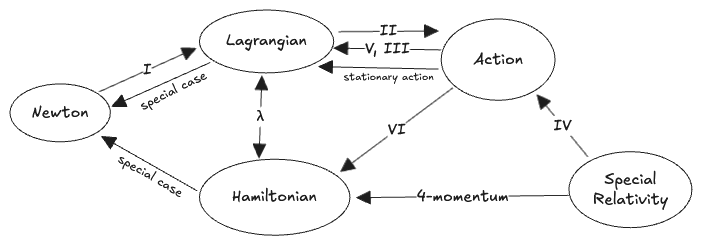

#### Table of Contents

## Introduction

The Action—as in "The Principle of Least Action"—has been washing around in my mind only partially digeste ever since undergraduate physics classes. This thing:

$$
\begin{aligned}
S = \int L(q, \dot{q}, t)\:dt
\end{aligned}
$$

It's not that it doesn't make sense. I've seen the arguments, I know how to use it, it works well. The problem is harder to put a finger on; it's something like: the "mode of argument" or "standard for proof" of a physics education switches partway through mechanics class: until then the mode relied on *physical intuition* first, never stepping far out of sight of the *physically-interpretable*, and having as its ideal a derivation of physical law *from* reality, rather than a fitting of mathematics to reality. Then one encounters the Lagrangian $$L = T-V$$, and the Euler-Lagrange equations $$\frac{d }{d t}\frac{\partial L}{\partial \dot{q}} = \frac{\partial L}{\partial q}$$, which is justified on the grounds that it works well—but what *is* it? What is $$L$$, physically? Then we zoom out again to introduce $$S$$, and justify the E-L equations from $$\frac{\delta S}{\delta q} = 0$$—again not by a derivation but by simply saying "do this, it works", and without restoring contact with physical intuition. By then you've lost me. That's two sketchy steps on top of each other, which is one too many for me. I thought I'd get over it, but I never did. 

Here's a map of where we're headed:

The Roman numerals are section numbers; the other labels refer to the textbook derivations. The sections largely stand on their own, but are given in a logical order.

Here, then, are the missing arguments from mechanics class. 

## I. From Newton to Euler-Lagrange

My first complaint about the derivation of classical mechanics is that we receive the Lagrangian and the Euler-Lagrange equations from "on high" and then proceed to show that these reproduce Newton's laws. Surely we should be able to go the other way, at least heuristically. 

The following argument is from a 1972 paper "Geometric Nature of Lagrange's Equations" by Beers, but also appears in some graduate texts like Goldstein. I came by my grievance with this subject in undergrad, I suppose, so I do want to record this argument for completeness, and to place it here in logical order. But the reader may want to skip to section 2.

We start with some mass $$m$$ and a motion described by $$\mathbf{r} = (x, y, z)$$, obeying Newton's laws, in particular N2 $$m \ddot{\mathbf{r}} = \sum \mathbf{F}$$. In short, with elementary physics. 

Then we ask: what does this same motion look like in *any* other coordinate system $$\mathbf{q} = (q_1, q_2, q_3)$$? This could be motivated in various way: maybe these are spherical coordinates, or they could be chosen to factor a problem into uncoupled subproblems, like the radial and angular components of planetary motion. Or for some particular problem, the $$q_i$$ could be defined so that motion along one or more of the $$q_i$$ is prohibited by a constraint—the radial direction for a bead constrained to a hoop, in that example. Why we want to re-parameterize doesn't matter for the argument. 

We write the original coordinates as a function of the new ones $$\mathbf{r}(\mathbf{q})$$, whose derivative is:

$$
\begin{aligned}
\dot{\mathbf{r}} &= \frac{d \mathbf{r}}{d t}
= \frac{\partial \mathbf{r}}{\partial \mathbf{q}} \frac{d {\mathbf{q}}}{d t} 
= \frac{\partial \mathbf{r}}{\partial \mathbf{q}} \dot{\mathbf{q}}
= \frac{\partial \dot{\mathbf{r}}}{\partial \dot{\mathbf{q}}}\dot{\mathbf{q}}\\
\ddot{\mathbf{r}} &= \frac{\partial \mathbf{r}}{\partial \mathbf{q}} \ddot{\mathbf{q}}
\end{aligned}
$$

That is, $$\dot{\mathbf{r}}$$ relates to $$\dot{\mathbf{q}}$$ in the same way that $$\mathbf{r}$$ relates to $${\mathbf{q}}$$, by a factor of $$\frac{\partial \mathbf{r}}{\partial \mathbf{q}}$$ which is just the Jacobian of the coordinate transformation.

We'll write the $$\ddot{\mathbf{r}}$$ equation for N2 in frame $$q$$ by projecting both sides onto columns of the Jacobian $$\frac{\partial \mathbf{r}}{\partial \mathbf{q}}$$. This is:

$$
\begin{aligned}
m \ddot{\mathbf{r}} \cdot \frac{\partial \mathbf{r}}{\partial \mathbf{q}} &= \sum \mathbf{F} \cdot \frac{\partial \mathbf{r}}{\partial \mathbf{q}}
\end{aligned}
$$

Note the l.h.s. is not $$\ddot{\mathbf{q}}$$; instead we are projecting $$\ddot{\mathbf{r}}$$ onto the local frame induced by variation of the $$\mathbf{q}$$ coordinates. This is a rather arbitrary thing to do at this point. We could do this whole argument by projecting $$\ddot{\mathbf{r}} \cdot \frac{\partial \mathbf{r}}{\partial \mathbf{r}}$$, but this would seem even more arbitrary. 

It will be easier to follow the rest of the argument if we work on just one of the components $$\frac{\partial \mathbf{r}}{\partial q_i}$$, which relate $$\mathbf{r}$$ to _one_ of the new coordinates $$q_i$$, one at a time:

$$
\begin{aligned}
m \ddot{\mathbf{r}} \cdot \frac{\partial \mathbf{r}}{\partial q_i} &= \left(m\ddot{r}_1 \frac{\partial r_1}{\partial q_i}, m\ddot{r}_2 \frac{\partial r_2}{\partial q_i}, \cdots\right) = \sum \mathbf{F} \cdot \frac{\partial \mathbf{r}}{\partial q_i}
\end{aligned}
$$

This expression has two factors of $$\mathbf{r}$$ in each term, which suggests that this expression can be arranged to give a term like $$\dot{\mathbf{r}} \cdot \dot{\mathbf{r}}$$:

$$
\begin{aligned}

m \ddot{\mathbf{r}} \cdot \frac{\partial \mathbf{r}}{\partial q_i} 
  & = m\frac{d }{d t} \left(\dot{r} \cdot  \frac{\partial \mathbf{r}}{\partial q_i}\right) 
  - m \dot{r} \cdot \frac{d }{d t} \left(\frac{\partial \mathbf{r}}{\partial q_i}\right)
\\
&= \frac{d }{d t} \left(m\dot{r} \cdot  \frac{\partial \dot{\mathbf{r}}}{\partial \dot{q}_i}\right) 
   - m \dot{r} \cdot \frac{\partial \dot{\mathbf{r}}}{\partial q_i}
\\
&= \frac{d }{d t} \left(\frac{\partial }{\partial \dot{q}_i} \left[\frac{m\dot{\mathbf{r}}\cdot \dot{\mathbf{r}} }{2}\right] \right) 
   - \frac{\partial }{\partial q_i} \left[\frac{m\dot{\mathbf{r}}\cdot \dot{\mathbf{r}} }{2}\right]\\
&= \frac{d }{d t} \left(\frac{\partial T}{\partial \dot{q}_i} \right) 
   -  \frac{\partial T}{\partial q_i}\\
\end{aligned}
$$

We get the kinetic part of the Euler-Lagrange equations immediately. The rest of E-L we can identify in the forces. We project the generic forces into the same $$q_i$$ direction to give the "generalized forces" $$Q_i$$: 

$$
\mathbf{F} \cdot \frac{\partial \mathbf{r}}{\partial q_i} = Q_i
$$

If any of the forces can be written as gradients of potentials, then projecting is simply a change of coordinates:

$$
- \frac{\partial U}{\partial \mathbf{r}} \cdot \frac{\partial \mathbf{r}}{\partial q_i}
 = -\frac{\partial U}{\partial q_i}
$$

Let us also treat, for generality, a constraint on motion of the form $$f(\mathbf{r}) = 0$$. We separate out the corresponding constraint force $$\mathbf{F}^c$$ from our list of forces. The constraint force is only ever in the direction of the gradient $$\frac{\partial f}{\partial \mathbf{r}}$$ of the constraint, and takes a value proportional to some unspecified function $$\lambda$$ equaling whatever it needs to to enforce the constraint, whose actual units depend on the units of the constraint. Then a projection of this $$\mathbf{F}^c$$ onto $$\frac{d \mathbf{r}}{d q_i}$$ becomes a coordinate transformation in the same way as $$U$$: 

$$
\begin{aligned}
\mathbf{F}^c &\propto \left(\mathbf{F}^{c} \cdot \frac{\partial f}{\partial \mathbf{r}}\right) \frac{\partial f}{\partial \mathbf{r}}\\
&= \lambda \frac{\partial f}{\partial \mathbf{r}} \\
{(F^c)}_i &= \lambda \frac{\partial f}{\partial \mathbf{r}}\cdot \frac{\partial \mathbf{r}}{\partial q_i} =  \lambda \frac{\partial f}{\partial q_i}
\end{aligned}
$$

The constraint force is just another force—it could just as easily be represented by a $$Q_i$$—but we'll split it out for clarity.

In all we get:

$$
\begin{aligned}
\frac{d }{d t} \left(\frac{\partial T}{\partial \dot{q}_i} \right)  
   - \frac{\partial T}{\partial q_i} 
 &= -\frac{\partial U}{\partial q_i} + Q_i + \lambda \frac{\partial f}{\partial q_i}
 \\
\frac{d }{d t} \left(\frac{\partial (T-U)}{\partial \dot{q}_i} \right)  
   -  \frac{\partial (T-U)}{\partial q_i} &= Q_i + \lambda \frac{\partial f}{\partial q_i}
\end{aligned}
$$

And there we have the Euler-Lagrange equations of $$L = T-U$$. No virtual forces, no virtual work, no "just introduce $$L$$ and show that it works"—one fairly straightforward calculus manipulation bridges the gap. I've included a generalized force and a constraint force for completeness, but you don't need those to get $$L$$. The only really sketchy step was early on when we wrote $$\frac{d }{d t} \left(\frac{\partial \mathbf{r}}{\partial q_i}\right) = \frac{\partial \dot{\mathbf{r}}}{\partial q_i}$$. I'm not sure how to make the case for this, but it appears to be a standard.

We also get $$T-U$$ for free, without having to assert it arbitrarily.

In any case, that is the first "missing derivation": $$L$$ and the E-L equations, directly from Newton. 

 

## II. From Euler-Lagrange to $$S$$

Now we will start by taking the Euler-Lagrange equations for granted as representative of Newton's laws in any frame. My next goal is to derive the form of $$S$$ itself and to come up with something representing the stationary action principle, without having to assert it out of the blue.

Consider a physical path $$q(t)$$ beginning at a fixed point in $$(q_0, t_0)$$, and ending at a fixed time $$t$$ but an unspecified endpoint $$x$$. We assume it is a physical trajectory obeying the Euler-Lagrange equations everywhere; then we imagine varying the initial velocity $$\dot{q}(t_0$$) and observing how the endpoint of the path $$x$$ varies.

We start with the E-L equation

$$
0 = \frac{d }{d t} \left(\frac{\partial L}{\partial \dot{q}} \right)  - \frac{\partial L}{\partial q}
$$

and multiply by $$\frac{\partial q}{\partial x}$$, representing the variation in the trajectory $$q(t)$$ as the endpoint $$x$$ is varied—I think of "pulling" the endpoint, which should, at least locally, have a smooth effect on the path and on the initial velocity.

Proceeding:

$$
\begin{aligned}
0 & = \left(\frac{d}{dt} \frac{\partial L}{\partial \dot{q}} - \frac{\partial L}{\partial q} \right)\frac{\partial q}{\partial x}
\\ 
 & = \frac{d}{dt} \left( \frac{\partial L}{\partial \dot{q}} \frac{\partial q}{\partial x} \right) - \frac{\partial L}{\partial \dot{q}} \frac{d}{dt} \left(\frac{\partial q}{\partial x} \right) - \frac{\partial L}{\partial q} \frac{\partial q}{\partial x}
\\ 
& = \frac{d}{dt} \left( \frac{\partial L}{\partial \dot{q}} \frac{\partial q}{\partial x} \right) - \left(\frac{\partial L}{\partial \dot{q}} \frac{\partial \dot{q}}{\partial x}  + \frac{\partial L}{\partial q} \frac{\partial q}{\partial x}\right)
\\ 
& = \frac{d}{dt} \left( \frac{\partial L}{\partial \dot{q}} \frac{\partial q}{\partial x} \right) - \frac{\partial L}{\partial x} 

\\ 
\int \frac{\partial L }{\partial x} dt  &= \left.{\left(\frac{\partial L}{\partial \dot{q}} \frac{\partial q}{\partial x} \right)}\right\vert^{t_1}_{t_0}
\\

 \frac{\partial }{\partial x} \int L dt &= 1\times \left.\frac{\partial L}{\partial \dot{q}} \right\vert_{t_1} - 0 \times \left.\frac{\partial L}{\partial \dot{q}} \right\vert_{t_0}
 \\

\frac{\partial S}{\partial x} &=  \left.\frac{\partial L}{\partial \dot{q}} \right\vert_{t_1}
\\
S_x &= p(t_1)
\end{aligned}
$$

On the third line we used $$\frac{d}{dt} \frac{\partial q}{\partial x} = \frac{\partial \dot{q}}{\partial x}$$, which is standard but non-obvious to me. On the third-to-last line we used the fact that we had defined $$x$$ specifically as the variation in $$q(t_1)$$ while fixing $$q(t_0)$$. Our final result is the equality of two things, as of yet uninterpreted: $$\frac{\partial L}{\partial \dot{q}}$$ at the endpoint of the path, which we knowingly name $$p$$, and $$\frac{\partial }{\partial x}\int L dt$$ over the whole path, which we knowingly call $$\frac{\partial S}{\partial x}$$. 

In other words: whatever this integral $$S = \int L dt$$ means, its differential with respect to the endpoint of some path, known to otherwise obey the E-L equations, depends *only* on the value of $$p$$ at the endpoint. Its full differential then has the form:

$$
dS = pdx + \frac{\partial S}{\partial t} dt
$$

Now we'll look for the other partial derivative. We imagine now fixing the endpoint $$q_1$$ and varying the end time $$t_1$$. Then:

$$
\begin{aligned}

\left.\frac{\partial S}{\partial t}\right\vert_{t_1}& = {\left[\frac{d S}{d t} - \frac{\partial S}{\partial q}\frac{\partial q}{\partial t}\right]}_{t_1}\\
&={\big[L - p \dot{q}\big]}_{t_1}\\
&= \left.-E\right\vert_{t_1}
\end{aligned}
$$

We have knowingly given $$p\dot{q} - L$$ the name $$E$$ for energy. (I will use $$E$$ rather than $$H$$ for Hamiltonian, unless considering $$H$$ as an explicit function of $$p$$.) 

We used the previous result $$\frac{\partial S}{\partial q} = p$$ and also assume that the final velocity $$\dot{q}(t_1)$$ of the path is unaffected by the variation in the endpoint, which I admit is a little suspicious.

In all, our differential $$dS$$ with respect to the two coordinates $$x, t$$ of the endpoints of a physical path $$q(t)$$, is therefore:

$$
dS = pdx - Edt
$$

Note this is equal to $$dS = Ldt$$, and if we rearrange:

$$
\begin{aligned}
L dt = pdx - Edt &= \left(p \dot(x) - E\right)dt\\
L &= p \dot{x} - E \\
&= 2T - (T + U) \\
&= T - U
\end{aligned}
$$

we find that the $$p dx$$ term is just the source of the minus sign in $$L = T-U$$.

If we now went through the same derivation for a variation of the initial point of the path we would get a full differential:

$$
\begin{aligned}
dS &= (p_1dx_1 - p_0 dx_0) - (E_1dt_1 - E_0 dt_0)
\end{aligned}
$$

We can get from here to an explicit "stationary action principle" as follows: if we consider some larger interval $$[t_0, t_2]$$, we ask what the variation of $$S = \int_{t_0}^{t_2} Ldt$$ would be w.r.t. an intermediate point $$(x_1, t_1)$$, given that the path in both halves of the interval separately obey E-L equations. The first half would then give $$p_1 dx_1$$, while the second half would give $$-p_1 dx_1$$, so the total variation would be zero. The variation $$dS$$ then must be 0 w.r.t. *any* of its intermediate values, and this must be a consequence of the E-L equations for $$L$$, since we started with those and since $$p, E$$ are both determined by $$L$$. 

There it is—no "variational derivatives" needed. We're perfectly equipped to handle the endpoints of a path with only some calculus. This is a weaker condition than the actual "Stationary Action Principle", though, because we are not considering so broad of a class of variations—we're only considering those that violate E-L at a single point, while the rest of the path deforms to maintain the E-L condition. And we haven't proven that the E-L equations are _equivalent_ to the stationary-action principle; for that we need to prove the other direction of implication. We could use the standard variational-derivative argument, but I also wonder if we could get there directly from $$dS = pdx - Edt$$; we'll do this in a few ways.

(The first half of this argument is based on [this](https://physics.stackexchange.com/questions/383431/momentum-as-derivative-of-on-shell-action/383663#383663) StackExchange post. I also borrow from [this](https://physics.stackexchange.com/questions/19847/whats-the-interpretation-of-feynmans-picture-proof-of-noethers-theorem/19944#19944) post.)

 

## III. $$S$$ as a function of its endpoint

What did the derivation of the previous section actually show?

It would be true for any integral $$F = \int^x f(x')dx'$$ that the derivative $$\frac{\partial F}{\partial x}$$ would depend only on the values of the integrand at the endpoints. The present situation is different, because the path $$q(t)$$ is taken to also depend on the endpoint; in general we would need a [Leibniz integral rule](https://en.wikipedia.org/wiki/Leibniz_integral_rule)—in the present situation $$x$$ also affects the *path of integration*. The E-L equations then guaranteed that the effect of varying the endpoint with $$\frac{\partial }{\partial x}$$ has *no* contribution from the rest of the path, contrary to the general case. For some non-E-L-satisfying path, changing the path endpoint:
* ...would likely change the value of $$S[q(t)] = \int_{q(t)} Ldt$$.
* ...and in fact would not have any *specific* effect on the path, unless we also specified how the path should be altered.
  
Instead, the E-L condition causes $$S$$ to act _like a regular integral_, for which the effect of a derivative w.r.t. an endpoint is localized to the endpoint as $$dS = pdx - Edt$$. 

We can see this with the standard variational derivation of the E-L equations. Calling the extremal, E-L-satisfying path $$q^*$$, we conjure up the stationary action. We fix the endpoints to values $$q(t_0) = x_0, q(t_1) = x_1$$ with Lagrange Multipliers:

$$
\begin{aligned}
S(x_0, x_1) &= \max_{q(t), \lambda_1, \lambda_0} \int_{t_0}^{t_1} L(q, \dot{q}, t) dt + \lambda_1 (x_1 - q(t_1)) - \lambda_0 (x_0 - q(t_0))\\
&= \max_{q(t), \lambda_0, \lambda_1} S[q, \lambda_0, \lambda_1] \\
0 &=\delta S[q, \lambda_0, \lambda_1] \\
&= - \lambda_1 \delta q(t_1) - (-\lambda_0) \delta q(t_0) + \int_{t_0}^{t_1} \delta q(t) \left(\frac{\partial L}{\partial x} - \frac{d }{d t}\frac{\partial L}{\partial \dot{x}} \right)dt - \left(\frac{\partial L}{\partial \dot{x}} \delta q(t) \right)\bigg\vert^{t^1}_{t_0}\\
&= (p_1 - \lambda_1) \delta q(t_1) - (p_0 -\lambda_0) \delta q(t_0) + \int_{t_0}^{t_1} \delta q(t) \left(\frac{\partial L}{\partial x} - \frac{d }{d t}\frac{\partial L}{\partial \dot{x}} \right)dt\\
\end{aligned}
$$

Equality requires that the multipliers take values $$\lambda_1 = p_1$$, $$\lambda_0 = p_0$$, and $$q(t) = q^*$$ as defined by the E-L condition. (E-L can be therefore be seen as a continuous Lagrange multiplier—an idea which I'd like to make explicit at some point.) Replacing the two $$\lambda$$ multipliers with their extremal values $$p_0, p_1$$, the extremal solution to the first expression becomes:

$$
S(x_0, x_1) = S[q^*] + p_1 (x_1 - q^*(t_1))- p_0 (x_0 - q^*(t_0))
$$

The second and third terms are zero, but this expression reveals the $$x$$-dependence of $$S$$—it is like a linearization of $$S[q]$$ around $$q^*$$; all $$q$$ dependence has been removed except for the two endpoints. A similar variation in $$\delta t$$ would also produce terms like $$-E t$$. In all we'd get a function $$S(x_1, x_0, t_1, t_0$$), which is called "Hamilton's Principal Function" (rather than "functional").

The situation is just like that of a conservative force with $$\nabla \times \mathbf{F} = 0$$. When the E-L equations hold, the value of a line integral $$S = \int L dt$$ will depend only on its endpoints. And in fact, if we view $$S(x, t)$$ as a two-dimensional function of its upper endpoint, the E-L equation at the endpoint is just the "curl" of this $$\nabla S(x, t)$$:

$$
\begin{aligned}
0 = \nabla \times \nabla S &= \frac{\partial S_x}{\partial t} - \frac{\partial S_t}{\partial x}  = \frac{\partial p}{\partial t} +\frac{\partial E}{\partial x}\\
&= \frac{d p}{d t} - \frac{\partial p}{\partial x}\dot{q} + \frac{\partial E}{\partial x}\\
&= \frac{d p}{d t} - \frac{\partial }{\partial x}(p\dot{q} - E)\\
&= \frac{d p}{d t} - \frac{\partial L}{\partial x}
\end{aligned}
$$

It's that simple?? In all, the following statements about $$S(x, t)$$ are equivalent to the E-L equations at its endpoint:

$$
\begin{aligned}
\nabla \times \nabla S &= 0\\
\frac{\partial^2 S}{\partial x \partial t} &= \frac{\partial^2 S}{\partial t \partial x}\\
\frac{\partial p}{\partial t}  &= -\frac{\partial E}{\partial t}\\
d^2 S &= 0\\
dq \wedge dp  &= dE \wedge dt
\end{aligned}
$$

(Those last two I won't get into in this post.)

All of these amount to the statement that $$S(x, t)$$ is a smooth scalar function of its endpoint coordinates, and there are no degrees-of-freedom in the choice of path. 

When we think about conservative forces, we typically view "conservative" as a condition on the _force_ which leads to path-independent line integrals. Here we are instead viewing the E-L equations as a constraint on the _path_ induced by the form of $$L$$. Of course, any force would be conservative if you restricted it to paths where $$\nabla \times \mathbf{F} = 0$$! 

We could also view the stationary-action-problem as a boundary-value-problem, with the endpoints of the path as given information. Then, of course, any solution to the BVP on the interior will still be a function of the information given at the endpoints.

I am searching for a justification for E-L in the vicinity of "$$S$$ must be a smooth function of its endpoint" with $$dS = pdx - Edt$$ and $$\nabla \times \nabla S =0$$, because the conventional stationary-action formulation is inadequate. It is unphysical. it looks into the future to derive the behavior in the present. I think it was a historical accident that $$S$$ was arrived at via variational methods— and analogies to brachistochromes and the like—such ideas, once established, have considerable inertia and are not easily changed. *Stationary*-action might be useful when it comes to interpreting QFT path integrals, but I think it's very much the wrong angle from which to introduce the underlying principle of all of classical physics. It ought to be relegated to the role of an interesting corollary.

But it still feels like some lynchpin is still missing. How, without bringing in "geodesic motion" or "stationary action", do we justify the assertion that $$S$$ on physical paths ought to be a smooth function, and that $$\nabla \times \nabla S = 0$$ suffices to characterize the path? My instinct is that the answer has a character of "composability"—that paths can be concatenated or cleaved apart without changing the physics, just as actions can be composed like $$S = S_1 + S_2$$ for noninteracting systems. But I can't see it clearly.

At this point I also wonder how much of the classical theory follows *just* from the fact that the path is determined if the endpoints are known, without stipulating the property that's actually determining the path. But that's far enough in this direction.

 

## IV. $$S$$ in Special Relativity

Now for another angle. 

The stationary-action derivation manages to completely miss the physical connection that the gradient of $$S$$ is just the four-momentum:

$$
\begin{aligned}
\nabla S = (-E, \mathbf{p}) && \frac{\partial S}{\partial x^\mu} = p_\mu \\
dS = \mathbf{p} \cdot d\mathbf{x} - Edt && dS = p_\mu dx^\mu
\end{aligned}
$$

This I think is another consequence of taking the stationary-action view as primary, rather than the behavior of $$S$$ at its endpoint. The physics all relate to how $$S$$ _extends_ as time evolves!

The components of the special-relativistic four-momentum are:

$$
\begin{aligned}
p_i &= \gamma(\dot{\mathbf{x}})m\dot{x}_i \\
p_0 &= \frac{E}{c} = \frac{\gamma(\dot{\mathbf{x}})mc^2}{c}\\
\end{aligned}
$$

where as usual, 

$$\gamma(\dot{\mathbf{x}}) = \frac{1}{\sqrt{1 - {\dot{\mathbf{x}}^2}/{c^2}}}$$

Or as a four-vector:

$$
p_\mu = \gamma(\dot{\mathbf{x}}) \big(c, {\dot{\mathbf{x}}}) = ( -\gamma c, \gamma\dot{\mathbf{x}})
$$

Plugging these into $$dS$$ we get (with $$dx^0 = ct$$): 

$$
\begin{aligned}
dS &= \gamma m (\dot{\mathbf{x}} \cdot d\mathbf{x} - c^2 ~dt)\\
&= \frac{\dot{ {\mathbf{x}}}^2 - c^2 }{\sqrt{1 - {\dot{\mathbf{x}}^2}/{c^2}}} dt \\
&= -mc \frac{c^2 - \dot{ {\mathbf{x}}}^2 }{\sqrt{c^2 - {\dot{\mathbf{x}}^2}}} dt \\
&= -mc \sqrt{c^2 - \dot{ {\mathbf{x}}}^2 }~dt \\
&= -mc^2 \sqrt{1 - \dot{ {\mathbf{x}}}^2/c^2 }~dt \\
&= -mc^2\frac{1}{\gamma(\dot{\mathbf{x}})} ~dt \\
&= L ~ dt
\end{aligned}
$$

We arrive at the special-relativistic definition of the Lagrangian. A small-$$\dot{\mathbf{x}}$$ limit gives us the classical formula:

$$
L = -mc^2 \sqrt{1 - \dot{ {\mathbf{x}}}^2/c^2} \approx -mc^2 + \frac{1}{2}m\dot{\mathbf{x}}^2 = -E_0 + T
$$

A potential $$U$$ would subtract: $$L = -E_0 + T - U$$. The sign of $$T$$ is always the odd one, which arises from the presence of $$\mathbf{p}\cdot d\mathbf{x} = p\dot{\mathbf{x}} dt = 2T$$ as we saw above. Thus if we start with special-relativity, the minus sign in $$L = T-U$$ is just the minus-sign in the metric; $$p_\mu dx^\mu = -p_0 dx^0 + \ldots$$. 

This line of inquiry also leads to a physical interpretation. We note that $$\gamma = \frac{ dt}{ d\tau}$$ where $$\tau$$ is the proper time experienced by a particle. Then:

$$
S = -mc^2 \int \frac{d \tau}{d t} dt = -mc^2 \int d\tau
$$

The action of a path is just the *proper time* of the path, in units of the *rest energy* of the particle on the path—that and a stray minus sign to make the classical limit work.

We can visualize this on a spacetime-diagram, using the fact that hyperbolae intersecting the $$t$$ axis at $$t=\tau$$ represent the set of points separated from the origin by a proper time $$c\tau = \sqrt{t^2 - \mathbf{x}^2}$$. Then we can decompose an infinitesimal path element $$ds$$ into two independent contributions to $$\tau$$ from $$d\mathbf{x}$$ and $$dt$$. We will take $$c=1$$ to simplify the visualization. We get:

In the left diagram the values are given in units of action; on the right they are in units of proper time $$\tau = \frac{S}{-mc^2}$$. The action-units are more interpretable. We see that action is generally _decreasing_, being $$\propto -mc^2 \int d\tau$$. 
* $$E = mc \gamma$$ is the "action cost" due to the passage of time alone, as if the particle was at rest. The contribution is negative: $$S \to S - E dt$$. 
* $$\mathbf{p} = m \gamma \mathbf{\dot{x}}$$ as the "action cost" of the particle's motion; a positive contribution $$S \to S + \mathbf{p} \cdot d\mathbf{x}$$. 
* $$L = -mc^2/\gamma = T - E_0$$ as the combination of the two. The total _decrease_ in $$S$$ is smaller in magnitude than it would be for a particle at rest; it is offset by the contribution from the momentum.

In other words: if we start with $$S = -mc^2 \int d \tau$$, we see that the rest energy $$mc^2$$ represents the "action per unit time" in the rest frame. In any other frame, the "action per unit time" is $$L = \frac{d S}{d t}$$, which we can decompose into a contribution from time (in that frame) itself proportional to $$E$$ in that frame, and one from the motion of the object proportional to $$p$$.

The E-L equations, which are mostly simply seen as a $$\nabla \times \nabla S = 0$$ or $$\frac{\partial \mathbf{p}}{\partial t} +\frac{\partial E}{\partial \mathbf{x}} = 0$$, representing how a particle which is facing a spatial region of greater action-per-time (energy $$E$$)—due to some interaction which couples it to the $$S$$-per-time of other systems—will necessarily trade away some velocity, changing its Lorentz frame, so as to reduce its action-per-space (momentum $$\mathbf{p}$$) to maintain the E-L condition.

Furthermore the proper time is just related to the _arc length_ of the path: $$ds = c d\tau$$. So $$S$$ is, almost equivalently, measuring the arc-lengths of world-lines. Compare to a normal non-Minkowski arc-length:

$$
\begin{aligned}
s[q] = \int\limits_{q(t)} {\sqrt{1 - {\dot{x}^2}/{c^2}} ~cdt} && s[y] = \int\limits_{y(x)} \sqrt{1 + {\left({d y}/{d x}\right)}^2}dt
\end{aligned}
$$

These observations—when I found them, piqued by a stray comment from a professor—were the physical interpretations of $$S$$ I had been looking for. Circa 2011 this was nowhere to be found on Wikipedia, and never came up in any undergraduate courses, which probably seeded the frustration that has led to my writing all this down over a decade later. Well, I should have learned more G.R.

In this post I've started from Newton and then reached the "arc length" interpretation through a few derivations and a dose of special relativity. The better pedagogical derivation may be to assert the "arc length of a world line" as the underlying truth. I imagine that starting with special relativity and then deriving classical mechanics from there might be more satisfactory.

 

## V. $$S$$ to Euler-Lagrange, infinitesimally

We'll now return to the question of deriving E-L from $$S$$ to look for another way down the ladder of abstraction.

The usual derivation of the Euler-Lagrange equations imagines varying a path $$q \to q + \delta q$$ and showing that the variation induced in $$S$$ is:

$$
\delta S =  \left.(p\delta q)\right\vert^{t_1}_{t_0} + \int^{t_1}_{t_0}{ [\text{Euler-Lagrange}]\delta q dt}
$$

The first term is essentially our $$\frac{\partial S}{\partial x} = p$$, but is taken to be zero by hypothesis. No $$-E \delta t$$ terms appear because the endpoint times are considered fixed. Both of these obscure the physical nature of $$\delta S$$! We've already established that the "endpoints are fixed" is unnecessary; the actual condition is that the action reduces to a function like $$p_1 dx_1 + \cdots$$ of its endpoints, which I find more enlightening.

But the Euler-Lagrange equations are only a local differential equation, and should therefore follow from a *local* "stationary-action" principle, without any need to refer to a whole path or to any fixed endpoints.

Suppose we have a path up to the point $$q = q(t_0)$$, at which point it has velocity $$\dot{q}$$ and Lagrangian $$L(q, \dot{q}, t_0)$$, and the action $$S[q(t)]$$ of the path so far is just $$S$$. 

Over the next time interval of size $$\Delta t$$, if the path continued at its current velocity, then the action will update to $$S \to S + \Delta S$$ like this:

The full update to the "state" will consist of:

$$
\begin{aligned}
t_0 &\to t_1 = t_0 + \Delta t\\
q &\to q + \dot{q} \Delta t\\
\dot{q} &\to \dot{q}\\
L &\to L + \frac{\partial L}{\partial q}\delta \dot{q} \Delta t\\
 &= L + \Delta L\\
S &\to S + L \Delta t + \frac{\partial L}{\partial q}\delta \dot{q} \frac{ {(\Delta t)}^2}{2} \\
S &\to S + \left(L + \frac{\Delta L}{2}\right)\Delta t \\
&= S + (L + \overline{\Delta L}) \Delta t
\end{aligned}
$$

The first few of these are straightforward. 

$$S$$ picks up a contribution from $$t$$ ticking up at the current rate of action-per-time $$L$$, and then secondly from $$L$$ changing over the interval $$\Delta t$$. This latter contribution is "second order", as the full effect of $$\frac{\partial L}{\partial q}$$ is only realized at the end of the interval. We therefore approximate it by its value at the midpoint of the interval, indicated with an overline $$\overline{\Delta L}$$, which amounts to a second-order term in the series of $$S$$.

Now we consider a variation of the velocity to $$\dot{q} + \delta \dot{q}$$ at the _beginning_ of the interval.

This will lead to a variation in $$q$$ along the interval, for a total variation of $$\delta q = \delta \dot{q} \Delta t$$ at the _end_ of the interval. Either the velocity or position variation could be imagined to "cause" the other, but I prefer taking the velocity as independent—I like to think of all dynamics as producing changes in Lorentz frames, i.e. velocities, with the motion ensuing only from time-evolution.

Visually:

Note that a $$+\delta \dot{q}$$ variation alters $$S$$ in the opposite direction of time-evolution. Since $$S = -mc^2 \int d\tau$$ and $$dS = p dx - Edt$$, this amounts to an _increase_ in the value of $$S$$, whereas pure time-evolution would make $$S$$ more negative.

Applying this variation $$\delta \dot{q}$$ then affects the state update occuring over the interval $$\Delta t$$. We use $$\Delta$$ for un-varied effect of time-evolution, and $$\delta$$ for everything resulting from this new variation in $$\delta q$$. We assume the velocity remains constant at the new value $$\dot{q} + \delta \dot{q}$$ to first order. Then we have:

$$
\begin{aligned}
\delta \dot{q}(t_0) = \delta \dot{q}(t_1) &= \delta \dot{q} && \text{(given)} \\
\delta q(t_0) &= 0 \\
\delta q(t_1) &=\delta \dot{q} \Delta t\\
\delta L(t_0) &= \frac{\partial L}{\partial \dot{q}}\delta \dot{q} \\
\delta L(t_1) &= \frac{\partial L}{\partial \dot{q}}\delta \dot{q} + \frac{\partial L}{\partial q}\delta \dot{q} \Delta t \\ 
&= \delta L + \delta \Delta L \\
\delta S(t_0) &= 0 \\
\delta S(t_1) &= 
  \delta L(t_0)\Delta t +  \frac{\partial L}{\partial q}\delta \dot{q} \frac{ {(\Delta t )}^2}{2}
\\ 
&= \left(\frac{\partial L}{\partial \dot{q}}\delta \dot{q} 
+ \frac{\partial L}{\partial q} \delta \dot{q} \frac{\Delta t}{2} 
   \right) \Delta t

\\
&= \left(\frac{\partial L}{\partial \dot{q}}
   + \overline{\frac{\partial L}{\partial q}} \Delta t\right) \delta \dot{q} \Delta t
\\
&= \left(p(t_0)
   + \overline{\frac{\partial L}{\partial q}} \Delta t\right) \delta \dot{q} \Delta t
\end{aligned}
$$

The final line for $$\delta S(t_1)$$ was the goal of this calculation. We find one variation due to the immediate change to $$\delta L(t_0)$$ which applies immediately, and is proportional to the initial momentum, and a second-order term which we approximate by its value at the midpoint.

Now that we've applied or $$\delta \dot{q}$$, we ask: what condition on $$L$$ makes this vanish? Apparently $$p(t_0) + \overline{\frac{\partial L}{\partial q}} \Delta t = 0$$, but there's an extra $$\Delta t$$, and those two derivatives aren't evaluated in the same place. We can fix both of these by replacing 

$$p(t_0) = p(t_1) - \overline{\frac{d p}{d t}}\Delta t$$ 

Then for $$\delta S$$ we have:

$$
\begin{aligned}

\delta S &= \left(p(t_1) - \overline{\frac{d p}{d t}}\Delta t
   + \overline{\frac{\partial L}{\partial q}} \Delta t\right) \delta \dot{q} \Delta t\\
&= p(t_1) \delta \dot{q} \Delta t + \left(
   \overline{\frac{\partial L}{\partial q}} - \overline{\frac{d p}{d t}}\right )\delta \dot{q} {(\Delta t)}^2\\
&= p(t_1) \delta \dot{q} \Delta t  + \left. \left(
    \frac{\partial L}{\partial q} - \frac{d }{d t} \frac{\partial L}{\partial \dot{q}}\right)\right\vert_{t_{mid}}\delta q \Delta t\\

\end{aligned}
$$

And the Euler-Lagrange equation appears.

But the condition is not "$$\delta S = 0$$". Instead our infinitesimal stationary-action principle has to say: when the E-L equations are satisfied, then the effect of an infinitesimal variation on $$S$$ must be equal to $$p\delta q$$ at the endpoint. But this is just the term as in the differential $$dS = pdx - Hdt$$. 

The standard "stationary-action principle" obscures all of this. You can't make the infinitesimal argument with fixed endpoints; yet it is actually more intuitive. The standard argument with fixed endpoints uses a number of unnecessary hypotheses which are really besides the point, and misleading as to the physical content of the theory.

 

## VI. $$S$$ and Legendre Transforms

One is usually introduced to the Hamiltonian as the Legendre transform of the Lagrangian; an explanation which sheds almost no light.

$$
\begin{aligned}
H(q, p, t) = \max_{\dot{q}} p \dot{q} - L(q, \dot{q}, t) && L(q, \dot{q}, t) = \max_{\dot{p}} p \dot{q} - H(q, p, t)
\end{aligned}
$$

The $$\max$$ are often omitted, which is permissible for convex functions—in that case, the meaning of the Legendre transform is

$$
\begin{aligned}
H(q, p, t) = \bigg[p \dot{q} - L(q, \dot{q}, t)\bigg]_{\dot{q} = {(\frac{\partial L}{\partial \dot{q}})}^{-1}(p)} 
&& L(q, \dot{q}, t) = \bigg[p \dot{q} - H(q, p, t)\bigg]_{p = {(\frac{\partial H}{\partial p})}^{-1}(\dot{q})}
\end{aligned}
$$

The explicit meaning of the Legendre transform is to invert the first derivative w.r.t. a single variable; hence $$H$$ expresses $$L$$ reparameterized by the value $$\frac{\partial L}{\partial \dot{q}}$$ and $$L$$ expresses $$H$$ but reparameterized by $$\dot{q} = \frac{\partial H}{\partial p}$$. But the Legendre transform is not quite _equal_ to the function with derivative is inverted; instead there is an extra $$p\dot{q} - \cdots$$ which has the effect of making the transformation its own inverse, and of making it equivalent to integration by parts:

$$
\frac{\partial L}{\partial \dot{q}}d\dot{q} = d(p\dot{q}) - \frac{\partial H}{\partial p} dp
$$

Or:

$$
\begin{aligned}
d(p\dot{q}) = dL + dH\\
p\dot{q} = L + H
\end{aligned}
$$

For more on this, see [ForeXiv](https://blog.jessriedel.com/2017/06/28/legendre-transform/) or my earlier [post](https://samkrit.ch/2024/08/19/thermo.html).

It turns out we can derive this relationship in another way, which I found somewhat clarifying. We imagine starting with $$S$$ defined in terms of a Lagrangian function $$L(q, v, t)$$ which does not "know about" the relationship between $$v = \dot{q}$$; they are effectively independent variables.

$$
S[q, v] = \int L(q, v, t)~dt
$$

Then we enforce $$\dot{q} = v$$ as a constraint, using a Lagrange multiplier, which will be a function of time $$\lambda(t)$$:

$$
S[q] = \int L(q, \dot{q}, t)~ dt = \max_{\lambda} \int \left[ L(q, v, t) + \lambda(t) (\dot{q} - v) \right] \: dt
$$

We'll call the inner function on the right the "expanded" action, which is a function of three variables before extremization: 

$$
\tilde{S}[q, v, \lambda] = \int \left[ L(q, v, t) + \lambda(t) (\dot{q} - v) \right] \: dt
$$

Then a stationary-action variation of $$q$$ on $$S$$ is equivalent to the variation of all three of $$v, q, \lambda$$ on $$\tilde{S}$$. We can in principle perform these variations in any order. If we extremize w.r.t. all three variables:

$$
\begin{aligned}
\delta \tilde{S} & = \int \left[ 
\frac{\partial L}{\partial q}\delta q 
+ \left(\frac{\partial L}{\partial v} - \lambda\right)\delta v 
+ \lambda(t)\delta \dot{q} \right] dt \\

& = \lambda \: \delta q \bigg\vert_{t_0}^{t_1} + \int \left[ 
\left(\frac{\partial L}{\partial q} - \dot{\lambda}\right)\delta q 
+ \left(\frac{\partial L}{\partial v} - \lambda\right)\delta v
+ (\dot{q} - v)\delta p
	 \right] dt \\

\delta \tilde{S} = 0 & \implies
\begin{cases}
 \lambda(t) = \frac{\partial L}{\partial v} = p \\
 \frac{d}{dt}\frac{\partial L}{\partial v} = \frac{\partial L}{\partial q} \\
 \dot{q} = v
\end{cases}
\end{aligned}
$$

We get that our multiplier $$\lambda$$ is simply equal to the momentum $$p$$, and an E-L equation, and we get the original constraint back. Inserting all of these results back into $$\tilde{S}$$ would just gives us the same extremal action $$S[q^*]$$ as we would have gotten with the original action.

If instead we perform the $$v$$ variation _first_, we will get only the condition that the multiplier is just the momentum: $$\lambda(t) = \frac{\partial L}{\partial v} = p$$. If we plug this back into $$\tilde{S}$$ we get:

$$
\tilde{S}[q, p] = \int \bigg(p\dot{q} - \big(pv(p) - L(q, v(p), t)\big)\bigg) ~dt
$$

Here $$v(p) = {\left(\frac{\partial L}{\partial v}\right)}^{-1}(p)$$. 

But this is just the condition in the definition of the Hamiltonian; hence we can write:

$$
S_H[q, p] = \int (p\dot{q} - H(q, p, t)) ~dt
$$

This we can call the "Hamiltonian Lagrangian"—it is a two-variable functional. The extremization w.r.t. $$v$$ has allowed us to treat $$p$$ as an independent variable.

Extremization of $$S_H$$ w.r.t. both of $$q, p$$ will give the same extremal path as extremization of the original $$S$$, but when we write this in terms of $$S_H$$ we get Hamilton's equations as our "Euler-Lagrange equations":

$$
\begin{aligned}

\delta S_H &= \int \left[\left(\dot{q} - \frac{\partial H}{\partial p}\right)\delta p 
+ p\delta \dot{q} - \frac{\partial H}{\partial q}\delta q\right]dt\\

\delta S_H &= p\delta q\bigg\vert_{t_0}^{t_1} +  \int \left[\left(\dot{q} - \frac{\partial H}{\partial p}\right)\delta p + \left(-\dot{p} - \frac{\partial H}{\partial q}\right)\delta q\right]dt\\

\delta S_H &= 0 \implies \begin{cases}
 \dot{q} = \frac{\partial H }{\partial p}\\
\dot{p} = -\frac{\partial H}{\partial q}
\end{cases}
\end{aligned}
$$

Furthermore, the extremization of $$S_H$$ w.r.t. only $$p$$ amounts to the Legendre transform of $$H$$ back into $$L$$:

$$
\max_p S_H[q, p] = \max_p  \int p\dot{q} - H(q, p, t) ~ dt = \int L(q, \dot{q}, t) dt = S[q]
$$

Mostly these just feel like tricks, but I do think they shed a little light—it's helpful to distinguish $$v$$ and $$\dot{q}$$ in particular.

We've used two particular "gestures" in this derivation:

First, we've re-expressed a Lagrange-multiplier problem $$f(x) + \lambda(c- g(x))$$ as a pair of Legendre transforms by rewriting the original function in terms of a new variable $$y = g(x)$$, i.e. $$x = g^{-1}(y)$$. Then the first Legendre-transform reparameterizes by the multiplier variable $$y \to \lambda$$, the second by the constraint value $$\lambda \to c$$. In the present problem, "$$g(x)$$" is the fairly trivial $$\dot{x} = v$$, but note that $$\dot{x}$$ is not *completely* trivial if viewed as a function of $$x$$, as it would be if we discretized the problem. Then the pair of Legendres are $$L \to H$$ and $$H \to L$$, but we could also see these as Legendre transforms on $$S$$ itself: $$S[q, v] \to S_H[q, p] \to S[q]$$ (omitting $$\dot{q}$$ in the third term because it is no longer independent of $$q$$.)

Second, we have taken an optimization problem (here over $$q, v, \lambda$$), partially extremized it (w.r.t. only $$v$$, or $$v$$ and $$\lambda$$), and then plugged the result back in to arrive a "transformed" function with its own physical interpretation. This is useful! And it's especially interesting to consider when some familiar expression can be seen as the _result_ of this process being applied to a larger expression.

I wonder at this point if there is some way to transform $$S[q]$$ along these same lines. It feels like there is some other way to look at $$S$$ in terms of Legendre transforms and Lagrange multipliers; one which ought to reduce it perhaps to nothing _but_ constraint terms. The punch line of this argument still eludes me. I have written a few ideas here and then scratched them out; it isn't clear right now. Well, one day.

[This](https://physics.stackexchange.com/questions/105912/equivalence-between-hamiltonian-and-lagrangian-mechanics/106611#106611) and [this](https://physics.stackexchange.com/questions/790569/derivation-of-hamiltonian-by-constraining-lq-v-t-with-v-dotq) StackExchange answers were source for this section, and have more along these lines.

## Conclusion

Here's that map again:

So we've seen:
* I: How to project Newton's 2nd law to produce the Euler-Lagrange equations for a Lagrangian $$L$$
* II: How to integrate the E-L equations directly to get an action $$S$$
* III: How the E-L equations can be seen as the "curl-free" condition for the action $$S(x, t)$$ as a function of its endpoint
* IV: How the classical $$S$$, with $$L = T - E_0 - U$$, arises from special relativity
* V: How to derive the $$E-L$$ equations by requiring that $$\delta S = pdx$$ over an infinitesimal interval rather than "looking into the future"
* VI: How to arrive at the Hamiltonian $$H$$, and the "Hamiltonian action", by a straightforward reparameterization of $$S$$.

III and VI are admittedly sketchy: the right _physical_ condition that would lead to the curl-free condition eludes me, and VI doesn't really seem to say anything. But they are, I think, stabs in the right direction—reducing the arbitrary operations we learn in mechanics class to be implementations of familiar operations.

The line marked $$\lambda$$, by the way, stands for "Legendre transform". I have taken to privately calling this the "$$\lambda$$-transform" in light of the connection to Lagrange multipliers.

These, then, were the "missing derivations" from mechanics class—the arguments which would have satisfied my discontent, way back when. I'm not even in the field anymore, but I've had these questions bookmarked in my brain for years now, eating up some amount of working memory. Hopefully they can be of some help to someone else. 

Were I ever to write a textbook on this material, I probably would *not* use my argument I or II. But I *would* cover special-relativity first, and then use relativity, IV, to justify a fully-fleshed-out version of III, the curl-free condition. The stationariness of the path could be mentioned only in passing—that can wait for some advanced quantum course.

The greatest advantage of a reorganization of material is that it may let you leave whole concepts and names in the dustbin. "Lagrangian" and "Hamiltonian" probably aren't going anywhere, but perhaps we could do without variational derivatives and even without "Legendre". The other major advantage is that it may let you teach the same material at a lower level of sophistication. The action $$S$$ is extremely important—it is emphasized throughout pop-sci books like Feynman's Q.E.D., for example!—and yet it is relegated to the shelf of obscure machinery rather than being recognized as simply the length of a worldline. To dispel the obscurity around "action" makes the whole field more accessible, and will help to compress the body of knowledge of physics even for its practitioners—worthy goals, surely.

 

 