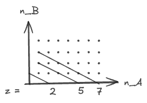
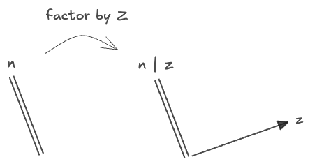
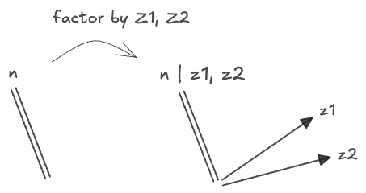
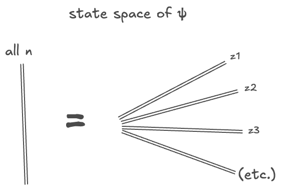
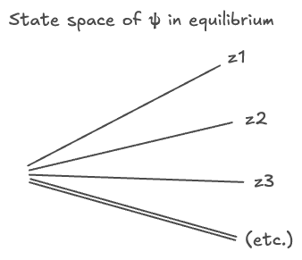

#### Table of Contents
## Introduction

In  we encountered the following "levels of abstraction" of Reaction Networks
0. Equilibria: the behavior in the $$t \to \infty$$ limit.
1. Population Dynamics: described by the Rate Equation itself. (Or continuous dynamics?)
2. Stochastic dynamics: described by the Master Equation
3. Histories: we briefly mentioned a path-integral interpretation of time-evolution.
4. Micro Dynamics: we've assumed a lot about this in adopting the "Reaction network" model, but haven't addressed it directly.

My chief interest in reaction networks, again, is in understanding how the different levels of abstraction of the same system relate to each other. We can start by asking:
* When do equilibria solutions of the Master equation imply equilibria of the Rate equation, and v.v.?
* What information is lost in the act of abstracting from the Master to Rate levels, and how important is it? 
* Do the differences between their solution sets amount to characterizations of _solutions_, or of the *networks* generating the equations, or both?
 

## From Master to Rate

Here again are the Rate and Master equations side by side; see <a href="2024-10-06-reaction-networks-1/">part 1</a> for notation.

$$
\begin{aligned}

\frac{d \bar{X}}{d t} =  \sum_r (\bar{k}_r' - \bar{k}_r) \times r \vert \bar{X}^{\bar{k}_r} \vert &&&& \frac{d \psi}{d t} = \left(\sum_r r \left[{(\bar{a}^+)}^{\bar{k}_r'} - {(\bar{a}^+)}^{\bar{k}_r}\right]{(\bar{a}^-)}^{\bar{k}_r}\right)\psi
\end{aligned}
$$

Each of these is derived from the same reaction network, with the same $$t, s, r$$ parameters, but they represent different "granularities" of description of the underlying physical system. The Rate Equation describes the time evolution of a single tuple of "populations" or "concentrations" $$\bar{X}(t)$$ with $$X_i \in \mathbb{R}_{\ge 0}$$, while the Master equation describes the time evolution of a distribution over exact species numbers $$\bar{n}$$, with $$n_i \in \mathbb{N}_{\ge 0}$$.

As a starting point, we can ask if the former—the coarser description—can be derived by some reductive operation from the latter. How can we convert a distribution over exact states $$\bar{n}$$ into a single concentration tuple $$\bar{X}$$? 

The obvious guess is to postulate that $$\bar{X} \stackrel{?}{=} \langle \bar{N} \rangle$$, and look at how expectations of the particle numbers evolve. This will be a function of time through the time-dependence of the underlying distribution $$\psi(t)$$, so we're looking for something like an [Ehrenfest Theorem](https://en.wikipedia.org/wiki/Ehrenfest_theorem) from quantum mechanics. Our expectation is analogous to a Q.M. expectation $$\langle \psi N \psi \rangle$$, but we will omit explicit mention of $$\psi$$ in the manner of a probabilistic expectation. If we need it, we'll write $$\langle \cdot \rangle_\psi$$ or $$\langle \cdot \rangle_{\psi(t)}$$.

We can test this guess by plugging $$\langle \bar{N} \rangle$$ into the Master equation and seeing what we get. We'll work in the g.f. representation where $$\psi = \sum_\bar{n} \psi_\bar{n} \bar{x}^\bar{n}$$, where expectations like $$\langle f \rangle = \sum_\bar{n} f(\bar{n}) \psi_\bar{n}$$ are calculated by setting $$\bar{x} = 1$$. Then we have:

$$
\begin{aligned}
\frac{d }{d t}{\langle \bar{N} \rangle}
  &= \langle \bar{N} H \rangle 
  = \left[\sum_\bar{n} \bar{N} H \psi_\bar{n} \bar{x}^\bar{n}\right]_{\bar{x}=1}
\\
&= \left.
  \sum_r \sum_\bar{n} r \left(
    \bar{N}{(\bar{a}^+)}^{\bar{k}_r'} {(\bar{a}^-)}^{\bar{k}_r} - \bar{N}{(\bar{a}^+)}^{\bar{k}_r}{(\bar{a}^-)}^{\bar{k}_r}
  \right) \psi_\bar{n} \bar{x}^\bar{n} \right|_{\bar{x}=1} 
\\
&= \left.
  \sum_r \sum_\bar{n} r  \left(
    \bar{N} \bar{n}^{\bar{k}_r\downarrow} \bar{x}^{\bar{n} - \bar{k}_r + \bar{k}_r'} 
    - \bar{N}\bar{n}^{\bar{k}_r\downarrow} \bar{x}^{\bar{n} - \bar{k}_r + \bar{k}_r} 
  \right)\psi_\bar{n}  \right|_{\bar{x}=1} 
\\
&= \left.
  \sum_r \sum_\bar{n} r \left(
    (\bar{n} - \bar{k}_r + \bar{k}_r') \bar{n}^{\bar{k}_r\downarrow} \bar{x}^{\bar{n} - \bar{k}_r + \bar{k}_r'} 
    - \bar{n}\bar{n}^{\bar{k}_r\downarrow} \bar{x}^{\bar{n}} 
  \right) \psi_\bar{n}  \right|_{\bar{x}=1} 
\\
&= 
  \sum_r \sum_\bar{n} r  \left(\bar{k}_r' - \bar{k}_r\right) 
  \bar{n}^{\bar{k}_r\downarrow} \psi_\bar{n}  
\\
&= \sum_r r  \left(\bar{k}_r' - \bar{k}_r\right) \sum_\bar{n} \bar{n}^{\bar{k}_r\downarrow} \psi_\bar{n}  
\\
&= \sum_r r (\bar{k}_r' - \bar{k}_r) \langle \bar{N}^{\bar{k}_r\downarrow} \rangle
\end{aligned}
$$

Not too bad—we _almost_ have a Rate Equation, except that the r.h.s. expectation is wrong—if it were $${\langle \bar{N} \rangle}^{\bar{k}_r}$$ we'd have the Rate Equation exactly. Instead there are two discrepancies:
* It's a falling power $$\bar{N}^{\bar{k}_r\downarrow}$$
* The power is inside the expectation $$\langle \bar{N}^{\bar{k}_r\downarrow} \rangle$$ rather than outside of it.

The first discrepancy is the kind of thing that arises from the discreteness of $$\bar{n}$$ and would disappear in an $$N\to\infty$$ limit; we'll almost always have $$\bar{N} \gg \bar{k}$$, so the differences between $$\bar{n}^\bar{k}$$ and $$\bar{n}^{\bar{k}\downarrow}$$ ought will be minimal. 

We could maybe work around the second discrepancy by thinking of the Rate Equation as an operator equation for the number operator, though this sounds like it would require a "Heisenberg picture", and I can't think of what that would mean right now.

So these aren't fatal flaws, but still—maybe we can do better.
 

## Poisson States

How to proceed? We can try to find a _state_ $$\psi_\bar{n}$$ for which $$\langle \bar{N}^{\bar{k}\downarrow} \rangle$$ *happens* to be equal to $${\langle \bar{N} \rangle}^\bar{k}$$. If such a state obeys the Master Equation, it will automatically obey the Rate Equation in the variable $$\bar{X} = \langle \bar{N} \rangle$$. The condition is:

$$
\begin{aligned}
\langle \bar{N}^{\bar{k}\downarrow} \rangle &\stackrel{?}{=}  {\langle \bar{N} \rangle}^\bar{k}\\
\sum_\bar{n} \frac{\bar{n}!}{(\bar{n}-\bar{k})!} \psi_\bar{n} &\stackrel{?}{=}  {\left(\sum_\bar{n} \bar{n}\psi_\bar{n} \right)} ^\bar{k}
\end{aligned}
$$

This is an extremely general condition on the distribution $$\psi_\bar{n}$$—there's no hope of finding every possible solution. But maybe we can guess our way to _some_ solution. 

The problem will get easier if we can actually evaluate one side or the other of this equation. The L.H.S. expression suggests a direction: we consider states for which $$\psi_\bar{n} \propto \frac{1}{\bar{n}!}$$, because the two factors of $$\bar{n}!$$ will cancel and the resulting expression will have the same form we started with. This at least is a simplification. Writing $$\psi_\bar{n} \propto \frac{f(\bar{n})}{\bar{n}!}$$, where $$f$$ is an unspecified function, the L.H.S. of the above becomes:

$$
\langle \bar{N}^{\bar{k}\downarrow} \rangle 
= \sum_\bar{n} \bar{n}^{\bar{k}\downarrow} \psi_\bar{n}
= \sum_\bar{n} \frac{\bar{n}!}{(\bar{n}-\bar{k})!} \frac{f(\bar{n})}{\bar{n}!}
= \sum_\bar{n} \frac{f(\bar{n})}{(\bar{n}-\bar{k})!}
$$

This now has the same denominator as the state $$\psi_{\bar{n}-\bar{k}}$$ will have under the same ansatz. If additionally $$f(\bar{n})$$ is taken to be some specific tuple $$\bar{\lambda}$$ to the power $$\bar{n}$$, then we get even closer—we get a constant multiple of the exact state $$\psi_{\bar{n}-\bar{k}}$$:

$$ 
\begin{aligned}
\bar{n}^{\bar{k}\downarrow} \psi_{\bar{n}} 
&= \frac{\bar{n}!}{(\bar{n}-\bar{k})!}\frac{\bar{\lambda}^\bar{n}}{\bar{n}!}
\\&= \frac{\bar{\lambda}^\bar{n}}{(\bar{n}-\bar{k})!}
\\&= \bar{\lambda}^\bar{k}\frac{\bar{\lambda}^{\bar{n} - \bar{k}}}{(\bar{n}-\bar{k})!}
\\&= \bar{\lambda}^\bar{k}\psi_{\bar{n}-\bar{k}}
\end{aligned}
$$ 

Note that if $$\bar{n} \ge \bar{k}$$, in _any_ tuple component, then $$(\bar{n} - \bar{k})! = 0$$; we will fudge this to mean "the product of zero terms" and therefore equal zero, rather than representing a division by zero. Then we can evaluate the whole expectation:

$$
\begin{aligned}
\langle \bar{N}^{\bar{k}\downarrow} \rangle &= \bar{\lambda}^{\bar{k}} \sum_\bar{n} \psi_{\bar{n} - \bar{k}}
\\&= \bar{\lambda}^{\bar{k}} \sum_\bar{n} \psi_{\bar{n}}
\\&= \bar{\lambda}^{\bar{k}}
\end{aligned}
$$

So for this distribution, $$\langle \bar{N}^{\bar{k}\downarrow} \rangle = \bar{\lambda}^\bar{k}$$. We have actually fixed both of the discrepancies in our pseudo-Rate Equation: the falling-power has disappeared, *and* the power $$\bar{k}$$ has moved outside the expectation. 

We're nearly at the Rate-Equation-for-$$\langle \bar{N} \rangle$$. All we need to do is take $$\bar{\lambda} = \langle \bar{N} \rangle$$ and normalize. Then this specific time-dependent distribution $$\psi(\bar{x}, t; \bar{\lambda})$$ will have expectations which obey the Rate Equation.

To get the normalization constant, we need to evaluate:

$$
\sum_\bar{n} \psi_\bar{n} = \sum_\bar{n} \frac{\bar{\lambda}^\bar{n}}{\bar{n}!}
$$

This looks like the series expansion of $$e^{\bar{\lambda}}$$, except that it's written with tuples. Does it matter? Let's check:

$$
\begin{aligned}
e^{\bar{\lambda}} = e^{\lambda_1 + \lambda_2 + \cdots} &= \sum_N \frac{ {(\lambda_1 + \lambda_2 + \cdots)}^N}{N!} \\
&= \sum_N \frac{1}{N!} \sum\limits_{n_1, n_2, \cdots}^{\sum n_i = N} {N \choose n_1, n_2, \cdots} \lambda_1^{n_1} \lambda_2^{n_2}\cdots \\
&= \sum_{n_1, n_2, \cdots} \frac{1}{N!} \frac{N!}{n_1! n_2! \cdots} \bar{\lambda}^\bar{n} \\
&= \sum_{\bar{n}} \frac{\bar{\lambda}^\bar{n}}{\bar{n}!}  \\
\end{aligned}
$$

...and indeed, this is nothing but a multivariate exponential. (In the third line we combined the double sum into a single unrestricted sum over all the $$n_i$$).

Therefore we need a factor of $$e^{-\bar{\lambda}}$$ to normalize the distribution, and the final distribution's g.f. will be $$e^{\bar{\lambda} \cdot \bar{x} - \bar{\lambda}}$$, which can be written in a few ways:

$$
\begin{aligned}
\psi(\bar{x}, t; \bar{\lambda}) &= e^{\bar{\lambda} \cdot \bar{x} - \bar{\lambda}} \\
&= \sum_\bar{n} \left(\frac{\bar{\lambda}^\bar{n}}{\bar{n}!}e^{-\bar{a}}\right) \bar{x}^\bar{n} \\
& = \prod_i e^{\lambda_i x_i -\lambda_i} \\
&= \prod_i \left( \sum_{n_i} \left(\frac{ {\lambda_i}^{n_i}}{n_i!} e^{-a_i}\right){x_i}^{n_i} \right)
\end{aligned}
$$

But look—the expression in the last line $$\left(\frac{ {\lambda_i}^{n_i}}{n_i!} e^{-a_i}\right)$$ is nothing but a Poisson distribution: 

$$
n_i \sim \text{Poisson}(\lambda_i)
$$

So our full distribution is a product of independent Poissons with means: $$\bar{\lambda} = \langle \bar{N} \rangle$$; of course I knew this when I called them $$\lambda$$. In tuple notation we can write this whole combination as $$\bar{n} \sim \text{Poisson}(\bar{\lambda})$$. 

We could also call these product-of-Poisson distributions "coherent states", borrowing from quantum mechanics, where the same distribution appears and acts in a similar way. I will call them "Poisson states", however, to avoid introducing too much jargon.

Recapping, we have found that, if a Poisson state satisfies the Master Equation, then its expectation $$\langle \bar{N} \rangle$$ also will satisfy the Rate Equation. Apparently this works because the Poisson states are eigenstates of the $$a^-$$ operator and therefore of $$N^{k \downarrow} = {(a^+)}^k{(a^-)}^k$$, but the physical meaning of this fact is obscure to me. 

These results are found in a similar Q.M.-inspired notation in [this paper](https://arxiv.org/pdf/1306.3451) of Baez, though the results themselves are older. I have tried, though, to present the derivation in the same way you might arrive at it yourself.

This result has two limitations:
* It requires that the Poisson state actually occurs, which is not guaranteed unless we take it as an initial condition
* Even if a Poisson state arises, there's no guarantee it will actually remain "coherent" over time under stochastic time-evolution.

Still, it's a starting point—we've learned _something_ about the relationship between the two levels of abstraction. From here we can ask:
* Can we go the other way—does any solution to the Rate Equation $$\bar{X}(t)$$ always produce a Poisson state $$e^{\bar{X} \cdot \bar{x} - \bar{X}}$$ which is an equilibrium of the Master Equation?
* Under what conditions does a Poisson state remain "coherent" state over time? As a step towards this, could we characterize the first-order "divergence-from-coherence" under time evolution with $$e^{tH}$$?

We'll take on the first question next, filing the second away for later.

 

## The ACK Theorem

The question: does any solution $$\bar{X}$$ to the Rate Equation give us a Poisson-state solution to the Master Equation? 

Here are the Rate and Master equations once again:

$$
\begin{aligned}
\frac{d \bar{X}}{d t} =  \sum_r (\bar{k}_r' - \bar{k}_r)  \times r \vert \bar{X}^{\bar{k}_r} \vert &&&& \frac{d \psi}{d t} = \left(\sum_r r \left[{(\bar{a}^+)}^{\bar{k}_r'} - {(\bar{a}^+)}^{\bar{k}_r}\right]{(\bar{a}^-)}^{\bar{k}_r}\right)\psi
\end{aligned}
$$

We can now assume we have solved the Rate with some $$\bar{X}(t)$$. We construct the corresponding Poisson state and look for a condition that makes $$H\psi(\bar{x}, t; \bar{X}) = 0$$:

$$
\begin{aligned}
H \psi(\bar{x}, t; \bar{X}) = H e^{\bar{X} \cdot \bar{x} -\bar{X}} 

&= \left(\sum_r r \left[{(\bar{a}^+)}^{\bar{k}_r'} - {(\bar{a}^+)}^{\bar{k}_r}\right]{(\bar{a}^-)}^{\bar{k}_r}\right) e^{\bar{X} \cdot \bar{x} - \bar{X}}
\\
&= \left(\sum_r r \left[\bar{x}^{\bar{k}_r'} - \bar{x}^{\bar{k}_r}\right] \bar{X}^{\bar{k}_r} \right)e^{\bar{X} \cdot \bar{x} - \bar{X}}\\
& \stackrel{?}{=} 0
\end{aligned}
$$

Well, there is our condition: the term in parentheses must vanish. The obvious way for this to happen is for each $$\bar{k}_r' = \bar{k}_r$$, but that would not be very interesting; it would mean all of our reactions do nothing.

Instead we can try to write this in another way. Recall that $$\bar{k}_r'$$ and $$\bar{k}_r$$ were the output and input *complexes* of reaction $$r$$; a complex was just an integer combination of species, like $$X_1 + 2X_2$$. Then the above sum can be written as a double sum, first over _all complexes_, which I'll call $$\bar{\kappa}$$ to distinguish from the known values. Then we write two separate sums over reactions, one for those where $$\bar{\kappa}$$ is equal to the input of that reaction, and one where it's the output.

$$
\begin{aligned}
\sum_r r \left[\bar{x}^{\bar{k}_r'} - \bar{x}^{\bar{k}_r}\right] \bar{X}^{\bar{k}_r} 
&= \sum_{\bar{\kappa}}
  \left[
    \sum_{r \mid \bar{k}_r' = \bar{\kappa}} r \bar{X}^{\bar{k}_r} \bar{x}^{\bar{\kappa}} 
  - \sum_{r \mid \bar{k}_r = \bar{\kappa}} r \bar{X}^{\bar{\kappa}} \bar{x}^{\bar{\kappa}} 
  \right]
\\
&= \sum_{\bar{\kappa}} \bar{x}^{\bar{\kappa}} 
  \left[
    \sum_{r \mid \bar{k}_r' = \bar{\kappa}} r \bar{X}^{\bar{k}_r}
  - \sum_{r \mid \bar{k}_r = \bar{\kappa}} r \bar{X}^{\bar{\kappa}} 
  \right]
\end{aligned}
$$

Now if the term in the brackets $$[ \cdots]$$ is identically zero, then $$H\psi = 0$$. This is a more interesting condition! It is a condition on a _solution_ rather than on the whole network. Physically, this means that our chosen Rate Equation solution $$\bar{X}(t)$$ has to produce exactly-cancelling inflows and outflows of each _complex_, rather than each _species_. This is a weak form of equilibrium where we are effectively reducing our network to only its complexes, without any regard for how these complexes are composed of the underlying species.

This condition is called "complex-balance". This is the "Anderson-Craciun-Kurtz" or "ACK" theorem, which can found in full, in this Q.M.-derived notation, in [this paper](https://arxiv.org/pdf/1305.4988) of Baez. (The proof in the paper seems needlessly complicated, though—that or mine is in error!)

Notice that it is a condition on the _rate equation solution_ $$\bar{X}(t)$$, and we can rewrite the Rate Equation in the same way:

$$
\begin{aligned}
\frac{d \bar{X}}{d t} &= \sum_r (\bar{k}_r' - \bar{k}_r)  \times r \vert \bar{X}^{\bar{k}_r} \vert\\
& = \sum_{\bar{\kappa}} \bar{\kappa} 
      \times \left[\sum_{r \mid \bar{k}_r' = \bar{\kappa}} r \bar{X}^{\bar{k}_r} - \sum_{r \mid \bar{k}_r = \bar{\kappa}} r \bar{X}^{\bar{k}_r}\right] \\

& = \sum_{\bar{\kappa}} \bar{\kappa} \times \frac{d \bar{X}_\bar{\kappa}}{d t}
  
\end{aligned}
$$

In the last line I've defined $$d\bar{X}_\bar{\kappa}/dt$$ to be the contribution to $$d\bar{X}/dt$$ from inflows or outflows of complex $$\bar{\kappa}$$. This is really an abuse of notation, because $$\bar{X}_\bar{\kappa}$$ does not really correspond to a particular "component" of the overall concentration tuple $$\bar{X}$$. But if we reduced our network to only count complexes rather than species, so that the reactions converted $$\bar{\kappa}_1 \to \bar{\kappa}_2$$, then this $$\bar{X}_\bar{\kappa}$$ *would* be one of the distinct tuple-components of the _reduced network_.

From the above form of the Rate Equation we see that the "complex-balance" condition on $$\bar{X}(t)$$ automatically solves the Rate Equation as well, even if we hadn't assumed that. If the complexes are balanced, the species must be too—this is rather obvious; the weaker condition follows from the stronger one.

To say this another way, observe that we have encountered three kinds of Rate-Equation solutions:
1. (Trivial) All $$\bar{k}_r' = \bar{k}_r$$; this is a network that does nothing.
2. (Complex-balance) All complexes have zero time-derivative, $$d\bar{X}_{\bar{\kappa}}/dt = 0$$. 
3. (Detailed-balance) All species have zero time-derivative, $$d\bar{X}/dt = 0$$

(1) implies _all_ states are solutions of (2) and (3), but this isn't interesting. Note that this is a condition
on networks rather than on states.

The solutions (2) are the solutions of the "reduced" network where we forget about how complexes are comprised of species. It is also fairly trivial that (2) implies (3), but the result here is that (2) *also* implies a Poisson solution to the Master Equation.

And (3) is the full set of equilibria of the master equation—being simply the definition of equilibrium.

But clearly there will be other equilibria—perhaps other classes we can characterize like (2)—a worthy line of investigation, but one which I'll file away with the others. For now, we'll try to say more about the complex-balanced cases in class (2).

 

## Symmetry Operators

We have so far found that:
* Poisson solutions to the Master Equation imply solutions to the Rate equation.
* Complex-balanced solutions to the Rate Equation imply Poisson solutions to the Master Equation.

Both of these are really results about the "reduced" network on complexes, but they're a start. Two worthy questions at this point are:
* how many of these complex-balanced solutions are there?
* are they stable?

To answer these we'll start to look at the "symmetries"—i.e. the "conserved quantities" or "invariants"—of a reaction network. This will also offer an example of the Poisson-state methods from the previous sections.

We consider, following Baez, a simple reversible network with two reactions: $$\alpha$$ creates two $$A$$ molecules from a $$B$$, and $$\beta$$ creates a $$B$$ from two $$A$$s:

$$
2A \underset{\alpha}{\overset{\beta}{\rightleftharpoons}} B
$$

The corresponding Rate and Master equations are:

$$
\begin{aligned}

\frac{d \bar{X}}{d t} &= \beta {(X_A)}^2 \begin{pmatrix} -2 \\ 1\end{pmatrix} + \alpha X_B \begin{pmatrix} + 2 \\ -1\end{pmatrix} 
&& \text{(Rate Equation)}\\
 &= \begin{pmatrix} -2 \\ 1\end{pmatrix} \left( \beta {(X_A)}^2 - \alpha X_B\right)\\
\frac{d }{d t}\psi &= H \psi && \text{(Master Equation)}\\

 &= \left(\alpha \left [{(a_A^+)}^2  - a_B^+\right] a_B^-
+  \beta \left [a_B^+  - {(a_A^+)}^2\right]{(a_A^-)}^2\right) \psi\\
&= \left({(a_A^+)}^2 - a_B^+\right)\left(\alpha a_B^- - \beta {(a_A^-)}^2\right) \psi

\end{aligned}
$$

Note that both equations can be factored into somewhat simpler forms, because the network consists of only two reactions between the same two species.

Note also that the Rate Equation will be satisfied for any $$\bar{X}$$ wth $$\beta {(X_A)}^2 = \alpha X_B$$. At any such concentrations the rates of the two reactions are equal and the net change in concentration is zero. 

Now we observe that time-evolution by the Master equation can never alter the quantity $$n_A + 2n_B$$ from its initial value; hence the following operator can be said to be a "symmetry" or "conserved quantity" of the system:

$$
\begin{aligned}
Z &= N_A + 2N_B \\
  &= {a^+_A}{a^-_A} + 2{a^+_B}{a^-_B}\\
 &= \bar{n}_z \cdot \bar{N} \\
\end{aligned}
$$

Here I've given the name $$\bar{n}_z$$ to the conserved tuple $$(1, 2)$$, because this tuple acts like a "particle number" of something _other_ than the species in our reaction. In a network representing chemical reactions there ought to be such a conserved operator for each underlying element, e.g. "Sodium"; in particle physics there would be an operator for each conserved quantum number like "lepton number". In this example it clearly corresponds to the total number of $$A$$ atoms, if we interpret $$B$$ as representing a diatomic molecule of two $$A$$s. But it is not the same as $$n_A$$, which counts the free (as opposed to bound) $$A$$ _molecules_, so we use a different name which is still suggestive of a "particle number". (I could see renaming $$Z$$ to $$N_Z$$ too, or $n_z$ to $z$, but I won't for now.)

In the generating-function representation we can write the action of this operator on a state $$\psi(\bar{x})$$ as:

$$
\begin{aligned}
Z\psi  &= \left(x_a \frac{\partial }{\partial x_A} + 2 x_B \frac{\partial }{\partial x_B}\right)\psi \\
 &= \sum_{n_A, n_B} \psi_\bar{n}
 \left[x_a \frac{\partial }{\partial x_A} + 2 x_B \frac{\partial }{\partial x_B}\right]  {(x_A)}^{n_A} {(x_B)}^{n_B} \\
&= \sum_{n_A, n_B} \psi_\bar{n} (n_A + 2 n_B) {(x_A)}^{n_A} {(x_B)}^{n_B} \\
&= \sum_\bar{n} \vert \bar{n}_z \cdot \bar{n} \vert  \psi_\bar{n}\bar{x} ^\bar{n}\\
&= \sum_\bar{n} z_\bar{n} \psi_\bar{n} \bar{x} ^\bar{n}
\end{aligned}
$$

In the last line I've used $$z_\bar{n}$$ to represent a particular eigenvalue of the $$Z$$ operator.

Apparently, any monomial $$\bar{x}^\bar{n}$$ is an eigenstate of $$Z$$:

$$
Z \bar{x}^\bar{n} = (n_A + 2n_B)\bar{x}^\bar{n} = z_{\bar{n}} \bar{x}^\bar{n}
$$

Any state for which $$2n_A + n_B = z$$ will have the same eigenvalue. Usually there are a great many, but for very small $$n_z$$ there might be only a few, for example $$n_z=5$$ has only three:

$$
(n_A, n_B) = \begin{cases} (5, 0) \\ (3, 1) \\ (1, 2) \\\end{cases}
$$

We can visualize this on a grid of $$n_A, n_B$$. Any line of gridpoints related by a multiple of $$(2, -1)$$ will have the same $$z$$ value; a few examples are visualized below:

We can also visualize how $$Z$$ divides up the overall space of all possible $$\bar{n}$$. (See my <a href="/posts/2024-09-02-dimensions/">drawing dimensions</a> post for more on this diagram style):

If there were two independent symmetries $$Z_1, Z_2$$, they would carve out two independent degrees-of-freedom from the full state space of $$\bar{n}$$:

We can see this as describing the "coordinates" of a term $$\bar{n}$$:
* first pick a value for each independent symmetry $$z_1, z_2, \cdots$$ 
* then, choose any coordinate in the remaining subspace $$\{ \bar{n} \mid z_1, z_2 \}$$. In the present case, once $$z_\bar{n} = \bar{n} \cdot \bar{n}_z = n_A + 2 n_B$$ is known, either $$n_A$$ or $$n_B$$ suffices to determine the exact state. Of course, all of this applies only to "pure" monomial states—a general $$\psi$$ will be composed of components along many $$z$$. This decomposition is:

$$
\begin{aligned}
\psi = \sum_{\bar{n}} \psi_\bar{n} &= \sum_{z} \psi_z\\
 &= \sum_{z} \sum_{\substack{\bar{n} \\ \bar{n}_z\cdot\bar{n} = z}} \psi_\bar{n}\\

 
Z \psi &= \sum_{z} z ~ \psi_z
\end{aligned}
$$

This is analogous to a decomposition of a quantum state into, first, energy levels, then some other quantum number like orbital angular momentum:

$$
\psi = \sum_E \sum_{l} \psi_{E, l}
$$

In the $$z$$ decomposition "basis", the operator $$Z$$ will be block-diagonal:

$$
Z\psi = \begin{pmatrix} z_1 I \\ & z_2I \\ & & z_3I \\ & & & \ddots \end{pmatrix}
\begin{pmatrix} \psi_{z_1} \\ \psi_{z_2} \\ \psi_{z_3} \\ \vdots \end{pmatrix}
$$

And we could represent the space of all $$\psi$$ as a sum of subspaces of fixed $$z$$:

I've drawn these as double lines because the space for a fixed $$z$$ is still $$\ge 1$$-dimensional. A matrix representation of $$Z$$ itself will be block diagonal for the same reason. This diagram conveys that any state $$\psi$$ defined on the full space of $$\bar{n}$$ can be factored into one independent (multi-dimensional) coordinate on each $$z_i$$ subspace. Note that this is describing the space of $$\psi$$, which is much larger than the space of a single $$\bar{n}$$ monomial. A monomial has a single $$z$$ value while $$\psi$$ potentially has a component along _each_ $$z$$ value—how best to render this? These diagrams are a stab at relating my mental model, but I think they haven't reached their final form yet.

 

## Symmetries of Equilibrium Solutions

Now we'll consider what a symmetry $$Z$$ of the "Hamiltonian" $$H$$ can tell us about its solutions, in two senses:
1. What can a $$Z$$-symmetry tell us about general equilibrium solutions ($$H\psi = 0$$) to the Master equation?
2. If we start with a _Rate Equation_ equilibrium solution, and construct a Poisson solution to the Master Equation using the ACK Theorem, what can a symmetry $$Z$$ tell us about this solution in particular?

First question first. Let us continue to work on our simple example network:

$$
2A \underset{\alpha}{\overset{\beta}{\rightleftharpoons}} B
$$

And let us conjure again the "Hamiltonian" for this network:

$$
\begin{aligned}
H &= \left({(a_A^+)}^2 - a_B^+\right)\left(\alpha a_B^- - \beta {(a_A^-)}^2\right)
\end{aligned}
$$

What is the action of this on a general state? Even the action of this $$H$$ on a simple monomial will be a fairly large expression; to keep it under control we write it with tuple $$\bar{\Delta}_\alpha = (2, -1)$$, representing the change in species induced by reaction $$\alpha$$. For this network $$\bar{\Delta}_\beta = -\bar{\Delta}_\alpha$$, so we only need the one; I'll write it simply as $$\bar{\Delta}$$. Note this is orthogonal to the conserved tuple $$\bar{n}_z$$: 

$$\bar{\Delta} \cdot \bar{n}_z = (2, -1) \cdot (1, 2) = 0$$.

Then the action of $$H$$ is:

$$
\begin{aligned}

H \bar{x}^{\bar{n}}  &= 
\alpha n_B \left [\bar{x}^{\bar{n} + \bar{\Delta}} - \bar{x}^{\bar{n} } \right]
+ \beta n_A(n_A - 1) \left [\bar{x}^{\bar{n} - \bar{\Delta}} - \bar{x}^{\bar{n} } \right]
\\
&=
  \alpha n_B \bar{x}^{\bar{n} + \bar{\Delta}} 
  + \beta n_A(n_A - 1) \bar{x}^{\bar{n} - \bar{\Delta}} 
  - \bigg[\alpha n_B + \beta (n_A)(n_A -1 )\bigg] \bar{x}^{\bar{n} }
\end{aligned}
$$

Evidently the monomial $${(x_A)}^{n_A}{(x_B)}^{n_B}$$ makes contributions to three states, all with the same eigenvalue $$z$$ of our symmetry $$Z$$ as the original:
1. Adds to state $${(x_A)}^{n_A+2}{(x_B)}^{n_B - 1}$$ with $$z = (n_A + 2) + 2 (n_B - 1) = n_A + 2 n_B$$ 
2. Adds to state $${(x_A)}^{n_A-2}{(x_B)}^{n_B + 1}$$ with $$z = (n_A - 2) + 2(n_B + 1) = n_A + 2n_B$$
3. Subtracts from the original state $${(x_A)}^{n_A}{(x_B)}^{n_B}$$

If we think of our $$H$$ as representing a flow $$\bar{n} \to \bar{n}'$$, then any final state $$\bar{n}'$$ will receive contributions from itself and the two neighboring states; and we can reindex the above expression to reflect this:

$$
\begin{aligned}
{(H\bar{x}^{\bar{n}})}_{\bar{n}'} &= 
  \alpha (n_B' + 1) \bar{x}^{\bar{n}' - \bar{\Delta}} \\
&~~~~~~+ \beta (n_A' + 2)(n_A' + 1) \bar{x}^{\bar{n}' + \bar{\Delta}}  \\
&~~~~~~- \bigg[\alpha (n_B' + 1) + \beta (n_A' + 2)(n_A' + 1)\bigg] \bar{x}^{\bar{n}'}\\
\end{aligned}
$$

Now if a state $$\psi = \sum_z \psi_z$$ is in equilibrium with $$H\psi = 0$$, then as we've just seen, $$H$$ cannot change the value of $$z$$, so $$H$$ itself must decompose cleanly into a sum over $$z$$:

$$
H \psi = \sum_z H_z \psi_z
$$

And apparently, any equilibrium solution must have $$H_z \psi_z = 0$$ on every $$z$$-component! And, if we find some set of equilibria on each $$z$$ component, then any arbitrary linear combination of these will, after normalization, be an equilibrium solution to the full $$H$$. 

The above expression has the form:

$$
{(H\bar{x}^{\bar{n}})}_{\bar{n}'}  = (c_-)\bar{x}^{\bar{n}' - \bar{\Delta}} - (c) \bar{x}^{\bar{n}'} + (c_+) \bar{x}^{\bar{n}' + \bar{\Delta}}
$$

Which gives us the condition for equilibrium on a $$z$$ eigenstate in terms of the same constants:

$$
0 = (c_-)\psi_{\bar{n} - \bar{\Delta}} - (c) \psi_{\bar{n}} + (c_+) \psi_{\bar{n} + \bar{\Delta}}
$$

where I've replaced the $$\bar{x}$$ powers above with the "components" of $$\psi$$ as in the sum $$\psi = \sum_\bar{n} \psi_\bar{n} \bar{x}^\bar{n}$$, and dropped the primes. Note that the $$c$$ coefficients are still functions of $$\bar{n}$$. 

The above is a 3-term recursion relation for the components of the equilibrium distribution $$\psi_\bar{n}$$. We have come up with a discrete boundary-value-problem for any equilibrium solution, with boundary conditions arising at either $$n_A = 0$$ or $$n_B =0$$ because neither particle-number is allowed to be negative. 

Consequently, there should only **be at most one equilibrium solution to the Master Equation for each value of $$z$$**. 

That's still a lot of equilibrium states, but at least we know *something*!

(This is the claim of Baez et al, but I'm a bit skeptical of this. For one thing, the recursion relation skips the states of immediately-adjacent $$n_A$$, and it seems possible to contrive a system where both interlaced recursions can be satisfied at once, or neither can. We might get something like sine/cosine modes. Filing it away.)

The following depicts how the state space is reduced in equilibrium. A linear combination over the independent $$z$$ equilibria will suffice to describe any equilibrium solution.

(Note to self: find a coherent way to depict "infinitely many axes")

If our $$H$$ has multiple symmetries $$Z_1, Z_2$$, then any equilibria will clearly decompose along each symmetry, considered _independently_. But in general the equilibrium state of one symmetry will be some linear combination of those of the other; we don't expect them to be "simultaneously diagonalizeable" unless one of the symmetries implies the other.

Note that this problem has turned out to be quite similar to a discrete Laplacian operator:

$$
0 = \psi_{n-1} - 2 \psi_n + \psi_{n+1}
$$

This is easier to see if we reindex our states $$\bar{n}$$ by $$z$$ and $$n = n_B$$:

$$
0 = (c_-)\psi_{z, n-1} - (c) \psi_{z, n} + (c_+) \psi_{z, n+1}
$$

Our three $$c$$ coefficients, however, are complicated functions of $$n$$ and $$z$$, so it is very unlikely this expression would be the discrete form of any reasonable continuous equation.

I wonder at this point:
* Can we say anything about the relationship between the unique equilibria of neighboring $$z$$ values?

But we'll put this aside for now, along with the question of stability posed above.

 

## Noether's Theorem

We can summarize the results of the previous section in a more general way.

We have seen, for the Master Equation:
* If $$H$$ can't change the value of an operator $$Z$$ on a single state, then time-evolution with $$H$$ can't take us out of the subspace of constant $$z$$.
* Furthermore, time-evolution will operate separately on components of distinct $$z$$, and any equilibria will be a linear combination of independent equilibria on each component.

These facts amount to [Noether's Theorem](https://en.wikipedia.org/wiki/Noether%27s_theorem) for reaction networks. The intuitive form of this theorem is:
* if, for some operator $$Z$$, every "transition" $$\bar{n} \to \bar{n}'$$ defined by the operator $$H$$ which links states with the same eigenvalue $$z$$ of $$Z$$
* ...then no amount of time-evolution $$e^{tH}$$ can ever take a state of one $$z$$ into another; eigenvalues of $$Z$$ are therefore conserved by time-evolution.

This relationship between $$H$$ and $$Z$$ turns out to have a number of equivalent mathematical expressions. A few of these are:

$$
\begin{align}
[Z, H] &= 0\\
(Z_\bar{n} - Z_{\bar{n}'}) H_{\bar{n}', \bar{n}} &= 0\\
\langle ZH\rangle_\psi = \langle Z^2 H\rangle_\psi &= 0, \forall \psi\\
\frac{d }{d t} \left( \mathrm{var}_\psi Z \right) &= 0, \forall \psi
\end{align}
$$

To read these, recall that our $$\psi$$ are p.d.f.s, so an expectation is taken $$\langle F \rangle_\psi = \sum_\bar{n} F_\bar{n}\psi_{\bar{n}}$$ and a time derivative is

$$
\frac{d }{d t}\langle F \rangle_\psi = \sum_\bar{n} F_\bar{n}\frac{d }{d t}\psi_{\bar{n}} = \sum_\bar{n} F_\bar{n}H\psi_{\bar{n}} = \langle FH \rangle_\psi
$$

Thus the last line is 

$$
\frac{d }{d t} \left(\mathrm{var}_\psi Z \right) = \frac{d }{d t} \left( \langle Z^2 \rangle_\psi  \right) - \frac{d }{d t}\left( {(\langle Z \rangle_\psi)}^2 \right)
$$

Which is clearly equivalent to the previous line. It is also interesting to note that 

$$
\langle H \rangle_\psi = \langle H F\rangle_\psi = 0
$$

for any $$\psi$$ and any $$F$$, since $$H$$ is "infinitesimal-stochastic"—its columns sum to zero—leading to an expectation of zero in any state. This means that the expectations like $$\langle ZH \rangle$$ can be trivially written in terms of the commutator

$$
\langle ZH \rangle = \langle [Z, H] \rangle
$$

Beyond these observations I won't prove these statements—they follow straightforwardly from the definitions. For more see Baez' [Noether paper](https://arxiv.org/pdf/1203.2035) and [book](https://math.ucr.edu/home/baez/stoch_stable.pdf). 

We will use the first form $$[Z, H] = 0$$ when we want to say "operator $$Z$$ is a symmetry of $$H$$".

This Noether theorem is fairly trivial: $$Z$$ is constant on connected components? Big deal. It is most interesting as an elementary example for reference when considering more complicated cases—of how symmetry operators of time-evolution lead to conserved quantities, and, more interestingly to me, how the eigenvalues of symmetry operators supply us with _coordinates_ by which we identify states, and dynamics interact with these coordinates—a given dynamical law's effect on the state can only be to either:
* move "along" coordinates of a symmetry (if $$[Z, H] = 0$$)
* move "between" coordinates of a symmetry (like an $$a^-$$ operator—what is the general rule here?)
* or to "mix" the coordinate of a symmetry (the general case)

 

## Symmetries of Poisson States

Now we'll move on to the second question from above. This was:

2. If we start with a _Rate Equation_ equilibrium solution, and construct a Poisson solution to the Master Equation using the ACK Theorem, what can a symmetry $$Z$$ tell us about this solution in particular?

Any Rate-Equation equilibrium solution for our example network will have $$\beta X_A^2 = \alpha X_B$$. 

Then the ACK theorem implies that the following Poisson state is an equilibrium solution to the Master equation:

$$
\psi(\bar{x}) = e^{\bar{x} \cdot \bar{X} - \bar{X}}
$$

We can verify this:

$$
\begin{aligned}
H e^{\bar{x} \cdot \bar{X} - \bar{X}} &= \left({(a_A^+)}^2 - a_B^+\right)\left(\alpha a_B^- - \beta {(a_A^-)}^2\right) e^{\bar{x} \cdot \bar{X} - \bar{X}} \\
  &= (x_A^2 - x_B)\left(\alpha X_B - \beta X_A^2 \right) e^{\bar{x} \cdot \bar{X} - \bar{X}}\\
  &= 0
\end{aligned}
$$

By the discussion right before this, we know this solution is a particular linear combination of solutions with specific $$Z$$ values. However there is no reason to think this solution is an eigenstate of $$Z$$ and indeed it is not:

$$
\begin{aligned}
Z\psi(\bar{x}) &= [N_A + 2N_B] e ^{\bar{x} \cdot \bar{X} - \bar{X}}\\

&= \left[x_A \frac{\partial }{\partial x_A} + 2x_B \frac{\partial }{\partial x_B}\right] e^{\bar{x} \cdot \bar{X} - \bar{X}}\\
&= (x_A X_A + 2x_B X_B)e^{\bar{x} \cdot \bar{X} - \bar{X}}\\
&= (\bar{n}_z \cdot \bar{x} \cdot\bar{X})e ^{\bar{x} \cdot \bar{X} - \bar{X}}
\end{aligned}
$$

(Here we've used the notation for a "scalar product of tuples"; it looks like a dot product over any number of arguments.)

So a Poisson state is not an eigenstate of $$Z$$—but of course it isn't, because the eigenstates of $$Z$$ were the monomials. Instead $$Z$$ acts on Poisson states to transform them in some obscure way. But whatever this thing is, we expect it to _also_ be an equilibrium, because our original state was a superposition of equilibria for each $$z$$, and $$Z$$ won't mix these. Let's verify:

$$
\begin{aligned}
H (\bar{n}_z \cdot \bar{x} \cdot\bar{X})e ^{\bar{x} \cdot \bar{X} - \bar{X}} 
&= \left({(a_A^+)}^2 - a_B^+\right)\left(\alpha a_B^- - \beta {(a_A^-)}^2\right) (x_A X_A + 2x_B X_B)e ^{\bar{x} \cdot \bar{X} - \bar{X}} 
\\
&=  (x_A^2 - x_B)\left( \alpha \frac{\partial }{\partial x_B} - \beta \frac{\partial^2 }{\partial x_A^2}\right)(x_A X_A + 2x_B X_B)e ^{\bar{x} \cdot \bar{X} - \bar{X}} 
\\
&= (x_A^2 - x_B)\left(\alpha (2 X_B + x_A X_A X_B + 2 x_B X_B^2) - \beta( 2X_A^2 +  x_A X_A^3 + 2x_B X_B X_A^2) \right)e ^{\bar{x} \cdot \bar{X} - \bar{X}} 
\\
&= (x_A^2 - x_B)\left(\alpha X_B - \beta X_A^2)(2 + x_a X_A + 2 x_B x_B \right)e ^{\bar{x} \cdot \bar{X} - \bar{X}} \\
&= (\alpha X_B - \beta X_A^2) \times (\cdots) \\
&= 0
\end{aligned}
$$

Gross, but it works. In the last line we used $$\alpha X_B - \beta X_A^2 = 0$$, which was the condition that made $$\bar{X}$$ a solution of the Rate Equation.

$$Z$$'s action is to only skew all the $$z_i$$ subspaces by $$z_i$$, so it can't take us out of equilibrium. This means we can create many equilibria from our original Poisson equilibria by applying different powers of the $$Z$$ operator. _Any_ linear combination of single-$$z$$ equilibria would work, but these won't be Poisson states in general.

We might now take some inspiration from the form of the time-evolution operator $$e^{tH}$$, and ask what it means to write a one-dimensional "shift-by-$$Z$$ operator":

$$
S_Z(s) = e^{sZ}
$$

Here $$s$$ is a continuous parameter which determines how much to shift by. On a monomial (a $$Z$$ eigenstate) this operator is simply a rescaling:

$$
e^{sZ} \bar{x}^\bar{n} = e^{s(n_A + 2n_B)} \bar{x}^\bar{n}
$$

What does $$S_z$$ do to a coherent state? We can find this a couple ways. The simplest is to write $$e ^{\bar{x} \cdot \bar{X} - \bar{X}}$$ as a series in $$\bar{n}$$. But it will be slightly more interesting to note that each of the $$x \frac{\partial }{\partial x}$$ terms in $$Z$$ can be written as $$\frac{\partial }{\partial \log{x}}$$, and therefore:

$$
\begin{aligned}
S_Z(s) \psi(\bar{x}) &= \exp{\left[s\frac{\partial }{\partial \log x_A}+ 2s x_B \frac{\partial }{\partial \log x_B}\right]} \psi(\bar{x})\\
&= \exp{\left[s \bar{n}_z \cdot \frac{\partial }{\partial \log \bar{x}}\right]} \psi(e^{\log \bar{x}})\\
&= \psi(e^{s \bar{n}_z + \log \bar{x}})\\
&= \psi(e^{s \bar{n}_z} \cdot \bar{x})
\end{aligned}
$$

So our "shift-by-$$s$$" operator is actually a _scale by $$e^{s \bar{n_z}}$$_ operator. (This might have been obvious if you recognize $$x\frac{\partial }{\partial x}$$ as a generator of scale transformations, but I didn't remember this. See [wiki](https://en.wikipedia.org/wiki/Shift_operator).)

Therefore the action of this operator on a coherent state is (switching to $$\log s$$ now):

$$
S_Z(\log s) e ^{\bar{x} \cdot \bar{X} - \bar{X}}  = \exp{(s^{\bar{n}_z} \cdot \bar{x} \cdot \bar{X} - \bar{X})}
$$

Which to be clear, if my notation has lost you, means:

$$
\begin{aligned}
S_Z(\log s) e ^{\bar{x} \cdot \bar{X} - \bar{X}} &= \exp({s x_A X_A + s^2 x_B X_B  - X_A - X_B}) \\
&=  \exp({ - X_A - X_B}) \exp({s x_A X_A + s^2 x_B X_B})
\end{aligned}
$$

But the second exponential is *another Poisson state*, with a transformed $$(X_A', X_B')$$:

$$
(X_A, X_B) \stackrel{S_z(\log s)}{\to}(X_A', X_B') = (s X_A, s^2 X_B)
$$

The transformed Poisson state is not normalized, though. Instead we have:

$$
S_Z(\log s) e ^{\bar{x} \cdot \bar{X} - \bar{X}} = e^{\bar{X}' - \bar{X}}e ^{\bar{x} \cdot \bar{X}' - \bar{X}'}
$$

Observe also that this new concentration tuple $$\bar{X}'$$ still obeys the Rate equation "complex-balanced" condition!

$$
\frac{ {(X_A')}^2}{X_B'} = \frac{ {(sX_A)}^2}{s^2 X_B} = \frac{ {(X_A)}^2}{X_B} = \frac{\alpha}{\beta}
$$

We expected this, because no power of $$Z$$ can take any state off the space of constant $$H$$; just as no power of $$H$$ could take any state off a plane of constant $$Z$$.

So we've found that this operator $$S_Z(\log s) = e^{(\log s )Z} = s^Z$$ defines a group flow through a one-dimensional space of complex-balanced _Rate Equation solutions_. And furthermore, every complex-balanced solution should be reachable with some $$s$$ (for this simple network, at least).

Some reasonable questions at this point are: 
* What happens with more reactions and more symmetries? Can we reach every Rate-equation equilibria from any starting point via some combination of scaling operators? Can we _leave_ equilibria this way?
* What about non-complex-balanced equilibria, the weaker condition? Can we say anything about them at all? Perhaps the symmetry operator will help?
* Still, we keep punting this: what about stability?

We'll leave it there for now, though.

 

 