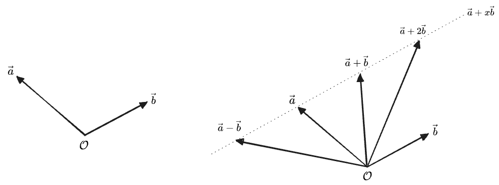
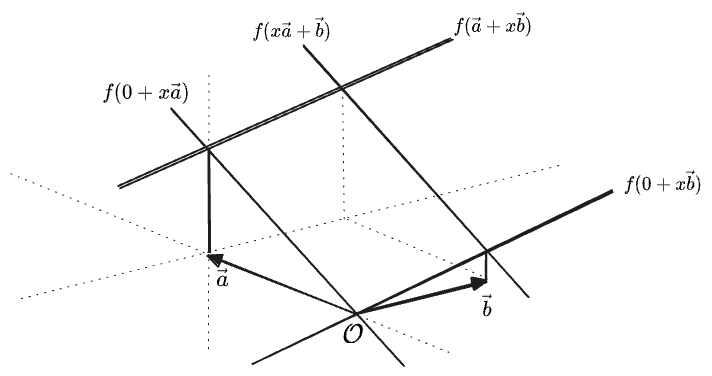
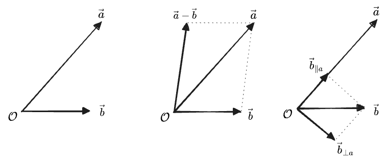
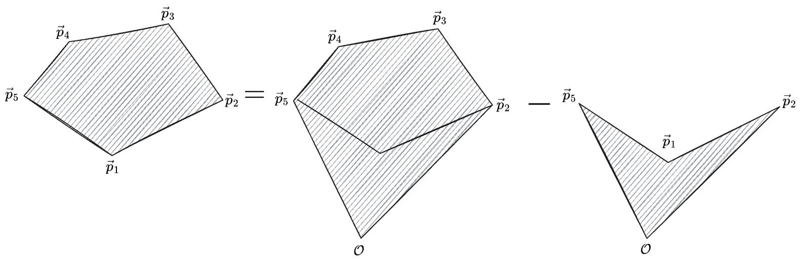
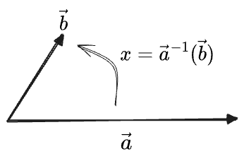
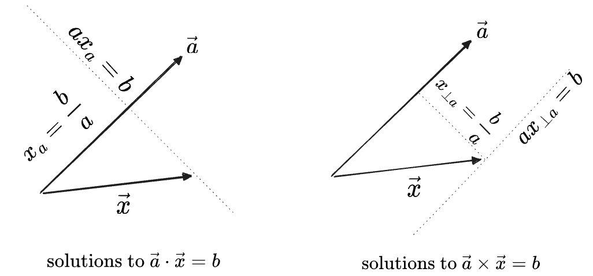

## Table of Contents

# Introduction 

This post is part one of an experimental course in linear algebra. It will differ from the conventional treatment in a number of ways. Primarily:
* in the use of "generalized inverses", introduced initially to implement an analog of "division" for the dot and cross products.
* in the use of geometric and graphical arguments throughout, in preference to proofs and especially to matrix-based derivations.
* in the use of exterior algebra and wedge products, with goal of making the determinant, when it arrives, completely trivial.
* in the use of unconventional notations for the atomic operations out of which more complex operations (like matrix inversion) will be defined.

The level of technicality will be inconsistent. This is not intended to *be* pedagogical, but rather to develop the ideas which would be in a pedagogical treatment in a logical order, while justifying the various decisions and notations. These discussions will tend to be more technical, but after they are all stripped away, the ideal result would be a course which could plausibly be taught at a _late-high-school_ level—a high bar, or a low one, I suppose. 

We begin with the simplest case.

# I. One Dimension

## Vectors

Behold a "vector":

For now I'll notate this as $$\to$$. 

We can make a longer vector by doubling it:

$$
(\longrightarrow) = 2 \times (\to)
$$

This is the same as adding $$\to$$ to itself: 

$$
(\longrightarrow) = (\to) + (\to)
$$

We can easily imagine multiplying $$\to$$ by any number $$c$$, giving a new vector $$c(\to)$$, which can be longer or shorter than the original vector. In this context we call the number $$c$$ a "scalar", because it "scales" vectors. 

There's no reason $$c$$ can't be negative too, reversing the direction:

$$
(-2)(\to) = (\longleftarrow)
$$

Then we can add and subtract these, which simply adds or subtracts their coefficients:

$$
a ( \to ) + b ( \to ) = (a + b)(\to)
$$

Therefore $$0(\to) = (\to) - (\to)$$ must be a valid vector too, which we'll just call "zero" or the "zero vector", written as $$0$$.

We can divide by a constant, which just acts on the coefficient

$$
\frac{a ( \to )}{2} = \frac{a}{2}( \to )
$$

We can even divide two vectors by each other, as long as the denominator isn't zero: 

$$
\frac{b ( \to )}{a ( \to )} = \frac{b}{a}
$$

If one is reversed, we get the negative:

$$
\frac{b ( \leftarrow )}{a ( \to )} = \frac{-b ( \to )}{a ( \to )} = -\frac{b}{a}
$$

(Note: this notion of dividing vectors is the first of many unconventional things in this post.)

The set of all of multiples of this single vector $$\to$$ is what we'll call a "vector space". Calling this space $$V$$, we can write it as the "set of all linear combinations of $$\to$$", along with the operations we've described, that is:

$$
V = \{ a (\to) \mid a \in \mathbb{R}\}
$$

This $$V$$ is one-dimensional: all of the vectors are multiples of a single vector $$\to$$, making it more of a "line" than a "space".

Note we can also get the same vector space $$V$$ by starting with any other vector in the same space, say, $$(\longleftarrow) = -2 (\to)$$, because any multiple of the first $$a(\longleftarrow)$$ can be written in terms of the second $$-2a (\to)$$. So the two are equal as sets:

$$
\{ a (\longleftarrow) \mid a \in \mathbb{R}\} = \{ a (\to) \mid a \in \mathbb{R}\} = V
$$

We can see this construction as an operation "$$\mathrm{vectorize}$$" which gives the same set for both elements:

$$
\mathrm{vectorize}(\longleftarrow) = \mathrm{vectorize}(\to) = V
$$

And in fact, apparently, it hardly matters what the vectors in the space are multiples _of_—the important feature of this  "vector space" $$V$$ is the coefficients, which give it the same structure as the real numbers $$a \in \mathbb{R}$$. 

We can therefore "vectorize" any single object and get a vector space with the same structure as $$V$$, for example, an apple or orange.
We won't go so far as to say that the spaces $\mathrm{vectorize}(\unicode{x1F34F}\:)$ and $\mathrm{vectorize}(\unicode{x1F34A}\:)$ are the same space, though—they only have the same structure. But we *will* identify the vector spaces generated by $$\longleftarrow$$ and $$\to$$ as the same space—this is possible because we additionally have asserted that these objects have an *innate* relationship; each is a multiple of the other according to $$(\longleftarrow) = -2 (\to)$$.

## Length

Now, what is the length of this arrow $$\to$$? 

Well, it's $$1$$ of, uh, whatever the length of $$\to$$ is. Clearly our second vector above has twice its length: 

$$\vert \longleftarrow \vert = 2 \vert \to \vert$$ 

And any constant multiple $$a(\to)$$ will have $$a$$-times the length, e.g.:

$$
\vert 3 (\to) \vert = 3 \vert (\to) \vert
$$

Maybe we think of $$\vert (\to) \vert$$ as having length "1 meter" and our $$\to$$ as a meter stick. But we can just as easily measure in inches instead. We could use any vector in the space to measure the others. For example, our long-left-arrow $$\vert \longleftarrow \vert$$ would produce lengths which are half as large:

$$
{\vert 3 (\to) \vert}_{\longleftarrow} 
= {\vert 3 (-\frac{1}{2}) (\longleftarrow) \vert}_{\longleftarrow} 
= \frac{3}{2} {\vert (\longleftarrow) \vert}_{\longleftarrow} 
= \frac{3}{2}

$$

A vector, then, has no _inherent_ length—not until we pick some reference vector to measure it with. Then its length carries "units" of that unit length. (The zero vector $$0$$, however, does have an innate length of zero.) 

Given our one-dimensional vector space $$V$$, you could choose any specific vector (like $$\to$$ or $$\longleftarrow$$), declare that it has length "1", and this would give a length for every other vector. Note that for any choice, there will be exactly two vectors in our 1D vector-space with that length. It's still just a number line. When you think of a vector space you should really not think of "things with lengths"—the vectors *themselves* are just dumb arrows that can be added and scaled; which one has length $$1$$ is really an additional choice you get to make—it's no more "inherent" to the vectors themselves than the choice of whether to measure length in meters vs. inches.

## Multiplication

Above, we demonstrated the following operations:
* vector times scalar $$c(\to)$$, giving a vector.
* vector divided by scalar, giving a vector.
* vector divided by (nonzero) vector, giving a scalar, as in $$\frac{b ( \to )}{a ( \to )} = \frac{b}{a}$$

What's missing is the multiplication of two vectors. The obvious definition would be:

$$
(a (\to)) \times (b(\to)) = (ab) {(\to)}^2
$$

but we get something that is neither a multiple of $$\to$$, _nor_ a scalar. Instead it has two units of $$(\to)$$; if our original vector $$\to$$ had represented meters, then this new thing has units of "meters squared". Its length in units of $$(\to)^2$$ is just $$(ab)$$, and, since we noted above that it doesn't matter what you created your vector space _out of_, you could easily assign this new vector to a vector space:

$$
(a (\to)) \times (b(\to)) = (ab)(\to)^2 \in \mathrm{vectorize}((\to)^2)
$$

This seems sensible enough, but we'll have to see if it's useful. 

# II. Two Dimensions

## Two Dimensional Vectors

So far our vectors aren't very interesting: they act just like the real numbers $$\mathbb{R}$$, and the arrow $$\to$$ is just a strange "unit" for these numbers. We'll have to add another dimension to make vectors meaningfully distinct from numbers.

Now imagine we start with two objects. Unlike $$\to$$ and $$\longleftarrow$$ above, we assume the two objects are _unrelated_ to each other; they could as well stand for "apples" and "oranges" or anything else. We will draw them as arrows in two perpendicular directions:

We'll notate these as, what else, $$\rightarrow$$ and $$\uparrow$$, for now.

Now, clearly we could create a one-dimensional vector space out of _either_ of these individually, with all of the properties defined above. The two spaces would be:

$$
\begin{aligned}
(\to) &\in \{ a(\to) \mid a \in \mathbb{R}\} 
\\
  &= \mathrm{vectorize}(\to)\\
  &= V_1\\
(\uparrow) &\in \{ a(\uparrow) \mid a \in \mathbb{R}\} \\
  &= \mathrm{vectorize}(\uparrow) \\
  &= V_2\\
\end{aligned}
$$

It's easy to imagine the next step: we create a single space out of both vectors by considering any linear combination of the two, i.e.

$$
\begin{aligned}
V &= \{ a(\to) + b(\uparrow) \mid a \in \mathbb{R}, b \in \mathbb{R} \} \\
 &= \mathrm{vectorize}(\to, \uparrow)
\end{aligned}
$$

Some elements of $$V$$ include:

$$
\begin{aligned}
\to &&&& \uparrow\\
0 &&&& -3(\to) + (\uparrow) \\
(\nearrow) = (\to + \uparrow) &&&& (\searrow) = (\rightarrow - \uparrow) = (\rightarrow + \downarrow)
\end{aligned}
$$

Of course, we get a unique vector for each ordered pair $$(a, b)$$. So this vector space has the same structure as the two-dimensional coordinate plane: one vector for each point, one point for each vector.

## Components

If we have some arbitrary vector in our two-dimensional $$V$$, like $$\nearrow$$, we can decompose it into a "component" along each of $$\to$$ and $$\uparrow$$ individually. Here it's 

$$(\nearrow) = 1(\to) + 1(\uparrow)$$

Because no amount of $$\to$$ can ever point upward or downward, and no amount of $$\uparrow$$ can ever point rightward or leftward, there must only be one way to represent any given vector as a sum $$(a, b)$$ of our original two generating vectors. These are the "projections" onto each of the original vectors, which we write:

$$
\begin{aligned}
{(\nearrow)} &= {(\nearrow)}_{\to} (\to) + {(\nearrow)}_{\uparrow} (\uparrow) \\
 &= 1(\to) + 1(\uparrow)
\end{aligned}
$$

At this point all these arrows are cumbersome, so we'll switch to a normal notation. Henceforth we write vectors as $$\vec{v}$$ and will refer to our original two arrows as:

$$
\begin{aligned}
(\to) = \vec{e}_1 &&& (\uparrow) = \vec{e}_2
\end{aligned}
$$

We'll write the projection of $$\vec{v}$$ onto $$\vec{e}_1$$ as $$v_1$$. Then the above reads, for $$\vec{v} = (\nearrow)$$:

$$
\vec{v} = 1 \vec{e}_1 + 1\vec{e}_2
$$

Now, we originally constructed this vector space out of our two vectors $$\vec{e}_1 = (\to)$$ and $$\vec{e}_2 = (\uparrow)$$. In one-dimension we observed that we could have generated the whole line by starting with any single arrow. In 2D, likewise, any pair of vectors which are not parallel could be used to generate the entire plane. Any such pair is called a "basis", for example, two other bases would be:

$$
\begin{aligned}
\vec{x} = (\longrightarrow) = 2\vec{e}_1 &&& \vec{y} = (\downarrow) = -\vec{e}_2\\
\vec{s} = (\nwarrow) = -\vec{e}_1 + \vec{e}_2 &&& \vec{t} = (\nearrow )= \vec{e}_1 + \vec{e_2}
\end{aligned}
$$

and the components of the same $$\vec{v}$$ in the bases from before would be:

$$
\begin{aligned}
\vec{v} &= \frac{1}{2} \vec{x} -1 \vec{y} \\
\vec{v} &= 0 \vec{s} + 1 \vec{t}  = \vec{t}\\
\end{aligned}
$$

Therefore the set of numbers describing the specific vector, such as $$(1, 1)$$ or $$(1/2, -1)$$, are the "coordinates of the vector in the basis" and depend on the choice of basis. 

Any "basis" of $$V$$, then, consists of a set of vectors which "span" $$V$$, in that any vector in $$V$$ can be written *uniquely* as a linear combination of the basis vectors. All bases of $$V$$ have the same "dimension", which is just the definition of dimension. Here, $$\text{dim } V = 2$$. 

We will always think of a vector as being a fundamentally "geometric" object, rather than a "set of coordinates"—the coordinates are a description of the vector *in a basis*. A basis, then, can be thought of as a "lens" we can look at the space through. Many such lenses are possible, and not all see the space the same way, but the space also has inherent properties that do not depend on the lens we use.

## Length

In one dimension we observed that our vectors had no "inherent" length. But we were able to define the length of a vector in "units" of some standard vector. Choosing $$(\to)$$ as this standard vector, we can write things like:

$$
\begin{aligned}
\vert \longrightarrow \vert &= 2 \vert \to \vert\\
\vert 2 \vec{e}_1 \vert & = 2 \vert \vec{e}_1\vert
\end{aligned}
$$

But we could just as easily choose $$(\longrightarrow)$$ as the standard, in which case the two vectors in the example would have lengths of 1 unit only.

Clearly we could do the same for any individual direction in two dimensions.

Now, how should we define the length of a two-dimensional vector in general? The obvious answer is to assert that some pair of two basis vectors both have length "1". The obvious choice are the two vectors we originally used to build the space $$V$$:

$$
\begin{aligned}
\vert \uparrow \vert = \vert \to \vert = 1\\
\vert \vec{e}_2 \vert = \vert \vec{e}_1 \vert = 1
\end{aligned}
$$

Once two unit vectors are chosen we can define a length by a standard Pythagorean theorem:

$$
\vert a \vec{e}_1 + b \vec{e}_2 \vert = \sqrt{a^2 + b^2}
$$

But, just as in 1D, we could as easily choose some other set of vectors to be the "unit" of length, such as $$\longleftarrow$$. Then if we choose $$\vert \uparrow \vert = \vert \longleftarrow \vert = 1$$, which is $$\vert \vec{e}_2 \vert = \vert (-2)\vec{e}_1 \vert = 1$$, then the Pythagorean length of a generic vector would be:

$$
\vert a \vec{e}_1 + b \vec{e}_2 \vert = \left\vert \left(-\frac{1}{2}\right) (-2) \vec{e}_1 + b \vec{e}_2 \right\vert  = \sqrt{ {\left(\frac{a}{2}\right)}^2 + b^2}
$$

Therefore the "lengths" of vectors are only defined up to choice of basis. And, while it might seem like $$\vec{e}_1 = (\to)$$ and $$\vec{e}_2 = (\uparrow)$$ are the natural choices to define as length "1", there is actually nothing special about these vectors that makes them equal in length—they do not *inherently* even have a length, except for the fact that I've chosen to represent both with equal-length arrows in my notation.

If you define $$-2\vec{e}_1 = (\longleftarrow)$$ to have length 1, then so it is, and now $$\vec{e}_1$$ has length $$\frac{1}{2}$$ in these units. This transformation would squash the "circle of vectors of length 1" in half in one direction, but the overall *structure* of the vector space is unchanged. 

The concept of length is not actually necessary to work with vectors at all. While all the vectors we'll consider are naturally lengthed, it might make more sense to do without if considering, for example, a vector space of "apples" and "oranges".

We will again aim to view our vectors as "geometric" or "graphical" objects, and therefore will not consider any vector to have an *inherent* length, except in view of a particular set of reference vectors—just as we did not consider vectors to have inherent coordiantes, except wth respect to a basis.

The operation of "length" then can be seen as an act of "measurement" with respect to a set of unit-length reference vectors. This choice of reference vectors we call a choosing a "metric". Just like choosing a "basis", the choice of "metric" acts like a lens through which the vector space can be viewed and described. In the simplest cases, the chosen basis consists of unit-length vectors, which is the case when we use $$\vec{e}_1, \vec{e}_2$$. But in general the two choices are independent—you could measure length relative to $$\vert \vec{e}_1 \vert = \vert \vec{e}_2 \vert = 1$$, while representing your vectors in terms of $$\vec{s} = -\vec{e}_1 + \vec{e}_2$$ and $$\vec{t} = \vec{e}_1 + \vec{e_2}$$., which each would have length $$\sqrt{2}$$. Then $$\vec{v} = 1\vec{t}$$ would have length $$\sqrt{2}$$ rather than 1. So, in general, the *metric* and *basis* can be chosen or varied independently. Varying the basis is more common; in most instances the "metric" is simply taken to be some obvious choice and is not discussed directly. You rarely think about *changing* the metric until you're working at a pretty advanced level.

Often we simplify the whole description by considering bases comprised of *perpendicular* and *unit-length* vectors, i.e., "orthonormal bases". Then the lengths of all vectors can be equally well measured in *any* orthonormal basis using a Pythagorean theorem. 

We will often write the length of vector $$\vec{v}$$ as the same name without the vector notation, $$v$$. (This rule will only apply when no subscripts are involved, which we'll see in a moment.) Then we write the unit-length vector parallel to $$\vec{v}$$ with a hat as $$\hat{v} = \vec{v}/v$$. As an example, the above $$\vec{s}, \vec{t}$$ basis becomes:

$$
\begin{aligned}
\vec{s} = s\hat{s} = \sqrt{2} \frac{-\vec{e}_1 + \vec{e}_2}{\sqrt{2}} &&& \vec{t} = t\hat{t} = \sqrt{2} \frac{\vec{e}_1 + \vec{e}_2}{\sqrt{2}}
\end{aligned}
$$

And in the $$\hat{s}, \hat{t}$$ basis we have our earlier $$\vec{v} = \vec{t} = \sqrt{2}\hat{t}$$.

For the rest of this post we'll stick to a standard metric which takes the two vectors $$\vec{e}_1, \vec{e}_2$$ as having "unit length", and we'll notate them with hats $$\hat{e}_1, \hat{e}_2$$ to indicate this.

## Projection and Rejection

We've been writing the same vector $$\vec{v}$$ in a few different bases—using unit-vector bases for now, we had:

$$
\begin{aligned}
\vec{v} &= 1 \hat{e}_1 + 1 \hat{e}_2 =  0\hat{s} + 1 \hat{t}
\end{aligned}
$$

We'll now start writing this decompositions generically, in terms of subscripted constants $$v_1, v_2, v_s, v_t$$:

$$
\begin{aligned}
\vec{v} &= v_1 \hat{e}_1 + v_2 \hat{e}_2 = v_s \hat{s} + v_t\hat{t}
\end{aligned}
$$

Clearly $$(v_1, v_2)$$ are the coordinates of $$\vec{v}$$ in the basis of $$\hat{e}_1, \hat{e}_2$$, and this holds for any vector. We'll use numeric subscripts like $$v_i$$ only for the bases named like $$\hat{e}_i$$. These subscripts will always be defined relative to _unit_ basis vectors. While it might seem more natural to define $$v_s$$ such that $$\vec{v} = v_s \vec{s} \ldots$$, this makes the scalar $$v_s$$ be unitless, which seems to cause to confusion. Instead we'll adopt the convention that a subscript applied to the name of a vector never changes its "units". If $$\vec{v}$$ is in meters, then so is $$v_1$$. 

We can generalize "the component along..." to any pair of vectors. For $$\vec{v}, \vec{a}$$:
* $$v_a$$ is the "scalar projection of $$\vec{v}$$ onto $$\vec{a}$$"; the component of $$v$$ along $$\hat{a}$$. Read this as "$$v$$-along-$$a$$" or "$$v$$-sub-$$a$$".
* $$\vec{v}_{\parallel a}$$ is the "vector projections of $$\vec{v}$$ onto $$\vec{a}$$", which is the vector $$v_a \hat{a}$$. Read this as "$$v$$-parallel-$$a$$".

Here we are making a distinction between the object named "$$\vec{a}$$" and the object $$\parallel a$$ which we intend to represent the "oriented line" along which $$\vec{a}$$ points—this line knows about the direction of $$a$$ but not its length; clearly this is all we need to define a projection. We will likewise use $$\perp a$$ to refer to the oriented line rotated $$90^\circ$$ from the direction of $$\parallel {a}$$. We will treat these "line"-typed objects more thoroughly when in higher dimensions.

Graphically:

In each case we find a projection by "dropping a line" from the end of one vector until it meets the line of the other vector at a right angle. Note that $$\vec{v}_{\parallel a}$$ is a scalar multiple of $$\vec{a}$$; the exact ratio is $$\vec{v}_{\parallel a} = \frac{v_a}{a}\vec{a}$$, with $$v_a$$ being positive or negative.

If we know the angle $$\theta$$ between the vectors, then the projection vectors and their lengths are:

$$
\begin{aligned}
\vec{v}_{\parallel a} = v_a \hat{a} = (v \cos\theta) \hat{a} =  \frac{v \cos \theta }{a}\vec{a} 
&&& \vec{a}_{\parallel v} = a_v \hat{v} = (a \cos\theta) \hat{v} = \frac{a \cos \theta }{v} \vec{v} \\
\vert \vec{v}_{\parallel a} \vert = v \cos \theta &&& \vert \vec{a}_{\parallel v} \vert = a\cos \theta
\end{aligned}
$$

The terms "projection" and "component" are mostly interchangeable. We will typically use "component" when referring to a "projection on a basis vector", whereas "projection" is an operation between any two vectors. One also sees the notations $$\vec{v}_{\parallel a}$$ and $$\text{proj}_a \vec{v}$$ for the projection.

When the vector $$\vec{a}$$ is one of our numbered basis vectors $$\hat{e}_i$$, we will write the projections themselves with numbers $$v_1$$. When the target of the projection is a unit vector, we will also sometimes omit the $$\parallel$$ symbol, writing $$\vec{v}_1$$ or $$\vec{v}_x$$, since in this case vector projection can be written in terms of the scalar projection as $$\vec{v}_x = v_x \vec{x} = v_x \hat{x}$$. The "components of a vector in a basis" are then just the projections onto each basis _unit_ vector.

Given the projection $$\vec{v}_a$$, we can also define the "rejection" of $$\vec{v}$$ with $$\vec{a}$$, which we will write as either:
* $$\vec{v}_{\perp a}$$, which reads as "$$v$$ perpendicular to $$a$$", or just '$$v$$-perp-$$a$$". 
* $$\vec{v}_{\not{a}}$$, read as "$$v$$-not-$$a$$" 

The $$\bot a$$ notation should be read as "projection onto the line perpendicular to $$\vec{a}$$", with $$\perp \vec{a}$$ being, here, the "oriented line" rotated $$90^\circ$$ from the direction of $$\vec{a}$$, which is then being used as the argument to the *projection* operation. It will be helpful later to also define the *vector* $$\vec{a}_\perp$$ as vector $$\vec{a}$$ rotated by $$90^\circ$$; i.e. the vector of the same length as $$\vec{a}$$ along the line $$\perp a$$. This vector is depicted in the diagrams below. Clearly the rejection could be defined as projection onto either of $$\perp a$$ or $$\vec{a}_\perp$$, but the former is more general.

The $$\not a$$ notatio,n on the other hand, conveys the sense of "rejection" by the vector $$\vec{a}$$ itself. In higher dimensions this object $$\bot \vec{a}$$ will no longer be a vector, and the equivalence of the two definitions will be less trivial, but for now they mean the same thing.

The definition of "rejection" is just "whatever's left after projection":

$$
\begin{aligned}
\vec{v}_{\bot a} = \vec{v}_{\not{a}} = \vec{v} - \vec{v}_{\parallel a} &&& \vec{a}_{\bot v} = \vec{a}_{\not{v}} = \vec{a} - \vec{a}_{\parallel v}
\end{aligned}
$$

Graphically:

We can also define a scalar rejection, in terms of the angles shown in the graphic:

$$
\begin{aligned}
v_{\bot a} = v \sin \theta &&& a_{\bot v} = a\sin \theta
\end{aligned}
$$

Note that again the scalar rejection is _not_ simply the length of the vector rejection, because it can be negative. Instead we have, using $$\vec{a}_\bot$$ now:

$$
\begin{aligned}
\vec{v}_{\bot a} &= v_{\bot a} \hat{a}_{\bot}\\
\vert \vec{v}_{\bot a} \vert &= \vert v_a \vec{a}_\bot\vert = \vert v_a \vert = \vert v \cos\theta \vert
\end{aligned}
$$

Here we can see the projection and rejection together:

In each case the projection and rejection together are two sides of a triangle, and their sum gives the original vector. Therefore we can write a Pythagorean theorem relating their lengths:

$$
\begin{aligned}
v^2 &= {\vert \vec{v}_{\parallel a} \vert}^2 + {\vert \vec{v}_{\perp a} \vert}^2 
&&&
a^2 &= {\vert \vec{a}_{\parallel v} \vert}^2 + {\vert \vec{a}_{\perp v} \vert}^2 
\\

v^2 &= v_a^2 + v_{\perp a}^2 
&&&
a^2 &= a_v^2 + a_{\perp v}^2 
\end{aligned}
$$

We will be able to give more useful definitions for the projection and rejection, not making use of $$\theta$$ once we introduce some additional tools. (Arguably we have not really yet defined what angles mean at all.)

# Vector Multiplication

Our definitions of multiplication or division by a scalar will carry over directly from the 1D case. We have, for some $$\vec{v} = v_1 \hat{e}_1 + v_2 \hat{e}_2$$:

$$
\begin{aligned}
b\vec{v} = (bv_1) \hat{e}_1 + (bv_2) \hat{e}_2 &&& 
\frac{1}{b}\vec{v} = \frac{v_1}{b} \hat{e}_1 + \frac{v_2}{b} \hat{e}_2
\end{aligned}
$$

But how should we define multiplication or division between two vectors?

In one dimension it was simple enough; for $$\vec{a} = a \hat{e}_1$$ and $$\vec{b} = b\hat{e}_1$$ we found that the obvious definitions were:

$$
\begin{aligned}
(\vec{a})(\vec{b}) = ab(\hat{e}_1)(\hat{e}_1) &&& \frac{\vec{a}}{\vec{b}} = \frac{a}{b}
\end{aligned}
$$

The thing $$(\hat{e}_1)(\hat{e}_1)$$ we could assign a sense like "square meters". Or we could simply shave it off and call this the number $$ab$$, since one-dimensional vectors act just like regular numbers.

This might work in 1D, but for higher dimensions We will want to be more thorough. We'll start by asking: what properties should the multiplication of two vectors obey?
1. Multiplication ought to reduce to the obvious definitions in simple cases—otherwise it's not really "multiplication"! The two "familiar" senses of multiplication of $$ab$$ are:
	* The length of a line consisting of $$a$$ copies of $$b$$, or $$b$$ copies of $$a$$.
	* The area of a rectangle with sides $$a$$ and $$b$$
2. The multiplication operation ought to play nicely with the "linear combinations" we used to define vectors in the first place. Multiplication of numbers distributes like $$a(b+c) = ab + ac$$, and it seems sensible that a similar "distributive property" hold over combinations of vectors. If we call the undefined operation $$\circ$$ for the time being, we want:

    $$
    \begin{aligned}
    ((x+y)\vec{a}) \circ \vec{b} &= (x\vec{a}) \circ \vec{b} + (y\vec{a}) \circ {\vec{b}} \\
      &= x(\vec{a} \circ \vec{b}) + y(\vec{a} \circ {\vec{b}}) \\
    & = \vec{a} \circ ((x + y) \vec{b})\\
    &= (x + y)(\vec{a} \circ \vec{b}) \\
    (\vec{a} + \vec{b}) \circ \vec{v} &= \vec{a} \circ \vec{v} + \vec{b} \circ \vec{v}
    \end{aligned}
    $$

   Taken together we will call these properties "linearity". 
3. The value we get for multiplication ought to depend on the exact vectors involved, and on the fact that they are vectors at all. We could just define multiplication to simply multiply the *lengths* of the vectors, like $$\vec{a} \circ \vec{b} = ab$$, which obviously means *something*. But this doesn't even care that they're vectors; they could as well just be numbers.
4. If possible, multiplication should be a purely *geometric* operation, defined in terms of the vectors themselves without reference to a choice of basis, and if possible, a choice of metric—although it seems likely that this second condition won't be possible, since both simple cases in condition (1) make explicit reference to "length".

Of all of these properties, the first is the most intuitive, so we'll start there.

## Linearity

We gave two "senses" of the multiplication of numbers: "$$b$$ copies of $$a$$", which clearly ought to give $$ab$$ for two parallel vectors, and the "area of a rectangle", which naturally equals $$ab$$ for two perpendicular vectors.
The simplest multiplication operation giving both of these would just be to multiply the *lengths* of the two vectors, i.e. $$\vec{a} \circ \vec{b} = \vert a \vert \vert b \vert$$. But this doesn't conform to condition 3—it doesn't really care that these two vectors are vectors at all; it simply treats them as numbers without a meaningful sense of "direction".

Let's suppose instead that we have one multiplication operation which gives the prescribed results for parallel and perpendicular vectors, and now let us ask what "linearity" tell us about its value on any other pair of vectors. We'll first illustrate how linearity works in practice with a simple graphical example:

In the image above, we have chosen two vectors $$\vec{a}, \vec{b}$$, and then drawn the line of vectors you would get if you added various multiples of $$\vec{b}$$ to $$\vec{a}$$, with the cases of $$\vec{a} + 2\vec{b}$$ and $$\vec{a} - \vec{b}$$ shown. If we now imagine some arbitrary "linear" function of vectors $$f(\vec{x})$$, then linearity requires that 
 $$f$$ vary _linearly_ as we slide its argument $$\vec{x}$$ along any line in space, which we can visualize as a "graph" of $$f(\vec{x})$$ floating over the plane of the vectors:

This should hold for *any* vector $$\vec{b}$$; the condition is that "varying the argument $$\vec{x}$$ along any line produces *some* linear change in the value of $$f(\vec{x})$$". The slope of this line is $$f(\vec{b})$$, as we can see if we expand write the linearity condition out, with $$\lambda$$ representing the number of copies of $$\vec{b}$$ to add to $$\vec{a}$$:

$$
f(\vec{a} + \lambda \vec{b}) = f(\vec{a}) + \lambda f(\vec{b})
$$

And actually, this tell us more; it also means that $$f(0) = 0$$. Apparently, if we know $$f(\vec{a}), f(\vec{b})$$ for two non-parallel vectors, then we know $$f$$ everywhere:

Linearity, then, is a very strong condition: the only thing a linear function on the 2D plane can do is "tilt" the plane, as can be seen in the above diagram.

Now, having established the geometric meaning of "linearity", we can ask what it means for "multiplying two vectors" to be linear in *each* argument.
If we fix one vector $$\vec{a}$$, then $$\vec{a} \circ \vec{b}$$ can be thought of as a function of just the second vector $$\vec{b}$$: $$f(\vec{b}) = \vec{a} \circ \vec{b}$$. Then our "intuitive" senses of multiplication suggests that the new $$f$$ should produce the "natural" value $$ab$$ when the second vector is exactly equal to *one of* the two vectors with some length $$b$$ and oriented either parallel or perpendicular to $$\vec{a}$$, that is, when $$\vec{b} = b\hat{a}$$ and $$\vec{b} = b\hat{a}_\perp$$.

If we linearly interpolate *between* those exact two vectors, then the value of $$\vec{a} \circ \vec{b}$$ must vary linearly between $$ab$$ and... $$ab$$:

But the only way for this to be linear is if the value *does not vary* along the line at all. Then we immediately know the value everywhere else, because $$f(0)$$ has to be zero, and we get a function that increases along the line $$\vec{a} + \vec{a}_\perp$$ and is constant along the line perpendicular to this:

... well, apparently this *is* a function we could define. But it doesn't look like a particularly useful one—except for the values $$ab$$ we started with, and $$-ab$$ for the opposite orientations, the other values don't admit any obvious interpretation.

Let's step back. Maybe those two conditions on the products of parallel and perpendicular vectors don't need to be cases of the *same* operation. We can instead define *two* multiplication operations, each in terms of projections:

1. One which multiplies the parallel components of vectors, $$\vec{a}, \vec{b} \mapsto a b_a = a_b b$$, which we will write as $$\vec{a} \cdot \vec{b}$$ and reas as a "dot product". This is a natural generalization of the multiplication of two _one_-dimensional vectors; we simply ignore the rest of the space!
2. One which multiplies the perpendicular components of vectors, $$\vec{a}, \vec{b} \mapsto a b_{\perp a} = -a_{\perp b} b$$ which we will write as $$\vec{a} \times \vec{b}$$, read as "cross product". This is the natural generalization of the sense of multiplication producing an "area".

Visualizing these as linear functions of the $$\vec{b}$$ argument, relative to some fixed $$\vec{a}$$, we see that they "tilt" the plane either along $$\vec{a}$$ or perpendicular to it—more natural, I think, than the peculiar diagonal-tilting function we came up with before. 

## Multiplication 1: The Dot Product

The "dot" product needs to multiply the lengths of vectors that are parallel. The simplest way to define an operation $$\vec{a} \cdot \vec{b}$$ that does this is to to multiply the length of $$a$$ by the projection of $$\vec{b}$$ onto $$\vec{a}$$, i.e.:

$$
\vec{a} \cdot \vec{b} = a b_a
$$

What about the opposite projection, $$b a_b$$? If we cite the definition in terms of $$\cos \theta$$ from earlier, we see that these are equal:

$$
\vec{a} \cdot \vec{b} = a b_a = b a_b =  ab\cos{\theta}
$$

So we ought to think of this product as a "symmetric projection"—it is a projection which incorporates _both_ lengths, and doesn't care which one you projected onto the other or the order of the two arguments. In all we have a few names:
* "dot product"
* "symmetric multiplication"
* "symmetric projection"
* or a "scalar product", because it produces a scalar, although in two dimensions $$\vec{a} \times \vec{b}$$ will *also* give a scalar, so this won't be very helpful.
* "inner product"

If we don't want to use $$\cos \theta$$, perhaps believing we pulled that out of a hat, then we'll have to find another way to write in terms of a basis $$\hat{e}_1, \hat{e}_2$$.

We do some geometry: first, draw $$\vec{a}, \vec{b}$$, and their difference $$\vec{a}-\vec{b}$$, which connects the tip of $$\vec{b}$$ to that of $$\vec{a}$$ since $$\vec{a} = \vec{b} + (\vec{b}-\vec{a})$$.

To get the component of $$\vec{b}$$ along $$\vec{a}$$, we run a line from $$b$$ to get $$\vec{b}_a$$. The line we ran is $$\vec{b}_{\bot a}$$. This makes two triangles, which share a side $$\vec{b}_{\bot a}$$. We can write out a Pythagorean theorem for each of them:

$$
\begin{aligned}
b^2 &= {\vert \vec{b}_{\parallel a}\vert}^2 + {\vert \vec{b}_{\bot{a}}\vert}^2 \\
{\vert (\vec{a}-\vec{b}) \vert}^2 &= {\vert (\vec{a} - \vec{b}_{\parallel a} )\vert}^2 + {\vert \vec{b}_{\bot{a}}\vert}^2 \\
\end{aligned}
$$

Both of these equations have a term $${\vert \vec{b}_{\bot{a}}\vert}^2$$, so we can eliminate this. We get, using $${\vert \vec{b}_{\parallel a}\vert}^2 = b_a^2$$:

$$
\begin{aligned}
b^2 - b_a^2 = {\vert (\vec{a}-\vec{b}) \vert}^2 - {\vert (\vec{a} - \vec{b}_{\parallel a} )\vert}^2 \\
\end{aligned}
$$

The last term is the (square of (length of (difference of two _collinear_ vectors))), so we can write it as the difference of their lengths only, which allows us to carry out the multiplication:

$$
\begin{aligned}
{\vert (\vec{a} - \vec{b}_{\parallel a}) \vert}^2  &= {(a - b_a)}^2 \\
&= a^2 + b_a^2 - 2 a b_a
\end{aligned}
$$

And—there appears the exact product we're looking for. Solving for $$2 a b_a$$, and leaving the 2 for now, we can plug in the previous equation, giving:

$$
\begin{aligned}
2a b_a &= a^2 + b_a^2 + b^2 - {\vert \vec{b}_{a}\vert}^2 - b_a^2 \\
&= a^2 + b^2 - {\vert (\vec{a}-\vec{b}) \vert}^2 
\end{aligned}
$$

We're close. The last term can be expanded in terms of $$\hat{e}_1, \hat{e}_2$$ components. We do some algebra:

$$
\begin{aligned}
2 a b_a  &= a^2 + b^2 - {(a_1 - b_1)}^2 - {(a_2 - b_2)}^2 \\
 &= a^2 + b^2 - (a_1^2 + b_1^2 - 2a_1 b_1) - (a_2^2 + b_2^2 - 2a_2 b_2)  \\ 
 &=  a^2 + b^2 - (a_1^2 + a_2^2) - (b_1^2 +  b_2^2) + 2(a_1 b_1 + a_2 b_2) \\
 &=  a^2 + b^2 - a^2 - b^2 + 2(a_1 b_1 + a_2 b_2) \\
 &= 2(a_1 b_1 + a_2 b_2)\\
ab_a &= a_1 b_1 + a_2 b_2
\end{aligned}
$$

And there it is, our "dot product" or "symmetric projection":

$$
\vec{a} \cdot \vec{b} = a b_a = b a_b = a_1 b_1 + a_2 b_2 = \vec{b}\cdot \vec{a}
$$

What we get is extremely easy to use—it takes only components, no angles at all. (It's certainly possible to derive this formula starting from the angle definition, but I don't feel like it adds any insight—not that the above mess of algebra is much better.)

We can do a lot with this. For one, we can write the squared-length of any vector as the dot with itself:

$$
v^2 = v_1^2 + v_2^2 = \vec{v} \cdot \vec{v}
$$

We discussed a lot of caveats about the definition of "length" above—have we now found "innate length" of a vector? No—the dot product depends on the choice of metric, since it is composed of vector lengths, and in fact the expression would be more complicated if our basis vectors were not unit-length.

We can also use a $$\cdot$$ to write the projection itself in a way that's easier to use:

$$
\vec{b}_{\parallel a} = b_a \hat{a} = \frac{\vec{a} \cdot \vec{b}}{a} \hat{a}
$$

Being a projection, the dot product gives zero for perpendicular vectors. Therefore $$\vec{a} \cdot \vec{b}$$ won't be affected if we add any multiple of a vector perpendicular to $$\vec{b}$$ to $$\vec{a}$$:

$$
\begin{aligned}
(\vec{a} + c \vec{b}_\perp) \cdot \vec{b} &= \vec{a} \cdot \vec{b} + c(\vec{b}_\perp \cdot \vec{b})\\
 &= \vec{a} \cdot \vec{b}
\end{aligned}
$$

Graphically, this says that all of these $$\vec{b}$$ vectors have the same projection $$\vec{b}_{\parallel a}$$, and therefore give the same value for $$\vec{a} \cdot \vec{b}$$:

Finally, we can use the other projection definition $$a b_a = ab\cos\theta$$ to derive the Law of Cosines by considering the triangle spanned by $$\vec{a}, \vec{b}, \vec{a} + \vec{b}$$:

$$
\begin{aligned}
{\vert \vec{a} + \vec{b}\vert}^2 &= a^2 + b^2 + 2 \vec{a} \cdot \vec{b}\\
 &= a^2 + b^2 + 2ab\cos\theta\\
\cos\theta &= \frac{ {\vert \vec{a} + \vec{b}\vert}^2 - a^2 - b^2}{2ab}
\end{aligned}
$$

The standard form of the Law of Cosines is found by renaming $$\vec{a} + \vec{b} \to \vec{c}$$ and $$\cos \theta \to - \cos \gamma$$, where $$\gamma = \pi - \theta$$ is the angle opposite $$\vec{a} + \vec{b} = \vec{c}$$:

$$
c^2 = a^2 + b^2 - 2 ab \cos \gamma \\
$$

The above expression could also be taken as the definition of $$\cos$$, if we hadn't assumed it in the first place.

## Multiplication 2: The Cross Product

Now, what about our other definition of multiplication, generalizing the "area of a rectangle"? Clearly the analogous multiplication formula is:

$$
\vec{a} \times \vec{b} = a b_{\perp a}
$$

To find this in components this, let's write $$\vec{b}_{\bot{a}} = \vec{b} - \vec{b}_{\parallel a}$$, and square both sides. We have:

$$
\begin{aligned}
 {( a b_{\perp a})} ^2 &= a^2 \left(b^2 - b_a ^2\right)
 & (b^2 = b_a^2 + b_{\perp a}^2 )
\\
  &= a^2 b^2 - {( \vec{a}\cdot\vec{b} )}^2
  & (a b_a= \vec{a} \cdot \vec{b})
\\
&={ 
  (a_1^2 + a_2^2)(b_1^2 + b_2^2) - {(a_1b_1 + a_2 b_2)}^2
}
\\
&= a_1^2 b_1^2 + a_2^2 b_1^2 + a_1^2 b_2^2 + a_2^2 b_2^2 - a_1^2 b_1^2 - 2a_1 b_1 a_2 b_2 - a_2^2 b_2^2
\\
&= a_2^2 b_1^2 + a_1^2 b_2^2 - 2a_1 b_1 a_2 b_2
\\
&= (a_1 b_2 - a_2 b_1)^2
\\
ab_{\perp a}  &= \sqrt{(a_x b_y - a_y b_x)^2} =  \pm (a_x b_y - a_y b_x)
\end{aligned}
$$

Clean. We get a result with a $$\pm$$ sign, and furthermore, we were trying to write an "area", but what we got can be negative. 
Well, our original "linearity" condition actually required that some areas come out negative; otherwise we couldn't have $$\vec{a} \times (\vec{b} - \vec{b}) = \vec{a}\times \vec{b} + (\vec{a} \times (-\vec{b}) = 0$$, because "$$(-\vec{b})$$" is just another vector; we could call this $$\vec{c}$$ and then we'd have $$\vec{a} \times \vec{b} = - \vec{a} \times \vec{c}$$. 

But apparently this also requires that flipping the arguments changes the sign, so we get:

$$
\begin{aligned}
\vec{a} \times \vec{b} &= - (\vec{b} \times \vec{a}) \\
a b_{\perp a} &= - b a_{\perp b}
\end{aligned}
$$

The second line holds because we have defined the $$\perp$$ "line" to a vector to be $$90^\circ$$ rotated from the original vector. But this means that one of $$a_{\perp b}, b_{\perp a}$$ must point opposite to the original $$a, b$$, giving a minus. This product, then, is "antisymmetric", and one name for it will simply be the "antisymmetric product". Another name might be the "area" or "areal" product—this would avoid some of the confusion that sets in with cross products, I think. 

So these are "signed" or "oriented" areas; the sign depends on the order you choose the vectors around the rectangle:

You can always take an absolute value if you need the literal area.

The $$\pm$$ means that this multiplication can be defined with *either* sign and will be self-consistent in either case. We'll choose the positive sign, which for vectors $$\vec{a} = a\hat{e}_1$$ and $$\vec{b} = b\hat{e}_2$$ can be seen to give a positive area when the arguments sweep from $$\hat{e}_1 \to \hat{e}_2$$. On a usual coordinate plane this is a counterclockwise orientation. This is consistent with $$ab_{\perp a} = ab \sin \theta$$ for $$\theta$$ having the usual orientation around the unit circle.

We have been casually using $$\vec{a}_\bot$$ for a vector perpendicular to $$\vec{a}$$, and $$\bot \vec{a}$$ as some kind of operation on $$\vec{a}$$ which gives this perpendicular vector $$\vec{a}_\bot$$. It has not mattered which direction $$\vec{a}_\perp$$ is chosen to be, but in defining $$\times$$ as $$ab_{\bot a}$$, we have linked the two choices together. The orientation above corresponds to a choice of:

$$
\vec{a}_\bot = -a_2 \hat{e}_1 + a_1 \hat{e}_2
$$

Which is a $$+\pi/2$$ rotation of to $$\vec{a}$$.

This definition also implies that we can write a cross product as a dot product with $$\vec{a}_\bot$$:

$$
\vec{a} \times \vec{b} = a_1 b_2 - a_2 b_1 = \vec{a}_\bot\cdot \vec{b} = - \vec{a} \cdot \vec{b}_{\bot}
$$

Note that these definitions only apply in 2D. In higher dimensions $$\vec{a}_\bot$$ will not be a vector but a plane or a larger space—we'll deal with that when we come to it.

Now, we found this definition by looking for a multiplication which gives the area of the rectangle formed by perpendicular vectors. What does it do on non-perpendicular vectors? If two vectors are _parallel_, antisymmetry requires that:

$$
\begin{aligned}
\vec{a} \times (c\vec{a}) &= -(c\vec{a}) \times \vec{a}\\
c(\vec{a} \times \vec{a}) &= -c(\vec{a} \times \vec{a})\\
0 &= 0
\end{aligned}
$$

So parallel vectors have a cross product of zero.

What about vectors at some angle to each other? The value of $$ab_{\bot a}$$ can easily be seen to give the area of the parallelogram formed by the two vectors:

Note that adding any component of $$\vec{a}$$ to $$\vec{b}$$ will lengthen the parallelogram but will not change its area, which can also be seen from fact that adding any multiple of $$\vec{a}$$ to the second argument of $$\vec{a} \times$$ doesn't change the value:

$$
\vec{a} \times (\vec{b} + c\vec{a}) = \vec{a} \times \vec{b} + c(\vec{a} \times \vec{a}) = \vec{a} \times \vec{b}
$$

Now we'll demonstrate the usefulness of "negative areas". We could have drawn the above parallelogram in a couple of other ways:

Clearly the triangles formed by either $$(\vec{a}, \vec{b}, \vec{a}-\vec{b})$$ or $$(\vec{a}, \vec{b}, \vec{a}+\vec{b})$$ each have half the area of the whole parallelogram, or $$\frac{\vec{a} \times \vec{b}}{2}$$. But this means that we can find the area of any polygon if we know the coordinates of all its vertices—we just carve it into triangles: 

With $$\mathcal{O}$$ as the origin, the total area of this polygon is the sum of the area of all the triangles:

$$
\begin{aligned}
\text{Area} &= \text{Area}(\triangle_{\mathcal{O}12}) + \text{Area}(\triangle_{\mathcal{O}23}) + \cdots + \text{Area}(\triangle_{\mathcal{O}61})\\
 &= \sum_i \text{Area}(\triangle_{\mathcal{O}i, i+1})
\end{aligned}
$$

(The sum is periodic, so $$p_7 = p_1$$.)

But, by the above observations, the area of each triangle is equal to half the cross product of its two sides. We can use either the two sides formed by one vertex and the next (as in the left parallelogram above) or those formed by one vertex and the vector to the next vertex (as in the right):

$$
\begin{aligned}
\text{Area} = \frac{1}{2} \sum_i \vec{p}_i \times \vec{p}_{i+1} &&\text{or}&& \text{Area} = \frac{1}{2} \sum_i \vec{p}_i \times (\vec{p}_{i+1} - \vec{p_i})
\end{aligned}
$$

These formulas are equivalent because $$\vec{p}_i \times \vec{p}_i$$ = 0. So we've expressed the entire area in terms of only the vertex vectors, drawn with arrows below:

Remarkably, this still works if the origin is outside of the polygon—the oriented areas become negative for the part outside of the polygon, in exactly the way that cancels out all the overlapping contributions:

This is called the [Shoelace Formula](https://en.wikipedia.org/wiki/Shoelace_formula) for the area of a polygon, for reasons you can read on the wiki. It's simple! But for some reason it is rarely taught.

## Multiplication 3: Rotational Invariance

To recap: we asked that our multiplication operation on vectors have four properties:
1. intuitiveness, and in fact we found we needed two products to match both senses of intuition for parallel and perpendicular vectors
2. linearity, which is manifest in the definitions $$a_1 b_1 + a_2 b_2$$ and $$a_1 b_2 - a_2 b_1$$. 
3. that they were purely "geometric" concepts, independent of a coordinate system. This we have satisfied by defining both operations in terms of projection vectors, though the values of the multiplications do still depend on "length" through the length of the projections.
4. that they depend on the unique vectors. We somewhat satisfied this; each multiplication has some vectors it considers equivalent (like sliding the parallelogram) but otherwise does depend on its inputs.

Even though we made use of the purely-geometric concepts of projection/rejection in defining the two products, we might still ask: what do these results do if we multiply the whole coordinate system? If we write our input vectors in terms of the "angle with respect to the $$+\hat{e}_1$$ axis, we have:

$$
\begin{aligned}
\vec{a} &= (a \cos \alpha) \hat{e}_1 + (a \sin \alpha) \hat{e_2}\\
\vec{b} &= (b \cos \beta) \hat{e}_1 + (b \sin \beta) \hat{e_2}
\end{aligned}
$$

Then we can write $$\vec{a} \cdot \vec{b}, \vec{a} \times \vec{b}$$ in terms of these angles:

$$
\begin{aligned}
\vec{a} \cdot \vec{b} = a_1 b_1 + a_2 b_2 &= ab\cos\alpha\cos\beta + ab\sin \alpha \sin \beta \\
 &= ab\cos{(\beta-\alpha)}\\
\vec{a} \times \vec{b}  =  a_1 b_2 - a_2 b_1 &= ab\cos\alpha\sin\beta - ab\sin \alpha \cos\beta \\
&= ab\sin{(\beta - \alpha)}\\
\end{aligned}
$$

We get two trig identities, each depending on the *difference* of the angles—which means they will be rotational invariants: $$(\beta + \theta) - (\alpha + \theta) = \beta - \alpha$$. Therefore we can conclude that a rotation of the whole space by $$\theta$$, which would take $$\alpha \to \alpha + \theta$$ and $$\beta \to \beta + \theta$$, will have *no effect* on the values of these products—nice.

This also suggests we can create a Pythagorean theorem from the two products themselves:

$$
{\vert \vec{a} \cdot \vec{b} \vert }^2 + {\vert \vec{a} \times \vec{b} \vert }^2 = a^2 b^2 \cos^2(\beta - \alpha) + a^2 b^2 \sin^2(\beta - \alpha) = a^2 b^2
$$

This is called [Lagrange's Identity](https://en.wikipedia.org/wiki/Lagrange%27s_identity). 

We observed above that the value of $$\vec{a} \cdot \vec{b}$$ could be written entirely in terms of vector lengths: $$\vec{a} \cdot \vec{b} = \frac{ {\vert \vec{a} + \vec{b}\vert}^2 - a^2 - b^2}{2}$$. Lagrange's Identity lets us do the same for $$\vec{a} \times \vec{b}$$:

$$
\begin{aligned}
\vec{a} \times \vec{b} &= \pm \sqrt{a^2 b^2 - {\vert \vec{a}\cdot \vec{b}\vert}^2 } \\
 &= \pm \frac{1}{2}\sqrt{4a^2 b^2 - {({\vert \vec{a} + \vec{b}\vert}^2 - a^2 - b^2)}^2}
\end{aligned}
$$

This isn't particularly enlightening. But it shows that both of these products can be derived from only the definition of length.

Interestingly, you could write two _more_ products which make different choices for the signs corresponding to angle _addition_ laws:

$$
\begin{aligned}
    a_1 b_1 - a_2 b_2 &= ab\cos\alpha\cos\beta - ab\sin \alpha \sin \beta = ab\cos{(\alpha + \beta)}\\
    a_1 b_2 + a_2 b_1 &= ab\cos\alpha\sin\beta + ab\sin \alpha \cos \beta = ab\sin{(\alpha + \beta)}
\end{aligned}
$$

These two products would _not_ be rotation invariant; instead they would rotate at double the rate of the coordinate system. But the would also obey a Lagrange's identity: 

$$
{(a_1 b_1 - a_2 b_2)}^2 + {(a_1 b_2 + a_2 b_1)}^2 = a^2 b^2 \cos^2(\alpha + \beta) + a^2 b^2 \sin^2(\alpha + \beta) = a^2 b^2
$$

These in fact correspond to the real and complex parts in the multiplication of complex numbers, and explain how complex numbers can be interpreted as rotations relative to a fixed axis:

$$
\begin{aligned}
(x_1 + iy_1)(x_2 + iy_2) &= (x_1 x_2 - y_1 y_2) + i(x_1 y_2 + x_2 y_1)\\
r_1 e^{i\alpha} \times r_2 e^{i\beta} &= (r_1 r_2) e^{i(\alpha + \beta)}
\end{aligned}
$$

We can also view these "opposite-signed" multiplications as a variant way of multiplying vectors from two _different_ vector spaces, where we choose to identify $$\hat{e}_1$$ of the first space with $$\hat{e}_2$$ of the second space; this could make sense in a context where there is no natural choice. 

The two pairs of multiplications operations can also be seen as two ways of decomposing a "fully general" product which simply distributes over all the basis vectors:

$$
\begin{aligned}
\vec{a} \vec{b} &= (a_1 \hat{e}_1 + a_2 \hat{e}_2)(b_1 \hat{e}_1 + b_2 \hat{e}_2) \\
 &= a_1 b_1 (\hat{e}_1)(\hat{e}_1) + a_1 b_2 (\hat{e}_1)(\hat{e}_2)  + a_2 b_1 (\hat{e}_2)(\hat{e}_1) +  a_2 b_2 (\hat{e}_2)(\hat{e}_2) 
\end{aligned}
$$

The symmetric "dot" product can be seen as choosing $$(\hat{e}_1)(\hat{e}_1) = (\hat{e}_2)(\hat{e}_2) = 1$$, while the antisymmetric "cross" product chooses $$(\hat{e}_1)(\hat{e}_2) = -(\hat{e}_2)(\hat{e}_1)$$. The two "opposite-sign" products just mentioned make the opposite choices.

# Vector Division

I went to a lot of effort to justify the two multiplication operations $$\cdot, \times$$, because in my opinion these are typically introduced with too little justification, or even no attempt at interpretation at all, which tends to unmoor a student from reality. (To be well-moored in reality is very important for one's sanity in the long run, and to avoid spending too much attention on useless things.)

It is even more unusual to consider "vector division" at all, but I have a strong suspicion it will be useful as we go on to develop linear algebra along these lines, so we're going to try to make it work.

We were, recall, able to define a (nonstandard) one-dimensional division of vectors that worked exactly like division of numbers:

$$
\frac{b\hat{e}_1}{a\hat{e}_1} = \frac{b}{a}
$$

This gave a scalar, telling us "how many copies of $$a$$ are needed to give $$\vec{b}$$"; the inverse of scalar multiplication $$x\vec{a} = \vec{b}$$. This $$x$$ is some unitless number.

In 2D we immediately run into problems. The first is that we have three separate notions of "multiplication" to invert:

$$
\begin{aligned}
x\vec{a} = \vec{b}\\
\vec{a} \cdot \vec{x} = b\\
\vec{a} \times \vec{x} = b
\end{aligned}
$$

Note the three scalars appearing here—$$x, b, b$$ respectively—are not really all the same "type" of number. The first $$x$$ is dimensionless scalar, while $$b$$ in both cases should have units of (vector)^2. And furthermore, we could distinguish the two $$b$$s as being "symmetric" and "antisymmetric", or as being like a "(length)^2" vs. an (oriented area). In higher dimensions we will be able to make these distinctions more explicit. In particular, we will be able to define $$\vec{a} \times \vec{x}$$ to give something other than a number, so there will only be one sense of division of a "scalar by a vector" to worry about.

## Division 1: Scalar Division

We'll take on $$x\vec{a} = \vec{b}$$ first. The immediate issue is that $$x = \frac{\vec{b}}{\vec{a}}$$ in the 1D case only made sense because the vectors were collinear. There is in most cases no "number of copies" of $$\vec{a}$$ that gives $$\vec{b}$$. We have a few options:
1. We could treat this like "dividing by zero"—expanding the class of forbidden denominators.
2. We could expand the type of thing "$$x$$" is to include solutions for *any* pair of vectors. This is what is done in the case of complex numbers, for which we interpret a solution $$z = \frac{b}{a}$$ as the "rotation + scaling" that takes $$a \to b$$, as in $$z = \frac{b}{a} = \frac{b\bar{a}}{a\bar{a}}$$. We could clearly do the same thing in the present case of two-dimensional vectors. But higher dimensional generalizations are harder to see.
3. We could define the division $$\frac{\vec{b}}{\vec{a}}$$ to only divide the parallel parts of the vectors, i.e. giving $$b_a$$. Then we would have
 $$\vec{b} = \frac{\vec{b}}{\vec{a}}\vec{a} + \vec{b}_{\perp a}$$
   This is simple enough, but it would mean that our division operation is no longer a strict "inverse" of scalar multiplication.

We will find this division useful, so I won't choose option (1). Option (2) is interesting but broadens the question considerably. We'll take a look at this below. But as a definition for vector division itself, I'll choose option (3)—we'll define the division of two vectors as the division of their parallel components:

$$
\frac{\vec{b}}{\vec{a}} = \frac{b_a}{a}
$$

We will call this "scalar division (of vectors)" because it *produces* a scalar. Apparently, it is nothing but another way of writing a "projection".

This notation:
* reduces to regular division for one-dimensional vectors
* is clearly dimensionless, because it looks like dividing one thing with vectorial units by another
* gives us an easy way to write the vector projection: $$\vec{b}_a = \frac{\vec{b}}{\vec{a}}\vec{a}$$. 
* and in fact to write the whole vector decomposition: $$\vec{b} = \frac{\vec{b}}{\vec{a}}\vec{a} + \frac{\vec{b}}{\vec{a}_\perp}\vec{a}_\perp$$
* is undefined if $$\vec{a}$$ is the zero vector, just like regular division
* is zero if $$\vec{b}$$ is entirely perpendicular to $$\vec{a}$$.

This operation has a certain similarity to "floor division", i.e. like $$\lfloor \frac{13}{3}\rfloor = 4$$, with the $$\vec{b}_{\perp a}$$  component as the "remainder". 
Another notation which suggests itself is then a double slash $$x = \vec{b} ~//~ \vec{a}$$, which is how floor division is notated in many programming languages. 
Or a unicode double-slash could be used, $$x = \vec{b} ⫽ \vec{a}$$, or a fraction with a double bar line which I have no way to represent here. 
We could further use a modulo sign to represent the "remainder", $$\vec{b}_{\perp a} = \vec{b} ~\%~ \vec{a}$$.
While interesting, I'll stick with the regular division notation in this post.

Returning to (2) above—we might look at the formula just given for the "decomposition of a vector" 

$$
\vec{b} = \frac{\vec{b}}{\vec{a}}\vec{a} + \frac{\vec{b}}{\vec{a}_\perp}\vec{a}_\perp
$$

and ask if we can factor this entire expression as something that operates on $$\vec{a}$$ alone, like this:

$$
\vec{b} = \left(\frac{\vec{b}}{\vec{a}} + \frac{\vec{b}}{\vec{a}_\perp}R\right) \vec{a}
$$

Here $$R$$ is some object that implements a $$\pi/2$$ rotation of $$\vec{a}$$, which is consistent with our original definition of $$\vec{a}_\perp$$. 

If we defined this, we could define a "full" inverse of "scalar multiplication", which would work on any two vectors, even perpendicular ones:

$$
\begin{aligned}
\vec{a}^{-1}(\vec{b}) &= \frac{\vec{b}}{\vec{a}} + \frac{\vec{b}}{\vec{a}_\perp}R \\
\vec{b} &= \vec{a}^{-1}(\vec{b}) \vec{a}
\end{aligned}
$$

Here I've notated this as a "function" $$\vec{a}^{-1}$$ acting on $$\vec{b}$$, giving an "operator" that then acts on $$\vec{a}$$; you could also think of $$\vec{a}^{-1}$$ itself as an operator, in which case you'd probably want to compose with $$\vec{a}$$ from the left $$\vec{b} = \vec{a}\vec{a}^{-1}\vec{b}$$. This will be our first example where we'll draw a notational distinction between "division" $$\frac{\cdots}{\vec{a}}$$ and "inverse" $$\vec{a}^{-1}$$; in each case the "division" will be used for a narrower or "nicer" operation. 

For perpendicular vectors this inverse  $$\vec{a}^{-1}\vec{b}$$ would be a pure rotation, for parallel ones a pure scaling, and for anything in between it would be a linear combination of the two representing the scaling and a rotation which must be applied to turn $$\vec{a}$$ into $$\vec{b}$$: 

This operator is _not_ simply a scalar; instead it is a vector in its own 2D vector space of "transformations of the plane", of which scalar multiplication was only one component. Using the $$\sin, \cos$$ versions of the projections gives

$$
\vec{a}^{-1}(\vec{b}) = \frac{b}{a}(\cos \theta_{a \to b} + R \sin \theta_{a \to b})
$$

which of course is analogous to Euler's formula $$z = re^{i \pi} = r(\cos \theta + i \sin \theta)$$. Note that while we started only with a $$90$$-degree rotation operator $$R$$, we can use this expression to produce an object that implements rotation by _any_ $$\theta$$; just divide two equal-length vectors at that angle.

We've found that to define a full inverse of "scaling", we need to move to a larger space. It won't be useful to do this carelessly; sans further constraints we might as well use with *any* function taking $$\vec{a} \to \vec{b}$$; in fact, it is the continuity of this function that makes it interesting. I won't take this any further for now, but it will be worth revisiting when we come to rotations in higher dimensions.

## Division 2: Dot and Cross Division

Next we come to $$\vec{a} \cdot \vec{x} = b$$ and $$\vec{a} \times \vec{x} = b$$, which I'll treat together. Here there are two problems: the first is that we would like to be able to invert with respect to either argument—solving for $$\vec{x}$$ in terms of $$\vec{a}$$ or $$\vec{a}$$ in terms of $$\vec{x}$$. Conventional notation makes this difficult, but it's mostly a notational problem. 

More importantly, there can now be, rather than *zero* solutions for $$\vec{x}$$ as in the scalar division case, *many* solutions. The addition of any component perpendicular to $$\vec{a}$$ to $$x$$ won't change the value of $$\vec{a} \cdot \vec{x}$$, and the addition of any component along $$\vec{a}$$ won't change the value of $$\vec{a} \times \vec{x}$$. That is,

$$
\begin{aligned}
\vec{a} \cdot (\vec{x} + \lambda \vec{a}_\perp) = \vec{a} \cdot \vec{x} = b 
&&& 
\vec{a} \times (\vec{x} + \lambda \vec{a}) = \vec{a} \times \vec{x} = b
\end{aligned}
$$

In each diagram below, $$\vec{x}$$ can take any value along the dotted lines:

On the left the line of solutions is perpendicular to $$\vec{a}$$, consisting of all vectors $$\vec{x}$$ with $${x}_a = \frac{b}{a}$$. On the right it is the line parallel to $$\vec{a}$$ with $$x_{\bot a} = \frac{b}{a}$$.

We therefore have to make a choice in how we define these divisions:
1. We could skip these, treating them as undefined.
2. We could define the inverses of either product to give the entire _set_ of solutions, i.e. the "preimage" of $$b$$. We'd get:
	* For $$\vec{a} \cdot \vec{x} = b$$, we choose $$\vec{x} \in \{ \frac{b}{a}\hat{a} + \lambda \vec{a}_\perp \mid \lambda \in \mathbb{R}\}$$ 
	* For $$\vec{a} \times \vec{x} = b$$, we choose $$\vec{x} \in \{ \frac{b}{a}\hat{a}_\perp + \lambda \vec{a} \mid \lambda \in \mathbb{R}\}$$ 
  
	Note that these sets, being lines, are one-dimensional vector spaces themselves. We could also write these with the "constant" term factored out of the set, or even more succinctly in the "line" notation $$(\parallel a), (\perp a)$$ from above:

    $$
    \begin{aligned}
      \vec{x} &= \frac{b}{a}\hat{a} + \vec{a}_\perp\{ \mid \lambda \in \mathbb{R}\} \\
              &= \frac{b}{a}\hat{a} + (\perp a)  \\
      \vec{x} &= \frac{b}{a}\hat{a}_\perp + \vec{a}\{\lambda  \mid \lambda \in \mathbb{R}\} \\
              &= \frac{b}{a}\hat{a}_\perp + (\parallel a) 
    \end{aligned}
    $$

3. We define the inverse of both products to be, not the set of all solutions as in (2), but the function of $$\lambda$$ which gives any element of that set, like this:
	* For $$\vec{a} \cdot \vec{x} = b$$, we get $$\vec{x} = \lambda \mapsto \frac{b}{a}\hat{a} + \lambda \vec{a}_\perp$$ 
	* For $$\vec{a} \times \vec{x} = b$$, we get $$\vec{x} = \lambda \mapsto \frac{b}{a}\hat{a}_\perp + \lambda \vec{a}$$ 
4. We define the inverse of the products to be the "simplest" value from the set in (2), which is the value for $$\lambda = 0$$ in (3), like this:
	* We choose the principle value of $$\vec{x}$$ for $$\vec{a} \cdot \vec{x} = b$$ to be the vector parallel to $$\vec{a}$$ which satisfies the equation, i.e. $$\vec{x} = \frac{b}{a}\hat{a} = \frac{b}{a^2}\vec{a}$$.
	* We choose the principle value $$\vec{x}$$ for $$\vec{a} \times \vec{x} = b$$ to be perpendicular to $$\vec{a}$$ in the direction which gives the correct sign for the cross product; this is $$\vec{x} = \frac{b}{a}\hat{a}_\perp$$. Thinking ahead to three dimensions, even this won't even be enough: there will be an entire plane of vectors satisfying $$\vec{a} \times \vec{x} = b$$. We'll solve this by changing the definition of $$\times$$, though.

Option (1), despite being standard, is out, because these definitions will be very useful. 

We will take (2) and (3) together as the same operation—which of the "set" or "an element of the set" is meant will be made clear from the context. These will be our first two examples of "generalized inverses"—multi-valued functions which arise as the inverses of forgetful operations. Our general rule will be to use $$(\cdots)^{-1}$$ notations for "generalized inverses". So the following notations will suffice:

$$
\begin{aligned}
{(\vec{a}~\cdot)}^{-1} b&&& {(\vec{a}~\times)}^{-1} b\\
{(\cdot~\vec{a})}^{-1} b&&& {(\times~\vec{a})}^{-1} b
\end{aligned}
$$

In each case the returned value is what would go in the "missing slot" of the product. (An alternative would be to have $$(\cdot~\vec{a})^{-1}$$ apply to the left, but I'm not sure I want to go that direction.) 

We can write an expression which treats this like a set:

$$
\vec{a} \cdot \vec{x} = b \to \vec{x} \in {(\vec{a}~\cdot)}^{-1} b
$$

Or we can replace the expression with a $$\lambda$$ parameter whenever it makes sense in the context:

$${(\vec{a}~\cdot)}^{-1} b = \frac{b}{a}\hat{a} + \lambda \vec{a}_\bot $$

We will always use Greek letters for the parameters brought in by generalized inverses (particularly $$\lambda$$ after Lagrange multipliers, which play the same role.)

Then for (4), following the previous choice of $$\frac{\vec{b}}{\vec{a}} = \frac{b_a}{a}$$, we will use "division" notation to represent the "principal value" of the inverse. 

$$
\begin{aligned}
\frac{b}{\vec{a}~\cdot} = ({(\vec{a}~\cdot)}^{-1} b)\bigg|_{\lambda=0} = \frac{b}{a}\hat{a}
&&& 
\frac{b}{\cdot~\vec{a}} = ({(\cdot~\vec{a})}^{-1} b)\bigg|_{\lambda=0} = \frac{b}{a}\hat{a} 
\end{aligned}
$$

For $$\times$$ we make use of $$\vec{a} \times \vec{b} = \vec{a}_\bot \cdot \vec{b}$$:

$$
\begin{aligned}
\frac{b}{\vec{a}~\times} = \frac{b}{a}\hat{a}_\bot = ({(\vec{a}~\times)}^{-1} b)\bigg|_{\lambda=0} = \frac{b}{\vec{a}_\bot \cdot} 
&&&
\frac{b}{\times~\vec{a}} = ({(\times ~ \vec{a})}^{-1} b)\bigg|_{\lambda=0} = \frac{b}{\cdot~(-\vec{a}_\bot)} = -\frac{b}{a}\hat{a}_\bot
\end{aligned}
$$

Note that using $$\vec{a}$$ as the second argument of $$\times$$ flips the sign.

Another notation which comes to mind is to use $$\div$$ for an inverse of the dot product, because it looks like a fraction with dots on the top and bottom: $$\vec{x} = b \div \vec{a}$$. We can hack a version for $$\times$$, too: $$\vec{x} = b ~\substack{\small\times \\ \_\_ \\ \small\times}~ \vec{a}$$. It's not too bad! [^1] We could also go in the "floor division" direction as mentioned earlier. But I think the fraction notation will be sufficient. 

[^1]: I don't have full LateX support here, so that's written `~\substack{\small\times \\ \_\_ \\ \small\times}~`. 

As an example of the how one uses this approach, we'll briefly consider how one would go about solving a system of two linear equations:

$$
\begin{aligned}
a_{1,x} x + a_{1,y} y = b_1 &&&
a_{2,x} x + a_{2,y} y = b_2
\end{aligned}
$$

We can rewrite this as two dot products with a single vector $$\vec{v} = (x, y)$$:

$$
\begin{aligned}
\vec{a}_1 \cdot \vec{v} = b_1 &&&
\vec{a}_2 \cdot \vec{v} = b_2
\end{aligned}
$$

Then the generalized inverses of these two dot products correspond to two *lines*, so the overall solution is their intersection:

$$
\vec{v} \in \left(\frac{b_1}{\vec{a}_1 ~ \cdot} + (\perp a_1)\right) \cap \left(\frac{b_2}{\vec{a}_2 ~ \cdot} + (\perp a_2)\right)
$$

Apparently:
1. if $$(\perp a_1)$$ and $$(\perp a_2)$$ are parallel, and $$\frac{b_1}{\vec{a}_1 ~ \cdot} = \frac{b_2}{\vec{a}_2 ~ \cdot}$$, then the two lines are the same and there are infinitely many solutions—the full set is given by either gen. inverse on its own.
2. if $$(\perp a_1)$$ and $$(\perp a_2)$$ are parallel, but the two constants aren't equal, there are zero solutions—parallel lines never intersect.
3. if they aren't parallel then there is exactly one solution; the intersection of the lines.

To check if the two lines are parallel we simply see if $$\vec{a}_{1,\perp} \times \vec{a}_{2,\perp} = 0$$. This is the same as $$\vec{a}_{1} \times \vec{a}_{2}$$ by rotational invariance:

$$
0 \stackrel{?}{=} \vec{a}_{1,\perp} \times \vec{a}_{2,\perp} = \vec{a}_{1} \times \vec{a}_{2}  = a_{1, x} a_{2, y} - a_{1, y} a_{2, x}
$$

Then to find the solution for (3), we need to find the intersection of the two lines. We can plug one generalized inverse into the other condition:

$$
\begin{aligned}
\vec{a}_2 \cdot \left(\frac{b_1}{\vec{a}_1}+ \lambda_1 \vec{a}_{1, \perp}\right) &= b_2 \\
\therefore \lambda_1 &= \frac{b_2 - \frac{b_1}{a_1^2}(\vec{a}_2 \cdot \vec{a}_1)}{ \vec{a}_2 \cdot \vec{a}_{1, \perp}} \\
  &= \frac{b_2 - \frac{b_1}{a_1^2}(\vec{a}_2 \cdot \vec{a}_1)}{ \vec{a}_1 \times \vec{a}_{2}}
\end{aligned}
$$

Here we've used $$\vec{a}_2 \cdot \vec{a}_{1, \perp} = a_{2,x} (-a_{1, y}) + a_{2,y} a_{1,x} = \vec{a}_1 \times \vec{a}_2$$ to rewrite the denominator as a cross-product.

This is an explicit solution for $$\lambda_1$$ and therefore for $$\vec{v} = \frac{b}{\vec{a}_1} + \lambda_1 \vec{a}_{1, \perp}$$. If the denominator is zero then $$\lambda_1 \to \infty$$, representing "no solutions" (2), unless the numerator is *also* zero, in which case *any* $$\lambda_1$$ will work (1), which can be seen as just another "generalized inverse": $$\lambda_1 = 0/0 = \lambda$$.

These are standard calculations, but this method has the advantage of being almost entirely algebraic. We haven't even needed to use the word "matrix" or "determinant". But it will turn out to be a great simplification to think of solutions to systems of equations as the intersection of row-solutions, especially in the case of underdetermined systems (our case 1 above). We will see much more of this kind of thing later on.

## Division 3: Further Experiments in Notation

To recap, we have come up with inverses for three different multiplication operations:
1. Scalar multiplication $$x\vec{a} = \vec{b}$$. We define only a principal value, "scalar division", as $$x = \frac{\vec{b}}{\vec{a}}$$, and this can fail to exist if the two vectors are perpendicular, akin to dividing by zero.
2. The dot product $$\vec{a} \cdot \vec{x} = b$$, for which we define a generalized inverse $$(\vec{a}~\cdot)^{-1}b = \frac{b}{a}\hat{a} + (\perp a)$$ and a principal value $$\vec{x} = \frac{b}{\vec{a}~\cdot} = \frac{b}{a}\hat{a}$$, which always exists unless $$\vec{a} = 0$$.
3. The cross product $$\vec{a} \times \vec{x} = b$$, with a generalized inverse $$(\vec{a}~\times)^{-1}b = \frac{b}{a}\vec{a}_\perp + (\parallel a)$$ and a principal value $$\vec{x} = \frac{b}{\vec{a}~\times} = \frac{b}{\vec{a}_\bot ~\cdot} = \frac{b}{a}\hat{a}_\bot$$, which always exists unless $$\vec{a} = 0$$.

We will close with a few observations about the properties of these newly-defined operations.

We can write all of the projections and rejections from earlier in terms of "principal values" of division operations:

$$
\begin{aligned}
\vec{v} &= \vec{v}_{\parallel a} + \vec{v}_{\bot a} = \frac{\vec{v}}{\vec{a}}\vec{a} + \frac{\vec{v}}{\vec{a}_\bot}\vec{a}_\bot = v_a \hat{a} + v_{\bot a} \hat{a}_\bot = v\cos\theta \hat{a} + v\sin\theta \hat{a}_\bot\\
\vec{v}_{\parallel a} &
  = v_a \hat{a}
  = \frac{\vec{v}}{\vec{a}}\vec{a} 
  = \frac{\vec{v} \cdot \vec{a}}{\vec{a}~\cdot} 
  = \frac{\vec{v} \cdot \vec{a}}{\vec{a} \cdot \vec{a}}\vec{a}
  = \frac{\vec{v} \cdot \vec{a}}{a^2}\vec{a}
  = \frac{\vec{v} \cdot \vec{a}}{a}\hat{a} \\
v_a &= 
  \frac{\vec{v} \cdot \vec{a}}{a} \\
\vec{v}_{\bot a} & 
  = v_{\bot a}\hat{a}_\bot
  = \frac{\vec{v}}{\vec{a}_\bot}\vec{a}_\bot 
  = \frac{\vec{v} \times \vec{a}}{\vec{a}~\times}
  = \frac{\vec{v} \cdot \vec{a}_\bot}{\vec{a}_\bot \cdot \vec{a}_\bot}\vec{a}_\bot
  = \frac{\vec{v} \cdot \vec{a}_\bot}{a^2}\vec{a}_\bot
  = \frac{\vec{v} \cdot \vec{a}_\bot}{a}\hat{a}_\bot \\
v_{\bot a} &= 
 \frac{\vec{v} \times \vec{a}}{a} \\
\end{aligned}
$$

Among these identities are some terms which demonstrate certain features of the division notations:
* $$\vec{v} = \frac{\vec{v}}{\vec{a}}\vec{a} + \frac{\vec{v}}{\vec{a}_\bot}\vec{a}_\bot$$ decomposes a vector into parallel and perpendicular components along another vector
* $$v_a \hat{a} =  \frac{\vec{v}}{\vec{a}}\vec{a}  = \frac{\vec{v} ~\cdot~ \vec{a}}{\vec{a}~\cdot}$$ indicates how to interchange a scalar-division and a dot-division. Note that this—like most features of the system—only works when the two vectors $$\vec{a}$$ here are the same or parallel.  
* $$v_{\bot a}\hat{a}_\bot  = \frac{\vec{v}}{\vec{a}_\bot}\vec{a}_\bot   = \frac{\vec{v} \times \vec{a}}{\vec{a}~\times}$$ is the same for cross-division
* $$\frac{\vec{v} \times \vec{a}}{\vec{a}~\times} = \frac{\vec{v} \cdot \vec{a}_\bot}{\vec{a}_\bot ~\cdot~ \vec{a}_\bot}\vec{a}_\bot$$ shows how $$\times$$ can be eliminated in favor of $$\vec{a}_\bot$$ 
* $$\frac{\vec{v} ~\cdot~ \vec{a}}{\vec{a} ~\cdot~ \vec{a}}\vec{a}  = \frac{\vec{v}}{\vec{a}}\vec{a}  = \frac{\vec{v} ~\cdot~ \vec{a}}{a}\hat{a}$$ demonstrates how a vector appearing in a denominator of a fraction which multiplies the same vector can be "divided out", leaving a unit vector. 

In general, the direction of any "fraction with vectors in it" is determined by the vector in the denominator. Like regular fractions you can combine numerators but not denominators:

$$
\begin{aligned}
\frac{\vec{a}}{\vec{c}} + \frac{\vec{b}}{\vec{c}} &= \frac{\vec{a} + \vec{b}}{\vec{c}} = (a_c + b_c)\hat{c}\\
\frac{\vec{a}}{\vec{b}} + \frac{\vec{a}}{\vec{c}} &\ne \frac{\vec{a}}{\vec{b}+\vec{c}}
\end{aligned}
$$

From the appearance of the "orthogonal decomposition" formula, 

$$
\vec{v} = \frac{\vec{v}}{\vec{a}}\vec{a} + \frac{\vec{v}}{\vec{a}_\bot}\vec{a}_\bot
$$

it looks as though we could define a notation that factors out the $$\vec{v}$$:

$$
\vec{v} \stackrel{?}{=} \left(\frac{\vec{a}}{\vec{a}} + \frac{\vec{a}_\bot}{\vec{a}_\bot}\right)\vec{v} = \mathbb{1} \vec{v} = \vec{v}
$$

But by our earlier rules we have $$\frac{\vec{a}}{\vec{a}} = 1$$, so this evaluates to $$\vec{v} = (1 + 1)\vec{v}$$ and doesn't work. Apparently, it doesn't make sense to simply "multiply" the numerators in these fractions:

$$
\frac{\vec{v}}{\vec{a}}\vec{a} \ne \frac{\vec{a}}{\vec{a}}\vec{v}
$$

We haven't defined multiplication of "adjacent vectors" in an equation at all—multiplication is only defined when a $$\cdot, \times$$ symbol is given. The similar notation for $$\frac{b}{\vec{a}~\cdot}\vec{v}$$ doesn't make sense either because, recall, the fraction over $$\vec{a}\cdot$$ is a vectorial object itself, in the direction of $$\vec{a}$$, and we have _not_ defined that the $$\cdot$$ in the denominator would pair with the $$\vec{v}$$ outside the fraction. If it did, we'd have

$$
\frac{b}{\vec{a}~\cdot}\vec{v} \stackrel{?}= \frac{b\vec{a}\cdot\vec{v}}{\vec{a}\cdot\vec{a}} = \frac{b}{\vert\vec{a}\vert}\vec{v}_a
$$

That doesn't seem like a bad notation, since $$\frac{b}{\vec{a}~\cdot}\vec{v}$$ is otherwise not defined. It looks as though we inserted a term $$\frac{\vec{a} \cdot}{\cdot \vec{a}}$$, and then "contracted" both multiplications.

We also found another way of writing the orthogonal decomposition,

$$
\vec{v} = \frac{\vec{v}}{\vec{a}}\vec{a} + \frac{\vec{v}}{\vec{a}_\bot}\vec{a}_\bot 
= \frac{\vec{v} \cdot \vec{a}}{\vec{a}~\cdot} + \frac{\vec{v} \times \vec{a}}{\vec{a}~\times}
$$

which seems to suggest a similar distribution over an "identity" object:

$$
\vec{v} \stackrel{?}{=} \vec{v}\left(\frac{\cdot~\vec{a}}{\vec{a} ~ \cdot} + \frac{\times~\vec{a}}{\vec{a} ~\times}\right) = \vec{v}\mathbb{1}
$$

This is a bit more promising—it looks like the linear operator $$\hat{a}\hat{a}^T  + \hat{a}_\bot \hat{a}_\bot^T $$. But to abstract out that $$\mathbb{1}$$ object would mean introducing a _new_ notation for a free-standing $$\cdot~\vec{a}$$ or $$\times~\vec{a}$$. We could clearly want to permit the opposite orientation $$\frac{\vec{a}~\cdot}{\cdot~\vec{a} } + \frac{\vec{a}~\times}{\times~\vec{a}}$$ as well. Still, it's suggestive—we'll file it away. 

Ultimately, the test of whether these notations are wise choices is:
* are they algebraically self-consistent?
* or are they, at least, easy enough to use accurately that a user doesn't mind their inconsistencies?
* and, of course, are they useful?
  
The human mind can get used to a _lot_ of caveats. (We become accustomed to many in the course of education.) So even a notation with a lot of weird loopholes should not be too hard to work with, given sufficient practice. But it has to be worth the effort.

With that we conclude our discussion of two-dimensional vectors. In next post we'll take on the case of 3-or-more dimensions, where, hopefully, all this preparatory work will start to show its power.
