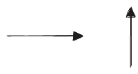
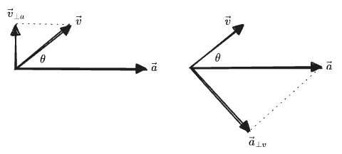

*Part of a series on elementary linear algebra*:
1. *(This post)*
2. *<a href="/posts/2024-11-01-linear-algebra-2/">Multiplication</a>*
3. *<a href="/posts/2024-11-01-linear-algebra-3/">Division</a>*

## Table of Contents

# Introduction 

This post is part one of an experimental course in linear algebra. It will differ from the conventional treatment in a number of ways:
* in the use of geometric and graphical arguments throughout, in preference to proofs and especially to matrix-based derivations.
* in the use of "generalized inverses", introduced initially to implement an analog of "division" for the dot and cross products.
* in the use of exterior algebra and wedge products, with goal of making the determinant, when it arrives, completely trivial.
* in the use of unconventional notations for the atomic operations out of which more complex operations (like matrix inversion) will be defined.

The level of technicality will be inconsistent. This is not intended to *be* pedagogical, but rather to develop the ideas which would be in a pedagogical treatment in a logical order, while justifying the various decisions and notations. These discussions will tend to be more technical, but after they are all stripped away, the ideal result would be a course which could plausibly be taught at a _late-high-school_ level—a high bar, or a low one, I suppose. 

We begin with the simplest case.

# One Dimension

## Vectors

Behold a vector:

For now I'll notate this as $$\to$$. 

We can make a longer vector by doubling it:

$$
(\longrightarrow) = 2 \times (\to)
$$

This is the same as adding $$\to$$ to itself: 

$$
(\longrightarrow) = (\to) + (\to)
$$

We can easily imagine multiplying $$\to$$ by any number $$c$$, giving a new vector $$c(\to)$$, which can be longer or shorter than the original vector. In this context we call the number $$c$$ a "scalar", because it "scales" vectors. 

There's no reason $$c$$ can't be negative too, reversing the direction:

$$
(-2)(\to) = (\longleftarrow)
$$

Then we can add and subtract these, which simply adds or subtracts their coefficients:

$$
a ( \to ) + b ( \to ) = (a + b)(\to)
$$

Therefore $$0(\to) = (\to) - (\to)$$ must be a valid vector too, which we'll just call "zero" or the "zero vector", written as $$0$$.

We can divide by a constant, which just acts on the coefficient

$$
\frac{a ( \to )}{2} = \frac{a}{2}( \to )
$$

We can even divide two vectors by each other, as long as the denominator isn't zero: 

$$
\frac{b ( \to )}{a ( \to )} = \frac{b}{a}
$$

If one is reversed, we get the negative:

$$
\frac{b ( \leftarrow )}{a ( \to )} = \frac{-b ( \to )}{a ( \to )} = -\frac{b}{a}
$$

(Note: this notion of dividing vectors is the first of many unconventional things in this post.)

The set of all of multiples of this single vector $$\to$$ is what we'll call a "vector space". Calling this space $$V$$, we can write it as the "set of all linear combinations of $$\to$$", along with the operations we've described, that is:

$$
V = \{ a (\to) \mid a \in \mathbb{R}\}
$$

This $$V$$ is one-dimensional: all of the vectors are multiples of a single vector $$\to$$, making it more of a "line" than a "space".

Note we can also get the same vector space $$V$$ by starting with any other vector in the same space, say, $$(\longleftarrow) = -2 (\to)$$, because any multiple of the first $$a(\longleftarrow)$$ can be written in terms of the second $$-2a (\to)$$. So the two are equal as sets:

$$
\{ a (\longleftarrow) \mid a \in \mathbb{R}\} = \{ a (\to) \mid a \in \mathbb{R}\} = V
$$

We can see this construction as an operation "$$\mathrm{vectorize}$$" which gives the same set for both elements:

$$
\mathrm{vectorize}(\longleftarrow) = \mathrm{vectorize}(\to) = V
$$

And in fact, apparently, it hardly matters what the vectors in the space are multiples _of_—the important feature of this  "vector space" $$V$$ is the coefficients, which give it the same structure as the real numbers $$a \in \mathbb{R}$$. 

We can therefore "vectorize" any single object and get a vector space with the same structure as $$V$$, for example, an apple or orange.
We won't go so far as to say that the spaces $\mathrm{vectorize}(\unicode{x1F34F}\:)$ and $\mathrm{vectorize}(\unicode{x1F34A}\:)$ are the same space, though—they only have the same structure. But we *will* identify the vector spaces generated by $$\longleftarrow$$ and $$\to$$ as the same space—this is possible because we additionally have asserted that these objects have an *innate* relationship; each is a multiple of the other according to $$(\longleftarrow) = -2 (\to)$$.

## Length

Now, what is the length of this arrow $$\to$$? 

Well, it's $$1$$ of, uh, whatever the length of $$\to$$ is. Clearly our second vector above has twice its length: 

$$\vert \longleftarrow \vert = 2 \vert \to \vert$$ 

And any constant multiple $$a(\to)$$ will have $$a$$-times the length, e.g.:

$$
\vert 3 (\to) \vert = 3 \vert (\to) \vert
$$

Maybe we think of $$\vert (\to) \vert$$ as having length "1 meter" and our $$\to$$ as a meter stick. But we can just as easily measure in inches instead. We could use any vector in the space to measure the others. For example, our long-left-arrow $$\vert \longleftarrow \vert$$ would produce lengths which are half as large:

$$
{\vert 3 (\to) \vert}_{\longleftarrow} 
= {\vert 3 (-\frac{1}{2}) (\longleftarrow) \vert}_{\longleftarrow} 
= \frac{3}{2} {\vert (\longleftarrow) \vert}_{\longleftarrow} 
= \frac{3}{2}

$$

A vector, then, has no _inherent_ length—not until we pick some reference vector to measure it with. Then its length carries "units" of that unit length. (The zero vector $$0$$, however, does have an innate length of zero.) 

Given our one-dimensional vector space $$V$$, you could choose any specific vector (like $$\to$$ or $$\longleftarrow$$), declare that it has length "1", and this would give a length for every other vector. Note that for any choice, there will be exactly two vectors in our 1D vector-space with that length. It's still just a number line. When you think of a vector space you should really not think of "things with lengths"—the vectors *themselves* are just dumb arrows that can be added and scaled; which one has length $$1$$ is really an additional choice you get to make—it's no more "inherent" to the vectors themselves than the choice of whether to measure length in meters vs. inches.

## Multiplication

Above, we demonstrated the following operations:
* vector times scalar $$c(\to)$$, giving a vector.
* vector divided by scalar, giving a vector.
* vector divided by (nonzero) vector, giving a scalar, as in $$\frac{b ( \to )}{a ( \to )} = \frac{b}{a}$$

What's missing is the multiplication of two vectors. The obvious definition would be:

$$
(a (\to)) \times (b(\to)) = (ab) {(\to)}^2
$$

but we get something that is neither a multiple of $$\to$$, _nor_ a scalar. Instead it has two units of $$(\to)$$; if our original vector $$\to$$ had represented meters, then this new thing has units of "meters squared". Its length in units of $$(\to)^2$$ is just $$(ab)$$, and, since we noted above that it doesn't matter what you created your vector space _out of_, you could easily assign this new vector to a vector space:

$$
(a (\to)) \times (b(\to)) = (ab)(\to)^2 \in \mathrm{vectorize}((\to)^2)
$$

This seems sensible enough, but we'll have to see if it's useful. 

# Two Dimensions

## Vectors

So far our vectors aren't very interesting: they act just like the real numbers $$\mathbb{R}$$, and the arrow $$\to$$ is just a strange "unit" for these numbers. We'll have to add another dimension to make vectors meaningfully distinct from numbers.

Now imagine we start with two objects. Unlike $$\to$$ and $$\longleftarrow$$ above, we assume the two objects are _unrelated_ to each other; they could as well stand for "apples" and "oranges" or anything else. We will draw them as arrows in two perpendicular directions:

We'll notate these as, what else, $$\rightarrow$$ and $$\uparrow$$, for now.

Now, clearly we could create a one-dimensional vector space out of _either_ of these individually, with all of the properties defined above. The two spaces would be:

$$
\begin{aligned}
(\to) &\in \{ a(\to) \mid a \in \mathbb{R}\} 
\\
  &= \mathrm{vectorize}(\to)\\
  &= V_1\\
(\uparrow) &\in \{ a(\uparrow) \mid a \in \mathbb{R}\} \\
  &= \mathrm{vectorize}(\uparrow) \\
  &= V_2\\
\end{aligned}
$$

It's easy to imagine the next step: we create a single space out of both vectors by considering any linear combination of the two, i.e.

$$
\begin{aligned}
V &= \{ a(\to) + b(\uparrow) \mid a \in \mathbb{R}, b \in \mathbb{R} \} \\
 &= \mathrm{vectorize}(\to, \uparrow)
\end{aligned}
$$

Some elements of $$V$$ include:

$$
\begin{aligned}
\to &&&& \uparrow\\
0 &&&& -3(\to) + (\uparrow) \\
(\nearrow) = (\to + \uparrow) &&&& (\searrow) = (\rightarrow - \uparrow) = (\rightarrow + \downarrow)
\end{aligned}
$$

Of course, we get a unique vector for each ordered pair $$(a, b)$$. So this vector space has the same structure as the two-dimensional coordinate plane: one vector for each point, one point for each vector.

## Components

If we have some arbitrary vector in our two-dimensional $$V$$, like $$\nearrow$$, we can decompose it into a "component" along each of $$\to$$ and $$\uparrow$$ individually. Here it's 

$$(\nearrow) = 1(\to) + 1(\uparrow)$$

Because no amount of $$\to$$ can ever point upward or downward, and no amount of $$\uparrow$$ can ever point rightward or leftward, there must only be one way to represent any given vector as a sum $$(a, b)$$ of our original two generating vectors. These are the "projections" onto each of the original vectors, which we write:

$$
\begin{aligned}
{(\nearrow)} &= {(\nearrow)}_{\to} (\to) + {(\nearrow)}_{\uparrow} (\uparrow) \\
 &= 1(\to) + 1(\uparrow)
\end{aligned}
$$

At this point all these arrows are cumbersome, so we'll switch to a normal notation. Henceforth we write vectors as $$\mathbf{v}$$ and will refer to our original two arrows as:

$$
\begin{aligned}
(\to) = \mathbf{e}_1 &&& (\uparrow) = \mathbf{e}_2
\end{aligned}
$$

We'll write the projection of $$\mathbf{v}$$ onto $$\mathbf{e}_1$$ as $$v_1$$. Then the above reads, for $$\mathbf{v} = (\nearrow)$$:

$$
\mathbf{v} = 1 \mathbf{e}_1 + 1\mathbf{e}_2
$$

Now, we originally constructed this vector space out of our two vectors $$\mathbf{e}_1 = (\to)$$ and $$\mathbf{e}_2 = (\uparrow)$$. In one-dimension we observed that we could have generated the whole line by starting with any single arrow. In 2D, likewise, any pair of vectors which are not parallel could be used to generate the entire plane. Any such pair is called a "basis", for example, two other bases would be:

$$
\begin{aligned}
\mathbf{x} = (\longrightarrow) = 2\mathbf{e}_1 &&& \mathbf{y} = (\downarrow) = -\mathbf{e}_2\\
\mathbf{s} = (\nwarrow) = -\mathbf{e}_1 + \mathbf{e}_2 &&& \mathbf{t} = (\nearrow )= \mathbf{e}_1 + \mathbf{e_2}
\end{aligned}
$$

and the components of the same $$\mathbf{v}$$ in the bases from before would be:

$$
\begin{aligned}
\mathbf{v} &= \frac{1}{2} \mathbf{x} -1 \mathbf{y} \\
\mathbf{v} &= 0 \mathbf{s} + 1 \mathbf{t}  = \mathbf{t}\\
\end{aligned}
$$

Therefore the set of numbers describing the specific vector, such as $$(1, 1)$$ or $$(1/2, -1)$$, are the "coordinates of the vector in the basis" and depend on the choice of basis. 

Any "basis" of $$V$$, then, consists of a set of vectors which "span" $$V$$, in that any vector in $$V$$ can be written *uniquely* as a linear combination of the basis vectors. All bases of $$V$$ have the same "dimension", which is just the definition of dimension. Here, $$\text{dim } V = 2$$. 

We will always think of a vector as being a fundamentally "geometric" object, rather than a "set of coordinates"—the coordinates are a description of the vector *in a basis*. A basis, then, can be thought of as a "lens" we can look at the space through. Many such lenses are possible, and not all see the space the same way, but the space also has inherent properties that do not depend on the lens we use.

## Length

In one dimension we observed that our vectors had no "inherent" length. But we were able to define the length of a vector in "units" of some standard vector. Choosing $$(\to)$$ as this standard vector, we can write things like:

$$
\begin{aligned}
\vert \longrightarrow \vert &= 2 \vert \to \vert\\
\vert 2 \mathbf{e}_1 \vert & = 2 \vert \mathbf{e}_1\vert
\end{aligned}
$$

But we could just as easily choose $$(\longrightarrow)$$ as the standard, in which case the two vectors in the example would have lengths of 1 unit only.

Clearly we could do the same for any individual direction in two dimensions.

Now, how should we define the length of a two-dimensional vector in general? The obvious answer is to assert that some pair of two basis vectors both have length "1". The obvious choice are the two vectors we originally used to build the space $$V$$:

$$
\begin{aligned}
\vert \uparrow \vert = \vert \to \vert = 1\\
\vert \mathbf{e}_2 \vert = \vert \mathbf{e}_1 \vert = 1
\end{aligned}
$$

Once two unit vectors are chosen we can define a length by a standard Pythagorean theorem:

$$
\vert a \mathbf{e}_1 + b \mathbf{e}_2 \vert = \sqrt{a^2 + b^2}
$$

But, just as in 1D, we could as easily choose some other set of vectors to be the "unit" of length, such as $$\longleftarrow$$. Then if we choose $$\vert \uparrow \vert = \vert \longleftarrow \vert = 1$$, which is $$\vert \mathbf{e}_2 \vert = \vert (-2)\mathbf{e}_1 \vert = 1$$, then the Pythagorean length of a generic vector would be:

$$
\vert a \mathbf{e}_1 + b \mathbf{e}_2 \vert = \left\vert \left(-\frac{1}{2}\right) (-2) \mathbf{e}_1 + b \mathbf{e}_2 \right\vert  = \sqrt{ {\left(\frac{a}{2}\right)}^2 + b^2}
$$

Therefore the "lengths" of vectors are only defined up to choice of basis. And, while it might seem like $$\mathbf{e}_1 = (\to)$$ and $$\mathbf{e}_2 = (\uparrow)$$ are the natural choices to define as length "1", there is actually nothing special about these vectors that makes them equal in length—they do not *inherently* even have a length, except for the fact that I've chosen to represent both with equal-length arrows in my notation.

If you define $$-2\mathbf{e}_1 = (\longleftarrow)$$ to have length 1, then so it is, and now $$\mathbf{e}_1$$ has length $$\frac{1}{2}$$ in these units. This transformation would squash the "circle of vectors of length 1" in half in one direction, but the overall *structure* of the vector space is unchanged. 

The concept of length is not actually necessary to work with vectors at all. While all the vectors we'll consider are naturally lengthed, it might make more sense to do without if considering, for example, a vector space of "apples" and "oranges".

We will again aim to view our vectors as "geometric" or "graphical" objects, and therefore will not consider any vector to have an *inherent* length, except in view of a particular set of reference vectors—just as we did not consider vectors to have inherent coordiantes, except wth respect to a basis.

The operation of "length" then can be seen as an act of "measurement" with respect to a set of unit-length reference vectors. This choice of reference vectors we call a choosing a "metric". Just like choosing a "basis", the choice of "metric" acts like a lens through which the vector space can be viewed and described. In the simplest cases, the chosen basis consists of unit-length vectors, which is the case when we use $$\mathbf{e}_1, \mathbf{e}_2$$. But in general the two choices are independent—you could measure length relative to $$\vert \mathbf{e}_1 \vert = \vert \mathbf{e}_2 \vert = 1$$, while representing your vectors in terms of $$\mathbf{s} = -\mathbf{e}_1 + \mathbf{e}_2$$ and $$\mathbf{t} = \mathbf{e}_1 + \mathbf{e_2}$$., which each would have length $$\sqrt{2}$$. Then $$\mathbf{v} = 1\mathbf{t}$$ would have length $$\sqrt{2}$$ rather than 1. So, in general, the *metric* and *basis* can be chosen or varied independently. Varying the basis is more common; in most instances the "metric" is simply taken to be some obvious choice and is not discussed directly. You rarely think about *changing* the metric until you're working at a pretty advanced level.

Often we simplify the whole description by considering bases comprised of *perpendicular* and *unit-length* vectors, i.e., "orthonormal bases". Then the lengths of all vectors can be equally well measured in *any* orthonormal basis using a Pythagorean theorem. 

We will often write the length of vector $$\mathbf{v}$$ as the same name without the vector notation, $$v$$. (This rule will only apply when no subscripts are involved, which we'll see in a moment.) Then we write the unit-length vector parallel to $$\mathbf{v}$$ with a hat as $$\hat{\mathbf{v}} = \mathbf{v}/v$$. As an example, the above $$\mathbf{s}, \mathbf{t}$$ basis becomes:

$$
\begin{aligned}
\mathbf{s} = s\hat{\mathbf{s}} = \sqrt{2} \frac{-\mathbf{e}_1 + \mathbf{e}_2}{\sqrt{2}} &&& \mathbf{t} = t\hat{\mathbf{t}} = \sqrt{2} \frac{\mathbf{e}_1 + \mathbf{e}_2}{\sqrt{2}}
\end{aligned}
$$

And in the $$\hat{\mathbf{s}}, \hat{\mathbf{t}}$$ basis we have our earlier $$\mathbf{v} = \mathbf{t} = \sqrt{2}\hat{\mathbf{t}}$$.

For the rest of this post we'll stick to a standard metric which takes the two vectors $$\mathbf{e}_1, \mathbf{e}_2$$ as having "unit length", and we'll notate them with hats $$\hat{\mathbf{e}}_1, \hat{\mathbf{e}}_2$$ to indicate this.

## Projection and Rejection

We've been writing the same vector $$\mathbf{v}$$ in a few different bases—using unit-vector bases for now, we had:

$$
\begin{aligned}
\mathbf{v} &= 1 \hat{\mathbf{e}}_1 + 1 \hat{\mathbf{e}}_2 =  0\hat{\mathbf{s}} + 1 \hat{\mathbf{t}}
\end{aligned}
$$

We'll now start writing this decompositions generically, in terms of subscripted constants $$v_1, v_2, v_s, v_t$$:

$$
\begin{aligned}
\mathbf{v} &= v_1 \hat{\mathbf{e}}_1 + v_2 \hat{\mathbf{e}}_2 = v_s \hat{\mathbf{s}} + v_t\hat{\mathbf{t}}
\end{aligned}
$$

Clearly $$(v_1, v_2)$$ are the coordinates of $$\mathbf{v}$$ in the basis of $$\hat{\mathbf{e}}_1, \hat{\mathbf{e}}_2$$, and this holds for any vector. We'll use numeric subscripts like $$v_i$$ only for the bases named like $$\hat{\mathbf{e}}_i$$. These subscripts will always be defined relative to _unit_ basis vectors. While it might seem more natural to define $$v_s$$ such that $$\mathbf{v} = v_s \mathbf{s} \ldots$$, this makes the scalar $$v_s$$ be unitless, which seems to cause to confusion. Instead we'll adopt the convention that a subscript applied to the name of a vector never changes its "units". If $$\mathbf{v}$$ is in meters, then $$v_1$$ must be too. 

We can generalize "the component along..." to any pair of vectors. For $$\mathbf{v}, \mathbf{a}$$:
* $$\mathbf{v}_{\parallel a}$$ is the "vector projection of $$\mathbf{v}$$ onto $$\mathbf{a}$$", which is the vector $$v_a \hat{\mathbf{a}}$$. Read this as "$$v$$-parallel-$$a$$".
* $$v_a$$ is the "scalar projection of $$\mathbf{v}$$ onto $$\mathbf{a}$$"; the component of $$v$$ along $$\hat{\mathbf{a}}$$, whch makes this exactly the length of the vector project: $$v_a = \vert \mathbf{v}_{\parallel a} \vert$$. Read this as "$$v$$-along-$$a$$" or "$$v$$-sub-$$a$$". Note that this makes the scalar projection a "length"- or "metric"-dependent quantity. [^proj]

[^proj]: Note that my notation uses $$v_a$$ for the length $$\vert \mathbf{v}_{\parallel a} \vert$$. A different "natural" definition for the "scalar projection" would be $$v_a = \frac{\vert \mathbf{v}_{\parallel a} \vert}{\vert{\mathbf{a}}\vert}$$, which has the nice property that $$\mathbf{v}_{\parallel a} = v_a \mathbf{a}$$, and makes $$v_a$$ a metric-*independent* quantity. I am *not* making this choice because I'll be using a different expression for this quantity later on, $$\frac{\mathbf{v}}{\mathbf{a}} = \frac{\vert \mathbf{v}_{\parallel a} \vert}{\vert{\mathbf{a}}\vert}$$, and I want to have the two mean distinct things. I'm okay with $$v_a$$ being metric-dependent because the other lower case scalars $v, a$ are too. Unlike those scalars, which were lengths and therefore positive-only, $v_a$ can be negative. [^neglength]

[^neglength]: But... what if we allowed the $\sqrt{\cdot}$ in the definition of length to include the negative branch of the $\pm$? Later on I'll derive the orientedness of areas by picking one branch of the $\pm$; who's to say we can't do the same for lengths? Hmm.

Here we are making a distinction between the object named "$$\mathbf{a}$$" and the object $$\parallel a$$ which we intend to represent the "oriented line" along which $$\mathbf{a}$$ points—this line knows about the direction of $$a$$ but not its length; clearly this is all we need to define a projection. We will likewise use $$\perp a$$ to refer to the oriented line rotated $$90^\circ$$ from the direction of $$\parallel {a}$$. We will treat these "line"-typed objects more thoroughly when in higher dimensions.

Graphically, the vector projections are:

In each case we find a projection by "dropping a line" from the end of one vector until it meets the line of the other vector at a right angle. Note that $$\mathbf{v}_{\parallel a}$$ is a scalar multiple of $$\mathbf{a}$$; the exact ratio is $$\mathbf{v}_{\parallel a} = \frac{v_a}{a}\mathbf{a}$$, with $$v_a$$ being positive or negative.

If we know the angle $$\theta$$ between the vectors, then the projection vectors and their lengths are:

$$
\begin{aligned}
\mathbf{v}_{\parallel a} = v_a \hat{\mathbf{a}} = (v \cos\theta) \hat{\mathbf{a}} =  \frac{v \cos \theta }{a}\mathbf{a} 
&&& \mathbf{a}_{\parallel v} = a_v \hat{\mathbf{v}} = (a \cos\theta) \hat{\mathbf{v}} = \frac{a \cos \theta }{v} \mathbf{v} \\
\vert \mathbf{v}_{\parallel a} \vert = v \cos \theta &&& \vert \mathbf{a}_{\parallel v} \vert = a\cos \theta
\end{aligned}
$$

The terms "projection" and "component" are mostly interchangeable. We will typically use "component" when referring to a "projection on a basis vector", whereas "projection" is an operation between any two vectors. One also sees the notations $$\mathbf{v}_{\parallel a}$$ and $$\text{proj}_a \mathbf{v}$$ for the projection.

When the vector $$\mathbf{a}$$ is one of our numbered basis vectors $$\hat{\mathbf{e}}_i$$, we will write the projections themselves with numbers $$v_1$$. When the target of the projection is a unit vector, we will also sometimes omit the $$\parallel$$ symbol, writing $$\mathbf{v}_1$$ or $$\mathbf{v}_x$$, since in this case vector projection can be written in terms of the scalar projection as $$\mathbf{v}_x = v_x \mathbf{x} = v_x \hat{\mathbf{x}}$$. The "components of a vector in a basis" are then just the projections onto each basis _unit_ vector.

Given the projection $$\mathbf{v}_a$$, we can also define the "rejection" of $$\mathbf{v}$$ with $$\mathbf{a}$$, which we will write as either:
* $$\mathbf{v}_{\perp a}$$, which reads as "$$v$$ perpendicular to $$a$$", or just '$$v$$-perp-$$a$$". 
* $$\mathbf{v}_{\not{a}}$$, read as "$$v$$-not-$$a$$" 

The $$\bot a$$ notation should be read as "projection onto the line perpendicular to $$\mathbf{a}$$", with $$\perp \mathbf{a}$$ being, here, the "oriented line" rotated $$90^\circ$$ from the direction of $$\mathbf{a}$$, which is then being used as the argument to the *projection* operation. It will be helpful later to also define the *vector* $$\mathbf{a}_\perp$$ as vector $$\mathbf{a}$$ rotated by $$90^\circ$$; i.e. the vector of the same length as $$\mathbf{a}$$ along the line $$\perp a$$. This vector is depicted in the diagrams below. Clearly the rejection could be defined as projection onto either of $$\perp a$$ or $$\mathbf{a}_\perp$$, but the former is more general.

The $$\not a$$ notation on the other hand, conveys the sense of "rejection" by the vector $$\mathbf{a}$$ itself. In higher dimensions this object $$\bot \mathbf{a}$$ will no longer be a vector, and the equivalence of the two definitions will be less trivial, but for now they mean the same thing.

The definition of "rejection" is just "whatever's left after projection":

$$
\begin{aligned}
\mathbf{v}_{\bot a} = \mathbf{v}_{\not{a}} = \mathbf{v} - \mathbf{v}_{\parallel a} &&& \mathbf{a}_{\bot v} = \mathbf{a}_{\not{v}} = \mathbf{a} - \mathbf{a}_{\parallel v}
\end{aligned}
$$

Graphically:

We can also define a scalar rejection, in terms of the angles shown in the graphic:

$$
\begin{aligned}
v_{\bot a} = v \sin \theta &&& a_{\bot v} = a\sin \theta
\end{aligned}
$$

Note that again the scalar rejection is _not_ simply the length of the vector rejection, because it can be negative. Instead we have, using $$\mathbf{a}_\bot$$ now:

$$
\begin{aligned}
\mathbf{v}_{\bot a} &= v_{\bot a} \hat{\mathbf{a}}_{\bot}\\
\vert \mathbf{v}_{\bot a} \vert &= \vert v_a \mathbf{a}_\bot\vert = \vert v_a \vert = \vert v \cos\theta \vert
\end{aligned}
$$

Here we can see the projection and rejection together:

In each case the projection and rejection together are two sides of a triangle, and their sum gives the original vector. Therefore we can write a Pythagorean theorem relating their lengths:

$$
\begin{aligned}
v^2 &= {\vert \mathbf{v}_{\parallel a} \vert}^2 + {\vert \mathbf{v}_{\perp a} \vert}^2 
&&&
a^2 &= {\vert \mathbf{a}_{\parallel v} \vert}^2 + {\vert \mathbf{a}_{\perp v} \vert}^2 
\\

v^2 &= v_a^2 + v_{\perp a}^2 
&&&
a^2 &= a_v^2 + a_{\perp v}^2 
\end{aligned}
$$

We will be able to give more useful definitions for the projection and rejection, not making use of $$\theta$$, once we introduce some additional tools. (Arguably we have not really yet defined what angles mean at all.)

 

 
