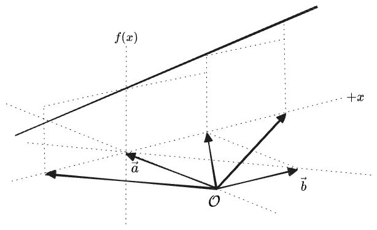
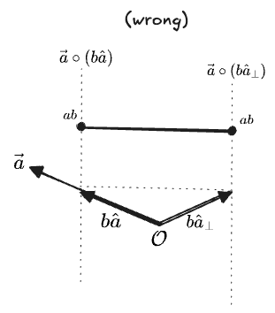
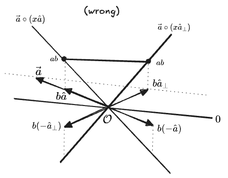
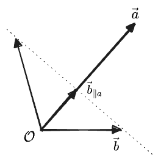
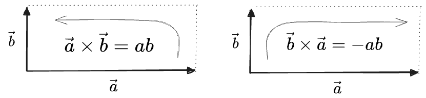
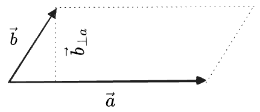
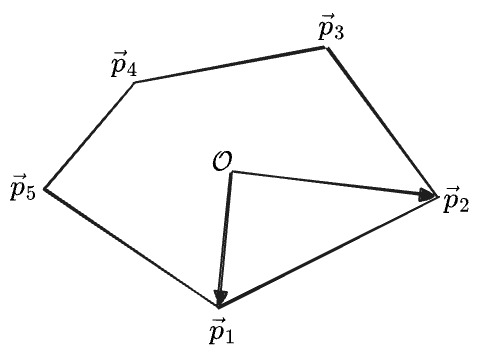

## Table of Contents

# Vector Multiplication

Our definitions of multiplication or division by a scalar will carry over directly from the 1D case. We have, for some $$\mathbf{v} = v_1 \hat{\mathbf{e}}_1 + v_2 \hat{\mathbf{e}}_2$$:

$$
\begin{aligned}
b\mathbf{v} = (bv_1) \hat{\mathbf{e}}_1 + (bv_2) \hat{\mathbf{e}}_2 &&& 
\frac{1}{b}\mathbf{v} = \frac{v_1}{b} \hat{\mathbf{e}}_1 + \frac{v_2}{b} \hat{\mathbf{e}}_2
\end{aligned}
$$

But how should we define multiplication or division between two vectors?

In one dimension it was simple enough; for $$\mathbf{a} = a \hat{\mathbf{e}}_1$$ and $$\mathbf{b} = b\hat{\mathbf{e}}_1$$ we found that the obvious definitions were:

$$
\begin{aligned}
(\mathbf{a})(\mathbf{b}) = ab(\hat{\mathbf{e}}_1)(\hat{\mathbf{e}}_1) &&& \frac{\mathbf{a}}{\mathbf{b}} = \frac{a}{b}
\end{aligned}
$$

The thing $$(\hat{\mathbf{e}}_1)(\hat{\mathbf{e}}_1)$$ we could assign a sense like "square meters". Or we could simply shave it off and call this the number $$ab$$, since one-dimensional vectors act just like regular numbers.

This might work in 1D, but for higher dimensions We will want to be more thorough. We'll start by asking: what properties should the multiplication of two vectors obey?
1. Multiplication ought to reduce to the obvious definitions in simple cases—otherwise it's not really "multiplication"! The two "familiar" senses of multiplication of $$ab$$ are:
	* The length of a line consisting of $$a$$ copies of $$b$$, or $$b$$ copies of $$a$$.
	* The area of a rectangle with sides $$a$$ and $$b$$
2. The multiplication operation ought to play nicely with the "linear combinations" we used to define vectors in the first place. Multiplication of numbers distributes like $$a(b+c) = ab + ac$$, and it seems sensible that a similar "distributive property" hold over combinations of vectors. If we call the undefined operation $$\circ$$ for the time being, we want:

    $$
    \begin{aligned}
    ((x+y)\mathbf{a}) \circ \mathbf{b} &= (x\mathbf{a}) \circ \mathbf{b} + (y\mathbf{a}) \circ {\mathbf{b}} \\
      &= x(\mathbf{a} \circ \mathbf{b}) + y(\mathbf{a} \circ {\mathbf{b}}) \\
    & = \mathbf{a} \circ ((x + y) \mathbf{b})\\
    &= (x + y)(\mathbf{a} \circ \mathbf{b}) \\
    (\mathbf{a} + \mathbf{b}) \circ \mathbf{v} &= \mathbf{a} \circ \mathbf{v} + \mathbf{b} \circ \mathbf{v}
    \end{aligned}
    $$

   Taken together we will call these properties "linearity". 
3. The value we get for multiplication ought to depend on the exact vectors involved, and on the fact that they are vectors at all. We could just define multiplication to simply multiply the *lengths* of the vectors, like $$\mathbf{a} \circ \mathbf{b} = ab$$, which obviously means *something*. But this doesn't even care that they're vectors; they could as well just be numbers.
4. If possible, multiplication should be a purely *geometric* operation, defined in terms of the vectors themselves without reference to a choice of basis, and if possible, a choice of metric—although it seems likely that this second condition won't be possible, since both simple cases in condition (1) make explicit reference to "length".

Of all of these properties, the first is the most intuitive, so we'll start there.

## Linearity

We gave two "senses" of the multiplication of numbers: "$$b$$ copies of $$a$$", which clearly ought to give $$ab$$ for two parallel vectors, and the "area of a rectangle", which naturally equals $$ab$$ for two perpendicular vectors.
The simplest multiplication operation giving both of these would just be to multiply the *lengths* of the two vectors, i.e. $$\mathbf{a} \circ \mathbf{b} = \vert a \vert \vert b \vert$$. But this doesn't conform to condition 3—it doesn't really care that these two vectors are vectors at all; it simply treats them as numbers without a meaningful sense of "direction".

Let's suppose instead that we have one multiplication operation which gives the prescribed results for parallel and perpendicular vectors, and now let us ask what "linearity" tell us about its value on any other pair of vectors. We'll first illustrate how linearity works in practice with a simple graphical example:

In the image above, we have chosen two vectors $$\mathbf{a}, \mathbf{b}$$, and then drawn the line of vectors you would get if you added various multiples of $$\mathbf{b}$$ to $$\mathbf{a}$$, with the cases of $$\mathbf{a} + \mathbf{b}$$, $$\mathbf{a} + 2\mathbf{b}$$ and $$\mathbf{a} - \mathbf{b}$$ shown. If we now imagine some arbitrary "linear" function of vectors $$f(\mathbf{x})$$, we can imagine drawing the whole line representing this function's value on "multiples of $\mathbf{b}$ added $\mathbf{a}$", as a function of the multiple:

For fixed $$\mathbf{a}, \mathbf{b}$$, this is just a function of the parameter $$x$$:

This should hold for *any* vector $$\mathbf{b}$$; the condition is that "varying the argument to $$f(x)$$ along any line produces *some* linear change in the value of $$f(x)$$". The slope of this line is $$f(\mathbf{b})$$, as we can see if we expand write the linearity condition out, with $$\lambda$$ representing the number of copies of $$\mathbf{b}$$ to add to $$\mathbf{a}$$:

$$
f(\mathbf{a} + x \mathbf{b}) = f(\mathbf{a}) + x f(\mathbf{b})
$$

And actually, this tell us more; it also means that $$f(0) = 0$$. Apparently, if we know $$f(\mathbf{a}), f(\mathbf{b})$$ for two non-parallel vectors, then we know $$f$$ everywhere:

Linearity, then, is a very strong condition: the only thing a linear function on the 2D plane can do is "tilt" the plane, as can be seen in the above diagram. It can't even have a "$y$-intercept". [^linfunc]

[^linfunc]: What we're describing here is a $f(\mathbf{x})$ which is a "linear in its argument $\mathbf{x}$". This is not really the same as a "linear function of an argument $\mathbf{x}$", like a 1D line $f(x) = ax + b$; a function "linear in an argument" must have $f(0) = 0$. 

Now, having established the geometric meaning of "linearity", we can ask what it means for "multiplying two vectors" to be linear in *each* argument.
If we fix one vector $$\mathbf{a}$$, then $$\mathbf{a} \circ \mathbf{b}$$ can be thought of as a function of just the second vector $$\mathbf{b}$$: $$f(\mathbf{b}) = \mathbf{a} \circ \mathbf{b}$$. Then our "intuitive" senses of multiplication suggests that the new $$f$$ should produce the "natural" value $$ab$$ when the second vector is exactly equal to *one of* the two vectors with some length $$b$$ and oriented either parallel or perpendicular to $$\mathbf{a}$$, that is, when $$\mathbf{b} = b\hat{\mathbf{a}}$$ and $$\mathbf{b} = b\hat{\mathbf{a}}_\perp$$.

If we linearly interpolate *between* those exact two vectors, then the value of $$\mathbf{a} \circ \mathbf{b}$$ must vary linearly between $$ab$$ and... $$ab$$:

But the only way for this to be linear is if the value *does not vary* along the line at all. Then we immediately know the value everywhere else, because $$f(0)$$ has to be zero, and we get a function that increases along the line $$\mathbf{a} + \mathbf{a}_\perp$$ and is constant along the line perpendicular to this:

... well, apparently this *is* a function we could define. But it doesn't look like a particularly useful one—except for the values $$ab$$ we started with, and $$-ab$$ for the opposite orientations, the other values don't admit any obvious interpretation. And we've privileged $b\mathbf{a}_\perp$ over $-b\mathbf{a}_\perp$, another vector perpendicular to $\mathbf{a}$. Shouldn't multiplication by this give the expected $ab$ as well?

Let's step back. Maybe those two conditions on the products of parallel and perpendicular vectors don't need to be cases of the *same* operation. We can instead define *two* multiplication operations, each in terms of projections:

1. One which multiplies the parallel components of vectors, $$\mathbf{a}, \mathbf{b} \mapsto a b_a = a_b b$$, which we will write as $$\mathbf{a} \cdot \mathbf{b}$$ and read as a "dot product". This is a natural generalization of the multiplication of two _one_-dimensional vectors; we simply ignore the rest of the space!
2. One which multiplies the perpendicular components of vectors, $$\mathbf{a}, \mathbf{b} \mapsto a b_{\perp a} = -a_{\perp b} b$$ which we will write as $$\mathbf{a} \times \mathbf{b}$$, read as "cross product". This is the natural generalization of the sense of multiplication producing an "area".

Visualizing these as linear functions of the $$\mathbf{b}$$ argument, relative to some fixed $$\mathbf{a}$$, we see that they "tilt" the plane either along $$\mathbf{a}$$ or perpendicular to it—more natural, I think, than the peculiar diagonal-tilting function we came up with before. 

## Multiplication 1: The Dot Product

The "dot" product needs to multiply the lengths of vectors that are parallel. The simplest way to define an operation $$\mathbf{a} \cdot \mathbf{b}$$ that does this is to to multiply the length of $$a$$ by the projection of $$\mathbf{b}$$ onto $$\mathbf{a}$$, i.e.:

$$
\mathbf{a} \cdot \mathbf{b} = a b_a
$$

What about the opposite projection, $$b a_b$$? If we cite the definition in terms of $$\cos \theta$$ from earlier, we see that these are equal:

$$
\mathbf{a} \cdot \mathbf{b} = a b_a = b a_b =  ab\cos{\theta}
$$

So we ought to think of this product as a "symmetric projection"—it is a projection which incorporates _both_ lengths, and doesn't care which one you projected onto the other or the order of the two arguments. In all we have a few names:
* "dot product"
* "symmetric multiplication"
* "symmetric projection"
* or a "scalar product", because it produces a scalar, although in two dimensions $$\mathbf{a} \times \mathbf{b}$$ will *also* give a scalar, so this won't be very helpful.
* "inner product"

If we don't want to use $$\cos \theta$$, perhaps believing we pulled that out of a hat, then we'll have to find another way to write in terms of a basis $$\hat{\mathbf{e}}_1, \hat{\mathbf{e}}_2$$.

We do some geometry: first, draw $$\mathbf{a}, \mathbf{b}$$, and their sum $$\mathbf{a} + \mathbf{b}$$.

We're going to compose $$\mathbf{a} + \mathbf{b}$$ in two ways. The first is shown on the right above: we compose into components on and off $$\mathbf{a}$$:

$$
\begin{align*}
(\mathbf{a} + \mathbf{b})_a &= a + b_a \\
(\mathbf{a} + \mathbf{b})_{\perp a} &= b_{\perp a}
\end{align*}
$$

Then we can write a Pythagorean theorem relating the three:

$$
\begin{align*}
{\vert \mathbf{a} + \mathbf{b} \vert }^2 &= (a + b_a)^2 + b_{\perp a}^2\\
&= a^2 + b_a^2 + 2ab_a + b_{\perp a}^2\\
&= a^2 + (b_a^2 + b_{\perp a}^2) + 2ab_a\\
&= a^2 + b^2 + 2ab_a
\end{align*}
$$

Then at the same time we can expand in our standard basis of  $$\hat{\mathbf{e}}_1, \hat{\mathbf{e}}_2$$:

$$
\begin{align*}
{\vert \mathbf{a} + \mathbf{b} \vert }^2 &= (a_1 + b_1)^2 + (a_2 + b_2)^2 \\
 &= a_1 ^ 2 + a_2^2 + 2 a_1 b_1 + a_2^2 + b_2 ^2 + 2 a_2 b_2\\
 &= (a_1 ^ 2 + a_2^2) + (b_1 ^2 + b_2 ^2) + 2 (a_1 b_1 + a_2 b_2 )\\
 &= a^2 + b^2 + 2 (a_1 b_1 + a_2 b_2)
\end{align*}
$$

Comparing the two, we see the following equivalence

$$
a b_a = a_1 b_1 + a_2 b_2
$$

The argument was completely symmetric between $$\mathbf{a}, \mathbf{b}$$, so we can write it either way. This is our dot product in terms of $$\hat{\mathbf{e}}_1, \hat{\mathbf{e}}_2$$ components:

$$
\mathbf{a} \cdot \mathbf{b} = a b_a = a_1 b_1 + a_2 b_2 = b a_b = \mathbf{b}\cdot \mathbf{a}
$$

Because we didn't specify what that basis was, it must hold in any basis. 

We can do a lot with this. For one, we can write the squared-length of any vector as the dot with itself:

$$
v^2 = v_1^2 + v_2^2 = \mathbf{v} \cdot \mathbf{v}
$$

We discussed a lot of caveats about the definition of "length" above—have we now found "innate length" of a vector? No—the dot product depends on the choice of metric, since it is composed of vector lengths, and in fact the expression would be more complicated if our basis vectors were not unit-length.

In fact, our derivation provided an expression for the dot product $$\mathbf{a} \cdot \mathbf{b}$$ which depends only on vector lengths: 

$$
\mathbf{a} \cdot \mathbf{b} = \frac{1}{2} ({\vert \mathbf{a} + \mathbf{b}\vert}^2 - a^2 - b^2)
$$

This is one form of what is called the "[polarization identity](https://en.wikipedia.org/wiki/Polarization_identity#Polarization_identities)".

We can also use the dot product to write the "projection" in a way that's easier to calculate:

$$
\mathbf{b}_{\parallel a} = b_a \hat{\mathbf{a}} = \frac{\mathbf{a} \cdot \mathbf{b}}{a} \hat{\mathbf{a}}
$$

As a "symmetric projection" the dot product must give zero for perpendicular vectors. Therefore $$\mathbf{a} \cdot \mathbf{b}$$ won't be affected if we add any multiple of a vector perpendicular to $$\mathbf{b}$$ to $$\mathbf{a}$$:

$$
\begin{aligned}
(\mathbf{a} + c \mathbf{b}_\perp) \cdot \mathbf{b} &= \mathbf{a} \cdot \mathbf{b} + c(\mathbf{b}_\perp \cdot \mathbf{b})\\
 &= \mathbf{a} \cdot \mathbf{b}
\end{aligned}
$$

Graphically, this says that all of these $$\mathbf{b}$$ vectors have the same projection $$\mathbf{b}_{\parallel a}$$, and therefore give the same value for $$\mathbf{a} \cdot \mathbf{b}$$:

Finally, we can use the other projection definition $$a b_a = ab\cos\theta$$ to derive the Law of Cosines by considering the triangle spanned by $$\mathbf{a}, \mathbf{b}, \mathbf{a} - \mathbf{b}$$:

$$
\begin{aligned}
{\vert \mathbf{a} - \mathbf{b}\vert}^2 &= (\mathbf{a} - \mathbf{b}) \cdot (\mathbf{a} - \mathbf{b}) \\
  &= a^2 + b^2 - 2 \mathbf{a} \cdot \mathbf{b}\\
  &= a^2 + b^2 - 2ab\cos\theta\\
\cos\theta &= \frac{ a^2 + b^2 - {\vert \mathbf{a} - \mathbf{b}\vert}^2}{2ab}
\end{aligned}
$$

## Multiplication 2: The Cross Product

Now, what about our other definition of multiplication, generalizing the "area of a rectangle"? Clearly the analogous multiplication formula is:

$$
\mathbf{a} \times \mathbf{b} = a b_{\perp a}
$$

To find this in components this, let's write $$\mathbf{b}_{\bot{a}} = \mathbf{b} - \mathbf{b}_{\parallel a}$$, and square both sides. We have:

$$
\begin{aligned}
 {( a b_{\perp a})} ^2 &= a^2 \left(b^2 - b_a ^2\right)
\\
  &= a^2 b^2 - {( \mathbf{a}\cdot\mathbf{b} )}^2
\\
&={ 
  (a_1^2 + a_2^2)(b_1^2 + b_2^2) - {(a_1b_1 + a_2 b_2)}^2
}
\\
&= a_1^2 b_1^2 + a_2^2 b_1^2 + a_1^2 b_2^2 + a_2^2 b_2^2 - a_1^2 b_1^2 - 2a_1 b_1 a_2 b_2 - a_2^2 b_2^2
\\
&= a_2^2 b_1^2 + a_1^2 b_2^2 - 2a_1 b_1 a_2 b_2
\\
&= (a_1 b_2 - a_2 b_1)^2
\\
ab_{\perp a}  &= \pm \sqrt{(a_x b_y - a_y b_x)^2} =  \pm (a_x b_y - a_y b_x)
\end{aligned}
$$

We get a result with a $$\pm$$ sign, and furthermore, we were trying to write an "area", but what we got can be negative. 

Well, our original "linearity" condition actually required that some areas come out negative; otherwise we couldn't have linearity hold for two vectors adding to zero: 

$$
\mathbf{a} \times (\mathbf{b} - \mathbf{b}) = \mathbf{a}\times \mathbf{b} + (\mathbf{a} \times (-\mathbf{b})) = 0
$$ 

But the coordinate expression also tells us that flipping the arguments must the sign. So we get:

$$
\begin{aligned}
\mathbf{a} \times \mathbf{b} &= - (\mathbf{b} \times \mathbf{a}) \\
a b_{\perp a} &= - b a_{\perp b}
\end{aligned}
$$

The second line holds because we have defined the $$\perp$$ "line" to a vector to be $$90^\circ$$ rotated from the original vector. But this means that one of $$a_{\perp b}, b_{\perp a}$$ must point opposite to the original $$a, b$$, giving a minus. This product, then, is "antisymmetric", and one name for it will simply be the "antisymmetric product". Another name might be the "area" or "areal" product—this would avoid some of the confusion that sets in with cross products, I think. 

So these are "signed" or "oriented" areas; the sign depends on the order you choose the vectors around the rectangle:

You can always take an absolute value if you need the literal area.

I'll write these as:

$$
\begin{align}
\mathrm{Area}({\unicode{x25AD} \:~}_{ab}) &= \mathbf{a} \times \mathbf{b} \\
\mathrm{Area}({\unicode{x25AD} \:~}_{ba}) &= \mathbf{b} \times \mathbf{a} = - \mathbf{a} \times \mathbf{b}\\
\left\vert\mathrm{Area}({\unicode{x25AD} \:~}_{ab})\right\vert &= \vert \mathbf{b} \times \mathbf{a} \vert = \left\vert\mathrm{Area}({\unicode{x25AD} \:~}_{ba})\right\vert \\
\end{align}
$$

The $$\pm$$ which arose when we took a square root in the component formula for $\mathbf{a} \times \mathbf{b}$ implies that this multiplication can be defined with *either* sign. We'll choose the positive sign, which for vectors $$\mathbf{a} = a\hat{\mathbf{e}}_1$$ and $$\mathbf{b} = b\hat{\mathbf{e}}_2$$ can be seen to give a positive area when the arguments sweep from $$\hat{\mathbf{e}}_1 \to \hat{\mathbf{e}}_2$$. On a usual coordinate plane this is a counterclockwise orientation. This is consistent with $$ab_{\perp a} = ab \sin \theta$$ for $$\theta$$ having the usual orientation around the unit circle.

We have been casually using $$\mathbf{a}_\bot$$ for a vector perpendicular to $$\mathbf{a}$$, and $$\bot \mathbf{a}$$ as some kind of operation on $$\mathbf{a}$$ which gives this perpendicular vector $$\mathbf{a}_\bot$$. It has not mattered which direction $$\mathbf{a}_\perp$$ is chosen to be, but in defining $$\times$$ as $$ab_{\bot a}$$, we have now linked these two choices together. The choice of counterclockwise orientation implies we must define $\mathbf{a}_\bot$ to be

$$
\mathbf{a}_\bot = -a_2 \hat{\mathbf{e}}_1 + a_1 \hat{\mathbf{e}}_2
$$

which is a $$+\pi/2$$ rotation of $$\mathbf{a}$$, sweeping from $\hat{\mathbf{e}}_1 \to \hat{\mathbf{e}}_2$.

This definition also implies that we can write a cross product as a dot product with $$\mathbf{a}_\bot$$:

$$
\mathbf{a} \times \mathbf{b} = a_1 b_2 - a_2 b_1 = \mathbf{a}_\bot\cdot \mathbf{b} = - \mathbf{a} \cdot \mathbf{b}_{\bot}
$$

Note that these definitions only apply in 2D. In higher dimensions $$\mathbf{a}_\bot$$ will not be a vector but a plane or a larger space—we'll deal with that when we come to it.

Now, we found this definition by looking for a multiplication which gives the area of the rectangle formed by perpendicular vectors. What does it do on non-perpendicular vectors? If two vectors are _parallel_, antisymmetry requires that:

$$
\begin{aligned}
\mathbf{a} \times (c\mathbf{a}) &= -(c\mathbf{a}) \times \mathbf{a}\\
c(\mathbf{a} \times \mathbf{a}) &= -c(\mathbf{a} \times \mathbf{a})\\
0 &= 0
\end{aligned}
$$

So parallel vectors have a cross product of zero.

What about vectors at some angle to each other? The value of $$ab_{\bot a}$$ can easily be seen to give the area of the parallelogram formed by the two vectors:

In the above the left triangle could be moved to the right. So we have:

$$
\mathrm{Area}({\unicode{x25B1} \:}_{ab}) = \mathbf{a} \times \mathbf{b} = a b_{\perp a}
$$

Note that adding any component of $$\mathbf{a}$$ to $$\mathbf{b}$$ will lengthen the parallelogram but will not change its area. This can also be seen from fact that adding any multiple of $$\mathbf{a}$$ to the second argument of $$\mathbf{a} \times$$ doesn't change the value:

$$
\mathbf{a} \times (\mathbf{b} + c\mathbf{a}) = \mathbf{a} \times \mathbf{b} + c(\mathbf{a} \times \mathbf{a}) = \mathbf{a} \times \mathbf{b}
$$

Drawing a diagonal in either direction divides the parallelogram into two triangles

Each has half the area of the whole parallelogram, which gives us a vector formula for the area of a triangle:

$$
\begin{align}
\mathrm{Area}(\triangle_{ab} \:) &= \frac{1}{2}(\mathbf{a} \times \mathbf{b}) \\
  &= \frac{1}{2}(\mathbf{a} \times (\mathbf{a} + \mathbf{b}))
\end{align}
$$

If we write $\mathbf{a} \times \mathbf{b}$ as $a b_{\perp a}$, we get something equivalent to the elementary "$\frac{1}{2} \text{base } \times \text{ height}$".

If we the angle between $\mathbf{a}, \mathbf{b}$ is $\theta$, then we can also express these area with a sine:

$$
\begin{align}
\mathrm{Area}({\unicode{x25B1} \:}_{ab}) &= \mathbf{a} \times \mathbf{b} \\
&= ab \sin{\theta} \\
\mathrm{Area}(\triangle_{ab} \:) &= \frac{1}{2}(\mathbf{a} \times \mathbf{b}) \\
  &= \frac{1}{2}ab \sin{\theta}
\end{align}
$$

We even get the right sign from $\sin\theta$ as long as we consider clockwise angles to be negative.

If we draw the triangle formed by $\mathbf{a}, \mathbf{b}, \mathbf{a} + \mathbf{b}$ and call the third side $\mathbf{c}$, with opposite angles $\alpha, \beta, \gamma$, 

we can write three equivalent expressions for the unsigned area, in terms of each pair of sides, which leads to the Law of Sines:

$$
\begin{align}
\vert \mathrm{Area}(\triangle_{ab} \:) \vert &= \vert \mathrm{Area}(\triangle_{bc} \:) \vert = \vert \mathrm{Area}(\triangle_{ca} \:) \vert \\
\frac{1}{2}(ab \sin{\gamma}) &= \frac{1}{2}(bc \sin{\alpha}) = \frac{1}{2}(ca \sin{\beta}) \\
\frac{\sin{\gamma}}{c} &= \frac{\sin{\alpha}}{a} = \frac{\sin{\beta}}{b} 
\end{align}
$$

## The Shoelace Formula

Now we'll demonstrate the usefulness of "negative areas". 

But this means that we can find the area of any polygon if we know the coordinates of all its vertices—we just carve it into triangles: 

With $$\mathcal{O}$$ as the origin, the total area of this polygon is the sum of the area of all the triangles:

$$
\begin{aligned}
\text{Area}({\unicode{x2B20}}_{12345}) &= \text{Area}(\triangle_{\mathcal{O}12}) + \text{Area}(\triangle_{\mathcal{O}23}) + \cdots + \text{Area}(\triangle_{\mathcal{O}51})\\
 &= \sum_i \text{Area}(\triangle_{\mathcal{O}i, i+1})
\end{aligned}
$$

(The sum is periodic, so $$p_6 = p_1$$.)

The area of each triangle is equal to half the cross product of its two sides. We can use either the two sides formed by one vertex and the next (akin to taking $\mathbf{a} \times \mathbf{b}$ in the left parallelogram above) or those formed by one vertex and the vector to the next vertex (akin to $$\mathbf{a} \times (\mathbf{a} + \mathbf{b})$$ on the right):

$$
\begin{aligned}
\text{Area}({\unicode{x2B20}}_{12345}) = \frac{1}{2} \sum_i \mathbf{p}_i \times \mathbf{p}_{i+1} 
&&\text{or}
&& \text{Area}({\unicode{x2B20}}_{12345}) = \frac{1}{2} \sum_i \mathbf{p}_i \times (\mathbf{p}_{i+1} - \mathbf{p_i})
\end{aligned}
$$

These formulas are equivalent because $$\mathbf{p}_i \times \mathbf{p}_i$$ = 0. So we've expressed the entire area in terms of only the vertex vectors, drawn with arrows below:

This is called the [Shoelace Formula](https://en.wikipedia.org/wiki/Shoelace_formula) for the area of a polygon, for reasons you can read on the wiki. It's simple! It could be taught in high school! [^shoelace]

[^shoelace]: I distantly recall expecting to learn how to calculate polygon areas in high school. But we never did, all because high school math is afraid of vectors. In fact they're a completely natural object to consider after some basic geometry and algebra. I think the kinds of things I'm demonstrating in this post would make a good Algebra II curriculum, and would feel far less arbitrary than what is normally considered at that point in one's education: conic sections? Roots of polynomials? Who cares?

Remarkably, this still works if the origin is outside of the polygon—the oriented areas become negative for the part outside of the polygon, in exactly the way that cancels out all the overlapping contributions:

The corresonding sum is:

$$
\begin{align}
\text{Area}({\unicode{x2B20}}_{12345}) &= \text{Area}({\unicode{x2B20}}_{\mathcal{O}2345}) + \text{Area}({\unicode{x2B20} }_{\mathcal{O}512}) \\
&= \text{Area}({\unicode{x2B20}}_{\mathcal{O}2345}) - \text{Area}({\unicode{x2B20}}_{\mathcal{O}215})
\end{align}
$$

with the sign in the second term becoming negative because the original vertices were in a clockwise (negatively-oriented) order; this becomes a minus sign out front in the second line where I've rewritten them in counterclockwise order.

And it works even if the polygon's vertices loop back on themselves, as long as we cancel out all of the negatively-oriented areas correctly:

The above stands for the sum:

$$
\begin{align}
\text{Area}({\unicode{x2B20}}_{12345}) &= 
  \text{Area}({\unicode{x2B20}}_{\mathcal{O}12})
  + \text{Area}({\unicode{x2B20}}_{\mathcal{O}345})
  + \text{Area}({\unicode{x2B20}}_{\mathcal{O}51})
  + \text{Area}({\unicode{x2B20}}_{\mathcal{O}23}) \\
&= 
  \text{Area}({\unicode{x2B20}}_{\mathcal{O}12})
  + \text{Area}({\unicode{x2B20}}_{\mathcal{O}345})
  - \text{Area}({\unicode{x2B20}}_{\mathcal{O}15})
  - \text{Area}({\unicode{x2B20}}_{\mathcal{O}31})
\end{align}
$$

This one's harder to see, but if you stack all of those pieces of the sum on top of each other everything will cancel exactly to give the area of the l.h.s. polygon.

## Multiplication 3: The Geometric Product

To recap: we asked that our multiplication operation on vectors have four properties:
1. intuitiveness, and in fact we found we needed two products to match both senses of intuition for parallel and perpendicular vectors
2. linearity, which is manifest in the definitions $$a_1 b_1 + a_2 b_2$$ and $$a_1 b_2 - a_2 b_1$$. 
3. that they were purely "geometric" concepts, independent of a coordinate system. This we have satisfied by defining both operations in terms of projection vectors, though the values of the multiplications do still depend on "length" through the length of the projections.
4. that they depend on the unique vectors. We somewhat satisfied this; each multiplication has some vectors it considers equivalent (like sliding the parallelogram) but otherwise does depend on its inputs.

We made use of the purely-geometric concepts of projection/rejection in defining the two products, so we should expect they will be well-formed. But let's also check: what do these results do if we rotate the whole coordinate system? If we express both of our input vectors in terms of the "angle with respect to the $$+\hat{\mathbf{e}}_1$$ axis", we have:

$$
\begin{aligned}
\mathbf{a} &= (a \cos \alpha) \hat{\mathbf{e}}_1 + (a \sin \alpha) \hat{e_2}\\
\mathbf{b} &= (b \cos \beta) \hat{\mathbf{e}}_1 + (b \sin \beta) \hat{e_2}
\end{aligned}
$$

Then we can write $$\mathbf{a} \cdot \mathbf{b}, \mathbf{a} \times \mathbf{b}$$ in terms of these angles:

$$
\begin{aligned}
\mathbf{a} \cdot \mathbf{b} = a_1 b_1 + a_2 b_2 &= ab\cos\alpha\cos\beta + ab\sin \alpha \sin \beta \\
 &= ab\cos{(\beta-\alpha)}\\
\mathbf{a} \times \mathbf{b}  =  a_1 b_2 - a_2 b_1 &= ab\cos\alpha\sin\beta - ab\sin \alpha \cos\beta \\
&= ab\sin{(\beta - \alpha)}\\
\end{aligned}
$$

We get two trig identities, each depending on the *difference* of the angles—which means they will be rotational invariants: $$(\beta + \theta) - (\alpha + \theta) = \beta - \alpha$$. Therefore we can conclude that a rotation of the whole space by $$\theta$$, which would take $$\alpha \to \alpha + \theta$$ and $$\beta \to \beta + \theta$$, will have no effect on the values of these products.

This also suggests we can create write a Pythagorean theorem with the two products:

$$
\begin{align}
{\vert \mathbf{a} \cdot \mathbf{b} \vert }^2 + {\vert \mathbf{a} \times \mathbf{b} \vert }^2 &= a^2 b^2 \cos^2(\beta - \alpha) + a^2 b^2 \sin^2(\beta - \alpha) \\
&= a^2 b^2
\end{align}
$$

This is called [Lagrange's Identity](https://en.wikipedia.org/wiki/Lagrange%27s_identity). Lagrange's Identity lets us write a sort of "polarization identity" for $$\mathbf{a} \times \mathbf{b}$$ as well:

$$
\begin{aligned}
\mathbf{a} \times \mathbf{b} &= \pm \sqrt{a^2 b^2 - {\vert \mathbf{a}\cdot \mathbf{b}\vert}^2 } \\
 &= \pm \frac{1}{2}\sqrt{4a^2 b^2 - {\left({\left(\vert \mathbf{a} + \mathbf{b}\vert\right)}^2 - a^2 - b^2\right)}^2}
\end{aligned}
$$

So both products can be derived from only the definition of length. But the cross product involves a square root and therefore a $\pm$, which isn't too surprising.

Interestingly, Lagrange's Identity suggests we might think of the two products as two components of a vector in a new vector space—something we didn't even consider at the outset of this "multiplication" section. Calling its basis $$\hat{\mathbf{f}}_{1}, \hat{\mathbf{f}}_{2}$$, we get a new candidate multiplication operation, called the "geometric product", which I'll write as $$\circ$$ as in our original experiments:

$$
\begin{align}
\mathbf{a} \circ \mathbf{b} = (\mathbf{a} \cdot \mathbf{b}) \hat{\mathbf{f}}_{1} + (\mathbf{a} \times \mathbf{b}) \hat{\mathbf{f}}_{2}
&& \text{(geometric product)}
\end{align}
$$

The geometric product maps two vectors (here in $\mathbb{R}^2$) to a new vector in a new _space_. Only in 2D does the output space have the same dimension as the inputs, as we'll see. 

The geometric product IS linear in both arguments. Recall that our "linearity" argument did not allow us to define a single product which produced a *scalar* and satisfied both intuitive definitions of "multiplication". Rather than choose one or the other as we did for the dot and cross, here we've simply chosen *both*.

Unlike the dot and cross products, the geometric product has no particular symmetry w.r.t. a swap of the two input vectors: its first term is symmetric while the second is antisymmetric.

How should we interpret this "geometric product"? When the two vectors are parallel it has only the first component; when they are perpendicular it has only the second. It is proportional to the lengths of both vectors. And we know it is invariant with respect to rotations of the original space $\mathbb{R}^2$. 

So it would appear to be some kind of characterization of the relationship between the two vectors: perhaps it tells us how to transform one into the other? This will bear out, but we don't have enough machinery to go any further at this point.

## More Products

You could write two more products which look like $\cdot, \times$ but make different choices for the signs. Their angular forms would then involve angle-*addition* trig identities:

$$
\begin{aligned}
    a_1 b_1 - a_2 b_2 &= ab\cos\alpha\cos\beta - ab\sin \alpha \sin \beta = ab\cos{(\alpha + \beta)}\\
    a_1 b_2 + a_2 b_1 &= ab\cos\alpha\sin\beta + ab\sin \alpha \cos \beta = ab\sin{(\alpha + \beta)}
\end{aligned}
$$

These two products are _not_ rotationally invariant; instead they rotate at double the rate of the coordinate system. But they do obey Lagrange's identity: 

$$
{(a_1 b_1 - a_2 b_2)}^2 + {(a_1 b_2 + a_2 b_1)}^2 = a^2 b^2 \cos^2(\alpha + \beta) + a^2 b^2 \sin^2(\alpha + \beta) = a^2 b^2
$$

These in fact correspond to the real and complex parts in the multiplication of complex numbers:

$$
\begin{aligned}
(x_1 + iy_1)(x_2 + iy_2) &= (x_1 x_2 - y_1 y_2) + i(x_1 y_2 + x_2 y_1)\\
r_1 e^{i\alpha} \times r_2 e^{i\beta} &= (r_1 r_2) e^{i(\alpha + \beta)}
\end{aligned}
$$

The angle-addition behavior implies that multiplication according to these products acts like "composing rotations", relative to the fixed axis we measured $\alpha, \beta$ from. 

We can also write a "fully general product" which simply distributes over all the basis vectors, the "tensor product":
$$
\begin{aligned}

\mathbf{a} \otimes \mathbf{b} &= (a_1 \hat{\mathbf{e}}_1 + a_2 \hat{\mathbf{e}}_2)\otimes(b_1 \hat{\mathbf{e}}_1 + b_2 \hat{\mathbf{e}}_2) \\

&= a_1 b_1 (\hat{\mathbf{e}}_1 \otimes \hat{\mathbf{e}}_1) + a_1 b_2 (\hat{\mathbf{e}}_1 \otimes \hat{\mathbf{e}}_2) + a_2 b_1 (\hat{\mathbf{e}}_2 \otimes \hat{\mathbf{e}}_1) + a_2 b_2 (\hat{\mathbf{e}}_2 \otimes \hat{\mathbf{e}}_2)

\end{aligned}
$$

In the tensor product we don't even try to combine any of the terms into scalars; we leave them all distributed out, and we consider the basis elements like $(\hat{\mathbf{e}}_1 \otimes \hat{\mathbf{e}}_2)$ to all be distinct from each other. 

It is not obvious from the expression, but the tensor product does not depend on the choice of basis: $\mathbf{a} \otimes \mathbf{b}$ is a distinct "thing" within the space of all possible pairs of two vectors from our original space (though there are many pairs of vectors whose tensor products produce the same "tensor" as $\mathbf{a} \otimes \mathbf{b}$).

We won't do much with this thing. But it's worth remarking that our other products amount to particular ways of "mapping" the general tensor product to smaller spaces. 

The dot product amounts to choosing $(\hat{\mathbf{e}}_1)(\hat{\mathbf{e}}_1) = (\hat{\mathbf{e}}_2)(\hat{\mathbf{e}}_2) = 1$, while the cross product chooses $(\hat{\mathbf{e}}_1)(\hat{\mathbf{e}}_2) = -(\hat{\mathbf{e}}_2)(\hat{\mathbf{e}}_1)$.

The two "opposite-sign" products just mentioned make the opposite choices.

 

 