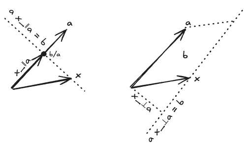
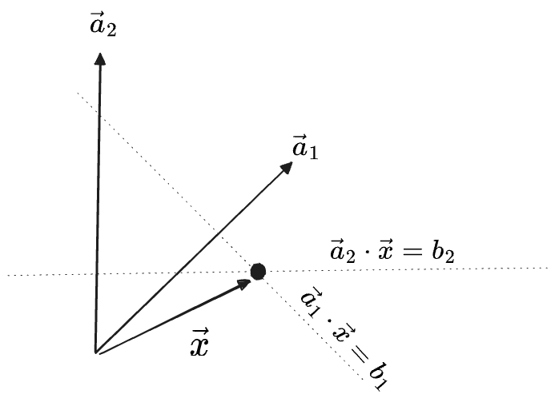
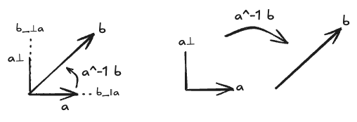

## Table of Contents

# Vector Division

I went to a lot of effort to justify the two multiplication operations $$\cdot, \times$$, because in my opinion these are typically introduced with too little justification, or even no attempt at interpretation at all, which tends to unmoor a student from reality.[^moored]

[^moored]: To be well-moored in reality is very important for one's sanity in the long run. And it helps to avoid spending too much of one's attention on useless things, such as one's grievances with one's high school math education.

It is even more unusual to consider "vector division" at all. But I have a strong suspicion it will be useful as we go on to develop linear algebra along these lines, so we're going to try to make it work.

We were, recall, able to define a (nonstandard) one-dimensional division of vectors that worked exactly like division of numbers:

$$
\frac{b\hat{\mathbf{e}}_1}{a\hat{\mathbf{e}}_1} = \frac{b}{a}
$$

This gave a scalar, telling us "how many copies of $$a$$ are needed to give $$\mathbf{b}$$". It is the inverse of scalar multiplication $$x\mathbf{a} = \mathbf{b}$$, with $$x$$ as some unitless number.

In 2D we immediately run into problems. The first is that we have three separate notions of "multiplication" to invert:

$$
\begin{aligned}
x\mathbf{a} = \mathbf{b}\\
\mathbf{a} \cdot \mathbf{x} = b\\
\mathbf{a} \times \mathbf{x} = b
\end{aligned}
$$

Note the three scalars appearing here—$$x, b, b$$ respectively—are not really all the same "type" of number. The first $$x$$ is dimensionless scalar, while $$b$$ in both cases should have units of (vector)$^2$. And furthermore, we could distinguish the two $$b$$s as being "symmetric" and "antisymmetric", or as being like a "(length)$^2$" vs. an (oriented area). In higher dimensions we will be able to make these distinctions more explicit. In particular, we will be able to define $$\mathbf{a} \times \mathbf{x}$$ to give something other than a number, so there will only be one sense of division of a "scalar by a vector" to worry about.

## Division 1: Projection as Scalar Division 

We'll take on $$x\mathbf{a} = \mathbf{b}$$ first. The immediate issue is that $$x = \frac{\mathbf{b}}{\mathbf{a}}$$ in the 1D case only made sense because the vectors were collinear. There is in most cases no "number of copies" of $$\mathbf{a}$$ that gives $$\mathbf{b}$$. We have a few options:
1. We could treat this like "dividing by zero"—expanding the class of forbidden denominators.
2. We could expand the type of thing "$$x$$" is to include solutions for *any* pair of vectors.
3. We could define the division $$\frac{\mathbf{b}}{\mathbf{a}}$$ to only divide the parallel parts of the vectors, i.e. giving $$\frac{b_a}{a}$$. Then we would have
 $$\mathbf{b} = \frac{\mathbf{b}}{\mathbf{a}}\mathbf{a} + \mathbf{b}_{\perp a}$$
   This is simple enough, but it would mean that our division operation is no longer a strict "inverse" of scalar multiplication.

This operation will be useful, so I won't choose option (1). Option (2) is interesting but broadens the question considerably; we'll return to it later on.

As a definition for the "division" of two vectors, I'll choose option (3): we'll define the division of two vectors as the division of their parallel components:

$$
\frac{\mathbf{b}}{\mathbf{a}} = \frac{b_a}{a}
$$

We will call this "scalar division (of vectors)" because it *produces* a scalar. Apparently, it is nothing but another way of writing a "projection".

This notation:
* reduces to regular division for one-dimensional vectors
* is clearly dimensionless, because it looks like dividing one thing with vectorial units by another
* is undefined if $$\mathbf{a}$$ is the zero vector, just like regular division
* is zero if $$\mathbf{b}$$ is perpendicular to $$\mathbf{a}$$.

Here I have introduced a convention which I have come to like: fraction notations like $\frac{\mathbf{b}}{\mathbf{a}}$ represent the "nicest" version of an operation, or the "standard" or "principal" part, rather than a full inverse. The fraction notation is therefore not invertible[^floor], that is:

$$
\frac{\mathbf{b}}{\mathbf{a}}\mathbf{a} = \mathbf{b}_{\parallel a} \ne \mathbf{b}
$$

[^floor]: This operation has a certain similarity to "floor division", i.e. like $$\lfloor \frac{13}{3}\rfloor = 4$$, with the $$\mathbf{b}_{\perp a}$$  component as the "remainder".  Another notation which suggests itself is then a double slash $$x = \mathbf{b} ~//~ \mathbf{a}$$, which is how floor division is notated in many programming languages.  Or a unicode double-slash could be used, $$x = \mathbf{b} \unicode{x244A} \mathbf{a}$$, or a fraction with a double bar line which I have no way to represent here.  We could further use a modulo sign to represent the "remainder", $$\mathbf{b}_{\perp a} = \mathbf{b} ~\%~ \mathbf{a}$$. While interesting, I'll stick with the regular division notation in this post.

Using this notation, we can easily decompose one vector into its projection and rejection by another: 

$$
\mathbf{b} = \frac{\mathbf{b}}{\mathbf{a}}\mathbf{a} + \frac{\mathbf{b}}{\mathbf{a}_\perp}\mathbf{a}_\perp
$$

If we are taking for granted a metric with which to define the lengths of vectors, this division operation is just an alias for

$$
\frac{\mathbf{b}}{\mathbf{a}} = \frac{\mathbf{a} \cdot \mathbf{b}}{{\vert \mathbf{a} \vert ^2}}
$$

Both the top and bottom of this fraction are length-dependent quantities, but the division-projection itself is a dimensionless scalar. Can it be defined in the absence of a scalar product?

To dip into some language we haven't introduced yet: I believe the answer is that a metric is required, but a scalar product is not. The above is the action of certain covector we'll call "$\frac{1}{\mathbf{a}}$" on $\mathbf{b}$, where that covector is defined such that $\frac{1}{\mathbf{a}} \cdot \mathbf{a} = 1$. In general that covector is not unique; there is one-dimensional space of covectors having that property which all agree on $\mathbf{a}$ but will in general disagree on $\mathbf{b}$. In order to choose one uniquely we either need:
- an inner product, so we can define $\frac{1}{\mathbf{a}} = \frac{\mathbf{a}^*}{a^2}$
- a metric $g$, with which to "lower" the index of $\mathbf{a}$. Then my $\frac{1}{\mathbf{a}} = \frac{g(\mathbf{a}, \cdot)}{g(\mathbf{a}, \mathbf{a})} = \frac{\mathbf{a}^\flat}{g(\mathbf{a}, \mathbf{a})}$.
- or, a privileged basis including $\mathbf{a}$ in which we assert that $\frac{1}{\mathbf{a}}\cdot \mathbf{e}_i = 0$ for all basis vectors except for $\mathbf{a}$.

In the present treatment I am not concerned with spaces lacking a scalar product, so we'll ignore these questions.

In fact, this division operation seems in many ways to be a more natural operation between two vectors than the scalar product itself. We can think of $\frac{\mathbf{b}}{\mathbf{a}}$ as the act of "measuring one vector with another along their parallel components", and $\frac{1}{\mathbf{a}}$ as "the function which performs this measurement". Then the scalar product of vectors can be implemented in terms of it:

$$
\mathbf{a} \cdot \mathbf{b} = {\vert \mathbf{a} \vert}^2 \frac{\mathbf{b}}{\mathbf{a}}
$$

## Division 2: Dot and Cross Division

Next we come to $$\mathbf{a} \cdot \mathbf{x} = b$$ and $$\mathbf{a} \times \mathbf{x} = b$$, which I'll treat together. Here there are two problems: the first is that we would like to be able to invert with respect to either argument—solving for $$\mathbf{x}$$ in terms of $$\mathbf{a}$$ or $$\mathbf{a}$$ in terms of $$\mathbf{x}$$. Conventional notation makes this difficult, but it's mostly a notational problem. 

More importantly, there can now be, rather than *zero* solutions for $$\mathbf{x}$$ as in the scalar division case, *many* solutions. The addition of any component perpendicular to $$\mathbf{a}$$ to $$x$$ won't change the value of $$\mathbf{a} \cdot \mathbf{x}$$, and the addition of any component along $$\mathbf{a}$$ won't change the value of $$\mathbf{a} \times \mathbf{x}$$. That is,

$$
\begin{aligned}
\mathbf{a} \cdot (\mathbf{x} + \lambda \mathbf{a}_\perp) = \mathbf{a} \cdot \mathbf{x} = b 
&&& 
\mathbf{a} \times (\mathbf{x} + \lambda \mathbf{a}) = \mathbf{a} \times \mathbf{x} = b
\end{aligned}
$$

In each diagram below, $$\mathbf{x}$$ can take any value along the dotted lines:

On the left the line of solutions is perpendicular to $$\mathbf{a}$$, consisting of all vectors $$\mathbf{x}$$ with $${x}_a = \frac{b}{a}$$. On the right it is the line parallel to $$\mathbf{a}$$ with $$x_{\bot a} = \frac{b}{a}$$.

We therefore have to make a choice in how we define these divisions:
1. We could skip these, treating them as undefined.
2. We could define the inverses of either product to give the entire _set_ of solutions, i.e. the "preimage" of $$b$$. We'd get:
	* For $$\mathbf{a} \cdot \mathbf{x} = b$$, we choose $$\mathbf{x} \in \{ \frac{b}{a}\hat{\mathbf{a}} + \lambda \mathbf{a}_\perp \mid \lambda \in \mathbb{R}\}$$ 
	* For $$\mathbf{a} \times \mathbf{x} = b$$, we choose $$\mathbf{x} \in \{ \frac{b}{a}\hat{\mathbf{a}}_\perp + \lambda \mathbf{a} \mid \lambda \in \mathbb{R}\}$$ 
  
	Note that these sets, being lines, are one-dimensional vector spaces themselves. We could also write these with the "constant" term factored out of the set, or even more succinctly in the "line" notation $$(\parallel a), (\perp a)$$ from above:

    $$
    \begin{aligned}
      \mathbf{x} &= \frac{b}{a}\hat{\mathbf{a}} + \mathbf{a}_\perp\{\lambda \mid \lambda \in \mathbb{R}\} \\
              &= \frac{b}{a}\hat{\mathbf{a}} + (\perp a)  \\
      \mathbf{x} &= \frac{b}{a}\hat{\mathbf{a}}_\perp + \mathbf{a}\{\lambda  \mid \lambda \in \mathbb{R}\} \\
              &= \frac{b}{a}\hat{\mathbf{a}}_\perp + (\parallel a) 
    \end{aligned}
    $$

3. We define the inverse of both products to be, not the set of all solutions as in (2), but the function of $$\lambda$$ which gives any element of that set, like this:
	* For $$\mathbf{a} \cdot \mathbf{x} = b$$, we get $$\mathbf{x} = \lambda \mapsto \frac{b}{a}\hat{\mathbf{a}} + \lambda \mathbf{a}_\perp$$ 
	* For $$\mathbf{a} \times \mathbf{x} = b$$, we get $$\mathbf{x} = \lambda \mapsto \frac{b}{a}\hat{\mathbf{a}}_\perp + \lambda \mathbf{a}$$ 
4. We define the inverse of the products to be the "simplest" value from the set in (2), which is the value for $$\lambda = 0$$ in (3), like this:
	* We choose the principal value of $$\mathbf{x}$$ for $$\mathbf{a} \cdot \mathbf{x} = b$$ to be the vector parallel to $$\mathbf{a}$$ which satisfies the equation, i.e. $$\mathbf{x} = \frac{b}{a}\hat{\mathbf{a}} = \frac{b}{a^2}\mathbf{a}$$.
	* We choose the principal value $$\mathbf{x}$$ for $$\mathbf{a} \times \mathbf{x} = b$$ to be perpendicular to $$\mathbf{a}$$ in the direction which gives the correct sign for the cross product; this is $$\mathbf{x} = \frac{b}{a}\hat{\mathbf{a}}_\perp$$. Thinking ahead to three dimensions, even this won't even be enough: there will be an entire plane of vectors satisfying $$\mathbf{a} \times \mathbf{x} = b$$. We'll solve this by changing the definition of $$\times$$, though.

Option (1)—just don't do this—is standard, but I'm going to try to make the others work.

We will take (2) and (3) together as the same operation—which of the "set" or "an element of the set" is meant will be made clear from the context. These will be our first two examples of "generalized inverses"—multi-valued functions which arise as the inverses of forgetful operations. Our general rule will be to use $$(\cdots)^{-1}$$ notations for "generalized inverses". The following notations will suffice:

$$
\begin{aligned}
{(\mathbf{a}~\cdot)}^{-1} b&&& {(\mathbf{a}~\times)}^{-1} b\\
{(\cdot~\mathbf{a})}^{-1} b&&& {(\times~\mathbf{a})}^{-1} b
\end{aligned}
$$

In each case the returned value is what would go in the "missing slot" of the product.

We can write an expression which treats this like a set:

$$
\mathbf{a} \cdot \mathbf{x} = b \to \mathbf{x} \in {(\mathbf{a}~\cdot)}^{-1} b
$$

Or we can replace the expression with a $$\lambda$$ parameter whenever it makes sense in the context:

$$
{(\mathbf{a}~\cdot)}^{-1} b = \frac{b}{a}\hat{\mathbf{a}} + \lambda \mathbf{a}_\bot
$$

We will always use Greek letters for the parameters brought in by generalized inverses, particularly $$\lambda$$ after Lagrange multipliers, which play the same role.

Then for (4), following the previous choice of $$\frac{\mathbf{b}}{\mathbf{a}} = \frac{b_a}{a}$$, we will use "division" notation to represent the "principal value" of the inverse.[^divtimes]

[^divtimes]: Another notation which comes to mind is to use $$\div$$ for an inverse of the dot product, because it looks like a fraction with dots on the top and bottom: $$\mathbf{x} = b \div \mathbf{a}$$. We can hack a version for $$\times$$, too: $$\mathbf{x} = b ~\substack{\small\times \\ \_\_ \\ \small\times}~ \mathbf{a}$$.  I don't have full LateX support here, so that's written `~\substack{\small\times \\ \_\_ \\ \small\times}~`. I don't think it's too bad! We could also go in the "floor division" direction as mentioned earlier. But I think the fraction notation will be sufficient. 

$$
\begin{aligned}
\frac{b}{\mathbf{a}~\cdot} &= ({(\mathbf{a}~\cdot)}^{-1} b)(\lambda)\bigg|_{\lambda=0} = \frac{b}{a}\hat{\mathbf{a}}
\\
\frac{b}{\cdot~\mathbf{a}} &= ({(\cdot~\mathbf{a})}^{-1} b)(\lambda)\bigg|_{\lambda=0} = \frac{b}{a}\hat{\mathbf{a}} 
\end{aligned}
$$

At the present level of abstraction the two placements for the $\cdot$ give the same vectorial result, $\frac{b}{a}\hat{\mathbf{a}}$. But I'll continue to distinguish these, both to maintain the parallel with the $\times$ case, and to allow that they might diverge later on (if we distinguish covectors from vectors, say).

For $$\times$$ we make use of $$\mathbf{a} \times \mathbf{b} = \mathbf{a}_\bot \cdot \mathbf{b}$$:

$$
\begin{aligned}
\frac{b}{\mathbf{a}~\times} = ({(\mathbf{a}~\times)}^{-1} b)(\lambda)\bigg|_{\lambda=0} &= \frac{b}{a}\hat{\mathbf{a}}_\bot \\
&= \frac{b}{\mathbf{a}_\bot \cdot} \\
\\
\frac{b}{\times~\mathbf{a}} = ({(\times ~ \mathbf{a})}^{-1} b)(\lambda)\bigg|_{\lambda=0} &= -\frac{b}{a}\hat{\mathbf{a}}_\bot \\
&= \frac{b}{\cdot~(-\mathbf{a}_\bot)} \\ 
\end{aligned}
$$

Note that using $$\mathbf{a}$$ as the second argument of $$\times$$ flips the sign.

## Systems of Equations

As an example of the how one might use these inverses, we'll try to solve a system of two linear equations:

$$
\begin{aligned}
a_{1,x} x + a_{1,y} y = b_1 &&&
a_{2,x} x + a_{2,y} y = b_2
\end{aligned}
$$

We can rewrite this as two dot products with a single vector $$\mathbf{x} = (x, y)$$:

$$
\begin{aligned}
\mathbf{a}_1 \cdot \mathbf{v} = b_1 &&&
\mathbf{a}_2 \cdot \mathbf{v} = b_2
\end{aligned}
$$

Then the generalized inverses of these two dot products correspond to two *lines*. The overall solution is their intersection:

$$
\mathbf{v} \in \left(\frac{b_1}{\mathbf{a}_1 ~ \cdot} + (\perp a_1)\right) \cap \left(\frac{b_2}{\mathbf{a}_2 ~ \cdot} + (\perp a_2)\right)
$$

Here is the solution to one such system:

Apparently:
1. if $$(\perp a_1)$$ and $$(\perp a_2)$$ are parallel, and $$\frac{b_1}{\mathbf{a}_1 ~ \cdot} = \frac{b_2}{\mathbf{a}_2 ~ \cdot}$$, then the two lines are the same and there are infinitely many solutions—the full set is given by either gen. inverse on its own.
2. if $$(\perp a_1)$$ and $$(\perp a_2)$$ are parallel, but the two constants aren't equal, there are zero solutions—parallel lines never intersect.
3. if they aren't parallel then there is exactly one solution; the intersection of the lines.

To check if the two lines are parallel we simply see if $$\mathbf{a}_{1,\perp} \times \mathbf{a}_{2,\perp} = 0$$. This is the same as $$\mathbf{a}_{1} \times \mathbf{a}_{2}$$ by rotational invariance:

$$
0 \stackrel{?}{=} \mathbf{a}_{1,\perp} \times \mathbf{a}_{2,\perp} = \mathbf{a}_{1} \times \mathbf{a}_{2}  = a_{1, x} a_{2, y} - a_{1, y} a_{2, x}
$$

Then to find the solution for (3), we need to find the intersection of the two lines. We can find this by plugging one generalized inverse into the other constraint and then using algebra:

$$
\begin{aligned}
\mathbf{a}_2 \cdot \left(\frac{b_1}{\mathbf{a}_1}+ \lambda_1 \mathbf{a}_{1, \perp}\right) &= b_2 \\
\mathbf{a}_2 \cdot (\lambda_1 \mathbf{a}_{1, \perp}) &= b_2  - \mathbf{a}_2 \cdot \frac{b_1}{\mathbf{a}_1} \\
\lambda_1 &= \frac{b_2 - \frac{b_1}{a_1^2}(\mathbf{a}_2 \cdot \mathbf{a}_1)}{ \mathbf{a}_2 \cdot \mathbf{a}_{1, \perp}} \\
  &= \frac{b_2 - \frac{b_1}{a_1^2}(\mathbf{a}_2 \cdot \mathbf{a}_1)}{ \mathbf{a}_1 \times \mathbf{a}_{2}}
\end{aligned}
$$

Here we've used $$\mathbf{a}_2 \cdot \mathbf{a}_{1, \perp} = a_{2,x} (-a_{1, y}) + a_{2,y} a_{1,x} = \mathbf{a}_1 \times \mathbf{a}_2$$ to rewrite the denominator as a cross-product.

This is an explicit solution for $$\lambda_1$$ and therefore for $$\mathbf{v} = \frac{b}{\mathbf{a}_1} + \lambda_1 \mathbf{a}_{1, \perp}$$. If the denominator is zero then $$\lambda_1 \to \infty$$, representing "no solutions" (2), unless the numerator is *also* zero, in which case *any* $$\lambda_1$$ will work (1), which can be seen as just another "generalized inverse": $$\lambda_1 = 0/0 = \lambda$$.

These are standard calculations, but this method has the advantage of being almost entirely algebraic. We haven't even needed to use the word "matrix" or "determinant". But it will turn out to be a great simplification to think of solutions to systems of equations as the intersection of row-solutions, especially in the case of underdetermined systems (our case 1 above). We will see much more of this kind of thing later on.

## Division 3: Operator Inverses

In the discussion of scalar division, we punted on the idea of expanding the space of solutions to allow for a full inverse of "regular scalar multiplication" $x \mathbf{a} = \mathbf{b}$. We'll return to that now.

What is needed is a "full inverse" $\mathbf{a}^{-1}(\mathbf{b})$ whose action on $\mathbf{a}$ is $\mathbf{a}^{-1}(\mathbf{b})\mathbf{a} = \mathbf{b}$, as opposed to the fraction $\frac{\mathbf{b}}{\mathbf{a}}$ whose action was only a projection.

Of course, in this case it will no longer *be* "scalar multiplication", the result *won't* be a scalar. We might think to consider solutions within the space of 2x2 matrices, which I'll write as $X$. But the above condition is too broad to identify a unique inverse in this space, which is most easily seen by working in the basis $(\mathbf{a}, \mathbf{a}_\perp)$, where the condition $X\mathbf{a} = \mathbf{b}$ has component form:

$$
\begin{pmatrix} b_a \\ b_{\perp a} \end{pmatrix} 
= 
X 
\begin{pmatrix} a \\ 0 \end{pmatrix}
=
\begin{pmatrix} \frac{b_a}{a} & ? \\ \frac{b_{\perp a}}{a} & ? \end{pmatrix}
 
\begin{pmatrix} a \\ 0 \end{pmatrix}
$$

Only two of the four components of $X$ are determined by the condition $X\mathbf{a} = \mathbf{b}$. How should we determine the others?

One way is to look at the expression for a full "decomposition of a vector"

$$
\mathbf{b} = \frac{\mathbf{b}}{\mathbf{a}}\mathbf{a} + \frac{\mathbf{b}}{\mathbf{a}_\perp}\mathbf{a}_\perp
$$

and ask if we can factor this entire expression as something that operates on $$\mathbf{a}$$ alone, like this:

$$
\mathbf{b} = \left(\frac{\mathbf{b}}{\mathbf{a}}I + \frac{\mathbf{b}}{\mathbf{a}_\perp}R\right) \mathbf{a}
$$

Here $I$ is the two-by-two identity operator, and $$R$$ is an operator which implements a $$\pi/2$$ rotation of $$\mathbf{a}$$, consistent with our original definition of $$\mathbf{a}_\perp$$. 

The object in parentheses is an inverse of "scalar multiplication":

$$
\begin{aligned}
X = \mathbf{a}^{-1}(\mathbf{b}) = \left(\frac{\mathbf{b}}{\mathbf{a}}I + \frac{\mathbf{b}}{\mathbf{a}_\perp}R\right)
\end{aligned}
$$

If $\mathbf{a}, \mathbf{b}$ are exactly perpendicular to each other, the inverse  $$\mathbf{a}^{-1}(\mathbf{b})$$ becomes a pure rotation, while for parallel ones it would be a pure scaling. For anything in between it comes out to a linear combination of the two, representing the scaling and a rotation which must be applied to turn $$\mathbf{a}$$ into $$\mathbf{b}$$: 

It amounts to following choices for the unspecified components:

$$
\begin{align}
X = \mathbf{a}^{-1}(\mathbf{b}) 
&=  \frac{b_a}{a} I + \frac{b_{\perp a}}{a} R \\
&= \begin{pmatrix} \frac{b_a}{a} &  \\ & \frac{b_a}{a} \end{pmatrix} + \begin{pmatrix} & -\frac{b_{\perp a}}{a}  \\ \frac{b_{\perp a}}{a} & \end{pmatrix} \\
&= \begin{pmatrix} \frac{b_a}{a} & -\frac{b_{\perp a}}{a}  \\ \frac{b_{\perp a}}{a} & \frac{b_a}{a} \end{pmatrix}
\end{align}
$$

This is a full inverse within the smaller space of 2x2 matrices whose actions are invariant with respect to rotations of the space, that is, those matrices $M$ which "commute" with $R$, obeying $R^T M R = M$:

$$
\mathbf{b}^T M \mathbf{a} = (R\mathbf{b})^T M (R\mathbf{a}) = \mathbf{b}^T (R^T M R) \mathbf{a} 
$$

This limitation feels acceptable, as "respecting rotations" was one of the principles we used to come up with our multiplication operations in the first place. So we'll commit, and our definition of the "full inverse" of scalar multiplication will be:

$$
\mathbf{a}^{-1}(\mathbf{b}) = \left(\frac{\mathbf{b}}{\mathbf{a}}I + \frac{\mathbf{b}}{\mathbf{a}_\perp}R\right)
$$

Here I've notated this as a "function" $$\mathbf{a}^{-1}$$ acting on $$\mathbf{b}$$, giving an "operator" which can then act on other vectors. If you instead want to think of $\mathbf{a}^{-1}$ as "multiplying" $\mathbf{b}$, you probably would want to define it to compose with $$\mathbf{a}$$ from the left as $$\mathbf{b} = \mathbf{a}\mathbf{a}^{-1}\mathbf{b}$$. 

Using the $$\sin, \cos$$ versions of the projections gives

$$
\mathbf{a}^{-1}(\mathbf{b}) = \frac{b}{a}(I\cos \theta_{a b} + R \sin \theta_{a b})
$$

which acts exactly like the division of two complex numbers: 

$$
\begin{align}
\frac{b}{a} &= \frac{r_b e^{i \theta_b}}{r_a e^{i \theta_a}} = \frac{r_b}{r_a}e^{i (\theta_b - \theta_a)} \\
  &= \frac{r_b}{r_a} \left( \cos{(\theta_b - \theta_a)} + i \sin{(\theta_b - \theta_a)}\right)
\end{align}
$$

We can follow the lead of the complex operation and write our vector inverse as a matrix exponential, which looks strange the first time you see it but simply stands for its power series:

$$
\begin{align}
\mathbf{a}^{-1}(\mathbf{b}) &= \frac{b}{a}  \exp{(\theta_{ab} R)} \\
  &= \frac{b}{a} \left( I + R \theta_{ab} + \frac{{(R\theta_{ab})}^2}{2!} + \frac{{(R\theta_{ab})}^3}{3!} + \cdots \right) \\
  &= \frac{b}{a} \left( I + R \theta_{ab} - I\frac{{(\theta_{ab})}^2}{2!} - R\frac{{\theta_{ab}}^3}{3!} + \cdots \right) \\
  
  &= \frac{b}{a} \left( I - I\frac{{(\theta_{ab})}^2}{2!} + \cdots \right) +  \frac{b}{a}\left( R \theta_{ab} - R\frac{{\theta_{ab}}^3}{3!} + \cdots \right) \\
  &= \frac{b}{a}(I\cos \theta_{a b} + R \sin \theta_{a b})
\end{align}
$$

In the above we used $R^2 = -I$ and $R^3 = -R$, which follows from $R$ being a rotation operator.

Note that while we started only with a $$90$$-degree rotation operator $$R$$, both the exponential or sine/cosine expressions allow us to implement rotation by _any_ $$\theta$$.

## Division 4: Geometric Division

Now we bring together a few of the strands we've followed so far.

In the previous post we tentatively combined the dot and cross products of a pair of vectors into a single vector in a new vector space, called the geometric product:

$$
\mathbf{a} \circ \mathbf{b} = (\mathbf{a} \cdot \mathbf{b}) \hat{\mathbf{f}}_{1} + (\mathbf{a} \times \mathbf{b}) \hat{\mathbf{f}}_{2}
$$

Additinally, we established above that the inverses of the dot and cross product each determine one of the target vectors only up to a line (in 2D). This implies that if we simultaneously knew the values of $\mathbf{a} \cdot \mathbf{x} = b_{1}$ and $\mathbf{a} \times \mathbf{x} = b_{2}$, the intersection of these would determine an exact value for $\mathbf{x}$. Unlike a full system of equations, these two conditions always have a solution (since the first argument $\mathbf{a}$ is shared between the two.)

This implies that, if we were somehow handed a specific value in the geometric-product space of $(\hat{\mathbf{f}}_{1}, \hat{\mathbf{f}}_{2})$, we could determine either of its arguments given the other. In other words, the following "geometric division" operation should always have an exact solution[^intersect]:

$$
\begin{align}
\mathbf{x} &= \frac{b_1 \hat{\mathbf{f}}_1 + b_{2} \hat{\mathbf{f}}_{2}}{\mathbf{a} ~\circ} \\
  &= ({(\mathbf{a}~ \cdot)}^{-1} (b_1)) \cap ({(\mathbf{a} ~ \times )}^{-1} (b_2))

\end{align}
$$

and we can also define an inverse with respect to the first argument, $\frac{\cdots}{\: \circ ~\mathbf{a}}$.

[^intersect]: The intersection appearing in the geometric inverse looks suspicious. But this is really exactly how a matrix inverse works: if you view $A \mathbf{x} = \mathbf{b}$ as a set of constraints $\mathbf{A}^j \cdot \mathbf{x} = b^j$, the solution is $\mathbf{x} = {(\mathbf{A}^1)}^{-1}(b^1) \cap {(\mathbf{A}^2)}^{-1}(b^2) \cap \cdots$. Indeed, the geometric product $\mathbf{a} \circ \mathbf{b}$ could simply be written as a matrix equation.

Now, suppose the specific geometric-product-vector we were handed was exactly $\mathbf{a} \circ \mathbf{b}$. In this case, we would clearly have 

$$
\begin{align}
\mathbf{b} = \frac{\mathbf{a} \circ \mathbf{b}}{\mathbf{a} \circ \:} &= \frac{ab_a \hat{\mathbf{f}}_1 + ab_{\perp a} \hat{\mathbf{f}}_{2}}{\mathbf{a} \circ \:} \\
  &= \frac{(ab \cos{\theta_{ab}}) \hat{\mathbf{f}}_1 + (ab \sin{\theta_{ab}}) \hat{\mathbf{f}}_{2}}{\mathbf{a} \circ \:}
\end{align}
$$

The above is conspicuously similar to the "operator inverse" or "matrix division" just discussed:

$$

\mathbf{b} = (\mathbf{a}^{-1}(\mathbf{b})) \mathbf{a} = \left(\left( \frac{b}{a} \cos \theta_{a b} \right) I + \left(\frac{b}{a} \sin \theta_{a b}\right) R\right) \mathbf{a}
$$

Both are true inverses. The difference is whether the inverse operation is applied to $\mathbf{a}$ first and then acts on $\mathbf{b}$, or whether $\mathbf{a} \circ \mathbf{b}$ is applied first and then an inverse is taken. The situation is akin to the different ways of writing fractions

$$
b = a\frac{b}{a} = \frac{ab}{a}
$$

except that in the present situation, it is as if the terms $ab$, $\frac{b}{a}$, and the vectors $a, b$ themselves all have different "types".

Can we unify these two constructs? One way would be to:
- identify $\mathbf{a}^{-1}(\mathbf{b})$ with the geometric product $\frac{1}{\mathbf{a}} \circ \mathbf{b}$, where $\frac{1}{\mathbf{a}}$ is the metric-dependent "inverse vector" we touched on earlier.
- identify $\hat{\mathbf{f}}_1$ with $I$ and $\hat{\mathbf{f}}_2$ with $R$
- identify the action of a geometric product on a vector as being that of matrix multiplication by the basis matrices $I, R$.

But this feels tenuous. I can't see a clear path forward. I am not comfortable simply saying these are the same thing, even if it works in this instance. We can apparently *map* geometric-product-vectors to superpositions of $I, R$ operators, but it is a stretch to say they are the *same kind of thing*. So I'll leave it there for now.

## Recap

To recap, we have come up with inverses for three different multiplication operations:
1. Scalar multiplication $$x\mathbf{a} = \mathbf{b}$$. We define only a principal value, "scalar division", as $$x = \frac{\mathbf{b}}{\mathbf{a}}$$, and this can fail to exist if the two vectors are perpendicular, akin to dividing by zero.
2. The dot product $$\mathbf{a} \cdot \mathbf{x} = b$$, for which we define a generalized inverse $$(\mathbf{a}~\cdot)^{-1}b = \frac{b}{a}\hat{\mathbf{a}} + (\perp a)$$ and a principal value $$\mathbf{x} = \frac{b}{\mathbf{a}~\cdot} = \frac{b}{a}\hat{\mathbf{a}}$$, which always exists unless $$\mathbf{a} = 0$$.
3. The cross product $$\mathbf{a} \times \mathbf{x} = b$$, with a generalized inverse $$(\mathbf{a}~\times)^{-1}b = \frac{b}{a}\mathbf{a}_\perp + (\parallel a)$$ and a principal value $$\mathbf{x} = \frac{b}{\mathbf{a}~\times} = \frac{b}{\mathbf{a}_\bot ~\cdot} = \frac{b}{a}\hat{\mathbf{a}}_\bot$$, which always exists unless $$\mathbf{a} = 0$$.
4. More experimentally, an inverse of multiplication $$X\mathbf{a} = \mathbf{b}$$ which is an operator or 2x2 matrix in the subspace generated by $I, R$. I've chosen to write this $X = \mathbf{a}^{-1}(\mathbf{b})$.
5. An inverse of the geometric product $\mathbf{a} \circ \mathbf{x} = b_1 \hat{\mathbf{f}}_1 + b_{2} \hat{\mathbf{f}}_{2}$, whose value is the intersection of the two constraints represented by that product: $\mathbf{x} = ({(\mathbf{a}~ \cdot)}^{-1} (b_1)) \cap ({(\mathbf{a} ~ \times )}^{-1} (b_2))$

None of these are conventional notations, though the "geometric product" definition comes close to that used in "geometric algebra".

Ultimately, the test of whether these notations are wise choices wil be:
* are they algebraically self-consistent?
* or are they, at least, easy enough to use accurately that a user doesn't mind their inconsistencies?
* are they useful?
  
The human mind can get used to a _lot_ of caveats. (We become accustomed to many in the course of our educations.) So even a notation with a lot of weird loopholes should not be too hard to work with, given sufficient practice. But it has to be worth the effort.

For more on division notations, see my dedicated post on <a href="/posts/2025-01-21-linear-algebra-1/">Division</a>, where I try to make sense of the matrix inverse and other operations in terms similar to these ones.

With that we conclude our discussion of two-dimensional vectors. In next post we'll take on the case of 3-or-more dimensions, where, hopefully, all this preparatory work will start to show its power.

 

 