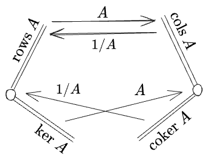
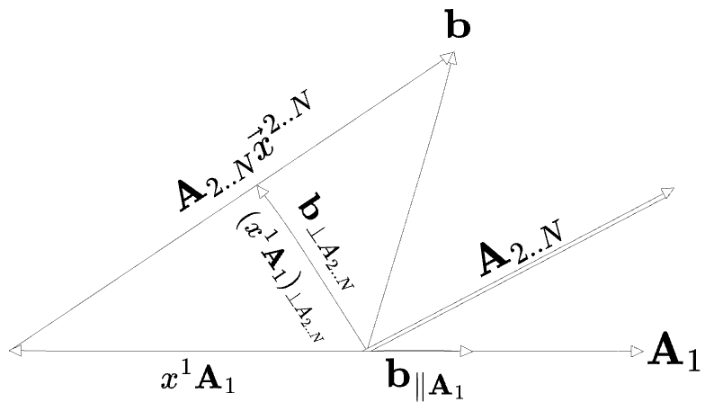
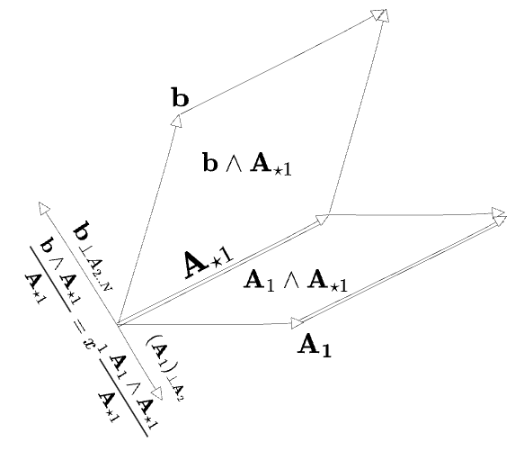

#### Table of Contents

## Introduction

The opposite of multiplication is division, right?

This series of posts will attempt to develop a *non-standard* notation for linear and exterior algebra by making extensive use of "division". I'm not sure if this is actually a good idea, so the reader should beware.

## Scalar / Scalar

If $$a$$ and $$b$$ are numbers, solve for $$x$$: 

$$
ax = b
$$

There are three cases:
 

**Case 1**: $$x$$ is the number $$\frac{b}{a}$$.

 

**Case 2**: ... unless $$a$$ is zero, in which case $$x = \frac{1}{0}$$ and there's no solution.

 

**Case 3**: ... unless $$b$$ is also zero, in which case $$x = \frac{0}{0}$$ and any number is a solution.

 
Easy. Now let's talk about vectors.

## Scalar / Vector

If $$\mathbf{a}$$ and $$\mathbf{x}$$ are vectors in $$\mathbb{R}^N$$, solve for $$x$$: 

$$
\mathbf{a}\cdot \mathbf{x} = b
$$

Three cases again:[^elemlinalg]
1. No solution, unless we're in one dimension. The equation fixes the component of $$\mathbf{x}$$ onto $$\mathbf{a}$$ to be $$\frac{\mathbf{a}}{\vert a\vert^2}b$$, but we're free to add any perpendicular vector without changing the answer.
2. ... unless $$\mathbf{a}$$ is zero, in which case even there are no solutions.
3. ... unless $$b$$ is also zero, in which case any $$N$$-vector is a solution.

[^elemlinalg]: For a thorough exploration of this kind of division, see my post on *<a href="/posts/2024-11-01-dimensions/">Elementary Linear Algebra</a>*.

Note (2) and (3) are the same special cases as in scalar division.

For (1), the set of solutions is a "generalized inverse" of the function "dot product with a vector $$\mathbf{a}$$", which I'll write

$$
\mathbf{x} = {(\mathbf{a} \cdot ~)}^{-1}(\mathbf{b})
$$

This can be thought of in a few ways:
- a) as a *set* of solutions $${(\mathbf{a} \cdot ~)}^{-1}(\mathbf{b}) \{ \mathbf{x} \mid \mathbf{a}\cdot \mathbf{x} = b \}$$
- b) or as a "standard" solution $$\frac{\mathbf{a}}{\vert a\vert^2}b$$ plus any single element from the orthogonal subspace $$\{ \mathbf{\lambda} \mid \mathbf{a}\cdot \mathbf{\lambda} = 0 \}$$
- c) or as a function to solutions, depending on the choice of element in the orthogonal subspace: $$\lambda \mapsto \mathbf{x}(\lambda)$$

Of these, (a) is most commonly seen, but in this post I'll prefer (c). 

My preferred notation will be as follows. The full inverse be represented by $${(\mathbf{a} \cdot ~)}^{-1}$$, and depending on the context can have any of the above three interpretations as the full affine set, a standard part plus a homogenous set, or a function to a single value.
A "fraction" or "division" notation $$\frac{b}{\mathbf{a}}$$ will always stand for the "standard" or "natural" part of the inverse. We then use $$\mathbf{\lambda}_{\perp \mathbf{a}}$$ for the "orthogonal" or "complement" term:

$$
\begin{aligned}
\mathbf{x}(\mathbf{\lambda}_{\perp a}) &= {(\mathbf{a} \cdot ~)}^{-1}(\mathbf{b}) \\
&\equiv \frac{b}{\mathbf{a}} + \mathbf{\lambda}_{\perp \mathbf{a}}
\end{aligned}
$$

This full solution will be called either a "general solution" or a "generalized inverse". The "standard" term might also be called the "principal value" or "adjoint". $$(\perp {a})$$ itself will be taken to represent the subspace perpendicular to $$\mathbf{a}$$, and this notation writes $$\lambda$$ as a projection $$(\perp a)$$ indicating that it is a member of that space. When it's unambiguous I'll drop the subscript from $$\mathbf{\lambda}$$, and I'll frequently omit the $$\mathbf{\lambda}$$ argument from $$\mathbf{x}$$ itself. So the short version of the general solution is:

$$
\mathbf{x} = \frac{b}{\mathbf{a}} + \mathbf{\lambda}
$$

The "division" notation is the main point of all this. This "generalized inverse" with a "division" for a "standard part", will be our 4th "prototype" case of division:

 

**Case 4**: Division gives a solution only up to the addition of a term which multiplies to zero, for whatever definition of "multiplies" we're currently using.

 

This is non-standard, reader beware, but my aim is to take it as far as I can, as a way of unifying what would otherwise be a number of distinct concepts.

How should "division by a vector" work, then? It is apparently equivalent to $$\frac{\mathbf{a}}{\vert a\vert^2}$$, so we have:

$$
\begin{aligned}
\mathbf{a} \cdot \mathbf{x} &= \mathbf{a} \cdot \frac{b}{\mathbf{a}} + \mathbf{a} \cdot \mathbf{\lambda}_{\perp \mathbf{a}} \\
&= b
\end{aligned}
$$

The two copies of $$\mathbf{a}$$ in "$$\mathbf{a} \cdot \frac{b}{\mathbf{a}}$$" simply cancel out. It's right to think of this as just $$b$$ times $$\mathbf{a} \cdot \frac{1}{\mathbf{a}}$$; $$\frac{1}{\mathbf{a}}$$ multiplies against a thing to measure "how many copies of $$\mathbf{a}$$ are in it". It might be convenient to omit the dot product and just write $$\mathbf{a} \cdot \frac{b}{\mathbf{a}} = \mathbf{a} \frac{b}{\mathbf{a}} = b$$. Then we can even write this as $$\frac{\mathbf{a}}{\mathbf{a}}$$. Then we can extend this to multiplication by a *multiple* of $$\mathbf{a}$$ in the obvious way:

$$
(c\mathbf{a})\frac{1}{\mathbf{a}} = \frac{(c\mathbf{a})}{\mathbf{a}} = c
$$

and

$$
(\mathbf{a})\frac{1}{c\mathbf{a}} = \frac{1}{c}\frac{(\mathbf{a})}{\mathbf{a}} = \frac{1}{c}
$$

But we'll want to be careful about assuming these act like regular fractions in any other ways—these "fractions" will only have the specific properties we name. 

We'll take on the case of vectors not parallel to $$\mathbf{a}$$ in the next section.

The standard part $$\frac{b}{\mathbf{a}}$$ is technically better thought of as a "dual vector", which we can associate to the corresponding vector $$b\frac{\mathbf{a}}{\vert\mathbf{a}\vert^2}$$ through a scalar product. At the current level of sophistication they will be equivalent, but I will use the *name* $$\frac{b}{\mathbf{a}}$$ as it is more suggestive of the meaning of this thing—I'm interested in making the simple cases simple, not in full generality.

The remainder $$\mathbf{\lambda}_{\perp \mathbf{a}}$$ is another vector in the same space as $$b/\mathbf{a}$$. It can be given "coordinates" on the $$(N-1)$$-dimensional space $$\perp \mathbf{a}$$ if we choose a basis.

In 2D we can span the space $$(\perp \mathbf{a})$$ with the single vector $$\mathbf{a}_\perp = (-a_2, a_1)$$, rotated 90 degrees from $$\mathbf{a}$$. Then the inverse has a single scalar coordinate $$\lambda$$:

$$
\mathbf{x}(\lambda) = \frac{b}{\mathbf{a}} + \lambda{\mathbf{a}_\perp}
$$

Note that I've used $$(\perp \mathbf{a})$$ for the *subspace*, but $$\mathbf{a}_{\perp}$$ with a subscript for the vector itself. Note also that, although $$\mathbf{a}_{\perp}$$ would seem to be the obvious choice for a second basis vector, it is exactly as suitable as any other vector in $$(\perp \mathbf{a})$$ for the purposes of parameterizing the complement term; only the value of $\lambda$ will change accordingly—in fact, $\lambda$ can simply be thought of as being defined by division $\frac{\mathbf{x}}{\mathbf{a}_\perp}$.

In $$N$$ dimensions we need $$(N-1)$$ basis vectors, which I will call $$\left\{\mathbf{f}_{2}, \mathbf{f}_{ 3, ...}\right\}$$, reserving $$\mathbf{e}$$ for a basis on the entire space. We can put these in an $$N \times (N-1)$$ matrix $$F_{\perp a}= \left(\mathbf{f}_{ 2}, \mathbf{f}_{ 3, ...}\right)$$; then the vector $$\mathbf{\lambda}$$ will have coordinates in this basis, which can be written as a matrix multiplication:

$$
\begin{aligned}
\mathbf{\lambda} = \lambda^2 \mathbf{f}_2 + \lambda^3 \mathbf{f}_3 + \ldots \lambda^{N} \mathbf{f}_{N} 
&= \begin{pmatrix}\\\mathbf{f}_2 & \mathbf{f}_3 & \ldots & \mathbf{f}_{N}\\~\end{pmatrix}
\begin{pmatrix}\lambda^2 \\ \lambda^3 \\ \vdots \\ \lambda^{N}\end{pmatrix} \\
&= F_{\perp a}  \begin{pmatrix}\lambda^2 \\ \lambda^3 \\ \vdots \\ \lambda^{N}\end{pmatrix} \\
\end{aligned}
$$

I'll use the symbol $$\vec{\lambda}$$ for the $$(N-1)$$-dimensional component vector $$(\lambda_2, \lambda_3, ...)^T$$, distinguishing it from the $$N$$-dimensional vector $$\mathbf{\lambda}$$. Then the full inverse is:

$$
\mathbf{x} = \frac{b}{\mathbf{a}} + F_{\perp a} \vec{\lambda}
$$

If the same basis is used for $$\mathbf{x}$$ and $$\mathbf{a}$$, filling in the last dimension with $$\mathbf{f}_1 = \hat{\mathbf{a}} = {\mathbf{a}}/{\vert\mathbf{a}\vert}$$, we could also write the entire equation in components and leave out $$E_{\perp a}$$ entirely:

$$
\begin{pmatrix}x^1 \\ x^2 \\ \vdots \\x^N\end{pmatrix}
= 
\begin{pmatrix}\frac{b}{a} \\ 0\\ \vdots \\0 \\\end{pmatrix}
+ 
\begin{pmatrix}0 \\ \lambda^2 \\ \vdots \\\lambda^N \\\end{pmatrix}
$$

This demonstrates that the "generalized inverse" acts like a combination of:
- regular division on the single dimension $$\hat{\mathbf{a}}$$, with solution $$\frac{b}{a}$$.
- zero divided by zero on the other $$(N-1)$$ dimensions, with the $$\lambda^i$$ free parameter representing "any solution" to these divisions. 

This is rather imprecise, though: $$\mathbf{a} \cdot \mathbf{x} = b$$ could just as easily be interpreted as $$0 / a$$ in the first dimension and $$b/0$$ in one of the others, and in this view would have no solution. 

Before we move on, I'll note one common example that works like this: the integral $$\int \cdots dx$$ is the inverse of a derivative operator $$\frac{d}{dx}$$ but only up to an integration constant $$C$$:

$$
\begin{aligned}
\frac{df}{dx} &= g\\
 f &= {\left(\frac{d}{dx}\right)}^{-1} g \\
&= \int g~dx + C
\end{aligned}
$$

The constant function $$C$$ therefore is the "orthogonal complement" of $$\frac{d}{dx}$$, considered as a linear operator on functions.

 

## Vector / Vector

If $$\mathbf{a}$$ and $$\mathbf{b}$$ are vectors in $$\mathbb{R}^N$$, solve for $$x$$:

$$
\mathbf{a}x = \mathbf{b}
$$

Three basic cases:
1. If $$\mathbf{a}$$ and $$\mathbf{b}$$ are parallel, then $$x$$ is the ratio between their lengths. So if $$\mathbf{b} = \frac{b}{a}\mathbf{a}$$, then $$x = \frac{b}{a}$$. Easy.
2. ... unless $$\mathbf{a} = 0$$, in which case there's no solution.
3. ... unless $$\mathbf{b} = 0$$, in which case any $$x$$ is a solution.

But if $$\mathbf{b}$$ isn't parallel to $$\mathbf{a}$$, we don't get any of the above. So we'll add a 5th case: 

 

**Case 5**: Division can be defined to give a standard part but is not a "generalized inverse" of multiplication. Instead a remainder is left over.

 

The remainder case is exactly what occurs for scalar division on integers. If in our original scalar example $$ax = b$$ we had taken all three variables to represent integers, then an inverse $$x = b/a$$ would't necessarily exist. 
Instead you can either choose a "best" answer, for which a good choice would be floor division $$\lfloor{b/a}\rfloor$$, or you can use floor division but additionally include a "remainder" to get an "exact" solution:

$$
\begin{aligned}
x& \cong \left\lfloor{\frac{b}{a}}\right\rfloor, \text{ remainder } (b \text{ mod } a)\\
b & = a x + (b \text{ mod } a)
\end{aligned}
$$

We will want to think of the remainder here as being "part" of $$x$$; like a data structure with two fields for "standard part" and "remainder". Then this data structure is effectively an inverse of multiplication despite no longer being a "number". 

Returning to the case of vectors, $$\mathbf{b}$$ can be divided into a sum of a "projection" parallel to $$\mathbf{a}$$ and a "rejection" perpendicular to $$\mathbf{a}$$:

$$
\mathbf{b} = \mathbf{b}_{\parallel a} + \mathbf{b}_{\perp a}
$$

Evidently the parallel part can be seen as the "best" answer for "division", with the perpendicular part the "remainder". 

Rather than a floor symbol $$\lfloor{\frac{\mathbf{b}}{\mathbf{a}}}
\rfloor$$, we'll again use the division notation of the previous section. $$\frac{1}{\mathbf{a}}$$ multiplies other vectors like $$\frac{\mathbf{a}}{\vert \mathbf{a} \vert^2}$$, so the division of vectors $$\frac{\mathbf{b}}{\mathbf{a}}$$ can stand for the scalar projection itself. Once again the fraction notation will be able to stand for a "standard part" of a generalized inverse:

$$
x \cong \frac{\mathbf{b}}{\mathbf{a}}
$$

In the scalar-over-vector case, multiplying by $$\mathbf{a}$$ again gave $$b$$—this was a true inverse, if not a unique one. Now it's not a true inverse; instead multiplication by $$\mathbf{a}$$ only gives the *vector projection* (again omitting the $$\cdot$$ in the second term):

$$
\mathbf{a}\cdot \frac{\mathbf{b}}{\mathbf{a}} = \mathbf{a} \frac{\mathbf{b}}{\mathbf{a}} = \frac{\mathbf{a} \cdot \mathbf{b}}{\mathbf{a}} = \mathbf{b}_{\parallel a}
$$

This will be a general pattern: division-and-multiplication produce a projection. Apparently we can *sort of* treat this like a fraction and move the multiplied vector into the numerator, but this will only work for vectors parallel to the denominator.

In two dimensions we can do the same for the rejection term, letting us write the decomposition of the whole vector $$\mathbf{b}$$ in the basis $$\mathbf{a}, \mathbf{a}_{\perp}$$:

$$
\mathbf{b} = \mathbf{a}\left(\frac{\mathbf{b}}{\mathbf{a}}\right) + \mathbf{a}_\perp \left(\frac{\mathbf{b}}{\mathbf{a}_\perp}\right)
$$

In higher dimensions we'll have to use a matrix in place of $$\mathbf{a}_{\perp}$$, which we'll come to shortly.

You can think of division-as-projection as measuring "the number of times $$\mathbf{a}$$ goes into $$\mathbf{b}$$". I imagine calculating this by measuring the length of one stick by measuring with another. Note that projection defined this way is a _dimensionless_ ratio. It should not be confused with "scalar component of $$\mathbf{b}$$ along the unit vector $$\hat{\mathbf{a}} = \mathbf{a}/\vert\mathbf{a}\vert$$", which I will call $$b_a$$ and which would be written in the present notation as 

$$
\frac{\mathbf{b}}{\hat{\mathbf{a}}} = \frac{\mathbf{b}}{\mathbf{a}/\vert\mathbf{a}\vert} = \vert\mathbf{a}\vert\frac{\mathbf{b}}{\mathbf{a}}
$$

The rule "division means projection" turns out to be exactly what is needed to interpret a standard derivative $$\frac{df}{dx}$$ as a fraction in spite of the usual warnings to the contrary:

$$
\begin{aligned}
\frac{df}{dx} = \frac{f_x dx + f_y dy + \ldots}{dx} &= f_x \frac{dx}{dx} + f_y \frac{dy}{dx} + \ldots\\
&= f_x + f_y \frac{dy}{dx} + \ldots
\end{aligned}
$$

Here $$f_x = \frac{\partial f}{\partial x}$$ are partial derivatives and $$df = f_x dx + f_y dy + \ldots$$ is to be thought of as a vector in a space of displacement basis vectors $$\{dx, dy, \ldots\}$$, although in this case the coefficients $$f_x$$ are not "dimensionless". Then $$\frac{1}{dx}$$ projects onto the $$dx$$ displacement, which makes this a "total derivative"; the terms $$\frac{dy}{dx}$$ account for the basis vectors being non-orthogonal. 

This does not work for partial deriatives $$\frac{\partial f}{\partial x}$$, though. We'll come back to those. 

I introduced the projection notation as a natural extension of "division with remainder", but there are a couple of other ways of looking at it. 

The first is to expand $$\mathbf{b}$$ in a basis $$\hat{\mathbf{a}}, \mathbf{f}_2, \ldots, \mathbf{f}_N$$. Then the original equation $$\mathbf{a}x = \mathbf{b}$$ looks like:

$$
\begin{pmatrix}a \\ 0 \\ \vdots \\ 0\end{pmatrix}x = \begin{pmatrix}b_a \\ b_2 \\ \vdots\\ b_N\end{pmatrix}
$$

This is clearly now a case of "dividing by zero". Furthermore these are $$N$$ equations in one unknown, so it could hardly be solved in *any* basis. So the "standard part" handles division by zero by simply ignoring it, while the general solution with a remainder keeps track of all the "no solutions" to those divisions-by-zero.

Secondly, we could expand the space in which $$x$$ lives. This will be our 6th "prototypical" case:

 

**Case 6**: Division is defined as an exact inverse, but within a larger space of solutions.

 

Of course this can get out of hand—you could in principle expand the space to *anything*. The trick is to expand it as little as possible while still getting a division operation that's well-defined.

For the present example, if we let $$x$$ be a matrix $$X$$, we get matrix equation $$X\mathbf{a} = \mathbf{b}$$ (multiplying from the left for simplicity) and would always have at least one solution unless $$\mathbf{a} = 0, \mathbf{b} \ne 0$$. 

The equation $$X\mathbf{a} = \mathbf{b}$$ places two constraints on $$X$$: it should simultaneously map $$\mathbf{a} \to \mathbf{b}_{\parallel a}$$ and also $$\mathbf{a} \to \mathbf{b}_{\perp a}$$. $$\bf{a}$$ alone has to produce both of these, since it's all we have to work with.
For $$N=2$$ and a basis of $$\{\hat{\mathbf{a}}, \hat{\mathbf{a}}_\perp\}$$ this constrains $${X}$$ to the form

$$
\begin{aligned}
X = \begin{pmatrix}
b_{\parallel a} / a & ?\\
b_{\perp a} / a & ? \\
\end{pmatrix}
\end{aligned}
$$

but this is apparently more degrees of freedom than are actually needed. Two will do, and an obvious choice is to write $$X$$ as a sum of a "pure scaling" and a "pure rotation"; then there is a single solution

$$
\begin{aligned}
X &= \frac{\mathbf{b}}{\mathbf{a}} I + \frac{\mathbf{b}}{\mathbf{a}_\perp}R = \frac{\mathbf{b}}{\mathbf{a}} I + \frac{\mathbf{b}}{R\mathbf{a}}R \\
&= b_{\parallel a} / a\begin{pmatrix}
1 &  \\
& 1\\
\end{pmatrix}
+ 
b_{\perp a} / a\begin{pmatrix}
& -1  \\
1 & \\
\end{pmatrix} \\
&= \begin{pmatrix}
b_{\parallel a} / a & -b_{\perp a} / a \\
b_{\perp a} / a & b_{\parallel a} / a  \\
\end{pmatrix}
\end{aligned}
$$

which is a true inverse of multiplication:

$$
\begin{aligned}
X\mathbf{a} &= \frac{\mathbf{b}}{\mathbf{a}}I \mathbf{a} + \frac{\mathbf{b}}{R\mathbf{a}}R\mathbf{a}\\
 &= \mathbf{b}_{\parallel a} + \mathbf{b}_{\perp a}\\
 &= \mathbf{b}
\end{aligned}
$$

This is not the only choice of two "basis" matrices out of which to construct the inverse, but these are particularly nice ones. If we call $$I \to 1$$ and $$R \to i$$, this is just the division of complex numbers: for $$x, a, b \in \mathbb{C}$$, complex division would be:

$$
\begin{aligned}
x = \frac{b}{a} = \frac{b\bar{a}}{a\bar{a}} &= \frac{b_xa_x + b_y a_y}{\vert a\vert^2} + \frac{b_ya_x - b_x a_y}{\vert a\vert^2}i\\
\end{aligned}
$$

The first term is obviously the projection analogous to $$\mathbf{b}\cdot{\mathbf{a}}/{\vert \mathbf{a} \vert}^2$$. The second term is a little harder to see, but if we take $$a_\perp = ia = -a_y + ia_x$$, the numerator is the analog of $$\mathbf{b} \cdot \mathbf{a}_\perp$$.

In more than two dimensions, any matrix which rotates $$\mathbf{a}$$ into $$\mathbf{b}$$ would suffice as a solution, so the generalized inverse $$X = \mathbf{a}^{-1}(\mathbf{b})$$ would also have free parameters, as in the scalar-over-vector case. The full space of $$N \times N$$ matrices
is more parameters than we need: for any pair of $$\mathbf{a}, \mathbf{b}$$, we can solve $$X\mathbf{a} = \mathbf{b}$$ by applying an appropriate combination of the identity $$I$$ and rotation $$R$$ within the plane spanned by the two vectors, while taking parameters on the rest of the space, which themselves could represent any combination of scalings and rotations we like. 
That is, in a basis of $$\{\hat{\mathbf{a}}, \hat{\mathbf{b}}_{\perp a}, \mathbf{e}_3, ..\mathbf{e}_N \}$$, a general solution $$X$$ is

$$
\begin{aligned}

X = \begin{pmatrix}
b_{\parallel a} / a & -b_{\perp a} / a & ? & \ldots\\
b_{\perp a} / a & b_{\parallel a} / a  & ? & \\
?& ? & ? \\
\vdots & & & \ddots
\end{pmatrix}

\end{aligned}
$$

One can take this line of thinking much further, but we'll turn back.

Now, if we can decompose a vector into a projection and rejection by dividing and multiplying,

$$
\mathbf{b} = \left(\frac{\mathbf{b}}{\mathbf{a}}\right)\mathbf{a} + \left(\frac{\mathbf{b}}{\mathbf{a}_\perp}\right)\mathbf{a}_\perp
$$

we can surely decompose it into an orthonormal basis in the same fashion:

$$
\begin{aligned}
\mathbf{b} &= \left(\frac{\mathbf{b}}{\mathbf{e}_1} \right)\mathbf{e}_1 + \left(\frac{\mathbf{b}}{\mathbf{e}_2}\right)\mathbf{e}_2 + \ldots\\
&= \sum_i\left(\frac{\mathbf{b}}{\mathbf{e}_i} \right)\mathbf{e}_i\\

\end{aligned}
$$

This will work even if the basis vectors are not unit-length, since the lengths divide out, but it won't work if they're non-orthogonal. 

The above expression looks something like a single "division and multiplication" on the entire basis at once, i.e.

$$
\mathbf{b} = E\frac{\mathbf{b}}{E}
$$

But to assign a meaning to this in generality we need the matrix inverse, which brings us to the next section.

 

## Vector / Matrix I: Orthogonal Matrices

$$A$$ is a matrix. Solve for $$\mathbf{x}$$:

$$
A \mathbf{x} = \mathbf{b}
$$

We've bumped into the matrix inverse three times already:
* when we wanted to put coordinates on the $$\mathbf{\lambda}$$ term in the generalized inverse $$\mathbf{x} = \frac{b}{\mathbf{a}} + F_{\perp a} \vec{\lambda}$$
* when "expanding the space of solutions" of $$\mathbf{a}x = \mathbf{b}$$ to get $$X \mathbf{a} = \mathbf{b}$$
* just now when considering the components of a vector $$\mathbf{b}$$ in an arbitrary basis: $$\mathbf{b} = \left(\frac{\mathbf{b}}{\mathbf{e}_1} \right)\mathbf{e}_1 + \left(\frac{\mathbf{b}}{\mathbf{e}_2}\right)\mathbf{e}_2 + \ldots$$

The third case is the simplest, so let's go in with that in mind. And I'll start by considering the simplest case of a matrix of $$N$$ orthogonal basis vectors.

### Invertible Matrices

For now, $$A$$ is a matrix whose columns are orthogonal basis vectors $$\mathbf{A}_i$$. Then the solution vector $$\mathbf{x}$$ will represent "the coordinates of $$\mathbf{b}$$ in $$A$$":

$$
\begin{pmatrix} \\ \mathbf{A}_1 & \ldots & \mathbf{A}_N \\ ~ \end{pmatrix}
\begin{pmatrix}x^1 \\ \vdots \\ x^N\end{pmatrix} = 
\begin{pmatrix}b^1 \\ \vdots \\ b^N\end{pmatrix}  

\leftrightarrow x^1 \mathbf{A}_1 + \ldots + x_N \mathbf{A}_N = \mathbf{b}
$$

The scalar and vector components of $$\mathbf{b}$$ can therefore be found by projecting onto each column one at a time (but only because matrix has orthogonal columns!):

$$
\begin{aligned}
x^i = \frac{\mathbf{b}}{\mathbf{A}_i} && \mathbf{b}_{\parallel A_i} = \left(\frac{\mathbf{b}}{\mathbf{A}_i}\right) \mathbf{a}_i &&&& \text{(orthogonal)}
\end{aligned}
$$

This means we can immediately write down the matrix inverse $$1/A$$; it is simply the matrix where each row is the inverse of one of the original columns $$\frac{1}{\mathbf{A}_i}$$:

$$
\begin{aligned}

\begin{pmatrix}x^1 \\ \vdots \\ x^N\end{pmatrix} = \begin{pmatrix} &1/\mathbf{A}_1&~ \\  &\vdots \\ &1/\mathbf{A}_N  \end{pmatrix}
\begin{pmatrix}b^1 \\ \vdots \\ b^N\end{pmatrix}  
&&&& \text{(orthogonal)}
\end{aligned}
$$

The matrix shown is therefore the inverse $$\frac{\mathbf{b}}{A}$$. With it, we can write the decomposition of $$\mathbf{b}$$ in this basis as a projection-and-multiplication, just as if it was a single vector:

$$
\begin{aligned}
\mathbf{b} &= \mathbf{A}_1\left(\frac{\mathbf{b}}{\mathbf{A}_1} \right) + \mathbf{A}_2\left(\frac{\mathbf{b}}{\mathbf{A}_2}\right) + \ldots\\
&= A\frac{\mathbf{b}}{A}
\end{aligned}
$$

That is the simplest case: the matrix is perfectly invertible, so its "generalized inverse" $$A^{-1}$$ is exactly equal to its standard part $$\frac{1}{A}$$ and therefore $$A\frac{b}{A}$$ is the identity. This is akin to case (1) from the scalar-over-scalar example.

We can also convert the inverse-vectors into regular vectors:

$$
\mathbf{x} = \left(\frac{\mathbf{b}}{\mathbf{A}_1}, \ldots, \frac{\mathbf{b}}{\mathbf{A}_{N}}\right)^T 
= \left(\frac{\mathbf{A}_1 \cdot \mathbf{b}}{\vert\mathbf{A}_1\vert^2}, \ldots, \frac{\mathbf{A}_{N}\cdot \mathbf{b}}{\vert\mathbf{A}_{N}\vert^2}\right)^T
$$

The denominators of these fractions are the diagonal elements of $$A^T A$$, because—again—the columns are orthogonal: 

$$
A^T A = \begin{pmatrix}\vert\mathbf{A}_1\vert^2 \\ & \ddots \\ & & \vert\mathbf{A}_N\vert^2\end{pmatrix}
$$

so we can also write $$\mathbf{b}/A$$ in "numerator" form:

$$
\frac{\mathbf{b}}{A} = \frac{A^T \mathbf{b}}{A^TA}
$$

Thus we have $$\frac{1}{A} = \frac{A^T}{A^T A}$$, which is (the simplest form of) the "Moore-Penrose pseudoinverse", normally written $$A^+$$. I much prefer the division notation, and I find the symmetry between these the matrix and vector notations to be quite clarifying.

Before we move on to non-orthogonal columns, let's look at how the cases of (2) "division by zero" and (3) "zero-over-zero" arise for matrices.

### Overdetermined Matrices

"Dividing by zero" is most easily seen in the extremely simple example of a diagonal matrix which has only $$M < N$$ nonzero diagonal values:

$$
\begin{pmatrix}a_1 \\ & \ddots \\ & & a_M \\ & & & 0 \\ & & & & \ddots\end{pmatrix}

\begin{pmatrix}{x}^1 \\ \vdots \\ {x}^M \\ \vdots \\ {x}^N\end{pmatrix}
 ~=~ \begin{pmatrix}{b}^1 \\ \vdots \\ {b}^M \\  \vdots \\ {b}^N\end{pmatrix}
$$

This gives $$M$$ equations of the form 

$$
a_i x^i = b^i
$$

which can of course be solved, and $$N-M$$ equations of the form

$$
0{x}^i = {b}^i
$$

which can't be solved in general, unless the $${b}^i$$ happen to also be zero.

(This is also the general case: any matrix can be transformed into this form via a "singular value decomposition", although the vectors $$\mathbf{x}, \mathbf{b}$$ will be rotated and will appear with different components.)

When talking about matrices this case is called "overdetermined", and it arises either when $$A$$ is square but has a rank of less than $$N$$, or when $$A$$ is non-square of shape $$N \times M$$, that is, $$A$$ maps $$\mathbb{R}^M \to \mathbb{R}^N$$, with $$M < N$$. The earlier case of "vector-over-vector" division was a special case with $$M=1$$.

We can view the overdetermined case in a few equivalent ways:
- $$A\mathbf{x} = \mathbf{b}$$ represents $$N > M$$ distinct equations in $$M$$ unknowns (which is the source of the word "overdetermined")
- Or, $$\mathbf{b}$$ is not in the span of the columns of $$A$$ and therefore cannot be assigned "coordinates" in the basis of its columns.
- Or, the $$N$$ rows of $$A$$, each of which is a constraint of the form $$A^i \cdot \mathbf{x} = b^i$$, amount to contradictory constraints on the vector $$\mathbf{x}$$.

But of course we'll still try to define a "standard part" of the inverse in the overdetermined case. We'll treat it like "division with a remainder" and define a "fraction" $$\frac{\mathbf{b}}{A}$$ such that:

$$
\mathbf{b} = \mathbf{b}_{\parallel A} + \mathbf{b}_{\perp A} =  A\left(\frac{\mathbf{b}}{A}\right) + \mathbf{b}_{\perp A}
$$

For the diagonal example this is simply:

$$
\begin{pmatrix}{x}^1 \\ \vdots \\ {x}^M \\ 0 \\ \vdots \\ 0\end{pmatrix} 
~=~ \begin{pmatrix}\frac{1}{a_1} \\ & \ddots \\ & & \frac{1}{a_M} \\ & & & 0 \\ & & & & \ddots\end{pmatrix}
\begin{pmatrix}{b}^1 \\ \vdots \\ {b}^M \\  \vdots \\ {b}^N\end{pmatrix}
$$

The "rejection" or "remainder" term $$\mathbf{b}_{\perp A}$$ is just the projection of $$\mathbf{b}$$ onto the final $$N-M$$ dimensions where $$A$$ gives zero.

In the above example I've set $$x^{M+1}... x^N$$ to zero, but in fact these can be free parameters because $$A$$ will kill these dimensions anyway. We therefore get a $$\mathbf{\lambda}_{A \perp }$$ term in addition to a remainder:

$$
\mathbf{x} = \frac{\mathbf{b}}{A} + \mathbf{\lambda}_{A \perp}
$$

In all we have:

$$
\mathbf{b} = \mathbf{b}_{\parallel A} + \mathbf{b}_{\perp A} =  A\left(\frac{\mathbf{b}}{A} + \mathbf{\lambda}_{A \perp} \right) + \mathbf{b}_{\perp A}
$$

I've used two different symbols $${A \perp}$$ and $${\perp A}$$, since, while we didn't have to distinguish for one-dimensional vectors, for matrix $$A: \mathbb{R}^M \to \mathbb{R}^N$$ the vectors $$\mathbf{\lambda}_{A\perp}$$ and $$\mathbf{b}_{\perp A}$$ will live in different spaces.  The first is the "kernel" or "null space" of vectors which go to zero under $$A$$, while the latter is the "cokernel" of vectors which are not in the image of $$A$$ (and are therefore the kernel of $$1/A$$.) So we could also call the "free parameter" and "remainder" by the names "kernel term" and "cokernel term", for some symmetry.

The following diagram sketches the full picture: $$A$$ maps its row-space[^rowspace] to its column-space invertibly, maps its kernel to zero, and maps nothing to its cokernel. The double lines stand for "a one-or-more-dimensional subspace perpendicular to all the rest", so the row-space is the complement of the kernel and column-space is the complement of the cokernel.

[^rowspace]: I am being fairly imprecise here by pretending vectors may be identified with their duals. $A$ doesn't, in fact, do anything to its row space; $A^T$ does.

It's just as easy to define the standard part of the inverse for the earlier example of a matrix of "orthogonal basis vectors". If the first $$M$$ columns of $$A$$ comprise a basis, but the rest are zero, then the standard part of the inverse $$\frac{\mathbf{b}}{A}$$ is

$$
\begin{aligned}
\frac{\mathbf{b}}{A} = \begin{pmatrix}x^1 \\ \vdots \\x^M \\ 0 \\ \vdots \\ 0\end{pmatrix} = \begin{pmatrix} &1/\mathbf{A}_1&~ \\ &\vdots \\ &1/\mathbf{A}_M \\ & 0\\ & \vdots \\ & 0  \end{pmatrix}
\begin{pmatrix}b^1 \\ b^2 \\ \vdots \\ b^N\end{pmatrix}  
&&&& \text{(orthogonal)}
\end{aligned}
$$

This again inverts each basis vector separately

$$
\frac{\mathbf{b}}{A}  = \left(\frac{\mathbf{b}}{\mathbf{A}_1}, \ldots, \frac{\mathbf{b}}{\mathbf{A}_{M}}, 0, \ldots, 0\right) 
= \left(\frac{\mathbf{A}_1 \cdot \mathbf{b}}{\vert\mathbf{A}_1\vert^2}, \ldots, \frac{\mathbf{A}_{M}\cdot \mathbf{b}}{\vert\mathbf{A}_{M}\vert^2}, 0, \ldots, 0\right)
$$

and we can write this in "numerator form" as shown earlier, which is the pseudoinverse:

$$
\frac{\mathbf{b}}{A} = \frac{A^T \mathbf{b}}{A^TA} = A^+ \mathbf{b}
$$

The "standard part" notation is conveniently ignoring the zeros in $$\frac{1}{A^T A}$$, meaning that expression is well-defined.

Given this we can easily write the rejection/remainder/cokernel term as well; it is the term usually appearing in the pseudoinverse equation:

$$
\mathbf{b}_{\perp A} = \left(I - \frac{1}{A} \right)\mathbf{b} =  \left(I - \frac{ A^T }{A^T A}\right)\mathbf{b}
$$

### Underdetermined Matrices

What about the case of "zero divided by zero"? This typically occurs when $$A$$ is non-square, $$A: \mathbb{R}^M \to \mathbb{R}^N$$, with $$M > N$$. Then $$A\mathbf{x} = \mathbf{b}$$ amounts to $$N$$ equations in $$M < N$$ unknowns and is called "underdetermined".  

An equivalent case can arise for square matrices when the rank is less than $$N$$, but only when applying the inverse to a specific vector $$\mathbf{b}$$ such that the two (equivalent) conditions hold:
- The span of $$A$$'s columns is less than the full space, but $$\mathbf{b}$$ *is* in this span.
- The row-constraints $$A^i \mathbf{x} = b^i$$ are *duplicated* constraints on $$\mathbf{x}$$ (rather that being inconsistent with each other.)

In either case an inverse *will* exist, but there will only be "free parameters" (akin to $$\lambda_{\perp a}$$), and no remainder. Mixed cases are also possible: $$\mathbf{b}$$ can have components outside the span of $$A$$ (and thus no solutions) while also being zero on some dimensions eliminated by $$A$$ (and thus having infinite solutions on those subspaces).

The simplest underdetermined case is a diagonal matrix:

$$
\begin{pmatrix}a_1 \\ & \ddots \\ & & a_M \\ & & & 0 \\ & & & & \ddots\end{pmatrix}
\begin{pmatrix}{x}^1 \\ \vdots \\ {x}^M \\ \vdots \\ {x}^N\end{pmatrix}
 ~=~ \begin{pmatrix}{b}^1 \\ \vdots \\ {b}^M \\ 0\\ \vdots \\\end{pmatrix}
$$

It will be easier to write these in block notation, so the above is equivalent to:

$$
\begin{pmatrix}A_{1..M} \\ & 0\end{pmatrix}
\begin{pmatrix}{x}^{1 .. M} \\ {x}^{M+1.. N}\end{pmatrix}
 ~=~ \begin{pmatrix}b^{1 .. M}\\ 0\end{pmatrix}
$$

The "standard part" of the inverse is clearly 

$$\frac{1}{A} = \begin{pmatrix}1/A_{1..M} \\ & 0\end{pmatrix}$$

and the generalized inverse is

$$
\begin{pmatrix}{x}^{1 .. M} \\ {x}^{M+1.. N}\end{pmatrix} 
~=~
\begin{pmatrix}1/A_{1..M} \\ & 0\end{pmatrix}
\begin{pmatrix}b^{1 .. M}\\ 0\end{pmatrix}
+ \begin{pmatrix}0 \\ \lambda^{M+1..N}\end{pmatrix}
$$

which is just the component representation of

$$
\mathbf{x} = \frac{\mathbf{b}}{A} + \mathbf{\lambda}_{\perp A}
$$

The "mixed case" can be seen on the simple example of a diagonal matrix, where it looks like

$$
\begin{pmatrix}A_{1..M} \\ & 0 \\ & & 0\end{pmatrix}
\begin{pmatrix}{x}^{1 .. M} \\ {x}^{(M+1)..(M+K)} \\ x^{(M+K+1) .. N}\end{pmatrix}
 ~=~ \begin{pmatrix}b^{1 .. M}\\ b^{(M+1) .. (M+K)} \\ 0\end{pmatrix}
$$

Here $$A$$ is invertible on $$M$$ dimensions, has no solutions on the next $$K$$ dimensions, and will have $$N-M$$ free parameters. Just as in the overdetermined case, the expression $$\mathbf{x} = \frac{\mathbf{b}}{A} + \mathbf{\lambda}_{\perp A}$$ here is not actually a "generalized inverse" of $$A$$. We still need a remainder/cokernel term:

$$
\mathbf{b} = A\left(\frac{\mathbf{b}}{A} + \mathbf{\lambda}_{\perp A}\right) + \mathbf{b}_{\perp A} = A\mathbf{x} + \mathbf{b}_{\perp A}
$$

The underdetermined case on "orthogonal basis vectors" works exactly the same as the diagonal case, so I'll skip it and we'll move on to *non*-orthogonal matrices.

 

## Vector / Matrix II: Non-orthogonal Matrices

$$A$$ is a matrix. Solve for $$\mathbf{x}$$:

$$
A \mathbf{x} = \mathbf{b}
$$

I'll now assume that the columns of $$A$$ aren't orthogonal, but we'll take $$A$$ to be square and full rank, so it *is* invertible.

### Invertible Matrices

Conceptually, the simplest way to understand the general matrix inverse makes use of the wedge product $$\wedge$$ and some exterior algebra, which I must assume the reader is familiar with, since this post is long enough already. (Ultimately the point of this series of posts is to simplify exterior algebra to the point where it is blends smoothly into elementary geometry, but this isn't the place to get into all that.)

We begin by writing out the above matrix multiplication in a way that suggests an interpretation as "the coordinates of $$\mathbf{b}$$ in the basis of the columns of $$A$$", i.e.

$$
\mathbf{A}_1 {x}^1 + \mathbf{A}_2 {x}^2 + \ldots = \mathbf{b}
$$

We can then "solve for" any single $$x^i$$ by wedging both sides of this expression with all of the other columns of $$A$$. The "[star index](https://samkrit.ch/2025/01/17/exterior-algebra-notation-2.html)" $$\mathbf{A}_{\star i}$$ (a non-standard notation) represents the ordering of columns-other-than-$$i$$ such that $$\mathbf{A}_{\star i} = \mathbf{A}_{(\star i)_1} \wedge \mathbf{A}_{(\star i)_2} \wedge \ldots \wedge \mathbf{A}_{(\star i)_{N-1}}$$, when wedged with the final $\mathbf{A}_{i}$ gives the determinant times the $$N$$-volume:

$$
\mathbf{A}_{i} \wedge \mathbf{A}_{\star i}= (\det A)\mathbf{e}_{\wedge 1..N}
$$

This can also be seen as the "$$(N-1)$$th" wedge power of the matrix acting on the complement of the basis vector $$\mathbf{e}_i$$, written $$A^{\wedge (N-1)} (\star \mathbf{e}_i$$), where $$\star$$ is the "Hodge Star" operator which gives the $$(N-1)$$-dimensional volume orthogonal to a vector. 

Of course this construction is zero if $\det A = 0$; for now we limit our discussion to invertible matrices.

For any other column $$\mathbf{A}_j$$, the wedge product $$\mathbf{A}_j \wedge \mathbf{A}_{\star i} = 0$$ because the column $$\mathbf{A}_j$$ would appear twice in wedge product. The only one that survives is the $$\mathbf{A}_i$$ term, meaning, we can use this object to extract the $x^i$ "coordinate" of $\mathbf{b}$:

$$
\begin{aligned}
\mathbf{b} \wedge \mathbf{A}_{\star i} &= (\mathbf{A}_1 {x}^1 + \mathbf{A}_2 {x}^2 + \ldots) \wedge \mathbf{A}_{\star i} \\
&= (\mathbf{A}_i x^i)  \wedge \mathbf{A}_{\star i}
\end{aligned}
$$

At this point the left and right sides are both $$N$$-volumes, so the division of the two gives the answer:

$$
x^i = \frac{\mathbf{b} \wedge \mathbf{A}_{\star i}}{\mathbf{A}_i \wedge \mathbf{A}_{\star i}}
$$

This is "Cramer's rule" in a slightly esoteric notation. The denominator is equal to the determinant of $$A$$ times the $$N$$-volume $$(\det{A})(\mathbf{e}_{\wedge 1..N})$$. The overall sign won't change if both $$\mathbf{b}$$ and $$\mathbf{A}_i$$ are transposed into the position originally occupied by $$i$$, which means we can interpret the numerator as "the determinant of $$A$$ if column $$i$$ is replaced by $$\mathbf{b}$$", which gives the usual Cramer argument.

The above expression can be interpreted for now as a ratio of two scalar *areas*, but is in fact a "standard part" of a division of two $$N$$-dimensional volumes, which we'll do more with in the next post in this series. A more-technically-correct equation in scalars can be found by applying the wedge-product identity $$\beta \wedge (\star \alpha)  = (\beta \cdot \alpha)\mathbf{e}_{\wedge 1 \ldots N}$$:

$$
\mathbf{b} \wedge \mathbf{A}_{\star i} = (\mathbf{b} \cdot \star^{-1} \mathbf{A}_{\star i})\mathbf{e}_{\wedge 1..N}
$$

Then the volume divides out, and we can rewrite $$\mathbf{A}_{\star i}$$ as $${(A^{\wedge(N-1)} \circ \star)}^i$$ to get

$$
x^i = \frac{\mathbf{b} \cdot \star^{-1} \mathbf{A}_{\star i}}{\det{A}} = \frac{ {(\star^{-1} \circ A^{\wedge (N-1)} \circ \star)}^i \cdot \mathbf{b}}{\det{A}}
$$

The matrix inverse "standard part" is therefore:

$$
\frac{1}{A} = \frac{\star^{-1} \circ A^{\wedge (N-1)} \circ \star}{\det A}
$$

This expression is analogous to $${1}/{\mathbf{a}} = {\mathbf{a}}/{\vert \mathbf{a} \vert^2}$$ or $${1}/{A} = {A^T}/{A^T A}$$, except that now we have $$(N-1)$$ *wedge* powers of $$A$$ on top and $$N$$ on the bottom. 

We can also identify 

$$
\frac{ {(\star^{-1} \circ A^{\wedge (N-1)} \circ \star)}^i}{\det A}
$$ 

as the "dual basis vector" to $$\mathbf{A}_i$$ itself, whose scalar product with another vector $$\mathbf{b}$$ gives its component in the basis of $$A$$.

I don't find the final inverse expression to be very enlightening, though. The clearest expression is 

$$
x^i = \frac{\mathbf{b} \wedge \mathbf{A}_{\star i}}{\mathbf{A}_i \wedge \mathbf{A}_{\star i}}
$$

which says: to find the component of $$\mathbf{b}$$ in the basis of the $$\mathbf{A}_i$$, calculate the projection of the $$N$$-volume "$$\mathbf{b}$$-wedged-with-all-the-other-columns" onto the "wedge product of all the columns". 

This can be understood visually with the aid of the diagams following. I'll consider $$i = 1$$ for simplicity but still work in $$N$$ dimensions, representing the dimensions $$2..N$$ by a self-explanatory "double line" notation; the argument works exactly as if there was only one other dimension.

As can be seen by studying this diagram, it is *not* the case that $$x^1$$ is merely the projection of $$\mathbf{b}$$ onto $$\mathbf{A}_1$$, that is, $$x^1 \ne {\mathbf{b}}/{\mathbf{A}_1}$$, because all the other $$\mathbf{A}_{2..N}$$ can have components along $$\mathbf{A}_1$$ as well. 
*That* projection is just $$\mathbf{b}_{\parallel A_1} = ({\mathbf{b}}/{\mathbf{A}_1})\mathbf{A}_1$$, which is labeled in the image. Instead $$x^1 \mathbf{A}_1$$ needs to supply the component of $$\mathbf{b}$$ that only $$\mathbf{A}_1$$ can: the component orthogonal to all the other columns $$\mathbf{b}_{\perp A_{2..N}}$$. 
We therefore choose a value of $$x^1$$ such that its projection onto $$\perp A_{2..N}$$ gives $$\mathbf{b}_{\perp \mathbf{A}_{2..N}}$$.
Then $$\mathbf{A}_{2..N}\vec{x}^{2..N}$$ (which should be seen as a matrix multiplication of $$N-1$$ coordinates with the other columns) is chosen to supply the rest of $$\mathbf{b}$$; clearly this _does_ have a component along $$\mathbf{A}_1$$. 

If we had first determined $$\mathbf{A}_{2..N}\vec{x}^{2..N}$$ and *then* $$x^1 \mathbf{A}_1$$, we would have drawn the same triangle but rotated by 180 degrees around the origin to the other side of $$\mathbf{b}$$.

It is somewhat surprising to me that the two requirements "$$x^1 \mathbf{A}_1$$ has to supply the component of $$\mathbf{b}$$ perpendicular to all the other vectors" and  "$$\mathbf{A}_{2..N}\vec{x}^{2..N}$$ has to supply the component of $$\mathbf{b}$$ perpendicular to $$\mathbf{A}_1$$" are consistent with each other. It feels like these ought to be circular or should fail to comprise all of $$\mathbf{b}$$ or something.

The next diagram depicts the same argument in terms of *areas*:

I've now written $$\mathbf{A}_{\star 1} = \mathbf{A}_{\wedge 2 ..N}$$ for brevity. The areas $$\mathbf{b} \wedge \mathbf{A}_{\star 1}$$ and $$\mathbf{A}_1 \wedge \mathbf{A}_{\star 1}$$ are proportional to the rejections $$\mathbf{b}_{\perp A_{2..N}}$$ and $$(\mathbf{A}_1)_{\perp A_{2..N}}$$ respectively, by a common ratio $${1}/{\mathbf{A}_{\star 1}}$$. These can be thought of for now as equations in areas, but can also be understood as *geometric* division of volumes by vector, as we'll see in the next post. The component $$x^1$$ is then equal to the ratio between these rejections—it is the number such that $$x^i (\mathbf{A}_i \wedge \mathbf{A}_{\star i}) = {\mathbf{b} \wedge \mathbf{A}_{\star i}}$$, which is equivalent to the first diagram's argument that "$$x^1 \mathbf{A}_1$$ has to supply the component of $$\mathbf{b}$$ perpendicular to all the other vectors." 

So we've found that the general case of the matrix inverse has a standard part that is not simply 

$$
\begin{aligned}
\frac{\mathbf{b}}{A} = 
\begin{pmatrix}& \mathbf{b}/\mathbf{A}_1 & \\ & \mathbf{b}/\mathbf{A}_2 & \\ & \vdots &\end{pmatrix}
&& \text{(orthogonal)}
\end{aligned}
$$

but the Cramer expression (using $$(\mathbf{A}_i \wedge \mathbf{A}_{\star i}) = \mathbf{A}_{\wedge 1..N}$$)

$$
\begin{aligned}
\frac{\mathbf{b}}{A} = 
\frac{1}{\mathbf{A}_{\wedge  1..N}} \begin{pmatrix}& \mathbf{b} \wedge \mathbf{A}_{\star 1} & \\ & \mathbf{b} \wedge \mathbf{A}_{\star 2} & \\ & \vdots &\end{pmatrix}
&& \text{(in general)}
\end{aligned}
$$

This, by the way, is exactly the same as the distinction between a total derivative $$\frac{df}{dx^i}$$ and a partial derivative $$f_1 = \frac{\partial f}{\partial x^i}$$, which can be seen by these side-by-side with the projection of $$\mathbf{b}$$ onto a single column $$\mathbf{A}_1$$:

$$
\begin{aligned}
\frac{\mathbf{b}}{\mathbf{A}_1} &= x^1 \frac{\mathbf{A}^1}{\mathbf{A}^1} + x^2 \frac{\mathbf{A}^2}{\mathbf{A}^1} + \ldots\\
&= x^1 + x^2 \frac{\mathbf{A}^2}{\mathbf{A}^1}  + \ldots\\
\frac{df}{dx^1} &= f_1 \frac{dx^1}{dx^1} + f_2 \frac{dx^2}{dx^1} + \ldots\\
 &= f_1 + f_2 \frac{dx^2}{dx^1}  + \ldots
\end{aligned}
$$

This suggests first that the act of taking a "partial derivative" with respect to $$x^1$$, which we normally think of as "vary $$x^1$$ while holding the other coordinates fixed", can be seen as applying the "dual basis vector" $$\frac{\partial }{\partial x^1}$$ of $$dx^1$$ to $$df$$ (though it would be nicer to write this with $$\frac{1}{\partial x^1}$$ or to act on $$f$$) rather than a mere projection $$\frac{1}{dx^1}$$, and secondly that the partial derivative ought to admit a Cramer-type formula

$$
\frac{\partial }{\partial x^1}(df) \stackrel{?}{=} \frac{df \wedge dx^2 \wedge \ldots}{dx^1 \wedge dx^2 \wedge \ldots}
$$

The denominator will clearly give a Jacobian determinant, but I'm not sure what to make of the numerator. I suppose it will turn out to be $$\frac{\partial f}{\partial x^1}$$ times a perfectly nice $$N$$-vector in the space of the $$dx^i$$, but the "mixed units" on that thing look funny to me.

### Non-Invertible Matrices

What about the cases of over- or under-determined matrices? In either case we know from the preceding section that $$A$$ will be invertible on its image, so if $$A$$ has rank $$M$$ then we should be able to sort its columns such that the first $$M$$ are linearly independent and write down Cramer-type formula for $$M$$ components of the $$\mathbf{x}$$,

$$
x^i = \frac{\mathbf{b} \wedge \mathbf{A}_{\ast i}}{\mathbf{A}_{\wedge 1..M}}
$$

where $$\ast i$$ now stands for the complementary set of columns of $$\mathbf{A}_i$$ with respect to $$\mathbf{A}_{\wedge 1..M}$$ (rather than $$\mathbf{A}_{\wedge 1..N}$$).

We can also see this as starting from the view of $$\mathbf{x}$$ as the components of $$\mathbf{b}$$ 

$$
\mathbf{b} = \mathbf{A}_1 x^1 + ...
$$

and then wedging both sides of this expression with only $$M-1$$ columns of $$A$$, since after this point the r.h.s. will be zero for all $$i$$. This will be enough to isolate the coefficients $$x^i$$, but not uniquely, as there would be different combinations of columns which could isolate the same $$x^i$$ but with different l.h.s. expressions. To avoid this, the solution should be constructed only for $$M$$ of the components at a time.

In either case the generalized inverse will then take $$N-M$$ free parameters on the remaining dimensions, corresponding to equations of the form $$0x^i = b^i$$ or $$0x^i = 0$$.

We can go a little further and use Cramer's rule to write an explicit basis on the subspace $$(A\perp)$$. 
Each of the columns $$\mathbf{A}_{M+1} \ldots \mathbf{A}_N$$ is known to *not* be linearly independent from the first $$M$$, so each can be written as a linear combination of the first $$M$$ columns by applying Cramer again, for example, $$
\mathbf{A}_{M+1} = \sum_k \left(\frac{\mathbf{A}_{M+1} \wedge \mathbf{A}_{\ast m}}{\mathbf{A}_{\wedge 1..M}}\right)  \mathbf{A}_m
$$. The above Cramer expression gives a component vector $$\vec{A}_{M+1}$$ for $$\mathbf{A}_{M+1}$$ in terms of the first $$M$$ columns $$A$$. This implies that the vector 

$$
\begin{pmatrix}\vec{A}_{M+1} & -1 & 0 & \ldots\end{pmatrix}^T
$$ 

lies in the subspace $$A \perp$$, since

$$
\begin{aligned}
A \begin{pmatrix}\vec{A}_{M+1}  \\ -1 \\ \vdots \\ 0\end{pmatrix} &= \begin{pmatrix}\mathbf{A}_{1..M} & \mathbf{A}_{M+1} & \ldots & \mathbf{A}_{N}\end{pmatrix} \begin{pmatrix}\vec{A}_{M+1}  \\ -1 \\ \vdots \\ 0\end{pmatrix}  \\
&= \mathbf{A}_{M+1} - \mathbf{A}_{M+1} \\
& = 0
\end{aligned}
$$

The $$(N-M)$$ vectors of this form constitute a basis on the space $$(A \perp)$$, and a general $$\mathbf{\lambda}_{A \perp}$$ can therefore be decomposed in this basis as

$$
\mathbf{\lambda}_{A \perp} = \begin{pmatrix}
\vec{A}_{M+1} & \vec{A}_{M+2} & \ldots & \vec{A}_{N}\\
-1 & \\
& -1 \\
& & \ddots \\
& & & -1
\end{pmatrix}
\begin{pmatrix}\lambda_{M+1} \\ \lambda_{M+2} \\ \vdots \\ \lambda_N\end{pmatrix}
$$

which is clear enough, although not particularly useful.

The takeaway is that Cramer can be used for over/undetermined matrices by applying it only to some maximal set of $$K$$ *independent* columns, and then handling the free parameters and remainder terms exactly as before.

Something about this approach feels unsatisfying, though. If the original Cramer formula worked and let us define a standard part $$\frac{1}{A}$$ of the matrix inverse, it feels like it shouldn't "stop working" just because some of the terms become zero. If we work on this simplest overdetermined case of a diagonal matrix

$$
\begin{pmatrix}a_1 \\ & \ddots \\ & & a_M \\ & & & 0_{(M+1)..N} \\ \end{pmatrix}

\begin{pmatrix}{x}^1 \\ \vdots \\ {x}^M \\ {x}^{(M+1)..N}\end{pmatrix}
 ~=~ \begin{pmatrix}{b}^1 \\ \vdots \\ {b}^M \\  {b}^{(M+1)..N}\end{pmatrix}
$$

then the Cramer denominators $$\mathbf{A}_i \wedge \mathbf{A}_{\star i}$$ will be products of the $$M$$ diagonal elements and $$N-M$$ zeroes, while $$\mathbf{b} \wedge \mathbf{A}_{\star i}$$ will be product of $$N-1$$ diagonal elements, again with a bunch of zeroes.

It feels as though these zeroes could be "cancelled out" to produce the rank-$$M$$ Cramer expression—as if each $$0$$ ought to be "tagged" with the dimension it refers to, $$0_{M+1}, 0_{M+2} .. 0_N$$. Then the "same" zeroes would cancel while different zeroes still give a free parameter; then of course the first $$M$$ components $$x^i$$ would all share the same full set of zeroes as the denominator and would survive while the other would die.

I'm not sure if this notion can be made precise. I think a better view might be to think of the Cramer formula in areas as a "reduced" description of the full matrix $$A$$, but as one that has been reduced *too* far for such cancellations to work; all the scalars in each dimension have already been made "equivalent to each other". $$A$$ itself on the other hand is too fine-grained a description to make the calculation of components easy. I then wonder if there might exist an intermediate description that represents $$A$$ with exactly the right amount of information such that the zeroes can be "cancelled" meaningfully:

$$
\frac{1}{A} \longrightarrow ??? \longrightarrow \frac{\star^{-1} \circ A^{\wedge (N-1)}\circ \star}{A^{\wedge N}}
$$

I suppose the "diagonal" representation I've been using (which as noted can be seen as the SVD of the original matrix) might be a candidate, but that doesn't feel quite like the thing I'm looking for. But this has gone on long enough, so let's leave it for now.

 

## Closing Remarks

In total we have toured the following things which look like "division".
- $$ax = b$$ gave us scalar-over-scalar division: $$b = x/a$$
- $$\mathbf{a} \cdot \mathbf{x} = b$$ required a generalized inverse, which we could write as a scalar-over-vector division and a "free parameter":  $$\mathbf{x} = \frac{b}{\mathbf{a}} + \mathbf{\lambda}_{\perp a}$$, 
- $$\mathbf{a} x = \mathbf{b}$$ led to vector-over-vector-division as a notation for the projection $$x = \frac{\mathbf{b}}{\mathbf{a}}$$, and also required a "remainder" $$\mathbf{b}_{\perp a}$$
- $$A\mathbf{x} = \mathbf{b}$$ led to vector-over-matrix division $$\frac{\mathbf{b}}{A}$$ which could be identified with the "pseudoinverse", and which required both "free parameters" and "remainders" in general. And we also saw how this could be expressed in terms of wedge powers as a Cramer type formula, in general written as $$\frac{\star^{-1} \circ A^{\wedge (N-1)}\circ \star}{A^{\wedge N}}$$.

Six "cases" came up:
1. An exact solution
2. Division by zero, which had no solution
3. Zero-divided-by-zero, which permits any solution
4. The free parameter, which was required when (2) or (3) red along some dimensions of the problem
5. The remainder, which was required when (2) occurred along some dimensions of the problem
6. And "moving to a larger space of solutions", which we touched briefly when solving vector-over-vector division with rotations.

All of this is really preliminary work for a larger project—my aim at this point has been to get my thoughts in order. There are two issues in particular which I did not take on in this post:
- How complex numbers arise when diagonalizing matrices, which can be seen as an instance of "case 6". I mostly avoided this by considering everything from the view of SVD, but in general it will be interesting to see how complex numbers *arise* when trying to invert purely-real systems. 
- Matrices requiring Jordan Normal form. Whatever I once knew about this I have long since forgotten, but my understanding is that these too can be diagonalized by a "case 6"-type maneuver, but now by adding "dual numbers" with $$\epsilon^k = 0$$ to the number system. 

That is surely enough for now, though. The next post in this series will be an attempt to express the basic constructs of *exterior* algebra as "divisions"; my hope is that some of these wind up appearing so elementary that they hardly deserve having their own names, but we'll see.

 

 