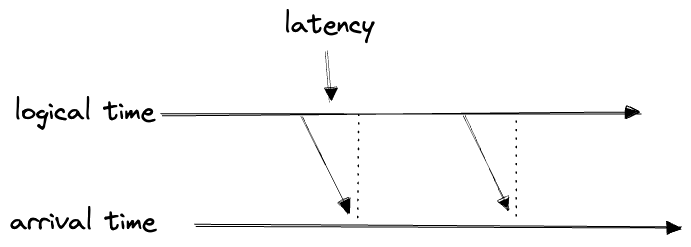

import { Image } from 'astro:assets';
import manydims from '../../images/datadims/many_dims.png';


1. *<a href="/posts/2024-09-02-dimensions/">Linear Algebra</a>*
2. *<a href="/posts/2024-09-02-dimensions-physics/">Physics</a>*
3. *(This post)*.

In this post I'll try to apply the dimension-diagrams method to the domain of data engineering.

#### Table of Contents

## 1. Time

Behold the axis of time:
<br/>


<br/>

When time advances, things happen, and the data representing those things need to be updated—data always being some kind of "materialized view" of the world; otherwise it would not be very interesting.

We can therefore draw a distinction between two different time axes: 
- *logical time*: when events in the world actually happened, a.k.a. real time[^1]
- *update time*: when your dataset is updated to reflect the fact that the event has occurred.

[^1]: I find the word "logical" here to be unsuggestive of its meaning. The sense here is from the perspective of software, where the realtime is the time that matters for the business logic, as opposed to the time when the data is being processed.

Obviously the former must precede the latter; the difference is the latency:


If we plot the two against each other, half of the space is inaccessible:


A given piece of data can be plotted at its "coordinates" according to these two axes, but the two are not truly independent.

Now, any real data pipeline will probably have more than just these two timestamps. Perhaps the data is pushed into our system and lands in a bucket where it is partitioned by *arrival* (or "landing" or "ingress") time. Only later do we pick it up, process it, and insert it:


This "arrival time" falls between the first two times:

```
logical time < arrival time < update time
```

 We could try to draw this in three dimensions, but it's not very useful:


 
Instead we'll represent these in the fashion of my <a href="/posts/2024-09-02-dimensions/">earlier post</a> by joined axes with an arrow indicating the direction of causality. We'll put the axes close together, suggesting that their values are closely related:


In this schematic representation of time, we're indifferent to how often these processes actually run. A "time dimension" in these diagrams can stand for any of:
- streaming in realtime
- polling frequently and updating through the present on every pull
- polling infrequently and processing in batches (e.g. all records arriving in the last day)
- ad-hoc / manual processes

Even an Excel spreadsheet counts: getting updates at 10 a.m. when someone or another gets into the office is still *a* schedule.

Except for truly realtime streaming, all our dimensions are actually discrete; of course, any continuous dimension can be reduced to a discrete one by "binning" or "batching" its values, for example, to partition into a directory structure like `YYYY/MM/DD/`. If we want to mark a dimension as discrete, we'll add tick marks to the axis:


If no accumulating state is needed to calculate the next value from the previous one, the individual batches can be treated as distinct datasets—"partitions" of the full data. Ideally data is partitioned on its real, i.e. logical, time; this being the time dimension you most often want to query by. But realtime data can usually have arbitrarily-late arrival times, due to upstream errors and the like. One must either accept incomplete data, or settle for partitioning by arrival times. If you want a clean dataset that's partitioned on logical time you have to merge the partitions later and allow that a newly-arriving partition can carry updates to many logical-time partitions at once. Databases can handle this; cloud storage not so much, not without specialized tools.

We also are not distinguishing between "push" and "pull", i.e. whether the call-stack starts upstream or downstream. "Push" doesn't necessarily mean low-latency: processing can be slow, or we might wait for a complete batch to arrive before pushing it downstream.

In all, a piece of data has the following "coordinates" along these time dimensions:
- logical time
- arrival time (i.e. the update time of its upstream)
- update time
- processing time (sometimes)

## 2. The DAG

If we have a number of datasets wired up in order, each dataset's "update time" will act as the upstream "arrival time" for the next in line. Each time dimension will be offset from previous:


But if we have $N$ separate time dimensions, we can extract the labels of their positions in the dependency chain $n$ as a dimension of its own:


Data pipelines are rarely so linear, though. The fundamental structure is the DAG: 


Even though a DAG can branch and recombine, it's still a dimension—it's "partially ordered", falling somewhere between an unordered discrete set (which is also a dimension) and an ordered set (like our discretized time above). I don't know if we need to represent this on the diagram, but one way to do it might be with a half-arrowhead:


Even though "the DAG" really stands for the "dependency order", and "DAG" is just its structure, I'm going to label it as the "DAG" in this post. And I'm not going to bother with that segmenting or half-arrow; a plain arrow will represent any kind of dimension.

The time and DAG dimensions are closely related. Like the different times, the DAG "depends on" time. Specifically it depends on a new time dimension, the "run time" or "processing time", which describes exactly when the DAG is executing. 

The run time of a piece of data falls between its arrival time and update times:[^2]

[^2]: I'm not being very precise with the "dependency" between the DAG and run time dimensions. Advancing the DAG requires advancing the run time, but the reverse also holds, I think? I think you can think of it either way.


(Often we don't care about the run time, but we might if the DAG logic makes reference to any ambient state.)

Suppose our data arrives in batches, and we run a copy of our DAG for each new batch to update a downstream view. We might represent this schematically as:


In the above:
- arrival time is bucketed, and we treat the entire bucket as representing the same "arrival time".
- run time proceeds linearly but must be `>=` arrival time.

When a DAG runs, it must do so in topological order:


But parts can often be parallelized:


And this parallelization adds yet another dimension to our dataset: where did it run, which worker or process did it run on, etc.? If we're counting.

I declared above that all data is a materialized view of the world; any business, then, is in the business of maintaining a materialized view of the part of the world it is interested in. Any business, therefore, has elements with the semantics of "time dimensions" as I've described above, even if they're not explicitly implemented as such in code: periodic manual processes, late-arriving data, etc.

Similarly, any business already has a DAG, even if it's not implemented in code, or is distributed across many separate systems. Data—whether in database, a file, a spreadsheet, or in the minds of humans—depends on other data, and so on; all data gets updated *somehow*, by some process. To *engineer* your data is to try to do this *well*.

But wait: doesn't data flow from the "back of house" of the business into the customer-facing part all the time? Here one thinks of "reverse ETLs", ML models, data feeds, data products... these seem to be reverse edges which violate the ordering of our DAG dimension. 


But these "reverse" edges must always point *forward* in time—you can't send data into the past, after all. The true "DAG" situates the future as a downstream of the past. 

It's a tremendous conceptual simplification, though, to be able to think of a DAG as having no backwards edges. We aim for this whenever possible. The easiest sorts of DAG edges to reason about are pure functions: either the new rows are a pure function of the old rows (as in a stateless stream), or, at least, the new datasets are functions of the old datasets (like a reactive spreadsheet). And in fact, the whole point of the "materialized views of world" which is our data is to implement some "pure function of the world state" in order to understand it.

We can take inventory of the edges in a DAG in order of increasing complexity:
1. (simplest): downstream data depends only on upstream state (a reactive pure function, like a spreadsheet)
2. downstream data depend on newly-arriving upstream data (a pure function)
3. downstream data depends on new upstream data + past downstream state (an update)
4. downstream data depends on new upstream data + past upstream state (a stateful stream operation, like a fold or reduce)
5. downstream data depends on new upstream data + past upstream state + past downstream state (stateful + update)
6. upstream data depends on past downstream data (reverse-ETL and the like)
7. (most complicated) upstream data depends on past downstream data and past upstream data (reverse + update)

It's worth it to isolate parts of the overall DAG of a business which can be reasonably modeled with simpler update patterns, and which pertain to one domain or dataset only. These are the smaller DAGs we carve out and identify as standalone DAGS of their own, i.e. as "pipelines". The nodes in a pipeline are then called something like "task" or "job", and the individual instances of these nodes called "runs" or "batches" or something. The "coordinates" of a particular dataset along the DAG dimension are generally something like `(pipeline name, job name, run_id)`, which, along with the timestamp data and the address (e.g. a filepath) of the actual dataset, constitute the core of the "lineage metadata" of a dataset.


## 3. Technology

Where does the data live? How is it updated?

The default is Excel, more or less:


This view applies even within a single Excel spreadsheet; when the cells reactively update, that's a DAG.

Usually there's a part of the business which runs in the tech stack, and a parallel offline part in Excel:


We can generally separate the technology dimensions into "storage" and "compute":
- storage: a spreadsheet, a database, cloud storage, a file on someone's computer, an email inbox, the human mind...
- compute: a spreadsheet, a production server, a batch job, a stream-processing engine, the human mind...
- access: a spreadsheet, a SQL client, an API call, code, conversation...


As a business grows its DAG will grow in complexity, as ever-more tools and platforms are brought to service ever-more data feeds. Half the job is just to keep this madness under control: to meet all the needs with as small as possible a set of well-understood tools, and to ensure the overall business' DAG is simple to understand and maintain. We like clean layers, with everything flowing in one direction. As a general rule, low-latency systems ought to live upstream of high-latency ones, and automated processes ought to live upstream of manual ones. Unreliable systems should depend on reliable ones, to limit the blast radius of errors, as opposed to the other way around.


## 4. Versions

What about the fact that the implementations of our data pipelines themselves will vary with time? 

Here find another class of dimensions, representing another complication: versioning. 

The basic version dimension is a Git commit hash; effectively, a coordinate along the `main` branch:


This isn't quite the full picture, because Git has a branching DAG structure of its own, but usually you want to avoid that in production so you can treat the code versions as a nice linear dimension.

Versioning code makes everything thornier: the old has to be compatible with new, and, quite often, old data has to be backfilled with the new logic:


The commit is not the only "version" dimension: we can also place A/B tests and other experiments here, as well as deployments, and, say, container images:


Also in this category can be placed a number of AI and ML-specific dimensions. ML tends to make heavy use of version dimensions, as ML models are often iterated on and versioned independently of the code that creates them, for example:
- by hyperparameters
- by training dataset (the same architecture with different training data will produce a different model)
- by epochs in the same training run


Furthermore the *outputs* of our modern AI models are stochastic. Anything downstream of those AI models may be said to acquire another quais-dimension, representing the actual output it consumed.

Contemplating the variety of version dimensions leads one to the perspective that, for data-engineering purposes, there is no real distinction to be made between input datasets, code files, ML model versions, or software packages. It's all just data, which can be brought together to create new data.[^3]

[^3]: Sometimes I'll see DE tools wrapping up all these different kinds of assets together in ways that strike my organized SWE-brain as heretical: deploying Python scripts by writing them onto S3, or zipping scripts up alongside datasets, or versioning datasets in Git. But I suppose I've just made a case for these kinds of heresies.


## 5. Institutional

Finally and briefly we have the human factors. Any piece of data has:
- owners: maintainers, internal and external stakeholders...
- monitoring: accuracy, freshness, validitation...
- error recover: SLAs, runbooks, alerting policies, retry policies...
- permissions: access control, audit policies...


Once again the philosophy here is: your data *already has all of these dimensions*, whether or not you have actually acknowledged them, or implemented them explicitly. *Someone* is going to be alerted when the pipeline goes down—that's the maintainer. *Someone* has write access—those are the permissions. Etc.


<hr/>
<br/>
With that we've covered all the major kinds of "lineage metadata" with which we can describe datasets. I find it helpful to view them all as instances of the same thing—as the dimensions of a meta-dataset which describes our datasets, for which the techniques of [dimensional modeling](https://en.wikipedia.org/wiki/Dimensional_modeling) apply just as they do with the data itself. 

A given dataset has "coordinates" in the space of all these dimensions, and more:

<br/>
<Image src={manydims} width="600" alt="Many dimensions" />
<br/>

The utility of the "dimension diagrams" here is to give a kind of taxonomy to all the dimensions. "Time", say, is a coarse-grained description, and the first thing you might think of; zooming in exposes a world of detail, but it's useful to step back and forth between the two levels of abstraction and to understand how they relate. These dimension diagrams come close to depicting to how I have come to *think* about dimensions, for whatever reasons, so perhaps this approach can be useful.