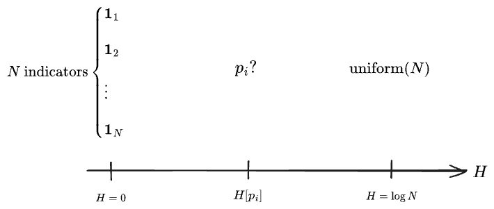
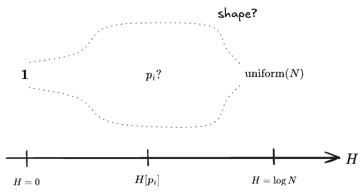

import BokehPlot from "../../components/diagrams/BokehPlot";
import EntropyBar from "../../components/diagrams/entropy/EntropyBar";
import EntropyReorder from "../../components/diagrams/entropy/EntropyReorder";
import EntropyGraph from "../../components/diagrams/entropy/EntropyGraph";

*This is part of a series on entropy.*
1. *<a href="/posts/2025-09-16-entropy/">Entropy I: Motivating Shannon</a>*
2. *(This post)*

 

#### Table of Contents

 

# 1. Interpreting Shannon

Here again is the "Shannon entropy" of a distribution $p_i$ over a set $S$ with $N$ elements:

$$
H[p_i] = \sum_i p_i \log \frac{1}{p_i}
$$

Its argument is a probability distribution, such $H[p_i]$, $H[p(x)]$ or $H[\mathcal{N}(\mu, \sigma^2)]$; the square brackets $H[\:\cdot\:]$ should be read as indicating that it is a function of an entire distribution rather than of a single numeric value. 

The simplest example is the entropy of a uniform distribution over $N$ elements:

$$
\begin{align}
H[\text{uniform}(N)] &= H\left[\left\{\frac{1}{N}, \frac{1}{N}, \ldots, \frac{1}{N} \right\}\right] \\
  &= \sum_{i =0}^N \frac{1}{N} \log{N} \\
  &= \log{N}
\end{align}
$$

We get $\log{N}$, which is easily seen as the "number of bits required to count or label a set of $N$ elements" (in whatever logarithm base we're using)

<EntropyBar total={16} weights={[4,4,4,4]} client:visible />

and the formula also interpolates cleanly over non-uniform distributions

<EntropyBar total={16} weights={[8, 5, 3]} client:visible />

We saw in the first post in this series that it is interpreted as representing the "information density" or "innate uncertainty" of a sample from this distribution. 

It is also the "average log-likelihood per sample" for a typical sequence drawn from the distribution $p_i$:

$$
H[p_i] = \lim_{K\to\infty} \frac{1}{K} \log {\text{Pr} (x_1, \ldots, x_K \mid \text{each } i \text{ occurs } p_i K \text{ times.})}
$$

We also saw that the same formula arises when taking the large-$K$ limit of a log of a multinomial
$$
H\left[\frac{k_1}{K}, \frac{k_2}{K}, \ldots\right] = \frac{1}{K} \log {K \choose k_1, k_2, \ldots}
$$

which can be seen as the relative size of a given outcome of many samples of a uniform distribution.

We can arrive at another characterization by noting that the entropy can be written as an expectation:

$$
H[ p_i ] = \mathrm{E}[\log{\frac{1}{p_i}}]
$$

where the object inside the expectation is either the "the number of bits required to express that probability" or the "information required to enumerate $\frac{1}{p_i}$ elements". For each probability in the uniform distribution $p_i = \frac{1}{N}$ it is $\log{N}$. This is called the "information function" or just "information", written

$$
I(p_i) = \log{\frac{1}{p_i}}
$$

We can express $H$ as

$$
H[ p_i ] = \mathrm{E}[I(p_i)]
$$

which suggests we interpret the entropy either "average information required to specify an element in $p_i$" or as the "expected information gained by learning the exact value of a a sample from $p_i$".

# 2. Visualizing Shannon

Each term in the Shannon entropy has the form

$$
p \log{\frac{1}{p}}
$$

whose graph looks like

 
<BokehPlot htmlPath="/data/entropy/pi_plot.html" client:visible />
 

That's an odd shape, but it doesn't mean much on its own. It is the product of $p$ (which increases linearly) and $\log{1/p}$ which goes to $\infty$ at $p \to 0$ and goes to $0$ at $p \to 1$.  

More informative is the graph of $H$ on a two-element distribution, such as that of an unbalanced coin that comes up heads with probability $p$. The distribution is simply $\{p, 1-p\}$ and the entropy, as a function of $p$, looks like the sum of the graph above with itself reflected horizontally, which smooths out the asymmetry giving

 
<BokehPlot htmlPath="/data/entropy/pH_plot.html" client:visible />
 

It's nearly a perfect circle, peaking at a value of $H = \log{2}$ at $p = 0.5$. (In base-2, its peak value is 1, here it is $\log{2}$.)

We can also visualize the entropy over all possible probability distributions on a three-element set. The three probabilities $p_1, p_2, p_3$ are constrained to the two-dimensional simplex $p_3 = 1 - p_1 - p_2$. The entropy function looksl ike:

 
<BokehPlot htmlPath="/data/entropy/p3_plot.html" client:visible />
 

Again we see that the entropy $H$ attains its highest value in the center (a uniform distribution) and goes to zero in all three corners (the indicators on any of the three elements). It treats each probability symmetrically; it is indifferent to the ordering of the three.

For more than three probabilities no direct visualization is possible. Within the space of all possible distributions $p_i$ on an $N$-element set, there are $N$ indicators $\mathbf{1}_i$ each with entropy 0 and one $\text{uniform}(N)$ with entropy $\log(N)$. All other distributions fall somewhere between these two extremes:

What happens in the middle? What fraction of all possible distributions have the given entropies? Certainly there are vastly more uneven distributions than either the indicators or the single uniform.

Let's first try to take on a simpler problem by considering only distributions which can arise by grouping $N$ underlying cells. This is then the problem of "counting partitions of a set". However, there are no longer $N$ distinct indicators but only one—the partition consisting of the whole set. Clearly there will be more distributions in between, but what is the exact shape?

Let's play with a few, starting from the single partition $\mathbf{1}$ with $H[\mathbf{1}] = 0$. Chipping away at it increases the entropy...

<EntropyBar total={16} weights={[16]} client:visible />
<EntropyBar total={16} weights={[15, 1]} client:visible />
<EntropyBar total={16} weights={[14, 2]} client:visible />
<EntropyBar total={16} weights={[14, 1, 1]} client:visible />
<EntropyBar total={16} weights={[12, 4]} client:visible />
<EntropyBar total={16} weights={[12, 2, 2]} client:visible />
<EntropyBar total={16} weights={[8, 8]} client:visible />

... but the three-way partitions quickly overtake the two-way ones, and of course there are a *lot* of these. The total number of partitions is given by the [Bell numbers](https://oeis.org/A000110), which are manageable up about $\text{Bell}(13) \approx 1 \text{ million}$ but by $N=16$ reaches $10480142147$. But the number of distinct integer partitions are far smaller, and the problem turns out to be extremely tractable. Plus, since it's 2025, I can ask an AI to do it in two minutes.[^chatgpt] Here's a visualization:

[^chatgpt]: Here's the [chat](https://chatgpt.com/share/68e0b77e-458c-800b-b3a8-1348cdf31808), including a lot of extra—and impressive—analysis.

 
<BokehPlot htmlPath="/data/entropy/entropy_counts16.html" client:visible />
 

There's a clear shape, peaking (the AI tells me) around $\log(16) = 2.77$. Neat. (Note the log scale: around the peak value there appear to be about 500 million partitions!)

Returning to the first question: what if did the same for the set of distributions on $N$ elements? The question now is to estimate the measure with each value of $H$ within the $(N-1)$-simplex formed by the $N$ probabilities. This is probably hard to calculate, but should be fairly simple to estimate numerically. Again I conjure a visualization from the AI:

 
<BokehPlot htmlPath="/data/entropy/entropy_measure16.html" client:visible />
 

Well: it's a similar shape. Note the y-axis is not a log-scale in this one, as the whole region near 0 would go to $-\infty$. Still we see that the vast majority of distributions have entropies a bit lower than the maximum. This isn't too enlightening, but I was curious.

Before we move on, I want to register a couple of stray thoughts:
- I find the distinction between the entropy of partitions and distributions here to be suggestive. I suspect that entropy is more naturally defined on partitions: elements of the underlying set with $p=0$ effectively don't exist from the perspective of the entropy. All indicator distributions are the same thing, information-wise (it's the underlying set which is different). I'll have to think on this.
- I don't think a "uniform measure" makes sense on the space of real-valued probability distributions, so the second visualization just given is probably not very meaningful. It might actually make sense to use the entropy itself as the measure on that space, but I won't try to take that on now.

# 3. Entropy vs. Variance

Here's one visualization of some entropies. Now—unlike all the earlier examples—we will associated the indices $i$ with their numeric value, i.e. treating this as a random variable $X \sim p_i$ with $X(i) = i$. This will let us compute a variance for the distribution.

 
<EntropyReorder n={20} client:visible />
 

You can observe:
- the uniform distribution always has the highest entropy.
- all of the indicator/delta-function distributions have entropy zero (and variance zero).
- in general, entropy is lower for very peaked distributions, and high for spread-out ones. In this respect it is similar to the variance.
- but the entropy is unchanged when the cells are shuffled, while the variance will tend to vary a lot.

(Note that you can put in unnormalized distributions, but they will be normalized before calculating stats.)

Both the entropy and variance are measure of the "uncertainty" or "spread-out-ness" of a distribution. Both are zero for an indicator and large for a uniform distribution—but the entropy attains its highest possible value on a uniform, while it's easy to make the variance even larger by creating something bimodal. (If you click the "Beta" button enough times you'll get something bimodal, or you can draw your own.)

What's the difference?

We'll write the entropy of a r.v. $X$ as a function of the r.v. rather than of the probabilities themselves:

$$
\begin{align}
H(X) = \mathrm{E}\left[\log{\frac{1}{p(X)}}\right] && \mathrm{Var}(X) = \mathrm{E}[X^2] - \mathrm{E}[X]^2
\end{align}
$$

Clearly the entropy does not depend on the value of $X$, while the variance does. 

And yet if we plot the two against each other for a few distributions, they seem to be closely related:

 

<EntropyGraph dataPath='/data/entropy/entropy_var_examples.json' client:visible />

 

(These are discretized normals and betas, not continuous distributions. We'll get to the entropy of continuous distributions later.)

What's going on?

Here are a family of normal distributions centered on $0.5$:

<EntropyGraph dataPath='/data/entropy/entropy_var_normals.json' client:visible />

We see a clear pattern, which interpolates between the nearly-indicator-like $\sigma^2 = 0.0001$ and the nearly-uniform $\sigma^2 = 0.1$.

Here now are a family of $\text{Beta}(\alpha, \beta)$  distributions, which might represent the posterior distribution of the posterior distribution for the probability $p$ that an unfair coin comes up heads.

<EntropyGraph dataPath='/data/entropy/entropy_var_betas.json' client:visible />

Again wee see entropies and variances which are decrease together.

Let's try a more contrived scenario: you flip a coin of unknown $H$-probability $p$ repeatedly and get the same result $N$ times in a row, but you don't know if this is $H$ or $T$. The probability of such a streak given $p$ is

$$
\begin{align}
\text{Pr}(N \text{ in a row} \mid p) &= p^N + {(1-p)}^N \\
  &= \text{Beta}(N+1, 1) + \text{Beta}(1, N+1)
\end{align}
$$

If we take our prior on $p$ to be uniform (i.e. a $\text{Beta}(1,1)$), the posterior distribution of $p$ goes as

$$
\begin{align}
\text{Pr}(p \mid N) &\propto \text{Pr}(N \mid p) \times \text{Pr}(p) \\
  &\propto (\text{Beta}(N+1, 1) + \text{Beta}(1, N+1))\text{Beta}(1, 1) \\
  &\propto \text{Beta}(N+2, 2) + \text{Beta}(2, N+2)
\end{align}
$$

which looks like

<EntropyGraph dataPath='/data/entropy/entropy_var_betas_bimodal.json' client:visible />

There's still a tight relationship between entropy and variance, but now it goes the other way.

The difference seems to be that these are bimodal distributions. After all, we should be able to shuffle the probability of any unimodal distribution and change the √ariance but not the entropy. Likewise if we can find some family of distributions with constant variance, they should have varying entropies.

Let's try it. In the following I started with a $\mathcal{N}(0.5, 0.1)$, and then had the AI conjure up a handful of shuffled versions of that distribution (which should have different variances) and a handful of Beta distributions with this same variance but otherwise different shapes (which should therefore have different entropies):

<EntropyGraph dataPath='/data/entropy/entropy_var_shuffled_betas.json' client:visible />

The point appears to be: entropy and variance are closely related *for unimodal distributions*, but not in general. They *can* vary independently, though it can take some pretty contrived distributions to demonstrate it.

Further investigation sheds some light. Apparently, there exists a series expansion for the Shannon entropy in terms of the [cumulants](https://en.wikipedia.org/wiki/Cumulant) of a distribution, which are certain functions $\kappa_n$ of the moments which distribute across independent distributions: $\kappa_n(X_1 + X_2) = \kappa_n(X_1) + \kappa_n(X_2)$.[^z] At the same time, any distribution can be expanded in a series in its cumulants around a normal distribution, called an [Edgeworth series](https://en.wikipedia.org/wiki/Edgeworth_series). Hence there exists a "local approximation" of the entropy for distributions which are close to normal, apparently:

$$
\begin{align}
H(X) &= H[\mathcal{N}(\mu, \sigma^2)] - \frac{\kappa_3^2}{12 \sigma^2} + \frac{\kappa_4}{24\sigma^4} + \ldots \\
     &= \frac{1}{2}\log{2\pi e \sigma^2} - \ldots
\end{align}
$$

[^z]: In statistical mechanics, the logarithm of the partition function, $\ln Z$, turns out to be a [cumulant generating function](https://samkrit.ch/posts/2024-09-30-partition-function/#z-is-a-few-kinds-of-generating-functions-at-once). 

This was surprising to me, since the Shannon entropy *doesn't* depend on the values taken by the R.V. $X$ while the variance and cumulants do. But I suppose the explanation is that, here, we are parameterizing the *distribution* by its variance and cumulants; then the entropy of course depends on the these because it depends on the specific distribution.

 

*Interactive visualizations for this post were authored with [D3.js](https://d3js.org/) in Typescript, embedded in a [Marimo](https://marimo.io/) (Python) notebook via [anywidget](https://anywidget.dev/) with considerable help from Claude Code, and then manually ported into React components to be consumed by Astro, which builds this site. The simpler plots were built with [Bokeh](https://www.bokeh.org/) and exported as HTML. Mostly this was a pain and I wouldn't do it this way again, but it is worth noting that Claude is excellent at one-off D3-type visualizations.*

 

 