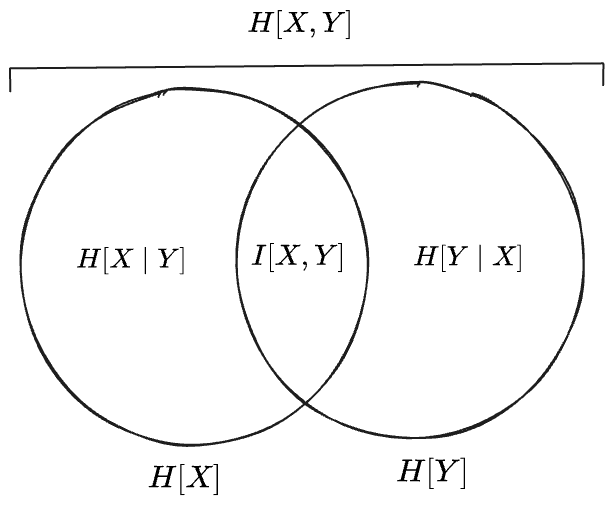
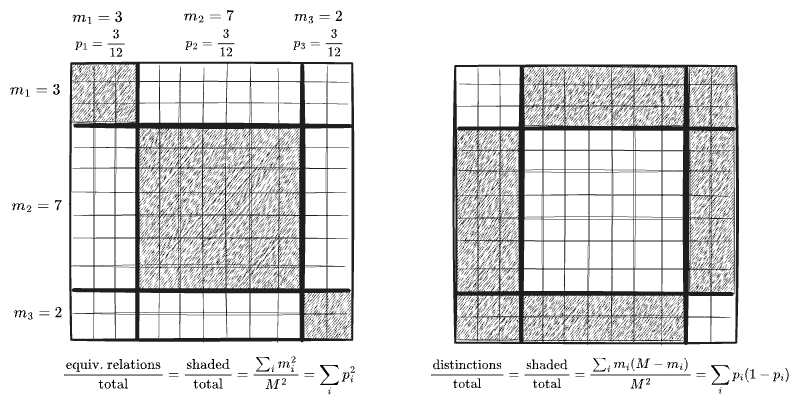

#### Table of Contents

# 1. Independence

In the previous post we saw that the entropy of a product distribution $pq$ adds if $p, q$ are independent:

$$
\begin{align}
H[pq] = H[p] + H[q] && \text{(independent)}
\end{align}
$$

The above expression does not generalize easily to *non*-independent distributions, as independence is precisely the condition that allows a *joint* distribution to be written as a product. Instead we need the entropy of the joint distributoin, which for some reason has its own name, the **Joint Entropy**, and has its own alternative notation in terms of random variables.[^cross]

[^cross]: Elsewhere we'll see the notation $H[p, q]$ for the "cross entropy" of two distributions, with probabilities for arguments and an entirely different meaning. I prefer to use only probabilities like $p(x, y)$ as arguments to entropy rather than random variables to avoid this kind of confusion.

$$
\begin{align}
H(X, Y) &\equiv \sum_{xy} p(x, y) \log \frac{1}{p(x, y)} \\
 &=H[p(x, y)]

\end{align}
$$

Independence means that the joint distributions factors as a product of marginals; the entropy again adds:

$$
\begin{align}
H(X, Y) &= H[p(x)p(y)] = \sum_{xy} p(x)p(y) \log \frac{1}{p(x)p(y)} && \text{(independent)} \\
 &= \left(\sum_y p(y)\right) \left(\sum_x \log \frac{1}{p(x)}\right) + \left(\sum_x p(x)\right) \left(\sum_y \log \frac{1}{p(y)}\right)  \\
 &= 1 \cdot H[X] + 1 \cdot H[Y] \\ 
 &= H[X] + H[Y]
\end{align}
$$

Variance has a similar property for *sums* of independent distributions:

$$
\begin{align}
\text{Var}[X + Y] = \text{Var}[X] + \text{Var}[Y] && && \text{(independent)}
\end{align}
$$

but in general behaves like a vector squared-norm $\langle\mathbf{x},\mathbf{x}\rangle$, with the covariance as the corresponding inner product $\langle\mathbf{x}, \mathbf{y}\rangle$[^norms]:

[^norms]: The intuition here that independent distributions add "at right angles", each contributing only its own randomness, while correlated distributions "constructively interfere". See <a href="/posts/2025-12-23-variance/">my post</a> on variances for more.

$$
\text{Var}[X + Y] = \text{Var}[X] + \text{Var}[Y] + 2 \text{Cov}[X, Y]
$$

What happens to the entropy for non-independent distributions?

We can start by rewriting the joint distribution in terms of a conditional, which is exact:

$$
\begin{align}
p(x, y) &= p(x)p(y \mid x) \\
H[X, Y] &= H[p(x, y)] \\
  &= H[p(x)p(y \mid x)] \\
  &= \sum_{xy} p(x)p(y \mid x) \log \frac{1}{p(x)p(y \mid x)} \\
  &= \sum_x p(x) \left( \sum_y p(y \mid x)\right)\log \frac{1}{p(x)} + \sum_{x} p(x)\left(\sum_y p(y \mid x) \log \frac{1}{p(y \mid x)}\right) \\
  &= \sum_x p(x)\log  \frac{1}{p(x)}   + \sum_{x} p(x)H[p(y \mid x)] \\
  &= H[X]  + H[Y \mid X]
\end{align}
$$

where in the last line we've used the conventional notation $H[Y \mid X]$ for the **conditional entropy**

$$
H[Y \mid X] \equiv \sum_{x} p(x)H[p(y \mid x)] = \text{E}_x H[p(y \mid x)]
$$

From this we can observe:
- if $y$ is independent of $x$, then $p(y \mid x) = p(y)$ and the conditional entropy $H[Y\mid X]$ reduces to the entropy of $Y$ alone: 

$$
\begin{align}
H[Y\mid X] &= \sum_{x} p(x)H[p(y \mid x)] \\
&= \left(\sum_x p(x)\right)H[Y] && \text{(independent)}\\
&= H[Y]

\end{align}
$$

  which recovers the additive property $H[X, Y] = H[X] + H[Y]$.
- on the other hand, if $y$ is completely determined by $x$, then $y$ takes a single value $y(x)$ on each level set of $X=x$. The marginal distribution is an indicator $p(y\mid x) = 1_{y(x)}$, which makes the entropy of every marginal distribution, and the conditional entropy, zero: 

$$
\begin{align}
H[p(y \mid x)] &= \sum_y 1_{y(x)} \log \frac{1}{1_{y(x)}} && \text{(dependent)}\\
 &= 0 \\
H[Y \mid X] &= \sum_x p(x) H[p(y \mid x)] \\
  &= 0

\end{align}
$$

We see that, for completely-dependent $X, Y$, all of the variation and therefore all of the entropy belongs to $X$ alone. (Or equivalently to $Y$ alone, if we marginalize in the other direction.) Intermediate degrees of independence will interpolate between these results.

The joint entropy in always *less* than the independent case:

$$
\begin{align}
H_{\text{dep.}}(X, Y) &= H[X] + H[Y \mid X]\\
& \le H_{\text{ind.}}(X, Y) \\
&= H[X] + H[Y]
\end{align}
$$

A number of the qualitative properties of entropy follow from these observations.
- Correlations and "internal structure" always *reduces* entropy (while they tend to increase variances). In the extreme case of total dependence, they reduce a joint distribution of two variables into a single-variable distribution.
- Expanding a sample space along a new dimension can only increase the entropy: $H(X, Y) \ge H[X]$.
- Conditioning, such as with new "information" or "evidence", can only reduce an entropy: $H[Y \mid X] \le H[Y]$
- Entropy is "concave" over probability distributions: $H[p(x)p(y \mid x)] \ge \sum_x p(x) H[p(y \mid x)]$ (this is an instance of [Jensen's Inequality](https://en.wikipedia.org/wiki/Jensen%27s_inequality))
- Equivalently: whatever the entropy w.r.t. a specific distribution, uncertainty in the distribution itself will increases the entropy. 

The last property is illustrated by the case of a biased coin whose probability of heads is either $p_1$ or $p_2$, with probabilities $q, (1-q)$. The overall probability of heads is the weighted average $\overline{p} = qp_1 + (1-p)p_2$, whose entropy $H[\overline{p}]$ is alway higher than the weighted average of the individual entropies

$$
H[\overline{p}] \ge qH[p_1] + (1-q)H[p_2]
$$

which follows from the concavity formula with $x$ ranging over $q, (1-q)$, $y \mid q$ over $p_1, (1-p_1)$, and $y \mid (1-q)$ over $p_2, (1-p_2)$

We may conclude this discussion with one more concept, the **mutual information**, which is nothing but the difference between the joint entropy $H[X, Y]$ and the of the marginal entropies:

$$
\begin{align}
I[X, Y] &= \sum_{xy} p(xy) \log \frac{p(x, y)}{p(x)p(y)} \\
  &= H[X] + H[Y] - H[X, Y]\\
  &= H[X] - H[X \mid Y] \\
  &= H[Y] - H[Y \mid X] \\
  &= H[X, Y] - H[X \mid Y] - H[Y \mid X]
\end{align}
$$

If we characterize $H[X \mid Y]$ as the information "in" $X$ which is *not* in $Y$, the last three expressions imply an interpretation of mutual information as the information "common to" both $X$ or $Y$.

 

# 2. Entropy as Measure?

 A "Venn diagram" is useful to organize the preceding ideas:

But, note, that while this diagram suggests an interpretation of entropy as the "measure" or "size" of some set—since Venn diagrams depict schematically the relationships between sets subsets—there exists no set of which these various entropy expressoins are measures. Instead we made the "Venn diagram" work by *defining* the mutual information $I[X, Y]$ to be exactly whatever was left over in $H[X, Y]$ after removing $H[X \mid Y]$ and $H[Y \mid X]$.

Interestingly, though, Taylor series of the entropy expression $p\log p$ around $p=1$ is

$$
\begin{align}
p \log \frac{1}{p} &= -p\log(1 + (1-p)) \\
 &\approx p(1-p) + \frac{1}{2}p(1-p)^2 + \frac{1}{3}p(1-p)^3 + \ldots
\end{align}
$$

and the first term in this series *is* the measure of something. If we consider the distribution $p_i, i = 1\ldots N$ to be formed by binning a large set of elements $M$ into bins of size $m_1, \ldots m_N$  with $m_i = p_i M$, then the first term for some $i$ may be written

$$
\begin{align}
p_i(1-p_i) &= \frac{m_i}{M}(1 - \frac{m_i}{M}) \\
  &= \frac{m_i(1- m_i)}{M^2}
\end{align}
$$

This expression admits an interpretation as the fraction of all pairs $(i, j)$ of elements from $M$ which relate one of $m_i$ elements of bin $i$ to one of the $(1-m_i)$ elements not in bin $i$. 

The full sum $\sum_i m_i(1- m_i)$ then represents the number of pairwise "distinctions", as opposed to the $\sum_i m_i^2$ "relations" (under the equivalence relation defined by the creation of the $m_i$ bins), as can be seen in the following visualization where $p_i$ is the distribution with weights $\{\frac{3}{12}, \frac{7}{12}, \frac{2}{12}\}$.

Therefore the first term in this "series" expansion of $H[p_i]$ does have the form of a probability; it is the measure of a subset of a space divided by that of the whole space:

$$
H[p_i] = \frac{\sum_i m_i(1- m_i)}{M^2} + \ldots 
$$

The expression $\sum_i p_i(1-p_i)$ in this context has been called the [logical entropy](https://arxiv.org/abs/2112.01966).[^gini] I find this line of reasoning suggestive, but the idea feels incomplete. It suggests the later terms $\frac{1}{k} \sum_i p_i(1-p_i)^k$ ought to admit interpretations as 3-distinctions, 4-distinctions, etc, but the $\frac{1}{k}$ is confounding. And, it is not really well-defined to take a Taylor expansion of $\log(p_i) = \log(1 + (1-p_i)) \approx (1-p_i)$ with respect to all of the $p_i$ at once—they cannot all be close to $1$ at the same time!

[^gini]: An equivalent form is $1 - \sum_i p_i^2$, which in other contexts is known as the [Gini impurity](https://en.wikipedia.org/wiki/Diversity_index#Gini%E2%80%93Simpson_index) or Simpson diversity index.

 

 